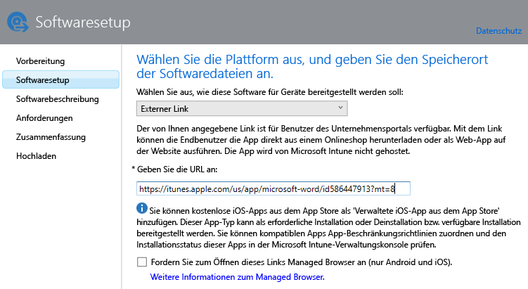
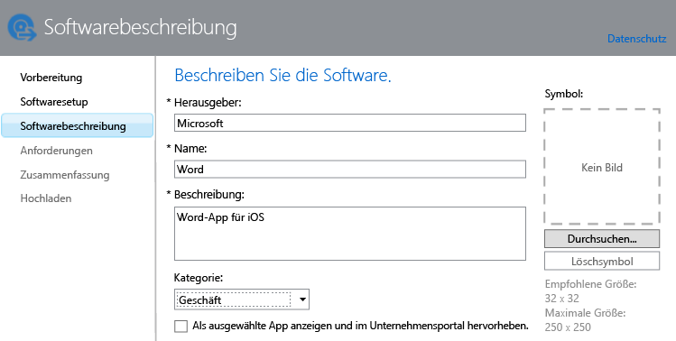

---
# required metadata

title: Hinzufügen von Apps für mobile Geräte | Microsoft Intune
description:
keywords:
author: robstackmsft
manager: jeffgilb
ms.date: 04/28/2016
ms.topic: article
ms.prod:
ms.service: microsoft-intune
ms.technology:
ms.assetid: f5b1f1ae-f177-450a-9af9-936a02d052e3

# optional metadata

#ROBOTS:
#audience:
#ms.devlang:
ms.reviewer: jeffgilb
ms.suite: ems
#ms.tgt_pltfrm:
#ms.custom:

---

# Hinzufügen von Apps für mobile Geräte in Microsoft Intune

In diesem Thema erfahren Sie, wie Sie Apps zu Intune hinzufügen, bevor Sie sie bereitstellen.

> [!IMPORTANT]
> Die Informationen in diesem Thema helfen Ihnen dabei die Apps hinzuzufügen, die Sie auf registrierten Geräten und registrierten Windows-PCs bereitstellen möchten. Wenn Sie Apps für Windows-PCs hinzufügen möchten, die Sie mithilfe der Intune-Clientsoftware verwalten, finden Sie weitere Informationen unter [Hinzufügen von Apps für Windows-PCs in Microsoft Intune](add-apps-for-windows-pcs-in-microsoft-intune.md).

## Hinzufügen der App
Sie verwenden den Intune-Softwareherausgeber, um die Eigenschaften der App zu konfigurieren und sie, falls zutreffend, mithilfe der folgenden Vorgehensweise in Ihren Cloudspeicher hochzuladen:

1.  Klicken Sie in der [Microsoft Intune-Administratorkonsole](https://manage.microsoft.com) auf **Apps** &gt; **Apps hinzufügen**, um den Intune-Softwareherausgeber zu starten.

    > [!TIP] Möglicherweise müssen Sie Ihren Intune-Benutzernamen und das Kennwort eingeben, bevor der Softwareherausgeber gestartet wird.

2.  Wählen Sie auf der Seite **Softwaresetup** eine der folgenden Optionen für **Wählen Sie aus, wie diese Software für Geräte bereitgestellt werden soll** aus:
    - **Softwareinstallationsprogramm**: Für Apps mit der Erweiterung **MSI**, oder **EXE** geben Sie Folgendes an:
        - **Wählen Sie den Dateityp des Softwareinstallationsprogramms aus**: Hiermit wird die Art der Software angegeben, die Sie bereitstellen möchten. Wenn Sie z. B. eine iOS-App bereitstellen möchten, wählen Sie **App-Paket für iOS (IPA-Datei)** aus.
        - **Geben Sie den Speicherort der Softwaresetupdateien an**: Geben Sie den Speicherort der Installationsdateien ein, oder klicken Sie auf **Durchsuchen**, um den Speicherort in einer Liste auszuwählen.
        - **Weitere Dateien und Unterordner aus dem gleichen Ordner einschließen**: Nur für den Dateityp **Windows Installer**. Mitunter sind für eine Software, bei der Windows Installer verwendet wird, unterstützende Dateien erforderlich, die sich meist im gleichen Ordner befinden wie die Installationsdateien. Wählen Sie diese Option aus, wenn Sie auch diese Dateien bereitstellen möchten. Bei diesem Installationstyp wird etwas Cloudspeicherplatz in Anspruch genommen.

  -   **Externe Verknüpfung**: Für Apps, die Sie durch Angeben eines Links zu einem App-Store erstellen möchten, geben Sie Folgendes an:

        - **URL angeben**: Geben Sie die URL in einem der folgenden Formate an:
            - App Store-URL der App, die Sie bereitstellen möchten. Wenn Sie z. B. die Microsoft-Remotedesktop-App für Android bereitstellen möchten, geben Sie **https://play.google.com/store/apps/details?id=com.microsoft.rdc.android** an. Suchen Sie die URL der App, indem Sie mithilfe einer Suchmaschine nach der App Store-Seite mit der App suchen. Um z. B. die Remotedesktop-App zu finden, können Sie nach **Microsoft-Remotedesktop-App für Android** suchen.
            - Website. Intune stellt ein Verknüpfungssymbol für die Website mit dem Gerät (Webclip genannt) bereit.
            - App im Web. Intune stellt ein Verknüpfungssymbol für die App auf dem Gerät bereit.
        - **Fordern Sie zum Öffnen dieses Links Managed Browser an (nur Android und iOS)**: Wenn Sie einen Link zu einer Website oder Web-App für Benutzer bereitstellen, können sie diesen nur im Intune Managed Browser öffnen, der auf ihrem Gerät installiert sein muss. Weitere Informationen zum Managed Browser finden Sie unter [Verwalten des Internetzugriffs mittels Managed Browser-Richtlinien mit Microsoft Intune](manage-internet-access-using-managed-browser-policies.md). Bei diesem Installationstyp wird kein Cloudspeicherplatz in Anspruch genommen.

  -   **Verwaltete iOS-App aus dem App Store**: Geben Sie Folgendes für kostenlose Apps aus dem iTunes-Store an, die Sie mit MAM-Richtlinien verwalten möchten:

        - **URL angeben**: Geben Sie die App Store-URL der App an, die Sie bereitstellen möchten. Wenn Sie z. B. die Microsoft-Arbeitsordner-App für iOS bereitstellen möchten, geben Sie **https://itunes.apple.com/us/app/work-folders/id950878067?mt=8** an. Bei diesem Installationstyp wird kein Cloudspeicherplatz in Anspruch genommen.

        Wenn Sie z. B. die Microsoft Word-App aus dem iTunes Store auf Geräten bereitstellen möchten, würde die Seite wie folgt aussehen:
        
        

3.  Konfigurieren Sie auf der Seite **Softwarebeschreibung** Folgendes:

    > [!TIP] Je nach Art des verwendeten Installationsprogramms werden einige dieser Werte möglicherweise automatisch eingetragen, oder sie werden nicht angezeigt.

    - **Herausgeber:** Geben Sie den Namen des Herausgebers der App ein.
    - **Name:** Geben Sie den Namen der App ein, wie er im Unternehmensportal angezeigt wird. Stellen Sie sicher, dass alle App-Namen eindeutig sind. Wenn ein App-Name zweimal vergeben wird, wird den Benutzern im Unternehmensportal nur eine der Apps angezeigt.
    - **Beschreibung:** Geben Sie eine Beschreibung für die App ein. Diese Beschreibung wird den Benutzern im Unternehmensportal angezeigt.
    - **URL für Softwareinformationen:** Nur verfügbar, wenn Sie **Softwareinstallationsprogramm** ausgewählt haben. Geben Sie optional eine URL zu einer Website ein, die Informationen über diese App enthält. Diese URL wird den Benutzern im Unternehmensportal angezeigt.
    - **URL zu den Datenschutzbestimmungen:** Nur verfügbar, wenn Sie **Softwareinstallationsprogramm** ausgewählt haben. Geben Sie optional eine URL zu einer Website ein, die Datenschutzinformationen für diese App enthält. Diese URL wird den Benutzern im Unternehmensportal angezeigt.
    - **Kategorie:** (Optional) Wählen Sie eine der integrierten App-Kategorien aus. Dadurch wird es für die Benutzer leichter, die App im Unternehmensportal zu finden.
    - **Als ausgewählte App anzeigen und im Unternehmensportal hervorheben:** Zeigen Sie die App auf der Hauptseite des Unternehmensportal hervorgehoben an, wenn Benutzer nach Apps suchen.
    - **Symbol:** (Optional) Laden Sie ein Symbol hoch, das der App zugeordnet wird. Dies ist das Symbol, das gemeinsam mit der App angezeigt wird, wenn die Benutzer das Unternehmensportal durchsuchen.

        In diesem Beispiel haben Sie eine Beschreibung für die Microsoft Word-App für iOS konfiguriert:

        

4.  Legen Sie auf der Seite **Anforderungen** die Anforderungen fest, die erfüllt sein müssen, bevor die App auf einem Gerät installiert werden kann. Zum Beispiel können Sie bei einem App-Paket für iOS die erforderliche Mindestversion von iOS und den nötigen Gerätetyp festlegen (wie iPhone oder iPad).

    > [!TIP] Die Seite **Anforderungen** wird nicht bei allen Arten von Apps angezeigt.

5.  Wenn Sie den Dateityp **Windows Installer** auswählen, werden weitere Assistentenseiten angezeigt. Dieser Dateityp wird verwendet, wenn Sie Software auf PCs mit Windows 10 oder höher bereitstellen, die bei Intune registriert sind.

6.  Überprüfen Sie auf der Seite **Zusammenfassung** die von Ihnen angegebenen Informationen. Sobald Sie bereit sind, klicken Sie auf **Hochladen**.

7.  Klicken Sie zum Fertigstellen auf **Schließen**.

Die App wird im Arbeitsbereich **Apps** im Knoten **Apps** angezeigt.

## Beispiele

### Bereitstellen von MSI-Anwendungen für Windows 10-Geräte
In diesem vierminütigen Video erfahren Sie, wie Sie MSI-Anwendungen (Microsoft Installer) auf registrierten Geräten mit Windows 10 bereitstellen.  

<iframe src="https://channel9.msdn.com/Series/How-to-Control-the-Uncontrolled/6--How-to-Deploy-MSI-Applications-to-Windows-10-Using-Intune-and-Mobile-Device-Management-MDM/player" width="640" height="360" allowFullScreen frameBorder="0"></iframe>

## Nächste Schritte

Wenn Sie eine App erstellt haben, umfasst der nächste Schritt die Bereitstellung. Weitere Informationen finden Sie unter [Bereitstellen von Apps in Microsoft Intune](deploy-apps.md).

<!--HONumber=May16_HO4-->

