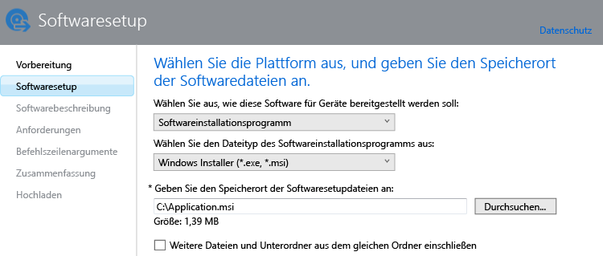

---
# required metadata

title: Hinzufügen von Apps für Windows-PCs | Microsoft Intune
description:
keywords:
author: robstackmsft
manager: jeffgilb
ms.date: 04/28/2016
ms.topic: article
ms.prod:
ms.service: microsoft-intune
ms.technology:
ms.assetid: bc8c8be9-7f4f-4891-9224-55fc40703f0b

# optional metadata

#ROBOTS:
#audience:
#ms.devlang:
ms.reviewer: jeffgilb
ms.suite: ems
#ms.tgt_pltfrm:
#ms.custom:

---

# Hinzufügen von Apps für Windows-PCs in Microsoft Intune

In diesem Thema erfahren Sie, wie Sie Apps zu Intune hinzufügen, bevor Sie sie bereitstellen.

> [!IMPORTANT]
> Die Informationen in diesem Thema helfen Ihnen beim Hinzufügen von Apps für Windows-PCs, die Sie mithilfe der Intune-PC-Clientsoftware verwalten. Wenn Sie Apps für registrierte Windows-PCs und andere mobile Geräte hinzufügen möchten, finden Sie weitere Informationen unter [Hinzufügen von Apps für mobile Geräte in Microsoft Intune](add-apps-for-mobile-devices-in-microsoft-intune.md).

## Hinzufügen der App
Mithilfe der folgenden Vorgehensweise verwenden Sie den Intune-Softwareherausgeber, um die Eigenschaften der App zu konfigurieren und sie in Ihren Cloudspeicher hochzuladen:

1.  Klicken Sie in der [Microsoft Intune-Administratorkonsole](https://manage.microsoft.com) auf **Apps** &gt; **Apps hinzufügen**, um den Intune-Softwareherausgeber zu starten.

    > [!TIP] Möglicherweise müssen Sie Ihren Intune-Benutzernamen und das Kennwort eingeben, bevor der Softwareherausgeber gestartet wird.

2.  Konfigurieren Sie auf der Seite **Softwareeinrichtung** des Softwareherausgebers Folgendes:

    **Wählen Sie aus, wie diese Software für Geräte bereitgestellt werden soll.** – Wählen Sie **Softwareinstallationsprogramm**, und legen Sie dann Folgendes fest:

    - **Wählen Sie den Dateityp des Softwareinstallationsprogramms aus**: Hiermit wird die Art der Software angegeben, die Sie bereitstellen möchten. Wählen Sie für einen Windows-PC **Windows Installer** aus.
    - **Geben Sie den Speicherort der Softwaresetupdateien an**: Geben Sie den Speicherort der Installationsdateien ein, oder klicken Sie auf **Durchsuchen**, um den Speicherort in einer Liste auszuwählen.
    - **Weitere Dateien und Unterordner aus dem gleichen Ordner einschließen**: Mitunter sind für eine Software, bei der Windows Installer verwendet wird, unterstützende Dateien erforderlich, die sich meist im gleichen Ordner befinden wie die Installationsdateien. Wählen Sie diese Option aus, wenn Sie auch diese unterstützenden Dateien bereitstellen möchten.

    Wenn Sie z. B. eine App namens „Application.msi“ für Intune veröffentlichen möchten, würde die Seite wie folgt aussehen: 

   Bei diesem Installationstyp wird etwas Cloudspeicherplatz in Anspruch genommen.

3.  Konfigurieren Sie auf der Seite **Softwarebeschreibung** Folgendes:

    Je nach verwendeter Installationsdatei werden einige dieser Werte möglicherweise automatisch eingetragen, oder sie werden nicht angezeigt.

    - **Herausgeber:** Geben Sie den Namen des Herausgebers der App ein.
    - **Name:** Geben Sie den Namen der App ein, wie er im Unternehmensportal angezeigt wird.  Stellen Sie sicher, dass alle App-Namen eindeutig sind. Wenn ein App-Name zweimal vergeben wird, wird den Benutzern im Unternehmensportal nur eine der Apps angezeigt.
    - **Beschreibung:** Geben Sie eine Beschreibung für die App ein. Diese Beschreibung wird den Benutzern im Unternehmensportal angezeigt.
    - **URL für Softwareinformationen:** (optional) Geben Sie die URL einer Website ein, die Informationen zu dieser App enthält. Diese URL wird den Benutzern im Unternehmensportal angezeigt.
    - **URL zu den Datenschutzbestimmungen:** (Optional) Geben Sie eine URL zu einer Website ein, die Datenschutzinformationen für diese App enthält. Diese URL wird den Benutzern im Unternehmensportal angezeigt.
    - **Kategorie:** (Optional) Wählen Sie eine der integrierten App-Kategorien aus. Dadurch wird es für die Benutzer leichter, die App im Unternehmensportal zu finden.
    - **Symbol:** (Optional) Laden Sie ein Symbol hoch, das der App zugeordnet wird. Dies ist das Symbol, das gemeinsam mit der App angezeigt wird, wenn die Benutzer das Unternehmensportal durchsuchen.

4.  Wählen Sie auf der Seite **Anforderungen** die Anforderungen aus, die erfüllt sein müssen, bevor die App auf einem Gerät installiert werden kann. **Architektur**: Wählen Sie aus, ob die App auf 32-Bit-Betriebssystemen, 64-Bit-Betriebssystemen oder auf beiden Betriebssystemarten installiert werden kann. **Betriebssystem:** Wählen Sie die niedrigste Betriebssystemvariante aus, unter der die App installiert werden kann.

5.  Nur für den **Windows Installer**-Dateityp (nur EXE): Auf der Seite **Erkennungsregeln** können Sie Regeln konfigurieren, anhand derer erkannt wird, ob die konfigurierte App bereits auf dem PC vorhanden ist. Sie können aber auch die Standarderkennungsregeln verwenden, bei denen alle zuvor installierten Versionen der App überschrieben werden.
    Sie können folgende Regeln konfigurieren:
    - **Die Datei ist vorhanden:** Geben Sie den Pfad zu der Datei an, die Sie erkennen möchten. Sie können den PC unter **%ProgramFiles%** durchsuchen (dabei wird **Programme**\*&lt;Pfad&gt;* und **Programme (x86)**\*&lt;Pfad&gt;* durchsucht) oder unter **%SystemDrive%** (dabei wird das Stammlaufwerk des PCs durchsucht, in der Regel „C:“)
    - **Der MSI-Produktcode ist vorhanden:** Klicken Sie auf **Durchsuchen**, um die zu erkennende Windows Installer-Datei (MSI-Datei) auszuwählen. 
    - **Der Registrierungsschlüssel ist vorhanden:** Geben Sie einen Registrierungsschlüssel an, der mit **HKEY_LOCAL_MACHINE\\** beginnt. Es werden 32-Bit- und 64-Bit-Registrierungspfade durchsucht. Wenn der angegebene Schlüssel an einem der beiden Speicherorte vorhanden ist, ist die Erkennungsregel erfüllt.

    Wenn die App eine der konfigurierten Regeln erfüllt, wird sie nicht installiert.

6.  Nur für den **Windows Installer**-Dateityp (MSI und EXE): Geben Sie auf der Seite **Befehlszeilenargumente** an, ob Sie optionale Befehlszeilenargumente für das Installationsprogramm angeben möchten. Beispielsweise unterstützen einige Installationsprogramme das Argument **/q** für eine unbeaufsichtigte Installation ohne Benutzereingriff.

7.  Nur für den **Windows Installer**-Dateityp (nur EXE): Auf der Seite **Rückgabecodes** können Sie neue Fehlercodes eingeben, die von Intune interpretiert werden, wenn die App auf einem verwalteten Windows-PC installiert wird.
    Standardmäßig werden in Intune die branchenüblichen Rückgabecodes verwendet, um eine fehlerhafte oder erfolgreiche Installation eines Anwendungspakets zu melden: **0** – Erfolg oder **3010** – Erfolg mit Neustart. Sie können der Liste auch Ihre eigenen Rückgabecodes hinzufügen. Wenn Sie eine Liste von Rückgabecodes angeben und bei der App-Installation ein in der Liste nicht enthaltener Code zurückgegeben wird, wird er als Fehler interpretiert.

8.  Überprüfen Sie auf der Seite **Zusammenfassung** die von Ihnen angegebenen Informationen. Sobald Sie bereit sind, klicken Sie auf **Hochladen**.

9. Klicken Sie zum Fertigstellen auf **Schließen**.

Die App wird im Arbeitsbereich **Apps** im Knoten **Apps** angezeigt.

## Nächste Schritte

Wenn Sie eine App erstellt haben, umfasst der nächste Schritt die Bereitstellung. Weitere Informationen finden Sie unter [Bereitstellen von Apps in Microsoft Intune](deploy-apps.md).

<!--HONumber=May16_HO3-->

