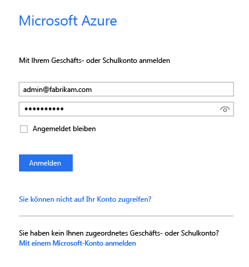
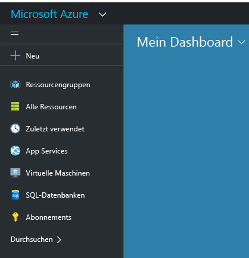
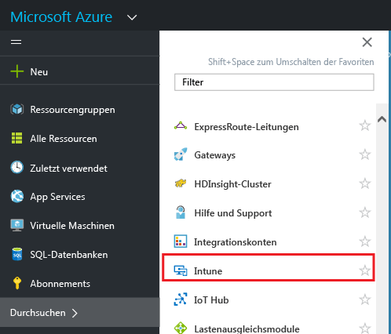
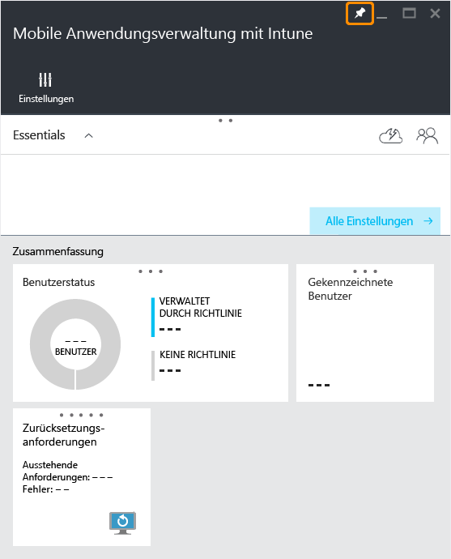
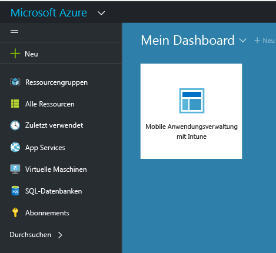

# Azure-Portal für MAM-Richtlinien in Microsoft Intune
## Zugreifen auf das Azure-Portal
Über das **Azure-Portal** können Sie Richtlinien zur Verwaltung mobiler Apps erstellen und verwalten.

Das Azure-Portal unterstützt das Erstellen von MAM-Richtlinien für:
- Apps, die auf Geräten ausgeführt werden, die von **Intune registriert und verwaltet werden**.
- Apps, die auf Geräten ausgeführt werden, die **nicht** in einer MDM-Lösung registriert sind.
- Apps, die auf Geräten ausgeführt werden, die **in einer MDM-Lösung von Drittanbietern registriert sind**.

>[!IMPORTANT]

> Wenn Sie derzeit Ihre Geräte mit der [Intune-Verwaltungskonsole](configure-and-deploy-mobile-application-management-policies-in-the-microsoft-intune-console.md) verwalten, können Sie mithilfe dieser Konsole eine MAM-Richtlinie erstellen, die Apps für die bei Intune registrierten Geräte unterstützt.

> Möglicherweise werden in der Intune-Verwaltungskonsole nicht alle MAM-Richtlinieneinstellungen angezeigt. Das Azure-Portal stellt die neue Verwaltungskonsole zum Erstellen von MAM-Richtlinien dar. Wenn Sie sowohl in der Intune-Verwaltungskonsole als auch im Azure-Portal MAM-Richtlinien erstellen, wird die im Azure-Portal erstellte Richtlinie auf die Apps angewendet und für die Benutzer bereitgestellt.

## Melden Sie sich beim Azure-Portal an, und passen Sie Ihre Startseite an.

1.  Navigieren Sie zum [Azure-Portal](https://portal.azure.com), und melden Sie sich mit Ihren [!INCLUDE[wit_nextref](../includes/wit_nextref_md.md)]-Anmeldeinformationen an.

    

2.  Sobald Sie erfolgreich angemeldet sind, wird das **Dashboard** angezeigt. Die Seite **Dashboard** enthält eine Reihe von Standardkacheln. Sie können diese entfernen und neue Kacheln hinzufügen, um die Seite anzupassen.

    

3.  Über das Menü **Durchsuchen** finden Sie **Intune**.

4.  Klicken Sie auf **Intune > Mobile Anwendungsverwaltung mit Intune > Einstellungen**.

    

    > [!TIP]
    > Zum Anheften eines Blatts an die **Startseite** können Sie auf dem Blatt die Option zum **Anheften** verwenden.  Klicken Sie auf dem Blatt **Intune-Verwaltung von mobilen Anwendungen**auf das Pinsymbol, um das Blatt an die **Startseite** anzuheften.

    

    
## Nächste Schritte
[Vorbereiten der Konfiguration von Verwaltungsrichtlinien für mobile Apps](get-ready-to-configure-mobile-app-management-policies-with-microsoft-intune.md)

<!--HONumber=Jul16_HO3-->

