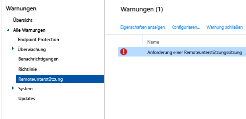

# Allgemeine Aufgaben zur Verwaltung von Windows-PCs mit dem Microsoft Intune-Computerclient
Überprüfen Sie die Aufgaben in diesem Thema, um zu erfahren, wie Sie Computer verwalten, auf denen die Intune-PC-Clientsoftware ausgeführt wird. Wenn Sie den Client noch nicht auf Ihren Computern installiert haben, finden Sie unter [Installieren des Windows-PC-Clients mit Microsoft Intune](install-the-windows-pc-client-with-microsoft-intune.md) weitere Informationen.

## Verwenden von Richtlinien zum Vereinfachen der Verwaltung von PCs
### Verwalten der Windows-Firewall
Mit Richtlinien lässt sich die Verwaltung der Einstellungen der Windows-Firewall auf verwalteten Computern vereinfachen. Weitere Informationen finden Sie unter [Unterstützen des Schutzes von Windows-PCs mithilfe von Windows-Firewall-Richtlinien in Microsoft Intune](help-protect-windows-pcs-using-windows-firewall-policies-in-microsoft-intune.md).

### Verwalten des Microsoft Intune Center
Das Microsoft Intune Center bietet Benutzern folgende Möglichkeiten:

-   Abrufen von Anwendungen aus dem Unternehmensportal

-   Suchen nach Updates

-   Verwalten von Microsoft Intune Endpoint Protection

<!--- -   Request remote assistance.--->

Das Microsoft Intune Center ist auf allen verwalteten Computern installiert. Sie können die folgenden Einstellungen in einer Intune Center-Richtlinie konfigurieren, die dann Benutzern im Microsoft Intune Center angezeigt werden:

|Richtlinieneinstellung|Details|
|------------------|--------------------|
|**Name**|Name des Administrators, der den Computer verwaltet  Maximale Länge: 40 Zeichen|
|**Telefonnummer**|Telefonnummer des Administrators, der den Computer verwaltet  Maximale Länge: 20 Zeichen|
|**E-Mail-Adresse**|E-Mail-Adresse des Administrators, der den Computer verwaltet  Maximale Länge: 40 Zeichen|
|**Name der Website**|Name der Supportwebsite für Benutzer  Maximale Länge: 40 Zeichen|
|**URL der Website**|URL der Supportwebsite  Maximale Länge: 150 Zeichen|
|**Hinweise**|Hinweis, der Benutzern angezeigt wird  Maximale Länge: 120 Zeichen|

### Verwalten der Einstellungen für Softwareupdates
Mit Richtlinien können Sie die Einstellungen konfigurieren, mit deren Hilfe von verwalteten Computern nach Softwareupdates von Microsoft und Drittanbietern gesucht und diese heruntergeladen werden. Weitere Informationen finden Sie unter [Aktualisieren Ihrer Windows-PCs mit Softwareupdates in Microsoft Intune](keep-windows-pcs-up-to-date-with-software-updates-in-microsoft-intune.md).

### Verwalten der Endpoint Protection-Einstellungen
Konfigurieren Sie die Einstellungen für Endpoint Protection mithilfe von Richtlinien, und stellen Sie sie dann auf verwalteten Computern bereit. Dies schließt Überprüfungszeitpläne, nach dem Erkennen von Schadsoftware durchzuführende Schritte und mehr ein. Weitere Informationen finden Sie unter [Schützen von Windows-PCs mit Endpoint Protection für Microsoft Intune](help-secure-windows-pcs-with-endpoint-protection-for-microsoft-intune.md).

## Anzeigen des Hardware- und Softwareinventars
Durch Intune werden ausführliche Informationen zur Hardware und Software der verbreiteten Computer erfasst. In den nachfolgend beschriebenen Verfahren lernen Sie, wie Sie

-   Einen Bericht erstellen, in dem Informationen zu den Hardwarefunktionen Ihres Computers aufgeführt sind

-   Einen Bericht erstellen, in dem die auf den jeweiligen Computern installierte Software aufgeführt ist

-   Das Inventar eines Computers aktualisieren, um sicherzustellen, dass die im Bericht enthaltenen Daten aktuell sind

### So zeigen Sie Informationen zu Ihren Computern an

1.  Wählen Sie in der [Microsoft Intune-Verwaltungskonsole](https://manage.microsoft.com/) die Option **Berichte** &gt; **Computerinventurberichte** aus.

2.  Übernehmen Sie auf der Seite **Neuen Bericht erstellen** die Vorgaben, oder passen Sie sie an, um die im Bericht zurückgegebenen Ergebnisse zu filtern. Sie können beispielsweise auswählen, dass nur Computer im Bericht angezeigt werden, auf denen Windows 8.1 ausgeführt wird.

3.  Wählen Sie **Bericht anzeigen** aus, um den **Computerinventurbericht** in einem neuen Fenster anzuzeigen.

    Sie können den Bericht durch Auswählen der entsprechenden Spaltenüberschrift nach jeder Spalte sortieren, z. B. **Name**, **Gehäusetyp** oder **Hersteller**.

### So zeigen Sie die auf Ihren Computern installierte Software an

1.  Wählen Sie in der [Microsoft Intune-Verwaltungskonsole](https://manage.microsoft.com/) die Option **Berichte** &gt; **Berichte zu ermittelter Software** aus.

2.  Übernehmen Sie auf der Seite **Neuen Bericht erstellen** die Vorgaben, oder passen Sie sie an, um die im Bericht zurückgegebenen Ergebnisse zu filtern. Sie können beispielsweise auswählen, dass nur von Microsoft herausgegebene Software im Bericht angezeigt wird.

3.  Wählen Sie **Bericht anzeigen** aus, um den **Bericht zu ermittelter Software** in einem neuen Fenster anzuzeigen.

    Sie können den Bericht durch Auswählen der entsprechenden Spaltenüberschrift nach jeder Spalte sortieren, z. B. **Name**, **Herausgeber** oder **Kategorie**. Durch Auswahl des Richtungspfeils neben dem Listenelement können Sie die Updates in der Liste erweitern, um weitere Details anzuzeigen (zum Beispiel die Computer, auf denen ein Update installiert ist).

### So aktualisieren Sie das Computerinventar, um sicherzustellen, dass es aktuell ist

1.  Wählen Sie in der [Microsoft Intune-Verwaltungskonsole](https://manage.microsoft.com/) die Option **Gruppen** &gt; **Alle Geräte** aus (oder eine andere Gruppe, in der der Computer enthalten ist, für den Sie das Inventar aktualisieren möchten).

2.  Wählen Sie einen Computer aus, oder wählen Sie mit gedrückter **STRG** -Taste mehrere Computer aus.

3.  Wählen Sie auf der Taskleiste **Remoteaufgaben** &gt; **Inventar aktualisieren** aus.

4.  Zur Anzeige des Aufgabenstatus wählen Sie **Remoteaufgaben** unten rechts auf der Seite aus.

    Im Dialogfeld **Taskstatus** werden aktuelle Remoteaufgaben, ihr Status, der Gerätename und etwaige gemeldete Fehler mit einem Link zu Problembehandlungsinformationen aufgelistet.

## Remoteneustart eines Windows-PCs

1.  Wählen Sie in der [Microsoft Intune-Verwaltungskonsole](https://manage.microsoft.com/) die Option **Gruppen** &gt; **Alle Geräte** aus (oder eine andere Gruppe, in der der Computer enthalten ist, den Sie erneut starten möchten).

2.  Wählen Sie mindestens einen Computer aus, und wählen Sie dann **Remoteaufgaben** &gt; **Computer neu starten**.

3.  Zur Anzeige des Aufgabenstatus wählen Sie **Remoteaufgaben** unten rechts auf der Seite aus.

4.  Überprüfen Sie im Dialogfeld **Taskstatus** die aktuellen Remoteaufgaben, den Aufgabenstatus, den Gerätenamen und etwaige gemeldete Fehler.

## Abkoppeln eines Computers

1.  Wählen Sie in der [Microsoft Intune-Verwaltungskonsole](https://manage.microsoft.com/) die Option **Gruppen** &gt; **Alle Geräte** aus (oder eine andere Gruppe, in der der Computer enthalten ist, den Sie abkoppeln möchten).

2.  Wählen Sie die Geräte aus, die Sie abkoppeln möchten, und wählen Sie dann **Abkoppeln/Zurücksetzen** aus.

Zum erneuten Registrieren eines Computers bei Intune müssen Sie die Clientsoftware erneut auf dem Computer installieren. Gehen Sie hierzu vor wie im Thema [Installieren des Windows-PC-Clients mit Microsoft Intune](install-the-windows-pc-client-with-microsoft-intune.md) beschrieben.

Wenn von einem Computer keine Verbindung mit Intune hergestellt werden kann, wird im Arbeitsbereich **Dashboard** eine Meldung angezeigt.

Wenn Sie einen Computer abkoppeln, werden folgende Aktionen ausgeführt:

-   Der Computer wird aus dem Intune-Inventar entfernt, und die mit dem Computer verknüpfte Lizenz steht zur erneuten Verwendung zur Verfügung.

-   Der Status des Computers wird nicht mehr in der Intune-Konsole angezeigt.

-   Die Clientsoftware wird von Intune vom Computer entfernt. Wenn der Computer nicht mit dem Intune-Dienst verbunden ist, wird die Clientsoftware nach dem nächsten Herstellen der Verbindung entfernt.

-   Microsoft Intune Endpoint Protection wird vom Computer entfernt. Wenn auf dem Computer eine andere Endpunktanwendung installiert ist und diese deaktiviert ist, kann sie unter Umständen nach dem Entfernen von Microsoft Intune Endpoint Protection wieder aktiviert werden, um sicherzustellen, dass Ihre Computer geschützt sind.

-   Alle vorhandenen Richtlinien werden vom Computer entfernt, und die durch die Richtlinie festgelegten Werte werden geändert.

-   Der Computer erhält vom Intune-Dienst keine Softwareupdates oder aktualisierten Schadsoftwaredefinitionen mehr.

-   Abgekoppelte Computer können je nach Konfiguration weiterhin Updates über Windows Server Update Services, Windows Update oder Microsoft Update empfangen.

    > [!IMPORTANT]
    > Wurde die Clientsoftware mithilfe eines Gruppenrichtlinienobjekts installiert, dann müssen Sie zuerst das Gruppenrichtlinienobjekt entfernen, bevor Sie die Clientsoftware entfernen können. So wird verhindert, dass die Software erneut installiert wird.

    Wenn der Client nicht deinstalliert werden kann, finden Sie hilfreiche Informationen unter [Problembehandlung für Endpoint Protection](/intune/troubleshoot/troubleshoot-endpoint-protection-in-microsoft-intune).

## Verwalten von Verknüpfungen zwischen Benutzern und Geräten
Damit Sie Software für einen Benutzer bereitstellen können, müssen Sie diesen zunächst mit einem Computer verknüpfen. Sie können einen Benutzer mit mehreren Computern verknüpfen, aber einzelne Computer nur mit jeweils einem Benutzer. Benutzer werden automatisch mit den Computern verknüpft, die sie über das Unternehmensportal in Intune registrieren.

### So verknüpfen Sie einen Benutzer mit einem Computer

1.  Wählen Sie in der [Microsoft Intune-Verwaltungskonsole](https://manage.microsoft.com/) die Option **Gruppen** &gt; **Alle Geräte** aus (oder eine andere Gruppe, in der der Computer enthalten ist, den Sie mit einem Benutzer verknüpfen möchten).

2.  Wählen Sie den Computer aus, den Sie mit einem Benutzer verknüpfen möchten, und wählen Sie dann **Benutzer verknüpfen** aus.

    Im Dialogfeld **Benutzer verknüpfen** wird eine Liste verfügbarer Benutzer mit ihren Anzeigenamen, Benutzer-IDs und der Anzahl von Computern angezeigt, mit denen die Benutzer jeweils aktuell verknüpft sind. Wenn ein Benutzer bereits mit dem ausgewählten Computer verknüpft ist, werden Name und Benutzer-ID des Benutzers unter **Aktueller Benutzer**angezeigt. Wenn der Computer mit keinem Benutzer verknüpft ist, wird unter **Aktueller Benutzer** der Wert **Kein Benutzer**angezeigt.

3.  Führen Sie eines der folgenden Verfahren aus:

    -   Wählen Sie **Abbrechen** aus, um die Verknüpfung des Computers mit einem ggf. vorhandenen aktuellen Benutzer beizubehalten.

    -   Zum Entfernen der Verknüpfung mit dem aktuellen Benutzer wählen Sie ggf. **Verknüpfung entfernen** &gt; **OK** aus.

    -   Zum Verknüpfen des Computers mit einem neuen Benutzer wählen Sie diesen in der Liste **Alle Benutzer** aus. Überprüfen Sie, ob die Benutzerdaten korrekt sind, und wählen Sie **OK** aus.

> [!TIP]
> Wenn Sie die Fähigkeit der Endbenutzer, sich mit Computern zu verknüpfen, einschränken möchten, aktivieren Sie die Option **Fähigkeit der Benutzer einschränken, sich mit Computern zu verknüpfen** in der Richtlinie **-Microsoft Intune-Agent-Einstellungen**.

<!--- ## Request and provide remote assistance to Windows PCs that use the Intune client software

> [!IMPORTANT]
> You might not see the options to configure TeamViewer integration for remote assistance in the Intune admin console. This capability is not currently available to all customers, but will be rolling our more widely soon.
     

Microsoft Intune can use the [TeamViewer](https://www.teamviewer.com) software to let users of PCs that run the Intune client software get remote assistance help from you. When a user requests help from the Microsoft Intune Center, you are informed by an alert, can accept the request, and then provide assistance.
This functionality replaces the existing Windows Remote Assistance functionality in Intune.

### Before you start

Before you can begin to establish and respond to remote assistance requests, you must ensure the following prerequisites are in place:

- You must have [signed up for a TeamViewer account](https://login.teamviewer.com/LogOn#register) to log into the TeamViewer website.
- Windows PCs that you want to administer must be [managed by the Windows PC client](manage-windows-pcs-with-microsoft-intune.md)
- All Windows PC operating systems supported by Intune can be administered.

### Configure the TeamViewer Connector

1. In the [Microsoft Intune administration console](https://manage.microsoft.com), choose **Admin**.
2. In the **Admin** workspace, choose **TeamViewer**.
3. On the **TeamViewer** page, under **TeamViewer Connector**, choose **Enable**.
4. In the **Enable TeamViewer** dialog box, view, then **Accept** the license terms. If you don't already own a TeamViewer license, choose **Purchase a TeamViewer license**.
5. After the TeamViewer browser window opens, sign into the site with your TeamViewer credentials.
6. On the TeamViewer site, read, then accept the options to allow Intune to connect with TeamViewer.
7. In the Intune console, verify that the **TeamViewer Connector** item shows as **Enabled**.

### Open a remote assistance request (end user)

1. On a client Windows PC, open the **Microsoft Intune Center**.
2. Under **Remote Assistance**, choose **Request Remote Assistance**.
3. After you approve the request (see below), TeamViewer opens on the client. The user must accept any messages indicating that the web browser is trying to open the TeamViewer application.
4. The user sees a message asking if you can control their PC. They must accept this message to continue.
5. During the remote assistance session, the user sees a window that shows them you are connected. If they close this window, the remote session ends.

### Respond to a remote assistance request

1. When a user submits a remote assistance request, you can view it in the **Alerts** workspace, under **Monitoring** > **Remote Assistance**. For example:
> 

 If a request goes unanswered for more than 4 hours, it is removed.
2. To accept the request, choose **Approve request and launch Remote Assistance**.
3. In the **A New Remote Assistance Request is Pending** dialog box, choose **Accept the remote assistance request**. If it's not already installed, TeamViewer will install any necessary apps on your computer.
4. TeamViewer then notifies the end user that you want to take control of their PC. After the user has accepted the request, the TeamViewer windows opens, and you can control the PC. 
 
While in a remote assistance session, you can use all available TeamViewer commands to control the remote PC. For help with these commands, download the [Manual for remote control](http://www.teamviewer.com/en/support/documents/) from the TeamViewer website.

### Close the remote assistance session

From the **Actions** menu of the **TeamViewer** window, choose **End Session**.--->

<!--HONumber=Jul16_HO3-->

