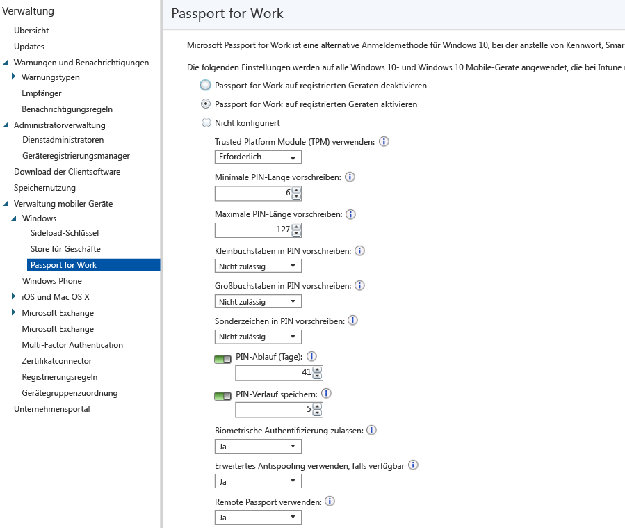

# Steuern von Microsoft Passport-Einstellungen auf Geräten mit Microsoft Intune
Microsoft Intune ermöglicht die Integration in **Microsoft Passport for Work**. Dies ist eine alternative Anmeldemethode, die Active Directory oder ein Azure Active Directory-Konto verwendet, um ein Kennwort, eine Smartcard oder eine virtuelle Smartcard zu ersetzen.

Mit Passport können Sie anstelle eines Kennworts eine **Benutzeraktion** zur Anmeldung verwenden. Eine Benutzeraktion kann eine einfache PIN, eine biometrische Authentifizierung wie Windows Hello oder ein externes Gerät sein, z. B. ein Fingerabdruckleser.

>[!TIP]
>Microsoft Passport for Work heißt jetzt Windows Hello for Business. Die Intune-Konsole wird in einem zukünftigen Update gemäß dieser Änderung aktualisiert.

Intune wird auf zwei Arten in Passport for Work integriert:

-   Sie können mithilfe einer Intune-Richtlinie steuern, welche Aktionen von Benutzern zum Anmelden verwendet werden können.

-   Sie können Authentifizierungszertifikate im Passport for Work-Schlüsselspeicheranbieter (Key Storage Provider, KSP) speichern. Weitere Informationen finden Sie unter [Sicherer Zugriff auf Ressourcen mit Zertifikatprofilen in Microsoft Intune](secure-resource-access-with-certificate-profiles.md).

## So erstellen Sie eine Passport for Work-Richtlinie

1.  Klicken Sie in der [Microsoft Intune-Verwaltungskonsole](https://manage.microsoft.com) auf **Verwaltung** &gt; **Verwaltung mobiler Geräte** &gt; **Windows** &gt; **Passport for Work**, um die Seite „Passport for Work“ wie unten dargestellt zu öffnen.

    

2.  Wählen Sie eine der folgenden Einstellungen aus:
    - **Passport for Work auf registrierten Geräten deaktivieren**: Wenn Sie Passport for Work auf Geräten mit Windows 10 verwenden möchten, wählen Sie diese Einstellung aus. Alle anderen Einstellungen auf dem Bildschirm sind deaktiviert.
    - **Passport for Work auf registrierten Geräten aktivieren**: Wählen Sie diese Einstellung aus, wenn Sie Passport for Work-Einstellungen auf allen Geräten mit Windows 10 konfigurieren möchten.
    - **Nicht konfiguriert**: Wählen Sie diese Einstellung aus, wenn Sie Passport for Work-Einstellungen mithilfe von Intune steuern möchten. Vorhandene Passport for Work-Einstellungen werden auf Geräten mit Windows 10 nicht geändert. Alle anderen Einstellungen auf dem Bildschirm sind deaktiviert.
3.  Wenn Sie **Passport for Work auf registrierten Geräten aktivieren** ausgewählt haben, konfigurieren Sie die erforderlichen Einstellungen, die auf alle registrierten Geräte mit Windows 10 und Windows 10 Mobile angewendet werden.
3.  Wenn Sie fertig sind, klicken Sie auf **Speichern**.

## Passport for Work: PIN-Einstellungen

  
- **Mindestlänge für PIN erfordern**/**Maximale Länge für PIN erfordern**: Konfiguriert Geräte für die Verwendung der von Ihnen angegebenen minimalen und maximalen PIN-Länge, um eine sichere Anmeldung zu gewährleisten. Die Standard-PIN-Länge beträgt 6 Zeichen, aber Sie können eine Mindestlänge von 4 Zeichen erzwingen. Die maximale PIN-Länge ist 127 Zeichen.
- **Kleinbuchstaben in PIN erfordern**/**Großbuchstaben in PIN erfordern**/**Sonderzeichen in PIN erforderlich**: Darüber hinaus können Sie eine stärkere PIN erzwingen, indem Sie die Verwendung von Groß- und Kleinbuchstaben sowie von Sonderzeichen in der PIN erfordern. Wählen Sie aus:
    - **Zulässig**: Benutzer können den Zeichentyp in ihrer PIN verwenden, aber es ist nicht zwingend erforderlich.
    - **Erforderlich**: Benutzer müssen in ihre PIN mindestens einen der Zeichentypen einbeziehen. Beispielsweise ist es üblich, mindestens einen Großbuchstaben und ein Sonderzeichen zu erfordern.
    - **Nicht zulässig** (Standard): Benutzer dürfen diese Zeichentypen in ihrer PIN nicht verwenden (dies trifft auch zu, wenn die Einstellung nicht konfiguriert ist).
    > [!TIP]
    > Sonderzeichen umfassen: **! " # $ % &amp; ' ( ) &#42; + , - . / : ; &lt; = &gt; ? @ [ \ ] ^ _ &#96; { &#124; } ~**.
- **PIN-Ablauf (Tage)**: Es wird empfohlen, ein Ablaufdatum für eine PIN anzugeben, nach dem sie vom Endbenutzer geändert werden muss. Die Standardeinstellung ist 41 Tage. 
- **PIN-Verlauf speichern**: Verwenden Sie diese Einstellung, um die Wiederverwendung von zuvor verwendete PINs einzuschränken. Standardmäßig können die letzten fünf PINs nicht erneut verwendet werden.

## Passport for Work: Sonstige Einstellungen

- **Trusted Platform Module (TPM) verwenden**: Ein Trusted Platform Module-Chip bietet eine zusätzliche Sicherheitsebene für Daten. Wählen Sie einen der folgenden Werte aus:
    - **Erforderlich** (Standard): Nur Geräte mit verfügbarem TPM können Passport for Work bereitstellen.
    - **Bevorzugt**: Geräte versuchen zunächst, ein TPM zu verwenden. Wenn diese Option nicht verfügbar ist, können sie die Softwareverschlüsselung verwenden.
- **Biometrische Authentifizierung zulassen**: Aktiviert die biometrische Authentifizierung, z. B. die Gesichtserkennung oder Fingerabdrücke, als Alternative zu einer PIN für Passport for Work. Benutzer müssen für den Fall dennoch eine PIN konfigurieren, dass die biometrische Authentifizierung fehlschlägt. Wählen Sie aus:
    - **Ja**: Passport for Work gestattet die biometrische Authentifizierung.
    - **Nein**: Passport for Work verhindert die biometrische Authentifizierung (für alle Arten von Konten).
- **Verbessertes Antispoofing verwenden, sofern verfügbar**: Konfiguriert, ob die Antispoofingfeatures von Windows Hello auf Geräten verwendet werden, die diese unterstützen (z. B. ein Foto mit einem Gesicht anstelle eines echten Gesichts erkennen). Wenn diese Option auf **Ja** festgelegt ist, fordert Windows von allen Benutzern die Verwendung von Antispoofing für Gesichtsmerkmale, sofern dies unterstützt wird.
- **Remote Passport verwenden**: Wenn diese Option auf **Ja** festgelegt ist, können die Benutzer einen Remote-Passport als tragbares Begleitgerät für die Authentifizierung von Desktopcomputern verwenden. Der Desktopcomputer muss Azure Active Directory angehören, und das Begleitgerät muss mit einer Passport for Work-PIN konfiguriert werden.

## Weitere Informationen
Weitere Informationen zu Microsoft Passport finden Sie im [Leitfaden](https://technet.microsoft.com/library/mt589441.aspx) in der Dokumentation zu Windows 10.

<!--HONumber=Jul16_HO3-->

