---
# required metadata

title: Erstellen und Bereitstellen von MAM-Richtlinien | Microsoft Intune
description:
keywords:
author: karthikaraman
manager: jeffgilb
ms.date: 04/28/2016
ms.topic: article
ms.prod:
ms.service: microsoft-intune
ms.technology:
ms.assetid: c1b9a343-1737-4a65-a9c6-aca48acad11c

# optional metadata

#ROBOTS:
#audience:
#ms.devlang:
ms.reviewer: jeffgilb
ms.suite: ems
#ms.tgt_pltfrm:
#ms.custom:

---

# Erstellen und Bereitstellen von Verwaltungsrichtlinien für mobile Apps mit Microsoft Intune
MAM-Richtlinien (Mobile App Management) können unabhängig davon angewendet werden, ob die Geräte, auf denen die Apps ausgeführt werden, von Intune verwaltet werden oder nicht. Eine ausführlichere Beschreibung zur Funktionsweise von MAM-Richtlinien und den von Intune MAM-Richtlinien unterstützten Szenarien finden Sie im Thema [Schützen von App-Daten mithilfe von Richtlinien zur Verwaltung mobiler Geräte](protect-app-data-using-mobile-app-management-policies-with-microsoft-intune.md).

In diesem Thema wird der Erstellungsvorgang einer MAM-Richtlinie im **Azure-Portal** beschrieben. Das Azure-Portal ist die neue Verwaltungskonsole zum Erstellen von MAM-Richtlinien, und wir empfehlen, dass Sie Ihre MAM-Richtlinien in diesem Portal erstellen. Das Azure-Portal unterstützt die folgenden MAM-Szenarien:
- Bei Intune registrierte Geräte
- Geräte, die mithilfe einer MDM-Lösung eines Drittanbieters verwaltet werden
- Geräte, die gar keiner Verwaltung durch eine MDM-Lösung unterliegen (BYOD).

Wenn Sie derzeit Ihre Geräte mit der **Intune-Verwaltungskonsole** verwalten, können Sie mithilfe der [Intune-Verwaltungskonsole](configure-and-deploy-mobile-application-management-policies-in-the-microsoft-intune-console.md) eine MAM-Richtlinie erstellen, die Apps für die bei Intune registrierten Geräte unterstützt.
>[!IMPORTANT]
> Möglicherweise werden in der Intune-Verwaltungskonsole nicht alle MAM-Richtlinieneinstellungen angezeigt. Das Azure-Portal stellt die neue Verwaltungskonsole zum Erstellen von MAM-Richtlinien dar. Wenn Sie sowohl in der Intune-Verwaltungskonsole als auch im Azure-Portal MAM-Richtlinien erstellen, wird die im Azure-Portal erstellte Richtlinie auf die Apps angewendet und für die Benutzer bereitgestellt.

Wählen Sie eins der folgenden Themen aus, um eine Liste der für die Plattformen Android und iOS unterstützten Richtlinieneinstellungen anzuzeigen:

> [!div class="op_single_selector"]
- [iOS-Richtlinien](ios-mam-policy-settings.md)
- [Android-Richtlinien](android-mam-policy-settings.md)

##  Erstellen einer MAM-Richtlinie
Überprüfen Sie vor dem Erstellen einer MAM-Richtlinie die Informationen zu [Voraussetzungen und Support](get-ready-to-configure-mobile-app-management-policies-with-microsoft-intune.md).
1.  Wählen Sie **Intune-Verwaltung von mobilen Anwendungen &gt; Einstellungen** aus, um das Blatt **Einstellungen** zu öffnen.

    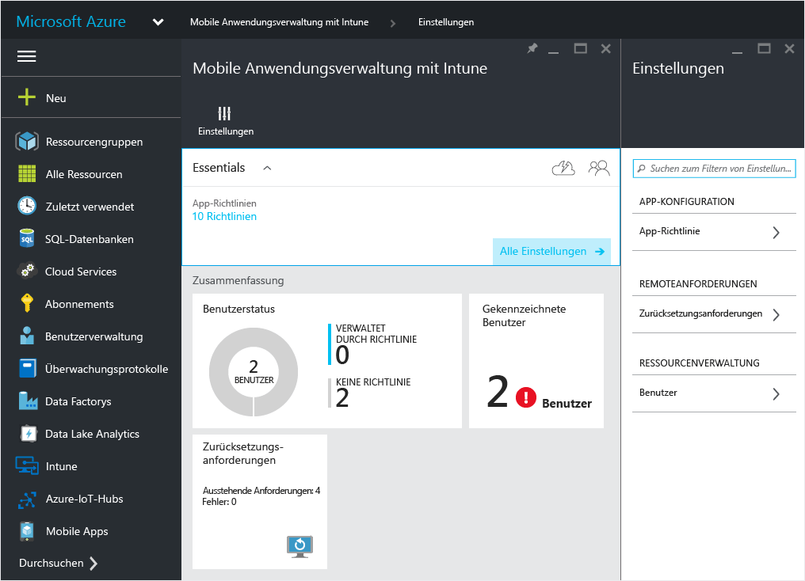

    > [!TIP] Wenn Sie das Azure-Portal zum ersten Mal verwenden, lesen Sie zuerst [Azure-Portal für MAM-Richtlinien in Microsoft Intune](azure-portal-for-microsoft-intune-mam-policies.md), um sich mit dem Portal vertraut zu machen.

2.  Wählen Sie auf dem Blatt **Einstellungen** **App-Richtlinie** aus.  Hiermit wird das Blatt **App-Richtlinie** geöffnet, auf dem Sie neue Richtlinien erstellen und vorhandene bearbeiten können.

    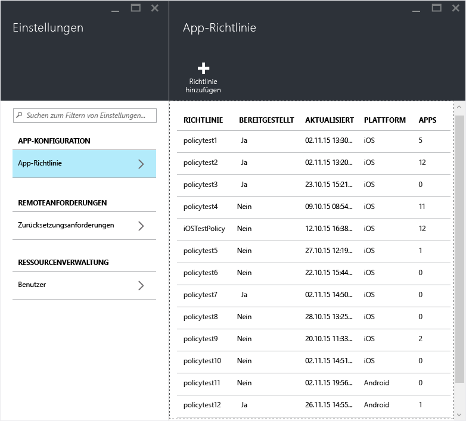

3.  Wählen Sie **Richtlinie hinzufügen** aus.

    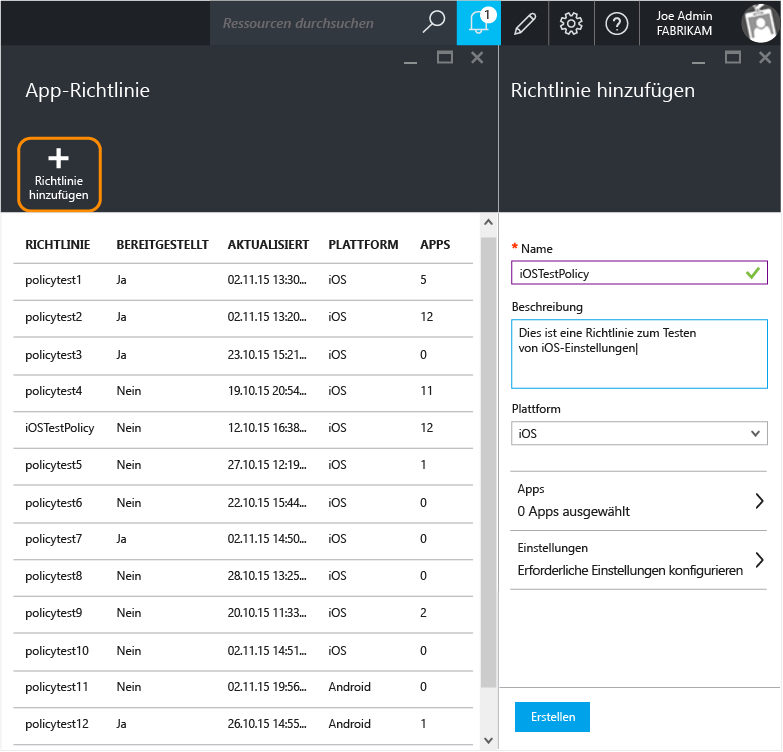

4.  Geben Sie einen Namen für die Richtlinie sowie eine kurze Beschreibung ein, und wählen Sie den Plattformtyp aus, um eine Richtlinie für iOS oder Android zu erstellen.  Sie können für jede Plattform mehr als eine Richtlinie erstellen.

    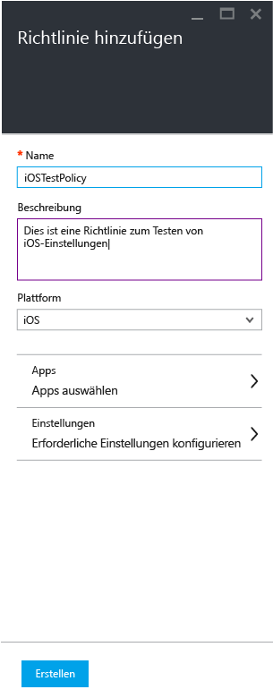

5.  Wählen Sie **Apps** aus, um das Blatt **Apps** zu öffnen, auf dem einer Liste der verfügbaren Apps angezeigt wird. Sie können eine oder mehrere Apps in der Liste auswählen, mit denen Sie die von Ihnen zu erstellende Richtlinie verknüpfen möchten. Nachdem Sie die Apps ausgewählt haben, wählen Sie die Schaltfläche **Auswählen** unten auf dem Blatt **Apps** aus, um Ihre Auswahl zu speichern.

    > [!IMPORTANT] Sie müssen mindestens eine App auswählen, um eine Richtlinie erstellen zu können.

6.  Wählen Sie auf dem Blatt **Richtlinie hinzufügen** **Erforderliche Einstellungen konfigurieren** aus, um das Blatt mit den Richtlinieneinstellungen zu öffnen.

    Es gibt zwei Kategorien von Richtlinieneinstellungen: **Datenverlagerung** und **Zugriff**.  Richtlinien für die Datenverlagerung beziehen sich auf die Datenverschiebung in und aus Apps, während mit Zugriffsrichtlinien bestimmt wird, wie der Endbenutzer auf die Apps im beruflichen Kontext zugreift.
    Um Ihnen bei den ersten Schritten zu helfen, enthalten die Richtlinieneinstellung Standardwerte.  Sie müssen keine Änderungen vornehmen, wenn die Standardwerte Ihren Anforderungen entsprechen.

    > [!TIP]
    > Diese Richtlinieneinstellungen werden nur durchgesetzt, wenn Apps im beruflichen Kontext verwendet werden.  Wenn der Endbenutzer die App zum Erledigen einer privaten Aufgabe verwendet, ist er von diesen Richtlinien nicht betroffen.

    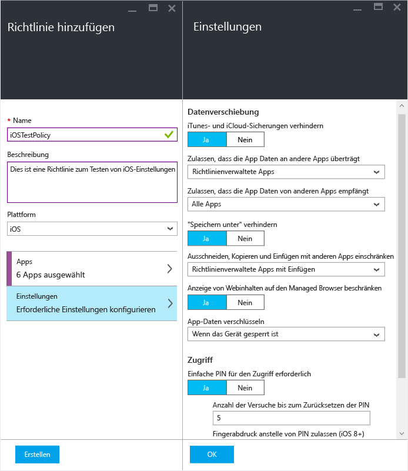

7.  Wählen Sie **OK** aus, um diese Konfiguration zu speichern.  Damit befinden Sie sich wieder auf dem Blatt **Richtlinie hinzufügen** . Wählen Sie **Erstellen** aus, um die Richtlinie zu erstellen und Ihre Einstellungen zu speichern.

    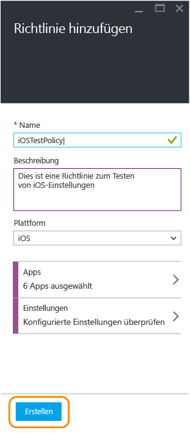

    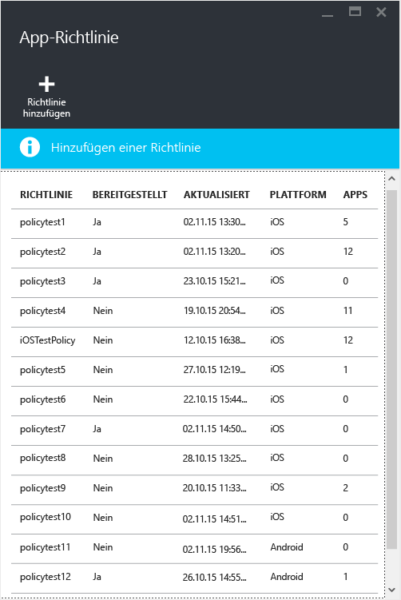

Wenn Sie mit dem Erstellen einer Richtlinie wie im vorherigen Verfahren beschrieben fertig sind, wird sie noch nicht für Benutzer bereitgestellt.  Folgen Sie den Schritten unten, um die Richtlinie bereitzustellen.

> [!IMPORTANT]
> Wenn Sie eine MAM-Richtlinie für eine App mithilfe der Intune-Verwaltungskonsole und eine MAM-Richtlinie mithilfe des Azure-Portals erstellen, erhält die im Azure-Portal erstellte Richtlinie den Vorrang. Mit der Berichterstattung in der Intune- oder Configuration Manager-Verwaltungskonsole werden jedoch die Richtlinieneinstellungen zurückgegeben, die im Azure-Portal erstellt wurden. Beispiel:
>
> -   Sie haben eine Verwaltungsrichtlinie für mobile Anwendungen in der Intune-Verwaltungskonsole erstellt, mit der Kopien aus einer Anwendung verhindert werden.
> -   Sie haben eine Verwaltungsrichtlinie für mobile Apps in der Azure-Verwaltungskonsole erstellt, die Kopien aus einer Anwendung zulässt.
> -   Sie führen beide Richtlinien in derselben App zusammen.
> -   Das Ergebnis ist, dass die Richtlinie, die Sie in der Azure-Verwaltungskonsole erstellt haben, Vorrang hat und Kopien möglich sind.
> -   Status und Berichte der Intune-Verwaltungskonsole geben jedoch fälschlicherweise an, dass Kopien nicht möglich sind.

## Bereitstellen einer Richtlinie für Benutzer

1.  Wählen Sie auf dem Blatt **Richtlinie** **Benutzergruppen** aus. Damit wird das Blatt **Benutzergruppen**geöffnet. Wählen Sie auf dem Blatt **Benutzergruppen** **Benutzergruppe hinzufügen** aus, um das Blatt **Benutzergruppe hinzufügen** zu öffnen.

    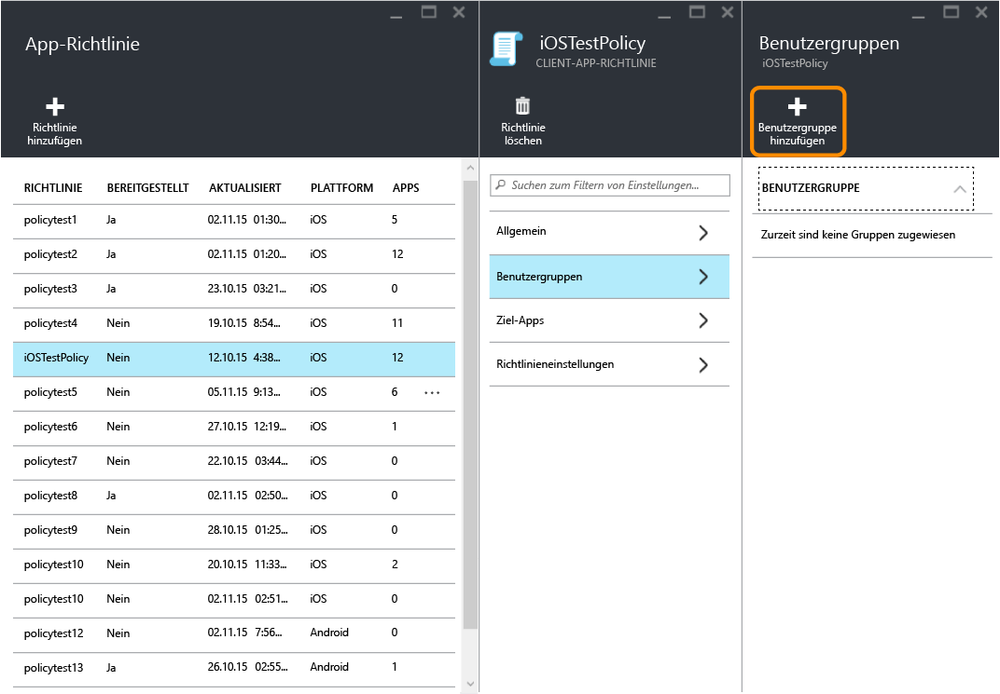

2.  Auf dem Blatt **Benutzergruppe hinzufügen** wird eine Liste der Benutzergruppen angezeigt. Dies ist eine Liste aller Sicherheitsgruppen in Ihrem **Azure Active Directory**.  Sie können die Benutzergruppen auswählen, auf die diese Richtlinie angewendet werden soll, und dann **Auswählen** auswählen. Die Auswahl von **Auswählen** bewirkt die Bereitstellung der Richtlinie für Benutzer.

    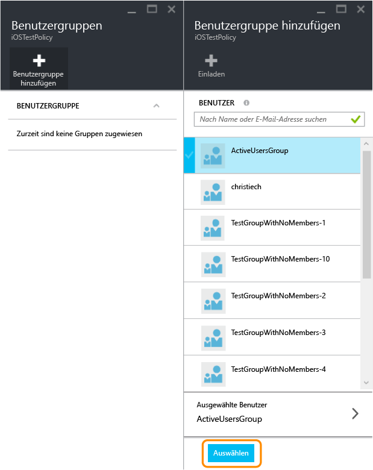

    Damit haben Sie eine Richtlinie erstellt und für die Benutzer bereitgestellt.

Von der Richtlinie sind nur Benutzer betroffen, denen [!INCLUDE[wit_nextref](../includes/wit_nextref_md.md)]-Lizenzen zugewiesen wurden.  Benutzer, die sich in einer von Ihnen ausgewählten Sicherheitsgruppe befinden und die nicht über eine [!INCLUDE[wit_nextref](../includes/wit_nextref_md.md)] -Lizenz verfügen, sind nicht betroffen.

Wenn Sie Intune mit Configuration Manager verwenden, um Ihre iOS- und Android-Geräte zu verwalten, wird die Richtlinie nur auf Benutzer in der Gruppe angewendet, die Sie ausgewählt haben.  Mitglieder untergeordneter Gruppen, die in der ausgewählten Gruppe geschachtelt sind, sind nicht betroffen.

Die Endbenutzer können die Apps aus dem App Store oder aus Google Play herunterladen. Eine detaillierte exemplarische Vorgehensweise zum Schutz von Unternehmensdaten auf Geräten mithilfe von MAM finden Sie im Thema [Benutzeroberfläche von Apps mit aktiviertem MAM](end-user-experience-for-mam-enabled-apps-with-microsoft-intune.md).

##  Ändern vorhandener Richtlinien
Sie können eine vorhandene Richtlinie bearbeiten und sie auf die als Ziel festgelegten Benutzer anwenden. Wenn Sie vorhandene Richtlinien ändern, werden diese Änderungen für Benutzer, die bereits bei der App angemeldet sind, jedoch in den nächsten acht Stunden nicht wirksam.

Um die Auswirkungen der Änderungen sofort zu erfahren, muss der Endbenutzer sich bei der App abmelden und sich dann erneut anmelden.

### So ändern Sie die Liste der Apps, die einer Richtlinie zugeordnet sind

1.  Wählen Sie auf dem Blatt **App-Richtlinie** die Richtlinie aus, die Sie ändern möchten. Damit wird ein Blatt speziell für die Richtlinie geöffnet, die Sie soeben ausgewählt haben.

    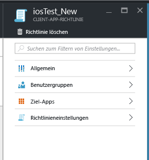

2.  Wählen Sie auf diesem Richtlinienblatt **Ziel-Apps** aus, um eine Liste der Apps zu öffnen.

3.  Fügen Sie der Liste Apps hinzu, oder entfernen Sie Apps hieraus, und wählen Sie dann das Symbol **Speichern** aus, um die Änderungen zu speichern.

### So ändern Sie die Liste der Benutzergruppen

1.  Wählen Sie auf dem Blatt **App-Richtlinie** die Richtlinie aus, die Sie ändern möchten. Damit wird ein Blatt speziell für die Richtlinie geöffnet, die Sie soeben ausgewählt haben.

2.  Wählen Sie auf dem Richtlinienblatt **Benutzergruppen** aus, um das Blatt **Benutzergruppe** zu öffnen, auf dem die Liste der Benutzergruppen angezeigt wird, auf die die Richtlinie gegenwärtig angewendet wird.

3.  Zum **Hinzufügen einer neuen Benutzergruppe** wählen Sie **Benutzergruppe hinzufügen**, und dann die Benutzergruppe aus. Wählen Sie **Auswählen** aus, um die Richtlinie für die ausgewählte Gruppe bereitzustellen.

    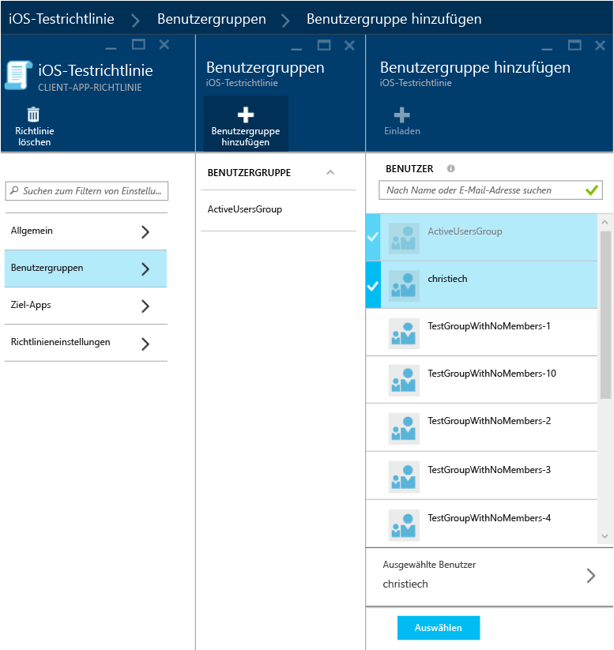

4.  Zum **Löschen einer Benutzergruppe**markieren Sie die Benutzergruppe, die Sie löschen möchten, wählen Sie die Ellipse (...) und dann **Löschen** aus, um die Benutzergruppe zu entfernen.

    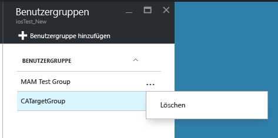

### So ändern Sie Richtlinieneinstellungen

1.  Wählen Sie auf dem Blatt **App-Richtlinie** die Richtlinie aus, die Sie ändern möchten. Damit wird ein Blatt speziell für die Richtlinie geöffnet, die Sie soeben ausgewählt haben.

    

2.  Wählen Sie **Richtlinieneinstellungen** aus, um das Blatt **Richtlinieneinstellungen** zu öffnen.

3.  Ändern Sie die Einstellungen, und wählen Sie das Symbol **Speichern** aus, um die Änderungen zu speichern.

    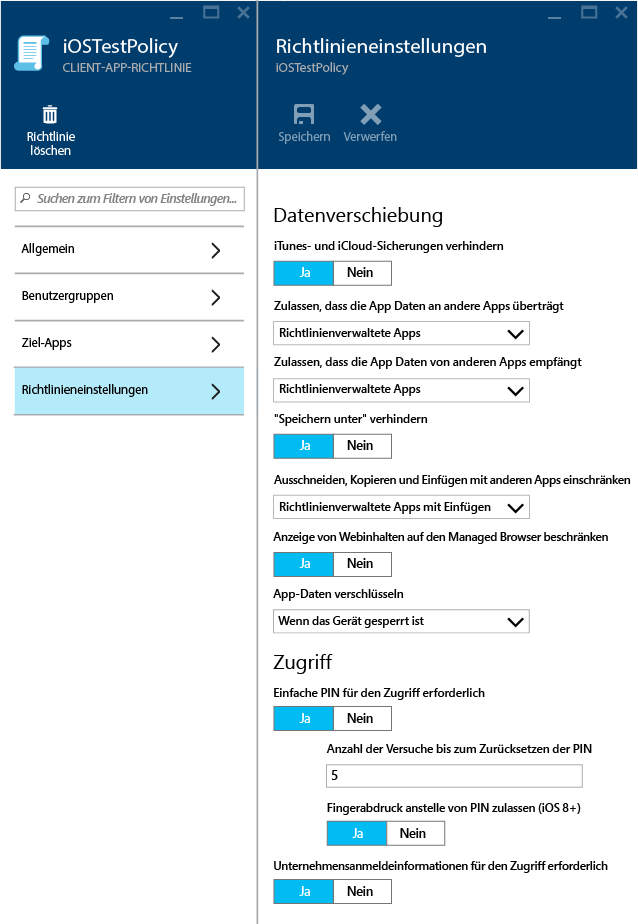

## Richtlinieneinstellungen
Eine vollständige Liste der Richtlinieneinstellungen für iOS und Android finden Sie in den folgenden Themen:

> [!div class="op_single_selector"]
  - [iOS-Richtlinien](ios-mam-policy-settings.md)
  - [Android-Richtlinien](android-mam-policy-settings.md)

## Nächste Schritte
[Überwachen von Compliance und Benutzerstatus](monitor-mobile-app-management-policies-with-microsoft-intune.md)

### Weitere Informationen:
[Benutzeroberfläche für MAM-fähige Apps](end-user-experience-for-mam-enabled-apps-with-microsoft-intune.md)

<!--HONumber=May16_HO3-->

