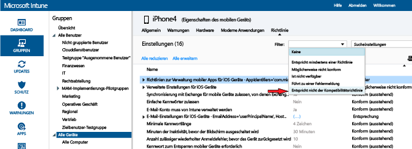

---
# required metadata

title: Bereitstellen und Überwachen der Kompatibilitätsrichtlinie in Microsoft Intune | Microsoft Intune
description:
keywords:
author: karthikaraman
manager: jeffgilb
ms.date: 04/28/2016
ms.topic: article
ms.prod:
ms.service: microsoft-intune
ms.technology:
ms.assetid: d8f246d4-0d86-4c8b-a1bf-9977985506d8

# optional metadata

#ROBOTS:
#audience:
#ms.devlang:
ms.reviewer: chrisgre
ms.suite: ems
#ms.tgt_pltfrm:
#ms.custom:

---

# Bereitstellen und Überwachen einer Kompatibilitätsrichtlinie für Geräte in Microsoft Intune
## Bereitstellen einer Konformitätsrichtlinie
Stellen Sie die von Ihnen [erstellte](create-a-device-compliance-policy-in-microsoft-intune.md) Kompatibilitätsrichtlinie für eine oder mehrere Gruppen von Benutzern oder Geräten in Ihrer Organisation bereit.

1.  Wählen Sie im Arbeitsbereich **Richtlinie** die Richtlinie aus, die Sie bereitstellen möchten, und wählen Sie dann **Bereitstellung verwalten** aus.

2.  Wählen Sie im Dialogfeld **Bereitstellung verwalten** mindestens eine Gruppe aus, für die die Richtlinie bereitgestellt werden soll. Wählen Sie dann **Hinzufügen > OK** aus.
 Kompatibilitätsrichtlinien können für Benutzer und/oder Geräte bereitgestellt werden. Verwenden Sie bereits erstellte und mit Intune synchronisierte Active Directory-Gruppen aus, oder erstellen Sie diese Gruppen manuell in der Intune-Konsole. Weitere Informationen zum Bereitstellen von Richtlinien finden Sie unter [Bereitstellen einer Konfigurationsrichtlinie](manage-settings-and-features-on-your-devices-with-microsoft-intune-policies.md).

Verwenden Sie die Statuszusammenfassung und Warnungen auf der Seite **Übersicht** des Arbeitsbereichs **Richtlinie**, um Probleme mit der Richtlinie zu identifizieren, die Ihre Aufmerksamkeit erfordern. Darüber hinaus wird eine Statusübersicht im Arbeitsbereich **Dashboard** angezeigt.

> [!IMPORTANT]Wenn Sie keine Konformitätsrichtlinie bereitgestellt haben und dann die Exchange-Richtlinie für bedingten Zugriff aktivieren, erhalten alle betreffenden Geräte Zugriff.

## Wie Intune-Richtlinienkonflikte gelöst werden
Richtlinienkonflikte können auftreten, wenn mehrere Intune-Richtlinien auf ein Gerät angewendet werden. Wenn sich Richtlinieneinstellungen überschneiden, löst Intune Konflikte nach den folgenden Regeln:

-   Wenn die in Konflikt stehenden Einstellungen zu einer Intune-Konfigurationsrichtlinie und einer Kompatibilitätsrichtlinie gehören, haben die Einstellungen in der Kompatibilitätsrichtlinie Vorrang vor den Einstellungen in der Intune-Konfigurationsrichtlinie, selbst wenn die Einstellungen in der Konfigurationsrichtlinie sicherer sind.

-   Wenn Sie mehrere Kompatibilitätsrichtlinien bereitgestellt haben, werden die sichersten dieser Richtlinien verwendet.

## Überwachen der Konformitätsrichtlinie

#### So zeigen Sie Geräte an, die keiner Konformitätsrichtlinie entsprechen

1.  Wählen Sie in der [Microsoft Intune-Verwaltungskonsole](https://manage.microsoft.com) die Option **Gruppen > Alle Geräte** aus.

2.  Doppelklicken Sie in der Geräteliste auf den Namen eines Geräts.

3.  Wählen Sie die Registerkarte **Richtlinie** aus, um eine Liste der Richtlinien für das Gerät anzuzeigen.

4.  Wählen Sie in der Dropdownliste **Filter** die Option **Entspricht nicht der Konformitätsrichtlinie** aus.

#### So zeigen Sie die Integritätsnachweisberichte an

1.  Wählen Sie in der [Microsoft Intune-Verwaltungskonsole](https://manage.microsoft.com) die Option **Berichte** aus.

2.  Auf der Seite **Integrationsnachweisbericht - Neuen Bericht erstellen** können Sie einen Bericht mit allen von Intune erfassten Windows 10-Integritätsnachweisdaten anzeigen. Sie können mithilfe von Filtern auch einen Bericht für eine Teilmenge der Daten erstellen. Die Filter können auf dem Gerätetyp, Betriebssystem oder auf einer Teilmenge der Datenpunkte basieren.

## Nächste Schritte
Sie können die Konformitätsrichtlinien jetzt zusammen mit bedingten Zugriffsrichtlinien verwenden, um den Zugriff auf Dienste in Ihrer Organisation zu steuern.

[Beschränken des Zugriffs auf E-Mail- und Office 365-Dienste](restrict-access-to-email-and-o365-services-with-microsoft-intune.md)

### Weitere Informationen:
[Einführung in Richtlinien zur Gerätekompatibilität in Intune](introduction-to-device-compliance-policies-in-microsoft-intune.md)

<!--HONumber=Jun16_HO2-->

