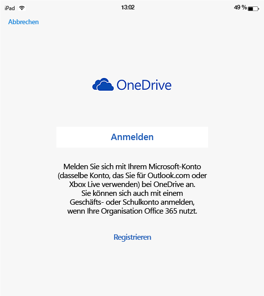
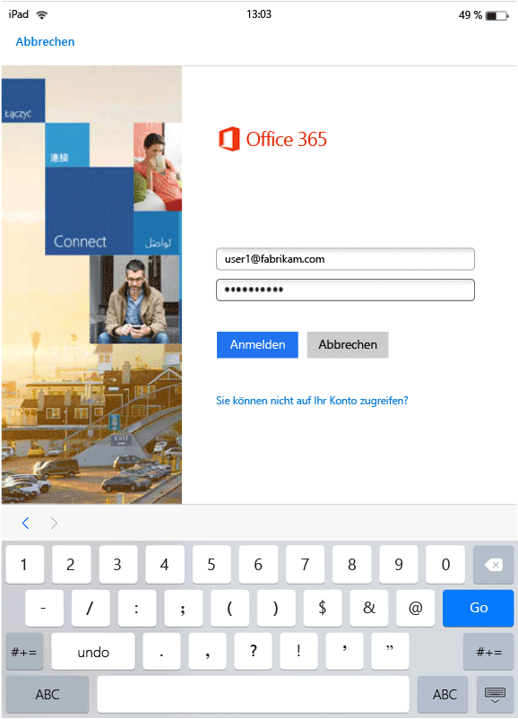

# Benutzeroberfläche für MAM-fähige Apps mit Microsoft Intune
MAM-Richtlinien (Mobile Application Management, Verwaltung mobiler Anwendungen) werden nur angewendet, wenn Apps im beruflichen Kontext verwendet werden.  Lesen Sie die folgenden Szenarien, um die Funktionsweise von verwalteten Apps zu verstehen.
##  Zugreifen auf OneDrive mit einem iOS-Gerät

1.  Starten Sie  **OneDrive** , um die Anmeldeseite zu öffnen.

    

    > [!NOTE]
    > Auf einem privaten Gerät würde der Endbenutzer normalerweise die App herunterladen.  Wenn das Gerät jedoch mit einer MDM-Lösung verwaltet wird, können Sie die App auf dem Gerät bereitstellen.

2.  Geben Sie den Benutzernamen Ihres Geschäftskontos ein. Sie werden auf die Seite **Office 365-Authentifizierung** weitergeleitet, auf der Sie Ihre Unternehmensanmeldeinformationen eingeben können.

    

3.  Nachdem Ihre Anmeldeinformationen von Azure Active Directory erfolgreich authentifiziert wurden, werden die MAM-Richtlinien angewendet, und Sie werden aufgefordert, **OneDrive** neu zu starten.
  >[HINWEIS!] Das Dialogfeld „Neustart erforderlich“ wird nur auf Geräten angezeigt, die nicht bei Intune registriert sind.

    

4.  Beim erneuten Starten der **OneDrive**-App wird die App mit aktivierten MAM-Richtlinien gestartet. Sie werden nun aufgefordert, eine **PIN** für die App einzugeben (sofern hierfür eine Richtlinie konfiguriert wurde).

    

5.  Nachdem Sie die PIN festgelegt und bestätigt haben, können Sie auf Ihre Dateien in **OneDrive for Business**zugreifen.

    

    > [!NOTE]
    > Wenn Sie eine schon bereitgestellte Richtlinie ändern, werden die Änderungen beim nächsten Öffnen der App angewendet.

##  Zugreifen auf OneDrive mit einem Android-Gerät

1.  Starten Sie OneDrive, um die Anmeldeseite zu öffnen.

    > [!NOTE]
    > Auf einem privaten Gerät würde der Endbenutzer normalerweise die App herunterladen.  Wenn das Gerät jedoch mit einer MDM-Lösung verwaltet wird, können Sie die App auf dem Gerät bereitstellen.

2.  Geben Sie den Benutzernamen Ihres Geschäftskontos ein. Sie werden auf die Seite **Office 365-Authentifizierung** weitergeleitet, auf der Sie Ihre Unternehmensanmeldeinformationen eingeben können.

    

3.  Nachdem Ihre Anmeldeinformationen von **Azure AD**erfolgreich authentifiziert wurden, sollte eine Meldung mit Anweisungen zur Installation der Unternehmensportal-App angezeigt werden, sofern diese auf dem Gerät noch nicht installiert ist.  Tippen Sie auf **App abrufen** , um fortzufahren.

>[!NOTE]
>Die Unternehmensportal-App ist auf Android-Geräten für alle Apps erforderlich, die MAM-Richtlinien zugeordnet sind. Für Geräte, die nicht bei Intune registriert sind, muss die App auf dem Gerät installiert sein, aber weder Starten der App noch Anmeldung bei der App sind erforderlich.  

  

4.  Sie befinden sich nun im **Google Play Store** , von wo Sie die App **Unternehmensportal** herunterladen und installieren können.

    Die App "Unternehmensportal" hilft Ihnen, Ihre Daten zu schützen.

    

5.  Wählen Sie nach Abschluss der Installation **Annehmen** aus, um die Bedingungen zu akzeptieren.

6.  **OneDrive** wird automatisch gestartet.

7.  Beim nächsten Öffnen von OneDrive werden Sie aufgefordert, eine **PIN**einzurichten, sofern die Richtlinieneinstellungen vorgeben, dass für den Zugriff auf **OneDrive** eine PIN erforderlich ist.

    

8.  Nachdem Sie die PIN festgelegt und bestätigt haben, können Sie **OneDrive**weiterhin verwenden, wobei nun die Richtlinien für verwaltete Apps gelten.

##  Verwenden von Apps mit Multi-Identity Support (Unterstützung für mehrere Identitäten)
Microsoft Word wird in diesem Szenario beispielhaft verwendet.

1.  Öffnen Sie **Word** auf Ihrem Gerät. Zur Darstellung der Schritte wird ein iOS-Gerät verwendet.

2.  Tippen Sie auf **Neu** , um ein neues Word-Dokument zu erstellen.

    

3.  Geben Sie einen Satz Ihrer Wahl ein.  Wenn Sie versuchen, dieses Dokument zu speichern, werden sowohl private als auch geschäftliche Speicherorte als Optionen zum Speichern des soeben erstellten Dokuments angezeigt.  An diesem Punkt werden die App-Richtlinien noch nicht angewendet, da der private/geschäftliche Kontext noch nicht eingerichtet wurde.

4.  Speichern Sie das Dokument an Ihrem OneDrive for Business-Speicherort. Das Dokument wird damit als Unternehmensdaten gekennzeichnet, und die Einschränkungen der Richtlinie werden wirksam.

    

5.  Öffnen Sie das Dokument, das Sie am Unternehmensspeicherort gespeichert haben.  Kopieren Sie den Text, öffnen Sie Ihr privates **Facebook**-Konto, und versuchen Sie, den kopierten Text einzufügen.  Sie sollten nicht in der Lage sein, den Inhalt in den neuen Facebook-Beitrag einzufügen. Die Option "Einfügen" ist nicht abgeblendet, aber wenn Sie auf **Einfügen**klicken, erfolgt keine Aktion.

    

    

6.  Wiederholen Sie jetzt die Schritte 2 und 3, um ein weiteres neues Dokument zu erstellen, geben Sie einen Satz Ihrer Wahl ein, und anstatt das Dokument an Ihrem geschäftlichen Speicherort zu speichern, speichern Sie es an Ihrem privaten Speicherort, etwa **OneDrive – Personal**

    

7.  Öffnen Sie das Dokument, das Sie auf Ihrem persönlichen Speicherort abgelegt haben.  Kopieren Sie den Text, öffnen Sie die **Facebook** -App, und versuchen Sie, den kopierten Text einzufügen. Wie Sie sehen, können Sie den kopierten Inhalt in einen Facebook-Beitrag einfügen.

    

##  Verwalten von Benutzerkonten

Intune unterstützt nur die Bereitstellung von MAM-Richtlinien auf je einem Benutzerkonto pro Gerät. Wenn ein Gerät über mehrere geschäftliche Konten verfügt, wird nur eines dieser geschäftlichen Konten durch die MAM-Richtlinien verwaltet.

Abhängig von der verwendeten App, ist der zweite Benutzer auf dem Gerät möglicherweise blockiert oder auch nicht. Unter allen Umständen wirken sich die MAM-Richtlinien nur auf den ersten Benutzer aus.

Wenn für ein Gerät vor der Bereitstellung der MAM-Richtlinien mehrere Benutzerkonten vorhanden sind, wird das Konto, für das die MAM-Richtlinien zuerst bereitgestellt werden, durch die Intune MAM-Richtlinien verwaltet.

**Microsoft Word**, **Excel** und **PowerPoint** blockieren ein zweites Benutzerkonto nicht, die MAM-Richtlinien wirken sich auf das zweite Benutzerkonto aber nicht aus.  

Für **OneDrive- und Outlook-Apps** kann nur ein geschäftliches Konto verwendet werden.  Das Hinzufügen weiterer Geschäftskonten wird von diesen Apps blockiert.  Sie können jedoch einen Benutzer entfernen und auf dem Gerät einen weiteren Benutzer hinzufügen.

Lesen Sie das Beispielszenario unten, um genauer zu verstehen, wie mehrere Benutzerkonten behandelt werden.

Benutzer A arbeitet für zwei Unternehmen – **Unternehmen X** und **Unternehmen Y**. Der Benutzer A verfügt für jedes Unternehmen über ein geschäftliches Konto, und beide verwenden Intune zum Bereitstellen von MAM-Richtlinien. **Unternehmen X** stellt MAM-Richtlinien **vor** **Unternehmen Y** bereit. Das **Unternehmen X** zugeordnete Konto erhält die MAM-Richtlinie, nicht jedoch das dem Unternehmen Y zugeordnete Konto. Wenn das Unternehmen Y zugeordnete Konto durch die MAM-Richtlinien verwaltet werden soll, müssen Sie das Unternehmen X zugeordnete Benutzerkonto entfernen.
### Hinzufügen eines zweiten Kontos
#### iOS
Wenn Sie ein iOS-Gerät verwenden und versuchen, auf demselben Gerät ein zweites Geschäftskonto einzurichten, wird möglicherweise eine Sperrnachricht angezeigt.  Darüber hinaus wird eine Option zum Entfernen des vorhanden Kontos und zum Hinzufügen eines neuen Kontos angezeigt. Wählen Sie hierfür **Ja** aus.

####  Android
Wenn Sie ein Android-Gerät verwenden, wird möglicherweise eine Sperrnachricht mit Anweisungen angezeigt, wie Sie das vorhandene Konto entfernen und ein neues Konto hinzufügen können.  Wechseln Sie auf Android-Geräten zum Entfernen eines vorhandenen Kontos zu **Einstellungen &gt; Allgemein &gt; Anwendungs-Manager &gt; Unternehmensportal**, und wählen Sie „Daten löschen“ aus.

##  Anzeigen von Mediendateien mit der Rights Management-Freigabeanwendung
Um unternehmenseigene AV-, PDF- und Bilddateien auf Android-Geräten anzuzeigen, verwenden Sie die [Microsoft Rights Management-Freigabeanwendung](https://play.google.com/store/apps/details?id=com.microsoft.ipviewer) (RMS-Freigabeanwendung).

Laden Sie diese App aus dem Google Play herunter.  Sobald die App auf Ihrem Gerät installiert ist, starten Sie die App, und authentifizieren Sie sich mit Ihren Unternehmens-Anmeldeinformationen. Sie sollten jetzt in der Lage sein, ungeschützte und geschützte Dateien aus anderen per Richtlinie verwalteten Apps anzuzeigen.

Die folgenden Dateitypen werden unterstützt:

* **Audio:** AAC LC, HE-AACv1 (AAC+), HE-AACv2 (erweitertes AAC+), AAC ELD (enhanced low delay ACC; erweitertes AAC mit geringer Verzögerung), AMR-NB, AMR-WB, FLAC, MP3, MIDI, Vorbis, PCM/WAVE.
* **Video:** H.263, H.264 AVC, MPEG-4 SP, VP8.
* **Bild:** JPG, PJPG, PNG, PPNG, BMP, PBMP, GIF, PGIF, JPEG, PJPEG.
* PDF, PPDF

------------
|**Pfile**|**text**|
|----|----|
|Pfile ist ein generisches „Wrapper“-Format für geschützte Dateien, das den verschlüsselten Inhalt und die RMS-Lizenzen einkapselt und zum Schützen aller Dateitypen verwendet werden kann.|Textdateien, einschließlich XML, CSV, etc. können zum Anzeigen in der App geöffnet werden, selbst wenn sie geschützt sind. Dateitypen: TXT, PTXT, CSV, PCSV, LOG, PLOG, XML, PXML.|
---------------
**Android-Geräte, die nicht bei Intune registriert sind**

Bevor Sie mithilfe der RMS-Freigabeanwendung Dateien anzeigen können, die aus anderen von Intune verwalteten Apps stammen, müssen Sie die RMS-Anwendung starten und sich mit Ihrem Geschäftskonto anmelden.  Wenn Sie sich angemeldet haben und **nur wenn Sie über keine RMS-Lizenz verfügen**, wird folgende Meldung angezeigt:

**Authentifizierung erfolgreich – Sie können jetzt Unternehmensdateien anzeigen, aber Ihre Organisation ist nicht so eingerichtet, dass Sie auch Dateien schützen können. Weitere Informationen erhalten Sie von Ihrem IT-Administrator.**

Dies verhindert nicht Sie, dass mit der RMS-Freigabeanwendung Unternehmensdateien anzeigen können. Sie können trotzdem Unternehmensdateien aus anderen von Intune verwalteten Apps öffnen und anzeigen, und auch die MAM-Richtlinien werden angewendet.  Diese Meldung besagt lediglich, dass Sie die zusätzlichen Schutzfunktionen der RMS-Freigabeanwendung nicht selbst auf eine Datei anwenden können.  Sie benötigen eine RMS-Lizenz, um Ihre Dateien mit diesen Schutzfunktionen zu schützen. Weitere Informationen über die Schutzfunktionen von RMS für Dateien finden Sie unter [Schützen einer Datei auf einem Gerät](https://docs.microsoft.com/en-us/rights-management/rms-client/sharing-app-protect-in-place) und [Schützen einer per E-Mail freigegebenen Datei](https://docs.microsoft.com/en-us/rights-management/rms-client/sharing-app-protect-by-email).

### Weitere Informationen:
[Erstellen und Bereitstellen von Verwaltungsrichtlinien für mobile Apps mit Microsoft Intune](create-and-deploy-mobile-app-management-policies-with-microsoft-intune.md)

<!--HONumber=Jul16_HO4-->

