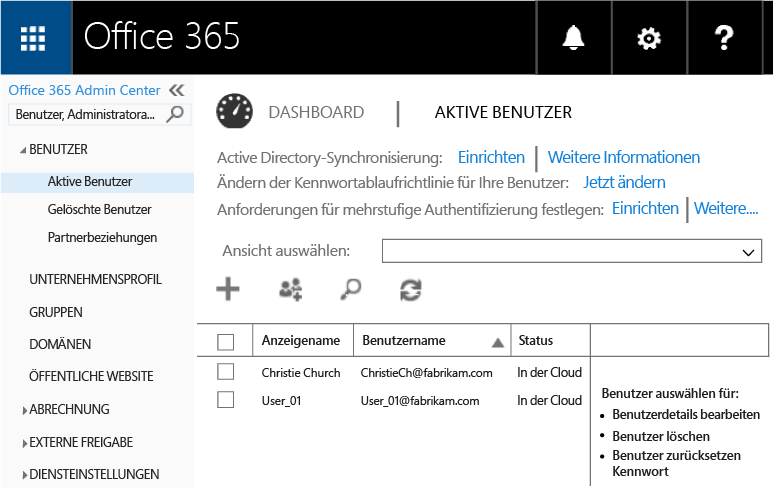
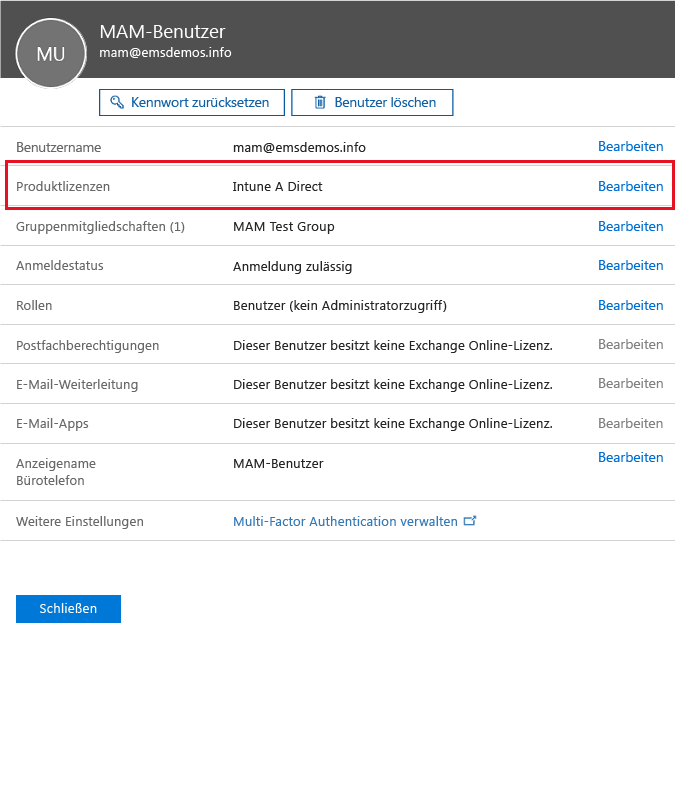
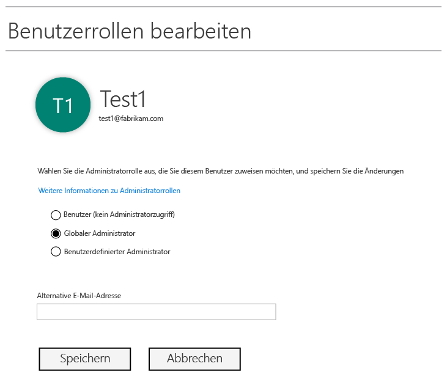
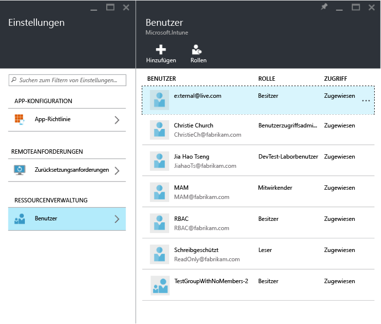
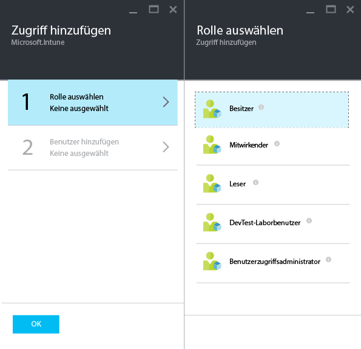
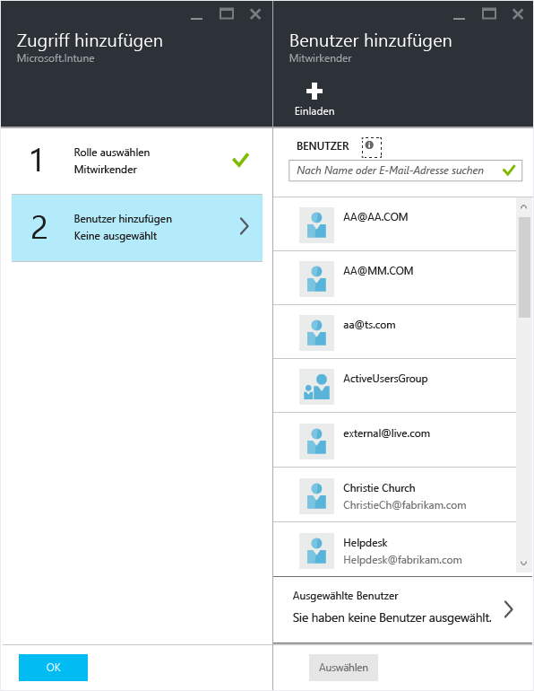

# Vorbereiten der Konfiguration von Verwaltungsrichtlinien für mobile Apps mit Microsoft Intune
In diesem Thema erfahren Sie, welche Schritte Sie ausführen müssen, bevor Sie im Azure-Portal Richtlinien für die Verwaltung von mobilen Apps (MAM, Mobile App Management) erstellen können.

Das Azure-Portal stellt die neue Verwaltungskonsole zum Erstellen von MAM-Richtlinien dar. Es empfiehlt sich, dieses Portal zu verwenden, um MAM-Richtlinien zu erstellen. Das Azure-Portal unterstützt die folgenden MAM-Szenarien:
- Geräte, die bei Intune registriert sind
- Geräte, die mithilfe einer MDM-Lösung eines Drittanbieters verwaltet werden
- Geräte, die nicht durch eine MDM-Lösung verwaltet werden (BYOD)

Wenn Sie Ihnen der Umgang mit dem Azure-Portal neu ist, sollten Sie sich im Artikel [Azure-Portal für MAM-Richtlinien in Microsoft Intune](azure-portal-for-microsoft-intune-mam-policies.md) einen kurzen Überblick verschaffen.

>[!IMPORTANT]

> Wenn Sie aktuell die Intune-Verwaltungskonsole zum Verwalten Ihrer Geräte verwenden, können Sie mithilfe der Intune-Verwaltungskonsole eine MAM-Richtlinie erstellen, die Apps für die bei Intune registrierten Geräte unterstützt. Es empfiehlt sich jedoch die Verwendung des Azure-Portals, selbst für Geräte, die in Intune registriert sind. Anweisungen zum Erstellen einer MAM-Richtlinie mithilfe der Intune-Verwaltungskonsole finden Sie unter [Konfigurieren und Bereitstellen von Verwaltungsrichtlinien für mobile Anwendungen in der Microsoft Intune-Konsole](configure-and-deploy-mobile-application-management-policies-in-the-microsoft-intune-console.md).

> Möglicherweise werden in der Intune-Verwaltungskonsole nicht alle MAM-Richtlinieneinstellungen angezeigt. Wenn Sie sowohl in der Intune-Verwaltungskonsole als auch im Azure-Portal MAM-Richtlinien erstellen, wird die im Azure-Portal erstellte Richtlinie auf die Apps angewendet und für die Benutzer bereitgestellt.
> MAM-Richtlinien, die in der Intune-Verwaltungskonsole erstellt wurden, können nicht in das Azure-Portal importiert werden.  Die MAM-Richtlinien müssen im Azure-Portal neu erstellt werden.

##  Unterstützte Plattformen
- iOS 8.1 oder höher

- Android 4 oder höher

Windows-Geräte werden momentan nicht unterstützt.
##  Unterstützte Apps
* **Microsoft-Apps**: Bei diesen Apps ist das Intune App SDK integriert, und vor der Anwendung von MAM-Richtlinien sind keine weiteren Schritte nötig.
Die vollständige Liste der unterstützten Microsoft-Apps finden Sie in der [Microsoft Intune mobile application gallery](https://www.microsoft.com/en-us/server-cloud/products/microsoft-intune/partners.aspx) (Microsoft Intune-Katalog für mobile Anwendungen) auf der Seite für Microsoft Intune-Anwendungspartner. Klicken Sie auf eine App, um die unterstützten Szenarien und Plattformen anzuzeigen und zu erfahren, ob die App mehrere Identitäten unterstützt.
* **Branchenspezifische Apps Ihrer Organisation**: Diese Apps müssen vorbereitet werden. Bevor Sie MAM-Richtlinien auf sie anwenden können, müssen Sie das Intune App SDK in die Apps integrieren.

  * Für Geräte, die mit Intune verwaltet werden, lesen Sie die Informationen unter [Auswählen der Vorbereitung von Apps für MAM](decide-how-to-prepare-apps-for-mobile-application-management-with-microsoft-intune.md).
  * Für nicht verwaltete Geräte, z. B. für Geräte im Besitz der Mitarbeiter, oder für Geräte, die über eine Drittanbieterlösung verwaltet werden, lesen Sie die Informationen unter [Schützen von branchenspezifischen Apps und Daten auf nicht in Intune registrierten Geräten](protect-line-of-business-apps-and-data-on-devices-not-enrolled-in-microsoft-intune.md).

*Bevor* Sie MAM-Richtlinien konfigurieren können, benötigen Sie Folgendes:

-   Ein Microsoft Intune-Abonnement.    Benutzer benötigen [!INCLUDE[wit_nextref](../includes/wit_nextref_md.md)]-Lizenzen, um Apps mit MAM-Richtlinien erhalten zu können.

-   Ein Office 365-Abonnement, das für Folgendes erforderlich ist:
  - Anwenden von MAM-Richtlinien auf Apps, die mehrere Identitäten unterstützen.
  - Erstellen von SharePoint Online- und Exchange Online-Arbeitskonten. Lokale Exchange- und SharePoint-Bereitstellungen werden nicht unterstützt.
-   Einrichten von Skype for Business Online für die moderne Authentifizierung. Weitere Informationen finden Sie unter [Aktivieren der modernen Authentifizierung](http://social.technet.microsoft.com/wiki/contents/articles/34339.skype-for-business-online-enable-your-tenant-for-modern-authentication.aspx).

- Azure Active Directory (Azure AD) zum Erstellen von Benutzern. Azure AD authentifiziert Benutzer, wenn diese die App starten und ihre geschäftlichen Anmeldeinformationen eingeben.

    > [!NOTE]
    > Wenn Sie Benutzer über die [!INCLUDE[wit_nextref](../includes/wit_nextref_md.md)]-Konsole einrichten, beachten Sie, dass die MAM-Richtlinienkonfiguration zum Azure-Portal migriert wird. Um dieses Portal zu verwenden, müssen Sie Azure AD-Benutzergruppen im Office 365-Portal einrichten.

## Erstellen von Benutzern und Zuweisen von Microsoft Intune-Lizenzen

1. Stellen Sie sicher, dass Sie über ein Intune-Abonnement verfügen. Sie verfügen bereits über ein [!INCLUDE[wit_nextref](../includes/wit_nextref_md.md)]-Abonnement, wenn Sie zurzeit [!INCLUDE[wit_nextref](../includes/wit_nextref_md.md)] zum Verwalten Ihrer Geräte verwenden.  Sie sind ebenfalls im Besitz eines [!INCLUDE[wit_nextref](../includes/wit_nextref_md.md)]-Abonnements, wenn Sie eine EMS-Lizenz (Enterprise Mobility Suite) erworben haben. Wenn Sie [!INCLUDE[wit_nextref](../includes/wit_nextref_md.md)] testen, um die MAM-Fähigkeiten kennenzulernen, können Sie auf der [Microsoft Intune-Webseite](http://www.microsoft.com/en-us/server-cloud/products/microsoft-intune/) ein Testkonto erhalten.

    Um zu überprüfen, ob Sie über ein [!INCLUDE[wit_nextref](../includes/wit_nextref_md.md)]-Abonnement verfügen, navigieren Sie im Office-Portal zur Seite **Abrechnung**.  In den Abonnements sollte [!INCLUDE[wit_nextref](../includes/wit_nextref_md.md)] als **Aktiv** angezeigt werden.

2.  Melden Sie sich mit Ihren Administratoranmeldeinformationen beim [Office-Portal](http://portal.office.com) an.

3.  Navigieren Sie zur Seite **Aktive Benutzer**, um Benutzer hinzuzufügen und [!INCLUDE[wit_nextref](../includes/wit_nextref_md.md)]-Lizenzen zuzuweisen.

    

    

4.  Um einem Benutzer Zugriff auf das Office-Portal, das Azure AD-Portal und das Azure-Portal zu gewähren, weisen Sie dem Benutzer die Rolle **Globaler Administrator** zu.

    

5.  MAM-Richtlinien werden für Benutzergruppen in Azure Active Directory bereitgestellt. Um Benutzergruppen für Ihre MAM-Richtlinien zu erstellen, navigieren Sie im Office-Portal zur Seite **Gruppen**, und klicken Sie im oberen Menü auf die Option **Gruppe hinzufügen**, um eine neue Sicherheitsgruppe zu erstellen.  Geben Sie einen Namen und eine Beschreibung ein, und klicken Sie auf **Erstellen**. Nachdem die Gruppe erstellt wurde, können Sie ihr Benutzer hinzufügen, indem Sie auf **Mitglieder bearbeiten** klicken. Die Sicherheitsgruppe wird in Azure Active Directory erstellt.

    

In der folgenden Tabelle werden die Rollen und Berechtigungen aufgelistet, die Sie Administratoren zuweisen können.

|||
|--|----|
|**Rolle**|**Berechtigungen**|
|Globaler Administrator (Office 365-Portal)|Zugriff auf das Office 365-Portal und das Azure AD-Portal.  Zugriff auf das Azure-Portal (damit können sowohl Rollenverwaltungs- als auch Verwaltungsaufgaben für mobile Apps ausgeführt werden).|
|Besitzer (Azure-Portal)|Zugriff auf das Azure-Portal (damit können sowohl Rollenverwaltungs- als auch Verwaltungsaufgaben für mobile Apps ausgeführt werden).|
|Mitwirkender (Azure-Portal)|Zugriff auf das Azure-Portal (damit können nur Verwaltungsaufgaben für mobile Apps ausgeführt werden).|

## Zuweisen der Rolle „Mitwirkender“ an einen Benutzer

Globale Administratoren haben Zugriff auf das [Azure-Portal](https://portal.azure.com).  Wenn Sie möchten, dass andere Administratoren in der Lage sind, Richtlinien zu konfigurieren und andere Verwaltungsaufgaben für mobile Apps auszuführen, können Sie den jeweiligen Benutzern die Rolle „Mitwirkender“ zuweisen:

1.  Klicken Sie auf dem Blatt **Einstellungen** im Abschnitt **Ressourcenverwaltung** auf **Benutzer**.

    

2.  Klicken Sie auf **Hinzufügen**, um das Blatt **Zugriff hinzufügen** zu öffnen.

3.  Klicken Sie auf **Rolle auswählen**, und klicken Sie dann auf **Mitwirkender**.

    

4.  Klicken Sie auf **Benutzer**, und suchen Sie anhand des Namens oder der E-Mail-Adresse nach dem Benutzer. Bei den in dieser Liste angezeigten Benutzern handelt es sich um die ersten 1000 Benutzer, die Sie zuvor über das Office-Portal in Azure AD erstellt haben. Klicken Sie auf dem Blatt **Zugriff hinzufügen** auf **OK**, um den Vorgang zu speichern und dem Benutzer die Rolle zuzuweisen.

    

    > [!IMPORTANT]
    > Wenn Sie einen Benutzer auswählen, dem keine [!INCLUDE[wit_nextref](../includes/wit_nextref_md.md)] -Lizenz zugewiesen ist, kann dieser Benutzer nicht auf das Portal zugreifen.

## Nächste Schritte
[Erstellen und Bereitstellen von Verwaltungsrichtlinien für mobile Apps mit Microsoft Intune](create-and-deploy-mobile-app-management-policies-with-microsoft-intune.md)

<!--HONumber=Aug16_HO1-->

