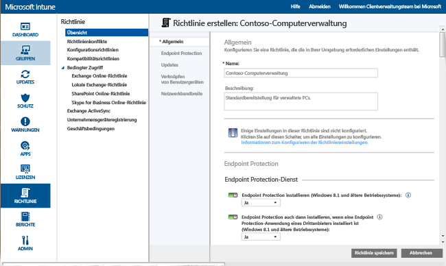

# Schützen von Windows-PCs mit Endpoint Protection für Microsoft Intune
Microsoft Intune kann Sie unterstützen, Ihre verwalteten Computer auf vielfältige Weise zu schützen. Dazu dient u. a. Endpoint Protection, das Echtzeitschutz gegen Bedrohungen durch Schadsoftware bietet, Schadsoftwaredefinitionen auf dem neuesten Stand hält und Computer automatisch überprüft. Endpoint Protection bietet außerdem Tools, mit denen Sie Angriffe durch Schadsoftware kontrollieren und überwachen können.

Falls Sie den Intune-Client noch nicht auf Ihren Computern installiert haben, finden Sie unter [Installieren des Windows-PC-Clients mit Microsoft Intune](install-the-windows-pc-client-with-microsoft-intune.md) weitere Informationen.

Verwenden Sie die Informationen in den folgenden Abschnitten zum Konfigurieren, Bereitstellen und Überwachen von Endpoint Protection.

## Wann eignet sich Endpoint Protection?
Eine ihrer wichtigsten Aufgaben als IT-Administrator besteht darin, die von Ihnen verwalteten Computer frei von Schadsoftware und Viren zu halten. Bevor Sie Intune auf Windows-PCs in Ihrer Organisation bereitstellen, sollten Sie entscheiden, wie Sie Ihre Computer schützen. Hierzu wählen Sie eine der folgenden Optionen aus und konfigurieren die zugehörigen Richtlinieneinstellungen:

|Ziel:|Richtlinieneinstellungen für Endpoint Protection|Weitere Informationen|
|--------------|---------------------------------------|--------------------|
|Microsoft Endpoint Protection nur verwenden, wenn keine Endpunktschutzanwendung von Drittanbietern installiert ist.  Sie können Microsoft Intune Endpoint Protection auf allen Computern verwenden, auf denen keine Endpunktschutzanwendung eines Drittanbieters installiert ist.|Endpoint Protection installieren = **Ja**  Endpoint Protection aktivieren = **Ja**  Endpoint Protection auch dann installieren, wenn eine Endpunktschutzanwendung von Drittanbietern installiert ist = **Nein**|Wenn die Endpunktschutzanwendung eines Drittanbieters erkannt wird, wird Microsoft Intune Endpoint Protection nicht installiert. Eine bereits installierte Instanz wird deinstalliert.|
|Microsoft Endpoint Protection verwenden, auch wenn eine Endpunktschutzanwendung von Drittanbietern installiert ist  Bei dieser Vorgehensweise führen Sie Microsoft Intune Endpoint Protection und die Endpunktschutzanwendung des Drittanbieters gleichzeitig aus. Von einer solchen Konfiguration wird aufgrund möglicher Leistungsprobleme abgeraten.|Endpoint Protection installieren = **Ja**  Endpoint Protection aktivieren = **Ja**  Endpoint Protection auch dann installieren, wenn eine Endpunktschutzanwendung von Drittanbietern installiert ist = **Ja**|Zu verwenden in folgenden Fällen:  – Sie möchten zur Verwendung von Microsoft Intune Endpoint Protection wechseln. – Sie stellen einen neuen Client bereit, der Microsoft Intune Endpoint Protection verwendet. – Sie aktualisieren einen Client, der Microsoft Intune Endpoint Protection verwendet.|
|Microsoft Intune Endpoint Protection ohne Intune verwenden. Stattdessen greifen Sie auf die Endpunktschutzanwendung eines Drittanbieters zurück.|Endpoint Protection installieren = **Nein**|Wenn Sie keine Endpunktschutzanwendung eines Drittanbieters verwenden, wird von dieser Konfiguration abgeraten, denn in diesem Fall wären die Computer in Ihrer Organisation anfällig für Malware oder andere Angriffe.  Microsoft Intune Endpoint Protection wird nicht installiert. Eine bereits installierte Instanz wird deinstalliert.|
Führen Sie folgende Schritte aus, um von Ihrer aktuellen Endpunktschutzanwendung zu Microsoft Intune Endpoint Protection zu wechseln:

1.  Beenden Sie Ihre aktuelle Endpunktschutzanwendung nicht, während Sie die Intune-Clientsoftware auf den betreffenden Computern bereitstellen.

2.  Vergewissern Sie sich, dass Microsoft Intune Endpoint Protection installiert ist und die Clientcomputer auf diese Weise geschützt werden.

3.  Entfernen Sie die Endpunktschutzsoftware des Drittanbieters auf folgende Weise:

    -   Stellen Sie über die Intune-Softwareverteilung ein Tool des Herstellers der Endpunktschutzanwendung bereit, mit dessen Hilfe diese entfernt werden kann. Weitere Informationen finden Sie unter [Bereitstellen von Apps in Microsoft Intune](deploy-apps.md).

    -   Entfernen Sie die von einem Drittanbieter stammende Endpunktschutzanwendung manuell.

> [!NOTE]
> Endpunktschutzanwendungen von Drittanbietern werden von Intune nicht automatisch deinstalliert.

## So konfigurieren Sie Microsoft Intune Endpoint Protection
Über die folgenden Schritte können Sie Microsoft Intune Endpoint Protection konfigurieren.

1.  Klicken Sie in der [Microsoft Intune-Verwaltungskonsole](https://manage.microsoft.com/) auf **Richtlinie** > **Richtlinie hinzufügen**.

2.  Erweitern Sie **Computerverwaltung**, und wählen Sie **Microsoft Intune-Agent-Einstellungen** aus. Wählen Sie **Benutzerdefinierte Richtlinie erstellen und bereitstellen** aus, um eine Richtlinie für Endpoint Protection-Einstellungen anzugeben, und klicken Sie auf die Schaltfläche **Richtlinie erstellen**. Sie können die empfohlenen Einstellungen verwenden oder die Einstellungen anpassen. Weitere Informationen zum Erstellen und Bereitstellen von Richtlinien finden Sie im Thema [Allgemeine Aufgaben zur Verwaltung von Windows-PCs mit dem Microsoft Intune-Computerclient](common-windows-pc-management-tasks-with-the-microsoft-intune-computer-client.md).

  

Sie können die bereitgestellte Endpoint Protection-Richtlinie auf der Seite **Alle Richtlinien** des Arbeitsbereichs **Richtlinie** anzeigen.

## Endpoint Protection-Diensteinstellungen

|Richtlinieneinstellung|Details|
|------------------|--------------------|
|**Endpoint Protection installieren**|Legen Sie hier **Ja** fest, um Endpoint Protection auf verwalteten Computern zu installieren. Wird bei der Installation eine Endpunktschutzanwendung eines Drittanbieters erkannt, wird Endpoint Protection nur installiert, falls **Endpoint Protection auch dann installieren, wenn eine Endpunktschutzanwendung von Drittanbietern installiert ist** auf **Ja** festgelegt ist. **Hinweis:** Intune Endpoint Protection ist auf verwalteten Computern standardmäßig installiert. Wenn Sie nicht möchten, dass Endpoint Protection auf Ihren verwalteten Computern installiert wird, müssen Sie diese Richtlinie explizit auf **Nein** festlegen. Wenn Endpoint Protection zuvor installiert war und die Richtlinie in **Nein** geändert wird, wird der Endpoint Protection-Client deinstalliert. Empfohlener Wert: **Ja**|
|**Endpoint Protection auch dann installieren, wenn eine Endpunktschutzanwendung von Drittanbietern installiert ist**|Legen Sie diese Option auf **Ja** fest, um Microsoft Endpoint Protection zu installieren, auch wenn eine Endpunktschutzanwendung eines Drittanbieters erkannt wird.  Empfohlener Wert: **Ja**|
|**Endpoint Protection aktivieren**|Legen Sie diese Option auf **Ja** fest, um Microsoft Intune Endpoint Protection auf Computern zu aktivieren, die über den Endpoint Protection-Client verfügen.  Wenn Sie diese Option auf **Nein** festlegen und Endpoint Protection installiert ist, wird den Benutzern die Benutzeroberfläche des Endpoint Protection-Clients nicht angezeigt, und alle Schutzfunktionen sind inaktiv.  Empfohlener Wert: **Ja**|
|**Clientbenutzeroberfläche deaktivieren**|Legen Sie diese Option auf **Ja** fest, um die Benutzeroberfläche des Microsoft Intune Endpoint Protection-Clients für Benutzer auszublenden. Damit die Einstellung wirksam wird, ist ein Neustart des Clientcomputers erforderlich.  Empfohlener Wert: **Nein**|
|**Endpoint Protection auch dann installieren, wenn eine Endpunktschutzanwendung von Drittanbietern installiert ist**|Legen Sie diese Option auf **Ja** fest, um die Installation von Microsoft Endpoint Protection zu erzwingen, auch wenn eine Endpunktschutzanwendung eines Drittanbieters erkannt wird.  Empfohlener Wert: **Nein**|
|**Vor der Entfernung von Malware einen Systemwiederherstellungspunkt erstellen**|Legen Sie hier **Ja** fest, um vor dem Entfernen von Malware einen Windows-Systemwiederherstellungspunkt zu erstellen.  Empfohlener Wert: **Ja**|
|**Behandelte Malware nachverfolgen (Tage)**|Ermöglicht Endpoint Protection, erkannte Schadsoftware für einen festgelegten Zeitraum nachzuverfolgen, damit Sie vormals infizierte verwaltete Computer manuell überprüfen können.  Sie können einen Wert zwischen 0 und 30 Tagen angeben.  Empfohlener Wert: **7 Tage**|
Wenn Sie die Richtlinienwerte für **Endpoint Protection installieren** und **Endpoint Protection aktivieren** auf **Ja** sowie den Richtlinienwert für **Endpoint Protection auch dann installieren, wenn eine Endpunktschutzanwendung von Drittanbietern installiert ist** auf **Nein** festgelegt haben, erkennt Microsoft Intune Endpoint Protection, dass eine andere Endpunktschutzanwendung installiert ist, und wird nicht installiert bzw., sofern bereits vorhanden, deinstalliert. Microsoft Intune Endpoint Protection meldet allerdings nicht den Status der anderen Endpunktschutzanwendung in Intune.

  Microsoft Security Essentials bietet Echtzeitschutz, indem Sie benachrichtigt werden, wenn potenzielle Bedrohungen wie Viren oder Spyware versuchen, sich auf Ihrem PC zu installieren oder auszuführen. In dem Moment, in dem dies passiert, wird ganz rechts auf der Taskleiste eine Meldung im Benachrichtigungsbereich angezeigt.

### Einstellungen für den Echtzeitschutz

|Richtlinieneinstellung|Details|
|------------------|--------------------|
|**Echtzeitschutz aktivieren**|Hiermit werden Überwachung und Überprüfung aller Dateien und Anwendungen aktiviert, auf die zugegriffen wird. Zudem werden schädliche Dateien oder Anwendungen blockiert, bevor sie auf Computern ausgeführt werden können.  Empfohlener Wert: **Ja**|
|**Alle Downloads werden überprüft**|Hiermit wird die Überprüfung aller Dateien und Anhänge aktiviert, die aus dem Internet auf Clientcomputer heruntergeladen werden.  Empfohlener Wert: **Ja**|
|**Datei- und Programmaktivität auf Computern überwachen**|Hiermit wird die Überwachung eingehender und ausgehender Dateien sowie von Programmaktivitäten auf Computern aktiviert. Mit dieser Einstellung kann Endpoint Protection überwachen, wann die Ausführung von Dateien und Programmen beginnt, und Sie werden über alle Aktionen informiert, die von bzw. an ihnen durchgeführt werden.  Empfohlener Wert: **Ja**|
|**Überwachte Dateien**|Wenn **Datei- und Programmaktivität auf Computern überwachen** aktiviert ist, ermöglicht es Ihnen diese Einstellung, auszuwählen, ob nur eingehende, nur ausgehende oder alle Dateien überwacht werden.  Empfohlener Wert: **Alle Dateien überwachen**|
|**Aktivieren der Verhaltensüberwachung**|Mit dieser Richtlinieneinstellung kann Microsoft Intune Endpoint Protection Clientcomputer auf bestimmte verdächtige Aktivitätsmuster prüfen.  Empfohlener Wert: **Ja**|
|**Netzwerkinspektionssystem aktivieren**|Hiermit wird das Netzwerkinspektionssystem (NIS) auf Clientcomputern aktiviert. Im NIS werden Signaturen bekannter Sicherheitsrisiken aus dem [Microsoft Malware Protection Center (Microsoft Center zum Schutz vor Malware)](http://go.microsoft.com/fwlink/?LinkId=234249) verwendet, um schädlichen Netzwerkdatenverkehr zu erkennen und zu blockieren.  Empfohlener Wert: **Ja**|

  

### Einstellungen für den Überprüfungszeitplan

|Richtlinieneinstellung|Weitere Informationen|
|------------------|--------------------|
|**Eine tägliche Schnellüberprüfung planen**|Hiermit wird eine tägliche Schnellüberprüfung von häufig verwendeten Dateien und wichtigen Systemdateien auf verwalteten Computern geplant. Diese Schnellüberprüfung wirkt sich geringfügig auf die Leistung aus.  Empfohlener Wert: **Ja**|
|**Eine Schnellüberprüfung ausführen, wenn zwei aufeinander folgende Schnellüberprüfungen verpasst wurden**|Hiermit wird Endpoint Protection so konfiguriert, dass automatisch eine Schnellüberprüfung auf Computern ausgeführt wird, wenn bei diesen zwei aufeinanderfolgende geplante Schnellüberprüfungen verpasst wurden.  Empfohlener Wert: **Ja**|
|**Vollständige Überprüfung planen**|Hiermit wird eine vollständige Überprüfung aller Dateien und Ressourcen auf den lokalen Festplatten der Computer konfiguriert. Diese Überprüfung kann einige Zeit in Anspruch nehmen und sich abhängig von der Anzahl der überprüften Dateien und Ressourcen auf die Computerleistung auswirken.  Empfohlener Wert: **Nein**|
|**Eine vollständige Überprüfung ausführen, wenn zwei aufeinander folgende vollständige Überprüfungen verpasst wurden**|Hiermit wird Endpoint Protection so konfiguriert, dass automatisch eine vollständige Überprüfung auf Computern ausgeführt wird, wenn bei diesen zwei aufeinanderfolgende geplante vollständige Überprüfungen verpasst wurden.  Empfohlener Wert: Nicht konfiguriert|

### Einstellungen für Überprüfungsoptionen

|Richtlinieneinstellung|Details|
|------------------|--------------------|
|**Nach der Installation von Endpoint Protection eine vollständige Überprüfung ausführen**|Hiermit wird vollständige Überprüfung so konfiguriert, dass nach der Installation auf Computern automatisch eine vollständige Systemüberprüfung durchgeführt wird. Um Auswirkungen auf die Benutzerproduktivität zu minimieren, wird diese Überprüfung nur ausgeführt, wenn sich die entsprechenden Computer im Leerlauf befinden.  Empfohlener Wert: **Ja**|
|**Bei Bedarf automatisch eine vollständige Überprüfung nach der Beseitigung von Malware ausführen**|Legen Sie diese Option auf **Ja** fest, damit von Endpoint Protection nach dem Entfernen von Schadsoftware automatisch eine vollständige Systemüberprüfung auf Computern durchgeführt wird, um zu bestätigen, dass andere Dateien nicht betroffen waren.  Empfohlener Wert: **Ja**|
|**Geplante Überprüfung nur starten, wenn sich der Computer im Leerlauf befindet**|Legen Sie hier **Ja** fest, um zu verhindern, dass geplante Überprüfungen auf Computern gestartet werden, während diese benutzt werden, und so eine Beeinträchtigung der Benutzerproduktivität zu vermeiden.  Empfohlener Wert: **Ja**|
|**Vor dem Start der Überprüfung die aktuellsten Malwaredefinitionen abrufen**|Legen Sie diese Option auf **Ja** fest, um Endpoint Protection so zu konfigurieren, dass vor einer Überprüfung von Clientcomputern automatisch nach den neuesten Schadsoftwaredefinitionen gesucht wird.  Empfohlener Wert: **Ja**|
|**Archivdateien überprüfen**|Legen Sie hier **Ja** fest, um Endpoint Protection so zu konfigurieren, dass Archivdateien wie ZIP- oder CAB-Dateien auf Computern auf Schadsoftware überprüft werden.  Empfohlener Wert: **Nein**|
|**Scannen von E-Mail-Nachrichten**|Legen Sie diese Option auf **Ja** fest, um Endpoint Protection so zu konfigurieren, dass auf Computern eingehende E-Mail-Nachrichten überprüft werden.  Empfohlener Wert: **Ja**|
|**Dateien überprüfen, die in freigegebenen Netzwerkordnern geöffnet wurden**|Legen Sie diese Option auf **Ja** fest, um Endpoint Protection zum Überprüfen von Dateien zu konfigurieren, die in freigegebenen Netzwerkordnern geöffnet werden. In der Regel sind dies Dateien, auf die über einen UNC-Pfad zugegriffen wird. Die Aktivierung dieser Funktion kann Benutzern Probleme bereiten, die nur über Lesezugriff verfügen, da sie Malware nicht entfernen können.  Empfohlener Wert: **Nein**|
|**Zugeordnete Netzwerklaufwerke überprüfen**|Legen Sie diese Option auf **Ja** fest, um Endpoint Protection für das Überprüfen von Dateien auf zugeordneten Netzwerklaufwerken zu konfigurieren. Die Aktivierung dieser Funktion kann Benutzern Probleme bereiten, die nur über Lesezugriff verfügen, da sie Malware nicht entfernen können.  Empfohlener Wert: **Nein**|
|**Wechseldatenträger überprüfen**|Legen Sie diese Option auf **Ja** fest, um Endpoint Protection für das Überprüfen von Wechseldatenträgern (z. B. USB-Sticks) auf Schadsoftware und unerwünschte Software beim Ausführen einer vollständigen Überprüfung auf Computern zu konfigurieren.  Empfohlener Wert: **Ja**|
|**Prozessornutzung während der Überprüfung begrenzen auf**|Hiermit wird der maximale Prozentsatz der Prozessornutzung festgelegt, der bei geplanten Überprüfungen auf Clientcomputern beansprucht werden darf. Sie können hierfür einen Wert zwischen 1 und 100 Prozent festlegen.  Empfohlener Wert: **50 %**|

### Standardeinstellungen für Aktionen

Die Einstellung **Auswählen, wie von Endpoint Protection mit Malware der folgenden Warnstufen verfahren werden soll** gibt die Standardaktion an, die Endpoint Protection ausführt, wenn Schadsoftware mit verschiedenen Warnstufen erkannt wird. Sie können für jede Warnstufe festlegen, dass die Malware entfernt oder in Quarantäne versetzt oder die von Microsoft empfohlene Aktion ausgeführt wird. Empfohlener Wert: **Empfohlene Aktion** ermöglicht die Verwendung von Endpoint Protection zum Vorschreiben einer Aktion.   

### Einstellungen für ausgeschlossene Dateien und Ordner

Die Einstellung **Von der Überprüfung oder dem Echtzeitschutz auszuschließende Dateien und Ordner** schließt bestimmte Dateien und Ordner aus, wenn eine Überprüfung ausgeführt wird oder Echtzeitschutz auf Computern aktiv ist.

### Einstellungen für ausgeschlossene Prozesse

Die Einstellung **Prozesse, die beim Ausführen einer Überprüfung oder bei Verwendung des Echtzeitschutzes auszuschließen sind** ermöglicht Ihnen das Ausschließen bestimmter Prozesse von der Ausführung einer Überprüfung oder vom Echtzeitschutz. Sie können nur Dateien mit der Erweiterung **.exe**, **.com** und **.scr** ausschließen.

### Einstellungen für ausgeschlossene Dateitypen

Die Einstellung **Dateierweiterungen, die beim Ausführen einer Überprüfung oder bei Verwendung des Echtzeitschutzes auszuschließen sind** schließt bestimmte Dateinamenerweiterungen aus, wenn eine Überprüfung ausgeführt wird oder Echtzeitschutz auf Computern aktiv ist.

### Einstellungen für Microsoft Active Protection Service
Microsoft Active Protection Service ist eine Online-Community, die Ihnen hilft zu entscheiden, wie Sie auf potenzielle Bedrohungen reagieren. Diese Community trägt auch dazu bei, die Weiterverbreitung neuer Infektionen mit Malware zu unterbinden. Sie können **Microsoft Active Protection Service beitreten**, indem Sie **Ja** auswählen und dann Ihre **Mitgliedschaftsstufe** angeben:
  - **Standard**: Hierbei werden grundlegende Informationen zu erkannter Schadsoftware an Microsoft gesendet. Hierzu gehören Angaben dazu, woher die Software stammt, welche Aktionen Sie anwenden oder von Endpoint Protection automatisch angewendet werden und ob diese Aktionen erfolgreich waren.
  - **Premium**: Hierbei werden zusätzliche Informationen über Schadsoftware, Spyware oder möglicherweise unerwünschte Software an Microsoft gesendet. Hierzu gehören Angaben zu dem Speicherort der Software, den Dateinamen, der Funktionsweise der Software und der Auswirkung der Software auf Ihren Computer.

Sie können auch **Dynamische Definitionen auf Basis von Microsoft Active Protection Service-Berichten empfangen**.

## Verwaltungsaufgaben für Endpoint Protection
Mithilfe der folgenden Aufgaben können Sie verschiedene Verwaltungsaufgaben auf verwalteten Computern ausführen, auf denen Endpoint Protection ausgeführt wird:
 - Update für Malwaredefinitionen ausführen
  - Intune-Konsole: Wählen Sie im Arbeitsbereich **Gruppen** die zu aktualisierenden Computer aus. Klicken Sie auf **Remoteaufgaben** &gt; **Update für Malwaredefinitionen ausführen**.
  - Verwaltete Computer: Starten Sie die Endpoint Protection-Clientsoftware über den Benachrichtigungsbereich von Windows. Klicken Sie zunächst auf die Registerkarte **Aktualisieren** und dann auf **Aktualisieren**.
 - Malwareüberprüfung ausführen:
  - Intune-Konsole: Wählen Sie im Arbeitsbereich **Gruppen** die zu überprüfenden Computer aus. Klicken Sie auf **Vollständige Malwareüberprüfung ausführen** oder auf **Malwareschnellüberprüfung ausführen**.
  - Verwaltete Computer: Starten Sie die Endpoint Protection-Clientsoftware über den Benachrichtigungsbereich von Windows. Wählen Sie **Schnell**, **Vollständig**oder **Benutzerdefiniert**aus, und klicken Sie auf **Jetzt überprüfen**.

Zur Anzeige des Status einer Remoteaufgabe klicken Sie rechts unten in der Intune-Konsole auf den Link **Remoteaufgaben**. Im Dialogfeld **Status des Remote-Tasks** werden aktuelle Remoteaufgaben, ihr Status, der Gerätename und etwaige berichtete Fehler ggf. mit einem Link zu Problembehandlungsinformationen aufgelistet.

## Überwachen von Endpoint Protection
Sie können den Malwarestatus Ihrer Computer mithilfe des Arbeitsbereichs **Schutz** der [Microsoft Intune-Verwaltungskonsole](https://manage.microsoft.com/)überwachen. Dieser Arbeitsbereich enthält zwei Seiten:
 - **Übersicht über Endpoint Protection**: Hier werden wichtige Probleme als Links angezeigt, auf die Sie klicken können, um weitere Informationen zu erhalten. Die folgenden Arten von Problemen können angezeigt werden:
  - **Instanzen von Schadsoftware, die Nachverfolgung erfordern**: Klicken Sie auf den Link, um eine Liste mit Schadsoftwareproblemen sowie den zur Lösung des jeweiligen Problems erforderlichen Folgemaßnahmen anzuzeigen. Sie können sich über diese Liste auch anzeigen lassen, welche Computer betroffen sind.
  - **Computer mit Schadsoftware, die Nachverfolgung erfordern**: Klicken Sie auf den Link, um alle Computer mit ungelösten Schadsoftwareproblemen sowie den zur Lösung des jeweiligen Problems erforderlichen Folgemaßnahmen anzuzeigen.
  - **Ungeschützte Geräte**: Klicken Sie auf den Link, um Computer anzuzeigen, die von keiner Endpunktschutzsoftware geschützt sind, weil eine solche Software entweder nicht installiert ist, oder weil ein Fehler aufgetreten ist. Wählen Sie einen Computer aus, um weitere Details anzuzeigen.
  - **Geräte, auf denen eine andere Endpunktschutzanwendung ausgeführt wird**: Klicken Sie auf den Link, um Computer anzuzeigen, auf denen die Endpunktschutzanwendung eines Drittanbieters ausgeführt wird.
 - **Sämtliche Malware**: Hiermit wird eine Liste der gesamten auf Ihren Computern gefundenen aktiven Schadsoftware angezeigt. Sie können sich über diese Liste auch alle Computer anzeigen lassen, die von einer bestimmten Schadsoftware betroffen sind, oder eine der folgenden Aufgaben auswählen:
  - **Eigenschaften anzeigen**: Es wird eine Seite mit weiteren Informationen zur ausgewählten Schadsoftware geöffnet.
  - **Informationen zu dieser Schadsoftware**: Es wird ein Thema aus dem Microsoft Malware Protection Center mit weiteren Informationen zur Schadsoftware geöffnet.

> [!IMPORTANT]
> Der Arbeitsbereich **Schutz** wird in der Administratorkonsole erst angezeigt, wenn Sie den Client installiert haben und mindestens einen Computerclient verwalten.

  

### Anzeigen der letzten Erkennungspfade für Malware auf Computern
Intune kann die Pfade der 10 zuletzt erkannten Instanzen von Malware auf einem Gerät anzeigen. Die Option **Letzter Erkennungspfad** ist standardmäßig deaktiviert. So aktivieren Sie diese Anzeige:

1.  Klicken Sie in der [Microsoft Intune-Verwaltungskonsole](https://manage.microsoft.com/) auf **Gruppen** > **Alle Geräte**. **Malware**.

2.  Klicken Sie mit der rechten Maustaste auf eine Spaltenüberschrift. Eine Liste der verfügbaren Spalten wird angezeigt.

3.  Aktivieren Sie das Kontrollkästchen **Letzte Erkennungspfade** in der Liste. Die Spalte **Letzte Erkennungspfade** wird angezeigt. Sie enthält bis zu 10 der zuletzt auf dem Gerät überwachten Malwareinstanzen.

## Ausführen einer Malwareüberprüfung oder Aktualisieren von Malwaredefinitionen auf einem Computer
Intune kann auf einem remoteverwalteten PC, der mit dem Intune-Client installiert wurde, entweder eine vollständige oder schnelle Malwareüberprüfung mithilfe von Endpoint Protection oder Windows Defender ausführen.

1. Klicken Sie in der [Microsoft Intune-Verwaltungskonsole](https://manage.microsoft.com/) auf **Gruppen** > **Übersicht** > **Alle Geräte** > **Alle Computer**, und wählen Sie den Computer aus, der verwendet werden soll.

2. Klicken Sie auf die **Remoteaufgaben**-Dropdownliste, und wählen Sie anschließend die Aufgabe aus. Die Aufgabe, die auf dem Remotecomputer ausgeführt werden soll.

## Benötigen Sie weitere Hilfe?
Weitere Hilfe und Unterstützung erhalten Sie unter [Troubleshoot Endpoint Protection in Microsoft Intune](/intune/troubleshoot/troubleshoot-endpoint-protection-in-microsoft-intune) (Problembehandlung für Endpoint Protection in Microsoft Intune).

### Siehe auch
[Richtlinien zum Schutz von Windows-PCs](policies-to-protect-windows-pcs-in-microsoft-intune.md)

<!--HONumber=Jul16_HO4-->

