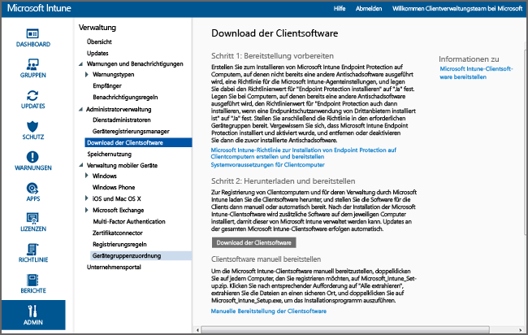

---
# required metadata

title: Installieren des Windows-PC-Clients mit Microsoft Intune | Microsoft Intune
description:
keywords:
author: NathBarn
manager: jeffgilb
ms.date: 04/28/2016
ms.topic: article
ms.prod:
ms.service: microsoft-intune
ms.technology:
ms.assetid: 64c11e53-8d64-41b9-9550-4b4e395e8c52

# optional metadata

#ROBOTS:
#audience:
#ms.devlang:
ms.reviewer: jeffgilb
ms.suite: ems
#ms.tgt_pltfrm:
#ms.custom:

---

# Installieren des Windows-PC-Clients mit Microsoft Intune
Befolgen Sie diese Anleitung zum Verwalten Ihrer Windows-PCs durch die Microsoft Intune-Clientsoftware.

## Vorbereitung
Bevor Sie mit dem Installieren der Intune-Clientsoftware beginnen, lesen Sie das Thema [Lösen von Konflikten mit Gruppenrichtlinienobjekten und Microsoft Intune-Richtlinien](resolve-gpo-and-microsoft-intune-policy-conflicts.md), um zu erfahren, welche Voraussetzungen erfüllt sein müssen, um den Client ordnungsgemäß zu installieren. Fahren Sie dann mit den vorliegenden Anleitungen fort.

## Installieren des Clients
Führen Sie die folgenden Schritte aus, um den Client zu installieren:

-   [So laden Sie die Clientsoftware herunter](#to-download-the-client-software)

Verwenden Sie dann mindestens eine der folgenden Methoden, um den Client zu installieren:

-   [So stellen Sie die Clientsoftware manuell bereit](#to-manually-deploy-the-client-software)

-   [So stellen Sie die Clientsoftware mithilfe von Gruppenrichtlinien automatisch bereit](#to-automatically-deploy-the-client-software-by-using-group-policy)

-   [So können Benutzer ihre Computer selbst registrieren](#how-users-can-self-enroll-their-computers)

-   [Installieren der Microsoft Intune-Clientsoftware als Teil eines Betriebssystemabbilds](#install-the-microsoft-intune-client-software-as-part-of-an-image)

Wenn ein Computer nicht mehr mit Intune verwaltet werden soll, können Sie ihn abkoppeln. Hierbei wird auch die Clientsoftware vom Computer entfernt. Weitere Informationen finden Sie unter [Allgemeine Aufgaben zur Verwaltung von Windows-PCs mit dem Microsoft Intune-Computerclient](common-windows-pc-management-tasks-with-the-microsoft-intune-computer-client.md)..

### So laden Sie die Clientsoftware herunter

1.  Klicken Sie in der [Microsoft Intune-Verwaltungskonsole](https://manage.microsoft.com/) auf **Verwaltung** &gt; **Download der Clientsoftware**.

  

2.  Klicken Sie auf der Seite **Download der Clientsoftware** auf **Clientsoftware herunterladen**, und speichern Sie das Paket **Microsoft_Intune_Setup.zip** mit der Software an einem sicheren Ort in Ihrem Netzwerk.

    > [!NOTE]
    > Das Installationspaket für die Intune-Clientsoftware enthält Informationen zu Ihrem Konto. Wenn nicht autorisierte Benutzer Zugriff auf das Installationspaket erhalten, können sie Computer bei dem Konto registrieren, dem das eingebettete Zertifikat entspricht.

3.  Extrahieren Sie an dem sicheren Ort in Ihrem Netzwerk den Inhalt des Installationspakets.

    > [!IMPORTANT]
    > Sie dürfen die extrahierte Datei **ACCOUNTCERT** weder umbenennen noch entfernen, da sonst die Installation der Clientsoftware misslingt.

### So stellen Sie die Clientsoftware manuell bereit

1.  Navigieren Sie auf einem Computer zum Ordner, in dem sich die Installationsdateien der Clientsoftware befinden, und führen Sie dann **Microsoft_Intune_Setup.exe** aus, um die Clientsoftware zu installieren.

    > [!NOTE]
    > Der Installationsstatus wird angezeigt, wenn Sie mit dem Mauszeiger auf das Symbol in der Taskleiste des Clientcomputers zeigen.

### So stellen Sie die Clientsoftware mithilfe von Gruppenrichtlinien automatisch bereit

1.  Führen Sie im Ordner, der die Dateien **Microsoft_Intune_Setup.exe** und **MicrosoftIntune.accountcert** enthält, den folgenden Befehl aus, um die Windows Installer-basierten Installationsprogramme für 32-Bit- und 64-Bit-Computer zu extrahieren:

    ```
    Microsoft_Intune_Setup.exe/Extract <destination folder>
    ```

2.  Kopieren Sie die Dateien **Microsoft_Intune_x86.msi**, **Microsoft_Intune_x64.msi** und **MicrosoftIntune.accountcert** in einen Netzwerkpfad, auf den alle Computer, auf denen die Clientsoftware installiert werden soll, zugreifen können.

    > [!IMPORTANT]
    > Benennen Sie die Dateien nicht um, und trennen sie sie nicht, da bei der Installation der Clientsoftware sonst ein Fehler auftritt.

3.  Verwenden Sie Gruppenrichtlinien, um die Software auf Computern in Ihrem Netzwerk bereitzustellen.

    Weitere Informationen zum automatischen Bereitstellen von Software mithilfe von Gruppenrichtlinien finden Sie in Ihrer Windows Server-Dokumentation.

### So können Benutzer ihre Computer selbst registrieren
Benutzer können alle ihre Computer über das Intune-Unternehmensportal selbst registrieren. Jeder registrierte Computer wird mit dem Benutzerkonto verknüpft, das zum Installieren der Clientsoftware verwendet wurde.

> [!NOTE]
> -   Der Benutzer muss ein Administrator auf dem Computer sein, um die Clientsoftware zu installieren.
> -   Für die Selbstregistrierung muss Internet Explorer auf dem Clientcomputer installiert sein.
> -   Bei jeder Selbstregistrierung eines Computers durch einen Benutzer wird eine Intune-Lizenz verwendet.
> -   Für die Selbstregistrierung eines Computers müssen Sie ein Geschäfts- oder Schulkonto verwenden. Eine Selbstregistrierung eines Computers mit einem Microsoft-Konto ist nicht möglich.
> -   Wenn die Clientsoftware auf einem Computer bereits installiert ist, erhält der Endbenutzer eine Fehlermeldung.

### So führen Sie die Selbstregistrierung eines Computers aus (Informationen für Endbenutzer)

1.  Melden Sie sich mit dem Computer, den Sie registrieren möchten, beim Unternehmensportal an.

2.  Klicken Sie auf **Gerät hinzufügen**..

3.  Klicken Sie auf **Software herunterladen** und dann auf **Ausführen**..

4.  Klicken Sie auf **Weiter**, um den Setup-Assistenten von Microsoft Intune zu starten.

5.  Klicken Sie nach Abschluss des Setup-Assistenten auf **Fertig stellen**..

### Installieren der Microsoft Intune-Clientsoftware als Teil eines Betriebssystemabbilds
Sie können die Intune-Clientsoftware als Teil eines Betriebssystemabbilds auf Computern installieren. Verwenden Sie dazu die folgende Beispielvorgehensweise als Basis:

1.  Kopieren Sie die Clientinstallationsdateien **Microsoft_Intune_Setup.exe** und **MicrosoftIntune.accountcert** in den Ordner **%Systemdrive%\Temp\Microsoft_Intune_Setup** auf dem Referenzcomputer.

2.  Erstellen Sie den Registrierungseintrag **WindowsIntuneEnrollPending** , indem Sie dem Skript **SetupComplete.cmd** den folgenden Befehl hinzufügen:

    ```
    %windir%\system32\reg.exe add HKEY_LOCAL_MACHINE\Software\Microsoft\Onlinemanagement\Deployment /v
    WindowsIntuneEnrollPending /t REG_DWORD /d 1
    ```

3.  Fügen Sie **setupcomplete.cmd** den folgenden Befehl hinzu, um das Registrierungspaket mit dem Befehlszeilenargument „/PrepareEnroll“ auszuführen:

    ```
    %systemdrive%\temp\Microsoft_Intune_Setup\Microsoft_Intune_Setup.exe /PrepareEnroll
    ```
    > [!TIP]
    > Mithilfe des Skripts **SetupComplete.cmd** können von Windows Setup Veränderungen am System vorgenommen werden, bevor sich ein Benutzer anmeldet. Durch das Befehlszeilenargument **/PrepareEnroll** wird ein Zielcomputer auf die automatische Registrierung bei Intune nach Beenden von Windows Setup vorbereitet.

4.  Legen Sie die Datei **SetupComplete.cmd** auf dem Referenzcomputer im Ordner **%Windir%\Setup\Scripts** ab.

5.  Erstellen Sie ein Systemabbild des Referenzcomputers, und stellen sie es auf den Zielcomputern bereit.

Wenn der Zielcomputer nach Beenden von Windows Setup neu gestartet wird, wird der Registrierungsschlüssel **WindowsIntuneEnrollPending** erstellt. Mit dem Registrierungspaket wird überprüft, ob der Computer registriert ist. Wenn der Computer registriert ist, ist keine weitere Aktion erforderlich. Wenn der Computer nicht registriert ist, wird vom Registrierungspaket eine Aufgabe zur automatischen Microsoft Intune-Registrierung erstellt.

Bei der Ausführung dieser Aufgabe zur automatischen Registrierung zum nächsten geplanten Zeitpunkt prüft die Aufgabe das Vorhandensein des Registrierungswerts **WindowsIntuneEnrollPending** und versucht, den Ziel-PC bei Intune zu registrieren. Sollte die Registrierung aus einem beliebigen Grund fehlschlagen, wird die Registrierung beim nächsten Ausführen der Aufgabe erneut versucht. Die Wiederholungen werden in einem Zeitraum von einem Monat ausgeführt.

Die Aufgabe zur automatischen Intune-Registrierung, der Registrierungswert **WindowsIntuneEnrollPending** und das Kontozertifikat werden vom Zielcomputer gelöscht, sobald die Registrierung erfolgreich war oder ein Monat vergangen ist.

## Überwachen und Überprüfen der erfolgreichen Clientbereitstellung
Verwenden Sie eins der folgenden Verfahren, um die erfolgreiche Clientbereitstellung zu überwachen und zu überprüfen.

### So überprüfen Sie die Installation der Clientsoftware mithilfe der Microsoft Intune-Administratorkonsole

1.  Klicken Sie in der [Microsoft Intune-Verwaltungskonsole](https://manage.microsoft.com/) auf **Gruppen** &gt; **Alle Geräte** &gt; **Alle Computer**..

2.  Suchen Sie mit einem Bildlauf nach unten in der Liste der Computer die verwalteten Computer, von denen mit Intune kommuniziert wird. Um nach einem bestimmten verwalteten Computer zu suchen, geben Sie den Computernamen oder einen Teil des Namens in das Textfeld **Geräte suchen** ein.

3.  Überprüfen Sie den Status des Computers im unteren Bereich der Konsole, und beheben Sie vorhandene Fehler.

### So erstellen Sie einen Computerinventurbericht zum Anzeigen aller registrierten Computer

1.  Klicken Sie in der [Microsoft Intune-Verwaltungskonsole](https://manage.microsoft.com/) auf **Berichte** &gt; **Computerinventurberichte**..

2.  Belassen Sie auf der Seite **Neuen Bericht erstellen** die Standardwerte in den Feldern (sofern Sie keine Filter anwenden möchten), und klicken Sie auf **Bericht anzeigen**..

3.  In einem neuen Fenster wird die Seite **Computerinventurbericht** geöffnet, auf der alle erfolgreich bei Intune registrierten Computer angezeigt werden.

    > [!TIP]
    > Klicken Sie im Bericht auf beliebige Spaltenüberschriften, um die Liste nach dem Inhalt der betreffenden Spalte zu sortieren.


### Weitere Informationen
[Verwalten von Windows-PCs mit Microsoft Intune](manage-windows-pcs-with-microsoft-intune.md)


<!--HONumber=May16_HO1-->


