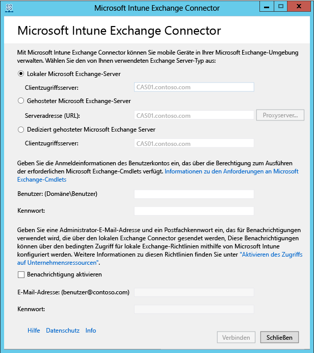

# Einrichten des lokalen Exchange-Connectors

Zum Einrichten einer Verbindung, über die Microsoft Intune mit dem Exchange-Server kommunizieren kann, auf dem die Postfächer der mobilen Geräte gehostet werden, müssen Sie den lokalen Connector über die Intune-Administratorkonsole herunterladen und konfigurieren.

## Anforderungen an den lokalen Connector
In der folgenden Tabelle finden Sie die Anforderungen an den Computer, auf dem Sie den lokalen Exchange-Connector installieren.

|Anforderungen|Weitere Informationen|
|---------------|--------------------|
|Betriebssysteme|Intune unterstützt den lokalen Exchange-Connector auf Computern, auf denen eine beliebige Edition von Windows Server 2008 SP2 (64 Bit), Windows Server 2008 R2, Windows Server 2012 oder Windows Server 2012 R2 ausgeführt wird.  Auf Server Core-Installationen wird der Connector nicht unterstützt.|
|Microsoft Exchange-Version|Der lokale Connector erfordert mindestens Microsoft Exchange 2010 SP1.|
|Autorität für die Verwaltung mobiler Geräte| [Festlegen von Intune als Autorität für die Verwaltung mobiler Geräte](get-ready-to-enroll-devices-in-microsoft-intune.md#set-mobile-device-management-authority).|
|Hardware|Der Computer, auf dem Sie den Connector installieren, erfordert eine CPU mit 1,6 GHz und 2 GB RAM sowie mindestens 10 GB freien Speicherplatz.|
|Active Directory-Synchronisierung|Bevor Sie einen Connector für die Verbindung von Intune mit Ihrem Exchange-Server verwenden können, müssen Sie die [Active Directory-Synchronisierung](/intune/get-started/start-with-a-paid-subscription-to-microsoft-intune-step-3) einrichten, damit Ihre lokalen Benutzer und Sicherheitsgruppen mit Ihrer Instanz von Azure AD synchronisiert werden.|
|Zusätzliche Software|Eine vollständige Installation von Microsoft .NET Framework 4 und Windows PowerShell 2.0 muss auf dem Computer installiert sein, auf dem der Connector gehostet wird.|
|Netzwerk|Der Computer, auf dem Sie den Connector installieren, muss sich in einer Domäne befinden, die sich mit der Domäne, in der Exchange Server gehostet wird, in einer Vertrauensstellung befindet.  Der Computer erfordert Konfigurationen, die es ihm ermöglichen, über Firewalls und Proxyserver über Port 80 und 443 auf den Intune-Dienst zuzugreifen. Von Intune verwendete Domänen umfassen manage.microsoft.com, &#42;manage.microsoft.com und &#42;.manage.microsoft.com.|
|Konfiguration und Ausführung von gehostetem Exchange|Unter [Exchange Server 2016](https://technet.microsoft.com/library/mt170645.aspx) finden Sie weitere Informationen. |
|Festlegen von Intune als Autorität für die Verwaltung mobiler Geräte|[Festlegen von Intune als Ihre Autorität für die Verwaltung mobiler Geräte](get-ready-to-enroll-devices-in-microsoft-intune.md#set-mobile-device-management-authority)|

### Anforderungen an Exchange-Cmdlets

Sie müssen in Active Directory ein Benutzerkonto erstellen, das vom Intune Exchange Connector verwendet wird. Das Konto muss über die Berechtigung zum Ausführen der folgenden erforderlichen Windows PowerShell-Exchange-Cmdlets verfügen:

 -   Get-ActiveSyncOrganizationSettings, Set-ActiveSyncOrganizationSettings
 -   Get-CasMailbox, Set-CasMailbox
 -   Get-ActiveSyncMailboxPolicy, Set-ActiveSyncMailboxPolicy, New-ActiveSyncMailboxPolicy, Remove-ActiveSyncMailboxPolicy
 -   Get-ActiveSyncDeviceAccessRule, Set-ActiveSyncDeviceAccessRule, New-ActiveSyncDeviceAccessRule, Remove-ActiveSyncDeviceAccessRule
 -   Get-ActiveSyncDeviceStatistics
 -   Get-ActiveSyncDevice
 -   Get-ExchangeServer
 -   Get-ActiveSyncDeviceClass
 -   Get-Recipient
 -   Clear-ActiveSyncDevice, Remove-ActiveSyncDevice
 -   Set-ADServerSettings
 -   Get-Command

## Herunterladen des Softwareinstallationspaket für den lokalen Exchange-Connector

1. Öffnen Sie in einem vom lokalen Exchange-Connector unterstützten Betriebssystem die [Microsoft Intune-Verwaltungskonsole](http://manage.microsoft.com) (http://manage.microsoft.com) mit einem Benutzerkonto, das ein Administrator im Exchange-Mandanten mit einer Lizenz zum Verwenden von Exchange Server ist.

2.  Wählen Sie im Bereich der Arbeitsbereichsverknüpfungen die Option **ADMIN** aus.

3.  Erweitern Sie im Navigationsbereich unter **Verwaltung mobiler Geräte** **Microsoft Exchange** ein, und wählen Sie anschließend **Exchange-Verbindung einrichten** aus.

4.  Wählen Sie auf der Seite **Exchange-Verbindung einrichten** die Option **Lokalen Connector herunterladen** aus.

5.  Der lokale Exchange-Connector ist in einem komprimierten Ordner (ZIP-Archiv) enthalten, der geöffnet oder gespeichert werden kann. Wählen Sie im Dialogfeld **Dateidownload** die Option **Speichern** aus, um den komprimierten Ordner an einem sicheren Speicherort zu speichern.

> [!IMPORTANT]
> Die Dateien im Ordner des lokalen Exchange-Connectors dürfen nicht umbenannt oder verschoben werden. Bei Verschieben oder Umbenennen der Inhalt des Ordners ist die Installation nicht mehr funktionsfähig.

## Einrichten und Konfigurieren des lokalen Exchange-Connectors für Intune
Führen Sie die folgenden Schritte aus, den lokalen Exchange-Connector für Intune zu installieren. Der lokale Connector kann nur einmal pro Intune-Abonnement und nur auf einem Computer installiert werden. Wenn Sie versuchen, einen weiteren lokalen Exchange-Connector zu konfigurieren, wird die ursprüngliche Verbindung durch die neue ersetzt.

1.  Extrahieren Sie unter einem vom lokalen Exchange-Connector unterstützten Betriebssystem die Dateien in **Exchange_Connector_Setup.zip** an einen sicheren Speicherort.

2.  Nachdem die Dateien extrahiert wurden, öffnen Sie den extrahierten Ordner, und doppelklicken Sie auf **Exchange_Connector_Setup.exe**, um den lokalen Exchange-Connector zu installieren.

    > [!IMPORTANT]
    > Wenn der Speicherort nicht sicher ist, sollten Sie die Zertifikatdatei **WindowsIntune.accountcert** nach der Installation des lokalen Connectors unbedingt löschen.

3.  Wählen Sie im Feld **Exchange-Server** Ihren Exchange-Serverumgebungstyp. Zur Auswahl stehen **Lokaler Microsoft Exchange-Server** und **Gehosteter Microsoft Exchange-Server**.

  

  Geben Sie bei einem lokalen Exchange-Server entweder den Servernamen oder den vollqualifizierten Domänennamen des Exchange-Servers an, auf dem die Rolle **Clientzugriffsserver** gehostet wird.

  Bei einem gehosteten Exchange-Server geben Sie die Adresse des Exchange-Servers an. So ermitteln Sie die URL des gehosteten Exchange-Servers:

      1.  Öffnen Sie die Outlook Web-App für Office 365.

      2.  Wählen Sie das „?“ oben links, und wählen Sie **Info**aus.

      3.  Suchen Sie den Wert **Externer POP-Server** .

      4.  Wählen Sie **Proxyserver** aus, um die Proxyservereinstellungen für Ihren gehosteten Exchange-Server anzugeben.
        1.  Wählen Sie **Beim Synchronisieren von Informationen für mobile Geräte einen Proxyserver verwenden**aus.

        2.  Geben Sie den **Proxyservernamen** und die für den Zugriff auf den Server zu verwendende **Portnummer** ein.

        3.  Ist für den Zugriff auf den Proxyserver die Angabe von Benutzeranmeldeinformationen erforderlich, wählen Sie „Mithilfe von Anmeldeinformationen eine Verbindung mit dem Proxyserver herstellen“ aus, und geben Sie **Domäne\Benutzer** und das **Kennwort** ein.

        4.  Wählen Sie **OK** aus.

5.  Geben Sie die für die Verbindung zu Ihrem Exchange-Server erforderlichen Anmeldeinformationen an (**Benutzer [Domäne\Benutzer]** und **Kennwort**).

6.  Geben Sie die zum Senden von Benachrichtigungen an das Exchange-Postfach des Benutzers erforderlichen administrativen Anmeldeinformationen ein. Diese Benachrichtigungen sind über bedingte Zugriffsrichtlinien mit Intune konfigurierbar.

    Stellen Sie sicher, dass die AutoErmittlungs- und Exchange-Webdienste auf dem Exchange-Clientzugriffsserver konfiguriert sind. Weitere Informationen dazu finden Sie unter [Clientzugriffsserver](https://technet.microsoft.com/library/dd298114.aspx).

7.  Geben Sie im Feld **Kennwort** das Kennwort für dieses Konto an, damit Intune auf Exchange Server zugreifen kann.

8. Wählen Sie **Verbinden** aus.

    Die Einrichtung der Verbindung kann einige Minuten dauern.

Bei der Konfiguration werden vom Exchange-Connector Ihre Proxyeinstellungen gespeichert, um den Zugriff auf das Internet zu ermöglichen. Wenn sich Ihre Proxyeinstellungen ändern, müssen Sie den Exchange-Connector neu konfigurieren, damit für ihn die aktualisierten Proxyeinstellungen verwendet werden.

Nach Einrichtung der Verbindung durch den Exchange-Connector werden mobile Geräte, die vom Exchange-Connector verwalteten Benutzern zugeordnet sind, automatisch synchronisiert und dem Exchange-Connector hinzugefügt. Diese Synchronisation kann einige Zeit in Anspruch nehmen.

> [!NOTE]
> Wenn Sie den lokalen Exchange-Connector installiert haben und zu einem späteren Zeitpunkt die Exchange-Verbindung löschen, müssen Sie den lokalen Exchange-Connector vom Computer löschen, auf dem er installiert wurde.

## Überprüfen der Exchange-Verbindung

Nachdem Sie den Exchange-Connector erfolgreich konfiguriert haben, können Sie den Status der Verbindung und den letzten erfolgreichen Synchronisationsversuch anzeigen. Wählen Sie in der [Microsoft Intune-Verwaltungskonsole](http://manage.microsoft.com) den Arbeitsbereich **ADMIN** aus. Wählen Sie unter **Verwaltung mobiler Geräte** die Option **Microsoft Exchange** aus, und überprüfen Sie die unter **Exchange-Verbindungsinformationen** angezeigten Details.

Sie können auch die Uhrzeit und das Datum des letzten erfolgreichen Synchronisationsversuchs überprüfen.

<!--HONumber=Jul16_HO2-->

