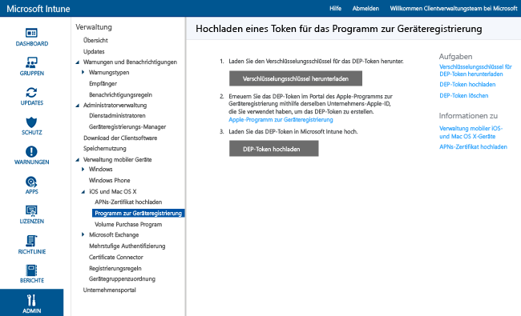

# Registrieren unternehmenseigener iOS-Geräte mithilfe des Programm zur Geräteregistrierung (Device Enrollment Program, DEP)
Microsoft Intune kann ein Registrierungsprofil bereitstellen, das über das Programm zur Geräteregistrierung (Device Enrollment Program, DEP) erworbene iOS-Geräte drahtlos registriert. Das Registrierungspaket kann Setup-Assistent-Optionen für das Gerät enthalten. Die Registrierung von Geräten über DEP kann von Benutzern nicht rückgängig gemacht werden.

## Apple-DEP-Verwaltung für iOS-Geräte mit Microsoft Intune
Zum Verwalten unternehmenseigener iOS-Geräte mit dem Apple-Programm zur Geräteregistrierung (Device Enrollment Program, DEP) müssen Unternehmen am Apple-DEP teilnehmen und Geräte über das Programm beziehen. Details zu diesem Prozess finden Sie unter:  [https://deploy.apple.com](https://deploy.apple.com). Das Programm bietet den Vorteil, dass Geräte eingerichtet werden können, ohne dass jedes Gerät physisch über USB mit einem Computer verbunden werden muss.

Bevor Sie unternehmenseigene iOS-Geräte mit DEP registrieren können, benötigen Sie ein DEP-Token von Apple. Mit diesem Token kann Intune Informationen zu DEP-Geräten synchronisieren, die Ihrem Unternehmen gehören. Damit kann Intune außerdem Registrierungsprofile an Apple übermitteln und diesen Profile Geräte zuweisen.

1.  **Beginnen der Verwaltung von iOS-Geräten mit Microsoft Intune** Bevor Sie iOS DEP-Geräte registrieren können, müssen Sie die Aktivierung der iOS-Verwaltung für Intune abschließen.

2.  **Abrufen eines Verschlüsselungsschlüssels** Öffnen Sie als Administrator die [Microsoft Intune-Verwaltungskonsole](http://manage.microsoft.com), wechseln Sie zu **Verwaltung**&gt;**Verwaltung mobiler Geräte** &gt; **iOS** &gt; **Geräteregistrierungsprogramm**, und klicken Sie auf **Verschlüsselungsschlüssel herunterladen**. Speichern Sie die Verschlüsselungsschlüsseldatei (PEM) lokal. Die PEM-Datei wird verwendet, um ein Vertrauensstellungszertifikat vom Apple Device Enrollment Program-Portal anzufordern.

      

3.  **Abrufen eines Tokens für das Geräteregistrierungsprogramm (Device Enrollment Program)** Navigieren Sie zum [Device Enrollment Program-Portal](https://deploy.apple.com) (https://deploy.apple.com), und melden Sie sich mit der Apple-ID Ihres Unternehmens an. Diese Apple-ID muss später verwendet werden, um das DEP-Token zu erneuern.

    1.  Wechseln Sie im [Device Enrollment Program-Portal](https://deploy.apple.com) zu **Device Enrollment Program** &gt; **Server verwalten**, und klicken Sie dann auf **MDM-Server hinzufügen**.

    2.  Geben Sie den **MDM-Servernamen** ein , und klicken Sie dann auf **Weiter**. Der Servername dient als Referenz zum Identifizieren des MDM-Servers. Es ist nicht der Name oder die URL des Microsoft Intune-Servers.

    3.  Das Dialogfeld **&lt;Servername&gt; hinzufügen** wird geöffnet. Klicken Sie auf **Datei auswählen**, um die PEM-Datei hochzuladen, und klicken Sie auf **Weiter**.

    4.  Im Dialogfeld **&lt;Servername&gt; hinzufügen** wird der Link **Ihr Servertoken** angezeigt. Laden Sie die Servertokendatei (.p7m) auf Ihren Computer herunter, und klicken Sie dann auf **Fertig**.

    Diese Zertifikatdatei (.p7m) wird verwendet, um eine Vertrauensstellung zwischen dem Intune- und Apple Device Enrollment Program-Server herzustellen.

4.  **Hinzufügen des DEP-Tokens zu Intune** Wechseln Sie in der [Microsoft Intune-Verwaltungskonsole](http://manage.microsoft.com) zu **Verwaltung** &gt; **Verwaltung mobiler Geräte** &gt; **iOS** &gt; **Geräteregistrierungsprogramm**, und klicken Sie auf **DEP-Token hochladen**. **Wechseln Sie** zur Zertifikatdatei (.p7m), geben Sie Ihre **Apple-ID**ein, und klicken Sie auf **Hochladen**.

5.  **Hinzufügen der Corporate Device Enrollment-Richtlinie** Wechseln Sie in der [Microsoft Intune-Verwaltungskonsole](http://manage.microsoft.com) zu **Richtlinie** &gt; **Unternehmensgeräteregistrierung**, und klicken Sie dann auf **Hinzufügen**.

    Geben Sie **allgemeine** Details ein, wie z. B. **Name** und **Beschreibung**. Geben Sie an, ob die dem Profil zugeordneten Geräte zu einem Benutzer oder einer Gruppe gehören.
      - **Benutzeraffinität anfordern**: Das Gerät muss während der ersten Installation einem Benutzer zugewiesen werden und dann berechtigt sein, im Namen dieses Benutzers auf Unternehmensdaten und E-Mail zuzugreifen.  **Benutzeraffinität** muss für DEP-verwaltete Geräte konfiguriert werden, die Benutzern gehören und das Unternehmensportal verwenden müssen (um z. B. Apps zu installieren).
      - **Keine Benutzeraffinität**: Das Gerät ist keinem Benutzer zugeordnet. Verwenden Sie diese Zuweisung für Geräte, die Aufgaben ohne den Zugriff auf lokale Benutzerdaten ausführen. Apps, die eine Benutzerzugehörigkeit erfordern, einschließlich der Unternehmensportal-App, die für die Installation branchenspezifischer Apps verwendet, funktionieren nicht.

    Sie können auch **Geräte folgender Gruppe zuweisen**. Klicken Sie auf **Auswählen...**, um eine Gruppe auszuwählen.

    [!INCLUDE[groups deprecated](../includes/group-deprecation.md)]

    Aktivieren Sie als Nächstes **DEP-Einstellungen für diese Richtlinie konfigurieren**, um DEP zu unterstützen.

      

     Die folgenden Einstellungen sind für DEP-verwaltete Geräte verfügbar:

     - **Abteilung**: Wird angezeigt, wenn Benutzer während der Aktivierung auf „Info zur Konfiguration“ tippen.
     - **Supportrufnummer**: Wird angezeigt, wenn der Benutzer während der Aktivierung auf die Schaltfläche **Hilfe erforderlich** klickt.
     - **Vorbereitungsmodus**: Dieser Status wird während der Aktivierung festgelegt und kann ohne Zurücksetzen des Geräts auf die Werkseinstellungen nicht geändert werden:
        - **Nicht überwacht**: Verwaltungsfunktionen sind eingeschränkt.
        - **Überwacht**: Ermöglicht weitere Verwaltungsfunktionen und deaktiviert standardmäßig die Aktivierungssperre.
     - **Registrierungsprofil für Gerät sperren**: Dieser Status wird während der Aktivierung festgelegt und kann ohne Zurücksetzen des Geräts auf die Werkseinstellungen nicht geändert werden.
        - **Deaktivieren**: Ermöglicht das Entfernen des Verwaltungsprofils aus dem Menü **Einstellungen**.
        - **Aktivieren**: (Erfordert **Vorbereitungsmodus** = **Überwacht**) Deaktiviert iOS-Einstellungen, die das Entfernen des Verwaltungsprofils zulassen könnten.
     - **Setup-Assistent-Optionen**: Diese Einstellungen sind optional und können später im iOS-Menü **Einstellungen** konfiguriert werden.
        - **Kennung**: Aufforderung zur Eingabe der Kennung während der Aktivierung. Fordern Sie immer eine Kennung an, es sei denn, das Gerät und der Zugriff darauf werden auf andere Weise geschützt (z. B. im Kioskmodus zum Einschränken des Geräts auf eine App).
        - **Ortungsdienste**: Falls aktiviert, fordert der Setup-Assistent den Dienst während der Aktivierung an.
        - **Wiederherstellen**: Falls aktiviert, fordert der Setup-Assistent die iCloud-Sicherung während der Aktivierung an.
        - **Apple ID**: Eine Apple ID ist erforderlich, um iOS App Store-Apps herunterzuladen, einschließlich Apps, die von Intune installiert wurden. Falls aktiviert, fordert iOS Benutzer zur Angabe einer Apple ID an, wenn Intune versucht, eine App ohne eine ID zu installieren.
        - **Geschäftsbedingungen**: Falls aktiviert, fordert der Setup-Assistenten Benutzer auf, die Apple-Geschäftsbedingungen während der Aktivierung zu akzeptieren.
        - **Touch ID**: Falls aktiviert, fordert der Setup-Assistent diesen Dienst während der Aktivierung an.
        - **Apple Pay**: Falls aktiviert, fordert der Setup-Assistent diesen Dienst während der Aktivierung an.
        - **Zoom**: Falls aktiviert, fordert der Setup-Assistent diesen Dienst während der Aktivierung an.
        - **Siri**: Falls aktiviert, fordert der Setup-Assistent diesen Dienst während der Aktivierung an.
        - **Diagnosedaten an Apple senden**: Falls aktiviert, fordert der Setup-Assistent diesen Dienst während der Aktivierung an.
     -  **Zusätzliche Verwaltung durch Apple Configurator aktivieren**: Auf **Nicht zulassen** festlegen, um das Synchronisieren von Dateien mit iTunes oder die Verwaltung per Apple Configurator zu verhindern. Microsoft empfiehlt das Festlegen von **Nicht zulassen**, das Exportieren weiteren Konfigurationen aus Apple Configurator und deren anschließende Bereitstellung als benutzerdefiniertes iOS-Konfigurationsprofil per Intune, anstatt diese Einstellung zu wählen, um eine manuelle Bereitstellung mit oder ohne Zertifikat zuzulassen.
        - **Nicht zulassen**: Verhindert, dass das Gerät per USB kommuniziert (Verbindung wird deaktiviert).
        - **Zulassen**: Erlaubt dem Gerät das Kommunizieren über eine USB-Verbindung mit einem PC oder Mac.
        - **Zertifikat anfordern**: Ermöglicht eine Verbindung mit einem Mac, indem ein Zertifikat in das Registrierungsprofil importiert wird.

6.  **Zuweisen von DEP-Geräten zur Verwaltung** Wechseln Sie zum [Device Enrollment Program-Portal](https://deploy.apple.com) (https://deploy.apple.com), und melden Sie sich mit der Apple ID Ihres Unternehmens an. Wechseln Sie zu **Bereitstellungsprogramm** &gt; **Device Enrollment Program** &gt; **Geräte verwalten**. Geben Sie an, wie Sie **Geräte wählen**, fügen Sie Geräteinformationen hinzu, und geben Sie die Details zum Gerät wie **Seriennummer**und **Bestellnummer**an, oder **laden Sie eine CSV-Datei hoch**. Wählen Sie als Nächstes **Zu Server zuweisen** aus. Wählen Sie den für Microsoft Intune angegebenen &lt;Servernamen&gt; aus, und klicken Sie dann auf **OK**.

7.  **Synchronisieren von mit DEP verwalteten Geräten** Öffnen Sie als Administrator die [Microsoft Intune-Verwaltungskonsole](http://manage.microsoft.com), wechseln Sie zu **Verwaltung** &gt; **Verwaltung mobiler Geräte** &gt; **iOS** &gt; **Geräteregistrierungsprogramm**, und klicken Sie auf **Jetzt synchronisieren**. Eine Synchronisierungsanforderung wird an Apple gesendet. Zum Anzeigen von DEP verwalteter Geräte nach der Synchronisierung wechseln Sie in der [Microsoft Intune-Verwaltungskonsole](http://manage.microsoft.com) zu **Gruppen** &gt; **Alle unternehmenseigenen Geräte**. Im Arbeitsbereich **Unternehmenseigene Geräte** wird der **Status** verwalteter Geräte als „Nicht kontaktiert“ angezeigt, bis das Gerät eingeschaltet und der Setup-Assistent darauf ausgeführt wird.

    Zur Einhaltung der Apple-Bedingungen für zulässigen DEP-Datenverkehr erzwingt Intune die folgenden Einschränkungen:
     -  Eine vollständige DEP-Synchronisation kann nicht öfter als einmal alle 7 Tage erfolgen. Während einer vollständigen Synchronisierung aktualisiert Intune jede Seriennummer, die Intune von Apple zugewiesen wurde, und zwar unabhängig davon, ob die Seriennummer vorher synchronisiert wurde oder nicht. Wenn eine vollständige Synchronisierung innerhalb von 7 Tagen nach der vorherigen vollständigen Synchronisierung versucht wird, aktualisiert Intune nur Seriennummern, die nicht bereits in Intune aufgeführt sind.
     -  Synchronisierungsanforderungen müssen binnen 10 Minuten erfüllt werden. Während dieser Zeit oder bis zum erfolgreichen Erfüllen der Anforderung wird die Schaltfläche „Synchronisieren“ deaktiviert.

8.  **Verteilen von Geräten an Benutzer** Ihre unternehmenseigenen Geräte können jetzt an Benutzer verteilt werden. Wenn ein iOS-Gerät eingeschaltet wird, wird es für die Verwaltung durch Intune registriert.

## Änderungen an den Intune-Gruppenzuweisungen

Ab Oktober werden Gerätegruppen in Azure Active Directory verwaltet. Nach diesem Übergang zu Azure Active Directory-Gruppen wird die Gruppenzuweisung nicht länger in den Optionen des **Unternehmensregistrierungsprofils** angezeigt. Da diese Änderung über mehrere Monate hinweg umgesetzt wird, wird Ihnen die Änderung möglicherweise nicht sofort angezeigt. Nach dem Wechsel zum neuen Portal können die Zuweisungen dynamischer Gerätegruppen basierend auf dem Namen des Unternehmensregistrierungsprofils definiert werden. Mit diesem Vorgang wird sichergestellt, dass Geräte, die vorab einer Gerätegruppe zugewiesen wurden, automatisch mit bereitgestellter Richtlinie und bereitgestellten Apps in der Gruppe registriert werden. [Weitere Informationen zu Azure Active Directory-Gruppen](https://azure.microsoft.com/documentation/articles/active-directory-accessmanagement-manage-groups/)

### Weitere Informationen:
[Vorbereitungen zum Registrieren von Geräten](get-ready-to-enroll-devices-in-microsoft-intune.md)

<!--HONumber=Aug16_HO2-->

