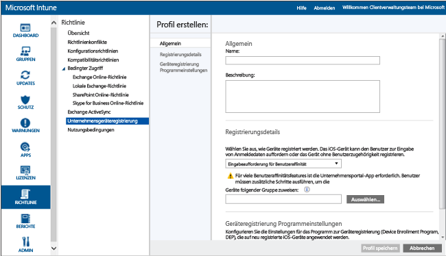
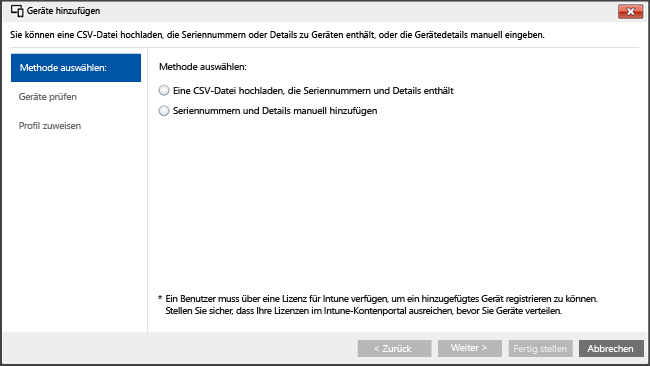

# Registrieren von iOS-Geräten mithilfe von Apple Configurator und Setup-Assistent
Intune unterstützt die Registrierung unternehmenseigener iOS-Geräte mithilfe des Tools [Apple Configurator](http://go.microsoft.com/fwlink/?LinkId=518017), das auf einem Mac-Computer ausgeführt wird. Dieser Prozess setzt das Gerät auf die Werkseinstellungen zurück und bereitet es auf die Ausführung des Setup-Assistenten durch den neuen Benutzer des Geräts vor, wobei die Unternehmensrichtlinien vorinstalliert sind.


## Registrierung von iOS-Geräten bei Microsoft Intune über den Setup-Assistenten
Mit dem Apple Configurator können Sie iOS-Geräte auf die Werkseinstellungen zurücksetzen und für die Einrichtung durch den neuen Benutzer des Geräts vorbereiten.  Bei dieser Methode muss das iOS über USB mit einem Mac-Computer verbunden werden, um die Registrierung beim Unternehmen einzurichten. Vorausgesetzt wird die Verwendung von Apple Configurator 2.0. Bei den meisten Szenarien ist es erforderlich, dass die auf das iOS-Gerät angewendete Richtlinie **Benutzeraffinität** einschließt, um das Intune-Unternehmensportal zu aktivieren.

**Voraussetzungen**
* [Aktiviert für die iOS-Registrierung](set-up-ios-and-mac-management-with-microsoft-intune.md) durch Installieren eines APNs-Zertifikats
* Physischer Zugriff auf iOS-Geräte: Geräte müssen unkonfiguriert sein (Zurücksetzung auf Werkseinstellungen) und dürfen keinen Kennwortschutz aufweisen.
* Geräteseriennummern: [Abrufen einer iOS-Seriennummer](https://support.apple.com/en-us/HT204308)
* USB-Verbindungskabel
* Mac-Computer mit [Apple Configurator 2.0](https://itunes.apple.com/us/app/apple-configurator-2/id1037126344?mt=12)


1.  **Erstellen einer mobilen Gerätegruppe** (Optional) Wenn Ihr Unternehmen mobile Gerätegruppen zur Verwaltung von Geräten erfordert, erstellen Sie diese Gruppen. [Verwenden Sie Gruppen zum Verwalten von Benutzern und Geräten in Microsoft Intune](use-groups-to-manage-users-and-devices-with-microsoft-intune.md).

2.  **Erstellen eines Profils für Geräte** Ein Registrierungsprofil für Geräte definiert die Einstellungen für eine Gruppe von Geräten. Wenn Sie dies noch nicht getan haben, erstellen Sie ein Registrierungsprofil für iOS-Geräte, die mit Apple Configurator registriert werden.

    1.  Wechseln Sie in der [Microsoft Intune-Verwaltungskonsole](http://manage.microsoft.com) zu **Richtlinie** &gt; **Unternehmensgeräteregistrierung**, und wählen Sie dann **Hinzufügen…**.
    

    2.  Geben Sie die Details für die Geräteprofile ein:

        -   **Name** : Name des Geräteanmeldungsprofils. (Für Benutzer nicht sichtbar)

        -   **Beschreibung**: Beschreibung des Geräteanmeldungsprofils. (Für Benutzer nicht sichtbar)

        -   **Registrierungsdetails**: Gibt an, wie Geräte registriert werden.

            -   **Benutzeraffinität anfordern**: Das Gerät muss während der ersten Installation einem Benutzer zugewiesen werden und dann berechtigt sein, im Namen dieses Benutzers auf Unternehmensdaten und E-Mail zuzugreifen. **Benutzeraffinität** muss für DEP-verwaltete Geräte konfiguriert werden, die Benutzern gehören und das Unternehmensportal verwenden müssen (um z. B. Apps zu installieren).

            -   **Keine Benutzeraffinität**: Das Gerät ist keinem Benutzer zugeordnet. Verwenden Sie diese Zuweisung für Geräte, die Aufgaben ohne den Zugriff auf lokale Benutzerdaten ausführen. Apps, die eine Benutzerzugehörigkeit erfordern, einschließlich der Unternehmensportal-App, die für die Installation branchenspezifischer Apps verwendet, funktionieren nicht.

        -   **Gerätegruppen-Vorabzuweisung**: Alle Geräte, die mit diesem Profil bereitgestellt werden, gehören anfänglich zu dieser Gruppe. Sie können die Geräte nach der Registrierung erneut zuweisen.

            [!INCLUDE[groups deprecated](../includes/group-deprecation.md)]

          -  **Geräteregistrierungsprogramm**: Das Apple-Programm zur Geräteregistrierung (Device Enrollment Program, DEP) kann bei der Registrierung mit dem Setup-Assistenten nicht verwendet werden. Stellen Sie sicher, dass die Umschaltfläche auf **aus** festgelegt ist.

    3.  Wählen Sie **Profil speichern**, um das Profil hinzuzufügen.

3.  **Hinzufügen von zu registrierenden iOS-Geräten mit dem Setup-Assistenten** Wechseln Sie in der [Microsoft Intune-Verwaltungskonsole](http://manage.microsoft.com) zu **Gruppen** &gt; **Alle Geräte** &gt; **Alle unternehmenseigenen Geräte** &gt; **Alle Geräte**, und wählen Sie dann **Geräte hinzufügen...**. Sie können Geräte auf zwei Arten hinzufügen:

    

    -   **Eine CSV-Datei mit Seriennummern hochladen**: Erstellen Sie eine durch Trennzeichen getrennte Liste (.csv) mit zwei Spalten ohne Überschrift, die auf 5000 Geräte oder 5 MB pro CSV-Datei beschränkt ist.

        |||
        |-|-|
        |&lt;Seriennumer1&gt;|&lt;Details zu Gerät1&gt;|
        |&lt;Seriennummer2&gt;|&lt;Details zu Gerät2&gt;|
        Diese CSV-Datei wird bei der Anzeige in einem Text-Editor folgendermaßen angezeigt:

        ```
        0000000,PO 1234
        111111111,PO 1234
        ```

    -   **Gerätedetails manuell hinzufügen**: Geben Sie die Seriennummer und Gerätedetails von bis zu fünf Geräten ein.

    > [!NOTE]
    > Wenn Sie später unternehmenseigene Geräte aus der Intune-Verwaltung entfernen müssen, kann es notwendig sein, die Seriennummer der Geräte in Intune aus der Gerätegruppe **Nach iOS-Seriennummer** unter **Vorabregistrierte Unternehmensgeräte** zu entfernen, um die Geräteregistrierung zu deaktivieren.  Wenn Intune eine Notfallwiederherstellung durchführt, während oder nachdem Seriennummern entfernt wurden, müssen Sie sicherstellen, dass in dieser Gruppe nur die Seriennummern aktiver Geräte vorhanden sind.

    Klicken Sie auf **Weiter**.

4.  **Auswählen der zu registrierenden Geräte** Bestätigen Sie die zu registrierenden Geräte. Bereits registrierte oder anderweitig registrierte Seriennummern werden nicht importiert. Klicken Sie auf **Weiter**, um fortzufahren.

5.  **Zuweisen eines Profils** Geben Sie das Profil an, das hinzugefügten Geräten aus der Liste der verfügbaren Profile zugewiesen werden soll, überprüfen Sie die **Registrierungsprofildetails**, und wählen Sie dann **Fertig stellen**. Manuell hinzugefügte Geräte können einem beliebigen Anmeldungsprofil zugewiesen werden.

6.  **Exportieren eines Profils zum Bereitstellen auf iOS-Geräten** Wechseln Sie in der [Microsoft Intune-Verwaltungskonsole](http://manage.microsoft.com) zu **Richtlinie** &gt; **Unternehmensgeräteregistrierung**, und wählen Sie das Geräteprofil aus, das auf mobilen Geräten bereitgestellt werden soll. Wählen Sie **Exportieren…** in der Taskleiste. Kopieren und speichern Sie die **Profil-URL**. Sie werden sie später in Apple Configurator hochladen, um das von iOS-Geräten verwendete Intune-Profil zu definieren.
    Zur Unterstützung von Apple Configurator 2 muss die URL des 2.0-Profils bearbeitet werden. Ersetzen Sie
    ```
    https://manage.microsoft.com/EnrollmentServer/Discovery.svc/iOS/ESProxy?id=
    ```
    mit

    ```
    https://appleconfigurator2.manage.microsoft.com/MDMServiceConfig?id=
    ```

   Sie laden im folgenden Verfahren diese Profil-URL mit Apple Configurator in den Apple DEP-Dienst hoch, um das von iOS-Geräten verwendete Intune-Profil zu definieren.


7.  **Vorbereiten des Geräts mit Apple Configurator** iOS-Geräte werden mit dem Mac-Computer verbunden und für die Verwaltung mobiler Geräte registriert.

    1.  Öffnen Sie auf einem Mac-Computer **Apple Configurator 2**. Wählen Sie in der Menüleiste **Apple Configurator 2**, und wählen Sie dann **Voreinstellungen**.

         > [!WARNING]
         > Während des Registrierungsprozesses werden die Geräte auf Werkseinstellungen zurückgesetzt. Als bewährte Methode empfiehlt sich, das Gerät zurückzusetzen und einzuschalten. Beim Anschließen eines Geräts sollte darauf der Begrüßungsbildschirm **Hallo** angezeigt werden.

    2. Wählen Sie im Bereich „Voreinstellungen“ **Server** aus, und wählen Sie links unten das Symbol „+“, um den MDM-Server-Assistenten zu starten. Klicken Sie auf **Weiter**.

    3. Geben Sie den **Namen** und die **Registrierungs-URL** für den MDM-Server aus Schritt 6 oben ein. Geben Sie für die Registrierungs-URL die aus Intune exportierte Registrierungsprofil-URL ein. Klicken Sie auf **Weiter**.  

       Wenn Sie eine Warnung mit dem Hinweis erhalten, dass die Server-URL nicht überprüft wird, können Sie die Warnung problemlos ignorieren. Um den Vorgang fortzusetzen, wählen Sie **Weiter**, bis der Assistent abgeschlossen ist.

    4.  Verbinden Sie die mobilen iOS-Geräte über einen USB-Adapter mit dem Apple-Computer.

        > [!WARNING]
        > Während des Registrierungsprozesses werden die Geräte auf Werkseinstellungen zurückgesetzt. Als bewährte Methode empfiehlt sich, das Gerät zurückzusetzen und einzuschalten. Beim Starten des Setup-Assistenten sollte auf Geräten der Begrüßungsbildschirm **Hallo** angezeigt werden.

    5.  Wählen Sie **Vorbereiten**. Wählen Sie im Bereich **iOS-Gerät vorbereiten** die Option **Manuell** aus, und wählen Sie dann **Weiter**.

    6. Wählen Sie im Bereich **Beim MDM-Server registrieren** den erstellten Servernamen aus, und wählen Sie dann **Weiter**.

    7. Wählen Sie im Bereich **Geräte überwachen** den Grad der Überwachung aus, und wählen Sie dann **Weiter**.

    8. Wählen Sie im Bereich **Organisation erstellen** die **Organisation** aus, oder erstellen Sie eine neue Organisation, und wählen Sie dann **Weiter**.

    9. Wählen Sie im Bereich **iOS-Setup-Assistenten konfigurieren** die Schritte aus, die dem Benutzer angezeigt werden, und wählen Sie dann **Vorbereiten**. Authentifizieren Sie sich, wenn Sie dazu aufgefordert werden, um die Vertrauenseinstellungen zu aktualisieren.  

    10. Nach Abschluss der Vorbereitung des iOS-Geräts können Sie das USB-Kabel trennen.  

8.  **Verteilen von Geräten** Die Geräte sind nun für die Unternehmensregistrierung bereit. Schalten Sie die Geräte aus, und verteilen Sie sie an Benutzer. Beim Einschalten des Geräts wird der Setup-Assistent gestartet.


### Weitere Informationen:
[Vorbereitungen zum Registrieren von Geräten](get-ready-to-enroll-devices-in-microsoft-intune.md)


<!--HONumber=Sep16_HO2-->


