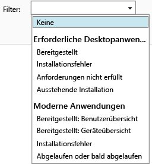

# Überwachen von App-Bereitstellungen in Microsoft Intune

## Überwachen einer App-Bereitstellung
Sie können die verwalteten Apps und den Status aller Bereitstellungen in der Intune-Verwaltungskonsole anzeige.

### So zeigen Sie die von Ihnen verwalteten Apps und ihren Status an
Klicken Sie im Arbeitsbereich **Apps** auf den Knoten **Apps** und anschließend auf **Apps**.

Es wird eine Liste der von Ihnen verwalteten Apps angezeigt. Sie können auf eine beliebige App klicken, um im unteren Bereich des Konsolenfensters den Installationsstatus anzuzeigen. Klicken Sie auf diesen Status, um weitere Details anzuzeigen. Angenommen, es wird folgender Status angezeigt: **1 Benutzer steht diese Software zur Verfügung**. Sie können dann auf diese Meldung klicken, um den Namen des Benutzers anzuzeigen.

> [!TIP]
> Über die Dropdownliste **Filter** können Sie die Anzeige auf diejenigen Apps beschränken, die von Ihnen angegebenen Kriterien entsprechen, z. B. die Apps, bei denen ein Installationsfehler aufgetreten ist oder die erfolgreich installiert wurden.
> 
> 

Außerdem wird im Arbeitsbereich **Dashboard** eine Übersicht über den Status der Apps angezeigt. Wenn Sie in der Übersicht auf eine beliebige Stelle klicken, gelangen Sie zur Liste der Apps.

## So zeigen Sie detailliertere Informationen über eine App an
Wählen Sie in der Liste der Apps eine beliebige App aus, und klicken Sie dann auf **Eigenschaften anzeigen**.

Klicken Sie auf der Seite **Softwareeigenschaften** für die App auf eine dieser Registerkarten: **Allgemein:** Zeigt allgemeine Informationen über die App und deren Installationsstatus an. **Geräte:** Zeigt die Geräte an, bei denen eine gezielte Bereitstellung der App erfolgreich installiert wurde. **Benutzer:** Zeigt die Benutzer an, auf deren Geräten eine gezielte Bereitstellung der App erfolgreich installiert wurde.

Wie bereits zuvor können Sie auch hier die Dropdownliste **Filter** verwenden, um die auf den Registerkarten angezeigten Werte zu konfigurieren.

<!--HONumber=Jun16_HO4-->

