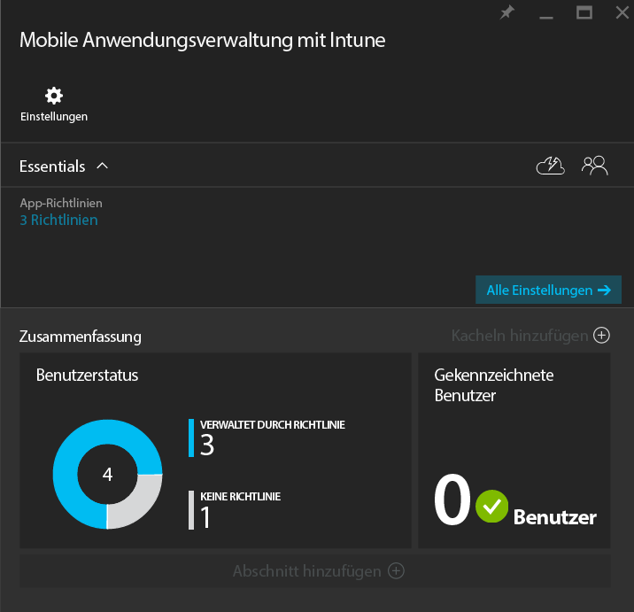
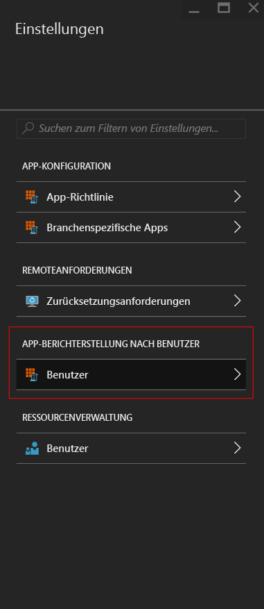
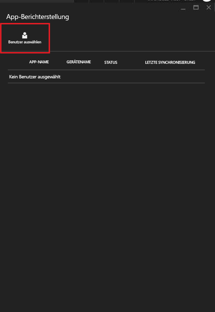
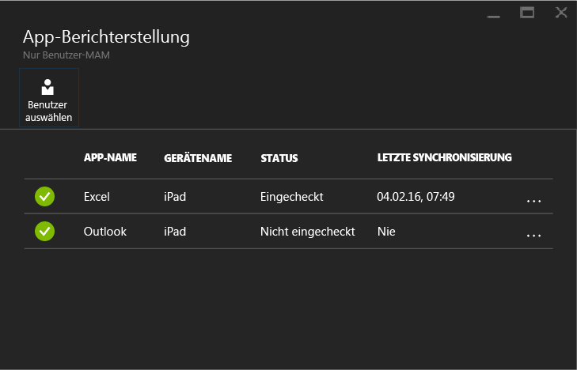

# Überwachen der Verwaltungsrichtlinien für mobile Apps mit Microsoft Intune
Nachdem Sie eine MAM-Richtlinie konfiguriert und auf die Benutzer angewendet haben, können Sie den Kompatibilitätsstatus im [Azure-Portal](https://portal.azure.com) überwachen. Das Azure-Portal enthält Informationen über die Benutzer, die von der Richtlinie betroffen sind, den Kompatibilitätsstatus sowie über Probleme, die bei Ihren Endbenutzer möglicherweise auftreten.
## Zusammenfassungsansicht
Auf dem Blatt **Mobile Anwendungsverwaltung mit Intune** sehen Sie eine Zusammenfassung des Kompatibilitätsstatus wie unten beschrieben:

-   **BENUTZER:** Die Gesamtzahl der Benutzer in Ihrem Unternehmen, die die der Richtlinie zugeordneten Apps verwenden.

-   **VERWALTET DURCH RICHTLINIE:** Die Anzahl der Benutzer, die mindestens eine der Apps im Arbeitskontext verwendet haben.

-   **KEINE RICHTLINIE:** Die Anzahl der Benutzer, die die der Richtlinie zugeordneten Apps verwenden, jedoch nicht von der Richtlinie betroffen sind.  Sie sollten erwägen, diese Benutzer der Richtlinie hinzuzufügen.

- **Gekennzeichnete Benutzer:** Die Anzahl der Benutzer, die Probleme feststellen. Derzeit werden nur Benutzer mit per Jailbreak manipulierten Geräten unter **Gekennzeichnete Benutzer** gemeldet.

## Detailansicht
Sie können zur detaillierten Ansicht der Zusammenfassung gelangen, indem Sie auf die Kachel **Benutzerstatus** und dann auf die Kachel **Gekennzeichnete Benutzer** klicken.

### Benutzerstatus
Sie können nach einem einzelnen Benutzer suchen und sich den Kompatibilitätsstatus für diesen Benutzer ansehen. Auf dem Blatt **App-Berichterstellung** werden für einen ausgewählten Benutzer die folgenden Informationen angezeigt:
- Geräte, die dem Benutzerkonto zugeordnet sind
- Apps mit MAM-Richtlinie auf dem Gerät
- Status:

  **Eingecheckt:** Dies bedeutet, dass die Richtlinie für den Benutzer bereitgestellt wurde und dass die App mindestens einmal im Arbeitskontext verwendet wurde.

  **Nicht eingecheckt:** Dies bedeutet, dass die Richtlinie für den Benutzer bereitgestellt wurde, die App seitdem aber nicht im Arbeitskontext verwendet wurde.

>[!NOTE]
> Wenn für den gesuchten Benutzer keine MAM-Richtlinie bereitgestellt wurde, wird Ihnen eine Meldung angezeigt, dass auf den Benutzer keine App-Richtlinien angewendet werden.

Um die Berichterstattung für einen Benutzer anzuzeigen, gehen Sie folgendermaßen vor:

**Schritt 1:** Um einen Benutzer auszuwählen, klicken Sie auf die Kachel „Zusammenfassung“, oder wählen Sie die Option **APP-BERICHTERSTELLUNG NACH BENUTZER** auf dem Blatt **Einstellungen**, wie unten dargestellt:

**Schritt 2:** Daraufhin wird das Blatt **App-Berichterstellung** geöffnet. Wählen Sie **Benutzer auswählen**, um nach einem Azure Active Directory-Benutzer zu suchen.

**Schritt 3:** Nach dem Auswählen des Benutzers aus der Liste werden die Details des Kompatibilitätsstatus für diesen Benutzer angezeigt.

### Gekennzeichnete Benutzer
In der Detailansicht werden die Fehlermeldung, die App, auf die bei Auftreten des Fehlers zugegriffen wurde, die Plattform des Geräts und ein Zeitstempel angezeigt.  

### Weitere Informationen:
[Verwalten der Datenübertragung zwischen iOS-Apps](manage-data-transfer-between-ios-apps-with-microsoft-intune.md)

* [Was Sie erwartet, wenn Ihre Android-App von MAM-Richtlinien verwaltet wird](user-experience-for-mam-enabled-android-apps-with-microsoft-intune.md)
* [Was Sie erwartet, wenn Ihre iOS-App von MAM-Richtlinien verwaltet wird](user-experience-for-mam-enabled-ios-apps-with-microsoft-intune.md)

<!--HONumber=Oct16_HO3-->

