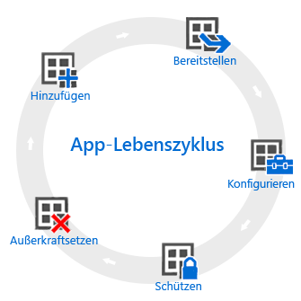

# Übersicht über den App-Lebenszyklus

Der Intune-Lebenszyklus von Apps beginnt, wenn eine App hinzugefügt wird, und durchläuft weitere Phasen, bis Sie die App entfernen.

## Hinzufügen

Der erste Schritt bei der App-Bereitstellung besteht darin, die Apps, die Sie verwalten und bereitstellen möchten, zu Intune hinzuzufügen. Sie können zwar mit vielen verschiedenen App-Typen arbeiten, aber die grundlegenden Verfahren sind identisch. Intune ermöglicht das Hinzufügen von Apps sowohl für [registrierte Geräte](add-apps-for-mobile-devices-in-microsoft-intune.md) als auch für [Windows-PCs, die Sie mit der Intune-Clientsoftware verwalten](add-apps-for-windows-pcs-in-microsoft-intune.md).

## Bereitstellen

Nachdem Sie die App in Intune hinzugefügt haben, können Sie sie [auf den verwalteten Geräten bereitstellen](deploy-apps.md). Intune vereinfacht diesen Vorgang, und nachdem die App bereitgestellt wurde, können Sie [den Erfolg der Bereitstellung über die Intune-Verwaltungskonsole überwachen](monitor-apps-in-microsoft-intune.md). Darüber hinaus können Sie in einigen App-Stores, wie z. B. dem [Apple](manage-ios-apps-you-purchased-through-a-volume-purchase-program-with-microsoft-intune.md)- und dem [Windows](manage-apps-you-purchased-from-the-windows-store-for-business-with-microsoft-intune.md)-App Store, App-Lizenzen für Ihr Unternehmen in einem Massenvorgang erwerben. Intune kann Daten mit diesen Stores synchronisieren, sodass Sie die Bereitstellung und Verfolgung der Lizenznutzung für diese Typen von Apps direkt von der Intune-Verwaltungskonsole aus bereitstellen und verfolgen können.

## Konfigurieren

Im Rahmen des App-Lebenszyklus werden regelmäßig neue Versionen von Apps veröffentlicht. Intune bietet Tools, mit denen Sie die bereitgestellten Apps leicht auf eine neuere Version [aktualisieren können](update-apps-using-microsoft-intune.md). Darüber hinaus können Sie für einige Apps zusätzliche Funktionalität konfigurieren, zum Beispiel:
- Mit [iOS-App-Konfigurationsrichtlinien](configure-ios-apps-with-mobile-app-configuration-policies-in-microsoft-intune.md) können Sie Einstellungen für kompatible iOS-Apps angeben, die bei Ausführung der App verwendet werden. Eine App kann beispielsweise bestimmte Brandingeinstellungen oder den Namen eines Servers für die Verbindungsherstellung abfragen.
- [Verwaltete Browserrichtlinien](manage-internet-access-using-managed-browser-policies.md) helfen Ihnen beim Konfigurieren von Einstellungen für den Intune Managed Browser, der den Standardbrowser für das Gerät ersetzt und Ihnen das Einschränken der Websites ermöglicht, die die Benutzer besuchen können.

## Schützen

Intune bietet Ihnen viele Möglichkeiten zum Schutz der Daten in Ihren Apps. Die wichtigsten Methoden sind:
- Der [bedingte Zugriff](restrict-access-to-email-and-o365-services-with-microsoft-intune.md) steuert den Zugriff auf E-Mail und andere Dienste basierend auf Bedingungen, die Sie festlegen. Bedingungen sind z. B. Gerätetypen oder die Einhaltung einer von Ihnen bereitgestellten [Gerätekompatibilitätsrichtlinie](introduction-to-device-compliance-policies-in-microsoft-intune.md).
- [Mobile Anwendungsverwaltung (MAM)](protect-app-data-using-mobile-app-management-policies-with-microsoft-intune.md). Diese arbeitet mit einzelnen Apps, mit denen Sie die von diesen Apps verwendeten Unternehmensdaten schützen können. Beispielsweise können Sie das Kopieren von Daten zwischen nicht verwalteten Apps und von Ihnen verwalteten Apps einschränken, oder Sie können die Ausführung von Apps auf Geräten verhindern, die per Jailbreak oder Rooting manipuliert wurden.

## Außerkraftsetzen

Letztlich ist es wahrscheinlich, dass von Ihnen bereitgestellte Apps irgendwann nicht mehr aktuell sind und entfernt werden müssen. Intune vereinfacht die [Außerbetriebnahme von Apps](retire-apps-using-microsoft-intune.md).

<!--HONumber=Aug16_HO2-->

