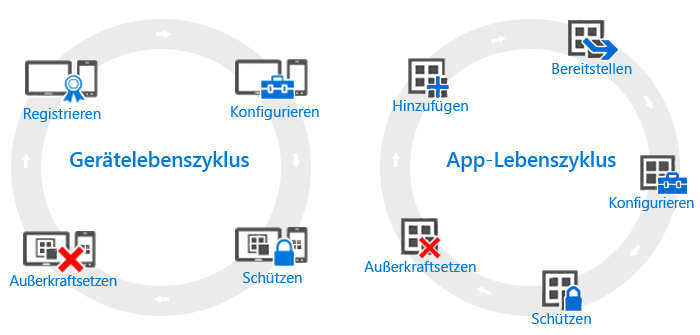

---
# required metadata

title: Übersicht über die Lebenszyklen von Geräten und Apps | Microsoft Intune
description:
keywords:
author: robstackmsft
manager: jeffgilb
ms.date: 04/28/2016
ms.topic: article
ms.prod:
ms.service: microsoft-intune
ms.technology:
ms.assetid: 38e08253-14a0-4cc4-87be-7b110c12a523

# optional metadata

#ROBOTS:
#audience:
#ms.devlang:
ms.reviewer: jeffgilb
ms.suite: ems
#ms.tgt_pltfrm:
#ms.custom:

---

# Übersicht über die Lebenszyklen von Geräten und Apps

Auch wenn sich die Anforderungen der einzelnen Organisationen unterscheiden, gibt es bestimmte allgemeine Schritte, die alle Organisationen unabhängig von ihren weiteren Betriebsanforderungen regelmäßig durchführen müssen. Diese lassen sich in zwei Hauptkategorien unterteilen, die als **Lebenszyklen** bezeichnet werden. Der von Ihnen befolgte Bereitstellungs-Lebenszyklus hängt von dem Szenario ab, das Sie ermöglichen möchten. Zum Beispiel benötigen Sie möglicherweise nur den Gerätelebenszyklus, nur den App-Lebenszyklus oder beide.

Zu Verwaltungszwecken besitzen alle Geräte einen Lebenszyklus – von der anfänglichen Registrierung des Geräts bis zur Außerbetriebnahme, wenn es nicht mehr benötigt wird. Der [Lebenszyklus der Geräteverwaltung](overview-of-device-lifecycle-in-microsoft-intune.md) führt Sie durch alle Registrierungsoptionen, die Methoden zum Konfigurieren und Schützen dieser Geräte und anschließend durch das Entfernen der Geräte aus der Verwaltung.

Ebenso verfügen die Apps, mit denen Sie arbeiten, über einen eigenen [App-Lebenszyklus](overview-of-app-lifecycle-in-microsoft-intune.md), der die Schritte vom Hinzufügen der App zu Intune bis hin zu ihrer Entfernung umfasst, wenn die App nicht länger benötigt wird.

<!--HONumber=May16_HO2-->

