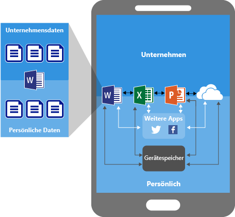
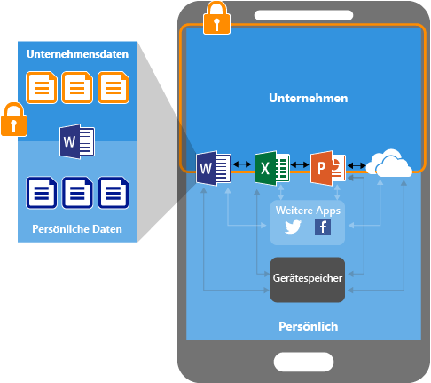
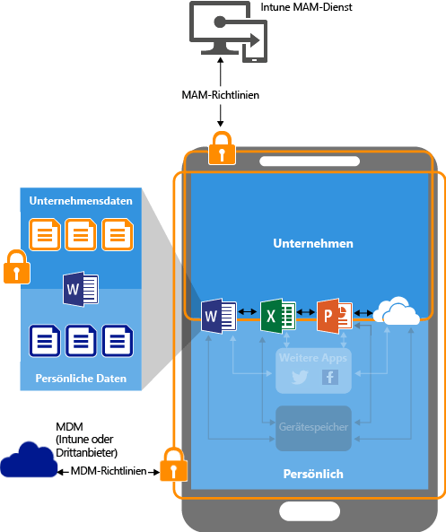
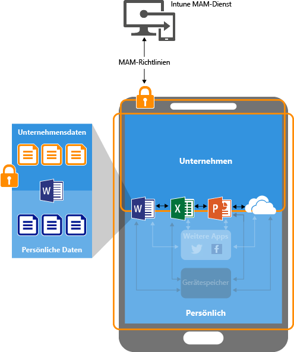

# Schützen von App-Daten mithilfe der Verwaltungsrichtlinien für mobile Apps mit Microsoft Intune

## Wie Sie Ihre App-Daten schützen können
Ihre Mitarbeiter verwenden mobile Geräte für private und berufliche Aufgaben.  Sie möchten einerseits die Produktivität Ihrer Mitarbeiter sicherstellen, möchten andererseits aber auch Datenverlust verhindern, sei er beabsichtigt oder unbeabsichtigt.  Darüber hinaus möchten Sie auch dann die Möglichkeit zum Schützen der Unternehmensdaten haben, wenn der Zugriff darauf über Geräte erfolgt, die nicht von Ihnen verwaltet werden.

Sie können Intune-Verwaltungsrichtlinien für mobile Apps (Mobile App Management, MAM) verwenden, um Ihre Unternehmensdaten zu schützen. Da Intune MAM-Richtlinien **unabhängig von Lösungen für die Verwaltung mobiler Geräte (MDM) einsetzbar sind**, können Sie sie mit oder ohne Registrierung der Geräte bei einer Geräteverwaltungslösung zum Schutz Ihrer Unternehmensdaten verwenden. Durch die Implementierung von **Richtlinien auf App-Ebene** können Sie den Zugriff auf Unternehmensressourcen einschränken und Daten im Zuständigkeitsbereich der IT-Abteilung halten.

MAM-Richtlinien können für Apps konfiguriert werden, die auf Geräten ausgeführt werden, die folgende Voraussetzungen mitbringen:

- **Registriert bei Microsoft Intune:** Die Geräte in dieser Kategorie sind in der Regel unternehmenseigene Geräte.

-   **Registriert bei einer Drittanbieterlösung für die Verwaltung mobiler Geräte (MDM, Mobile Device Management):** Die Geräte in dieser Kategorie sind in der Regel unternehmenseigene Geräte.

  > [!NOTE]
  > Verwaltungsrichtlinien für mobile Apps sollten nicht in Verbindung mit Verwaltungslösungen für mobile Geräte von Drittanbietern oder sicheren Containerlösungen verwendet werden.

-   **Nicht bei einer Lösung für die Verwaltung mobiler Geräte registriert:** Die Geräte in dieser Kategorie sind in der Regel mitarbeitereigene Geräte, die weder bei Intune noch anderen MDM-Lösungen registriert sind oder dort verwaltet werden.

> [!IMPORTANT]
> Sie können Verwaltungsrichtlinien für mobile Apps für mobile Office-Apps erstellen, die eine Verbindung mit Office 365-Diensten herstellen. MAM-Richtlinien werden nicht für Apps unterstützt, die eine Verbindung mit Exchange lokal, Skype for Business oder SharePoint-Diensten herstellen.

**Die wichtigsten Vorteile von MAM-Richtlinien sind:**

-   Schutz Ihrer Unternehmensdaten auf App-Ebene.  Da die Verwaltung von mobilen Apps keine Geräteverwaltung voraussetzt, können Sie Unternehmensdaten auf verwalteten und auf unverwalteten Geräten schützen. Bei der Verwaltung wird die Benutzeridentität in den Mittelpunkt gestellt, wodurch sich die Geräteverwaltung erübrigt.

-   Die Produktivität der Endbenutzer wird nicht beeinträchtigt, und die Richtlinien werden nicht angewendet, wenn die App im privaten Kontext verwendet wird.  Die Richtlinien werden nur auf den beruflichen Kontext angewendet, wodurch Sie die Möglichkeit haben, Unternehmensdaten zu schützen, ohne dass private Daten einbezogen werden.

Es gibt weitere Vorteile bei der Verwendung einer MDM mit MAM-Richtlinien, und Unternehmen können MAM sowohl mit als auch ohne MDM gleichzeitig verwenden. So kann ein Mitarbeiter beispielsweise ein unternehmenseigenes Smartphone und ein privates Tablet verwenden.  In diesem Fall wird das unternehmenseigene Smartphone in einer MDM registriert und von MAM-Richtlinien geschützt, während das private Geräte nur mit MAM-Richtlinien geschützt wird.

- **Eine MDM-Lösung stellt sicher, dass das Gerät geschützt ist**.  So können Sie beispielsweise die Eingabe einer PIN für den Zugriff auf das Gerät anfordern, oder Sie können verwaltete Apps auf dem Gerät bereitstellen. Sie können Apps auch über die MDM-Lösung auf Geräten bereitstellen, um mehr Kontrolle über die App-Verwaltung zu haben.

- **MAM-Richtlinien stellen sicher, dass Schutzfunktionen auf App-Ebene vorhanden sind**. So können Sie beispielsweise eine PIN anfordern, wenn eine App im beruflichen Kontext geöffnet werden soll oder wenn Daten zwischen Apps ausgetauscht werden können oder um zu verhindern, dass App-Daten des Unternehmens an einem privaten Speicherort gespeichert werden.

### MAM-Richtlinien werden zurzeit auf folgenden Betriebssystemen unterstützt:
-   iOS 8.1 oder höher

-   Android 4 oder höher

Windows-Geräte werden momentan nicht unterstützt.
##  Wie App-Daten mit MAM-Richtlinien geschützt werden

####  Apps ohne MAM-Richtlinien:

Wenn Apps ohne Einschränkungen verwendet werden, können Unternehmensdaten und private Daten vermischt werden.  Unternehmensdaten könnten damit an Speicherorten wie dem persönlichen Speicher abgelegt oder an Apps außerhalb Ihres Zuständigkeitsbereichs übermittelt werden, was Datenverlust bedeuten würde. Die Pfeile im Diagramm zeigen die uneingeschränkte Datenbewegung zwischen Apps (geschäftlich und privat) und zu Speicherorten.

### Schutz von Daten mit MAM-Richtlinien:

Mit MAM-Richtlinien können Sie verhindern, dass Unternehmensdaten im lokalen Speicher des Geräts gespeichert werden. Außerdem können Sie das Verschieben von Daten in andere Apps einschränken, die nicht durch MAM-Richtlinien geschützt sind. MAM-Richtlinieneinstellungen umfassen Folgendes:
- Richtlinien zur Datenverschiebung wie **„Speichern unter“ verhindern**, **Ausschneiden, Kopieren und Einfügen einschränken**.
- Einstellungen von Zugriffsrichtlinien wie **Einfache PIN für den Zugriff erforderlich**, **Ausführen verwalteter Apps auf Geräten mit Jailbreak oder Rootzugriff blockieren**.

### Schutz von Daten mit MAM-Richtlinien auf Geräten, die durch eine MDM-Lösung verwaltet werden:

**Für Geräte, die in einer MDM-Lösung registriert sind:**-

Die obige Abbildung zeigt die Schutzebenen, die durch den gemeinsamen Einsatz von MDM und MAM-Richtlinien geboten werden.

Die MDM-Lösung:

-   Registrieren das Gerät

-   Stellt die Apps auf dem Gerät bereit

-   Sorgt für kontinuierliche Gerätekompatibilität und -verwaltung

**MAM-Richtlinien erhöhen den Wert:**

-   Sie tragen zum Schutz der Unternehmensdaten bei, indem der Zugriff durch Verbraucher-Apps und -Dienste verhindert wird.

-   Es werden Einschränkungen ("Speichern unter", Zwischenablage, PIN usw.) auf mobile Apps angewendet.

-   Unternehmensdaten können aus Apps entfernt werden, ohne die Apps vom Gerät zu löschen.

### Schutz von Daten mit MAM-Richtlinien für Geräte ohne Registrierung:

Das obige Diagramm zeigt, wie die Datenschutzrichtlinien auf App-Ebene ohne MDM funktionieren.

Bei BYOD-Geräten, die nicht in einer MDM-Lösung registriert sind, können MAM-Richtlinien dazu beitragen, Unternehmensdaten auf App-Ebene zu schützen.
Es gibt jedoch einige Einschränkungen, die Sie kennen sollten:

-   Sie können auf dem Gerät keine Apps bereitstellen.  Der Endbenutzer muss die Apps aus dem Store beziehen.

-   Sie können auf diesen Geräten keine Zertifikatprofile bereitstellen.

-   Sie können auf diesen Geräten keine unternehmensweiten WLAN- und VPN-Einstellungen bereitstellen.

## Mehrere Identitäten

Apps, die mehrere Identitäten unterstützen, bieten Ihnen die Möglichkeit, verschiedene Konten – Geschäfts- und persönliche Konten – für den Zugriff auf die gleichen Apps zu verwenden. Hierbei werden MAM-Richtlinien nur angewendet, wenn die Apps im Arbeitskontext verwendet werden.  

Wenn der Benutzer beispielsweise die OneDrive-App mit seinem Geschäftskonto startet, kann er die Dateien nicht an einen persönlichen Speicherort verschieben. Wenn der Benutzer OneDrive jedoch mit einem persönlichen Konto verwendet, kann er Daten ohne Einschränkung aus dem persönlichen OneDrive kopieren und verschieben.  

Alle mobilen Office-Apps unterstützen mehrere Identitäten.

##  Nächste Schritte
[Vorbereiten der Konfiguration von Verwaltungsrichtlinien für mobile Apps](get-ready-to-configure-mobile-app-management-policies-with-microsoft-intune.md)

[Erstellen und Bereitstellen von Verwaltungsrichtlinien für mobile Apps mit Microsoft Intune](create-and-deploy-mobile-app-management-policies-with-microsoft-intune.md)

<!--HONumber=Oct16_HO3-->

