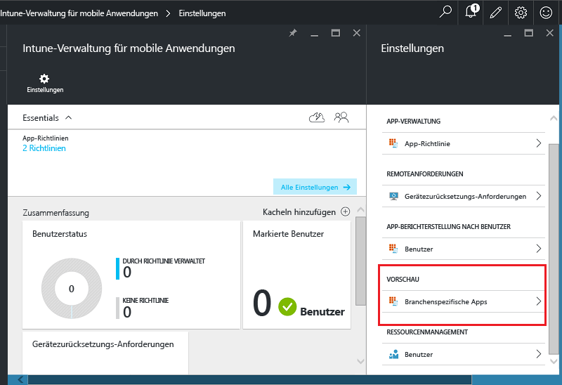
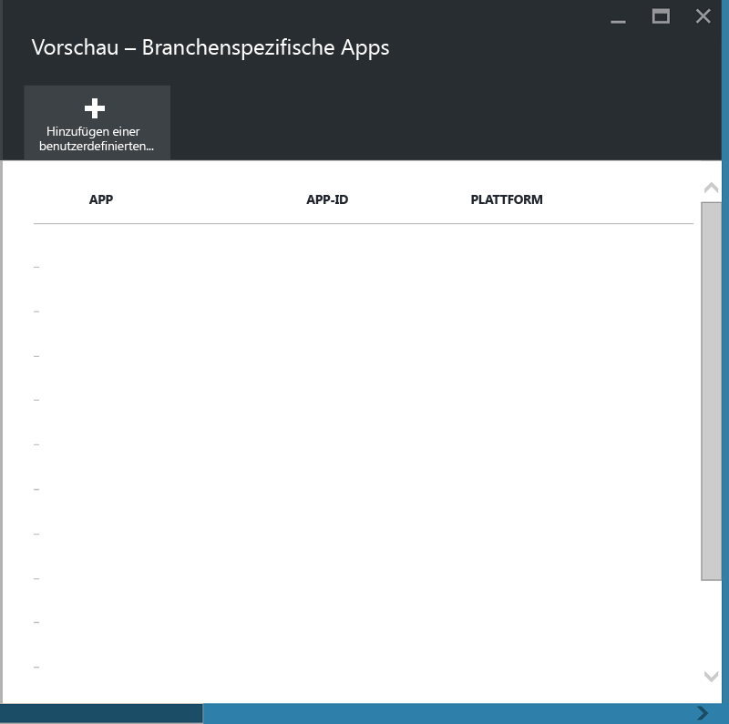
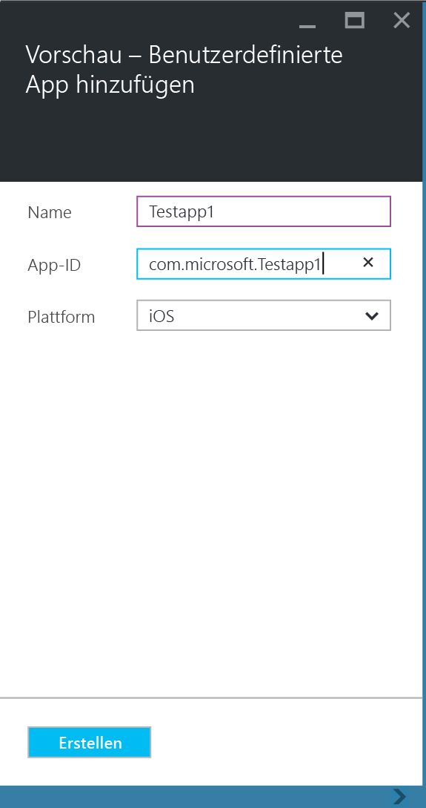
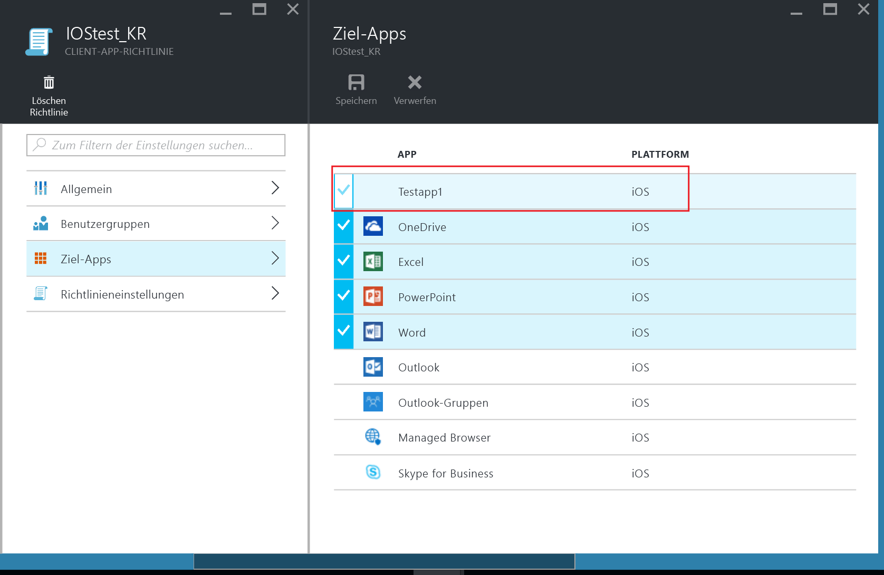
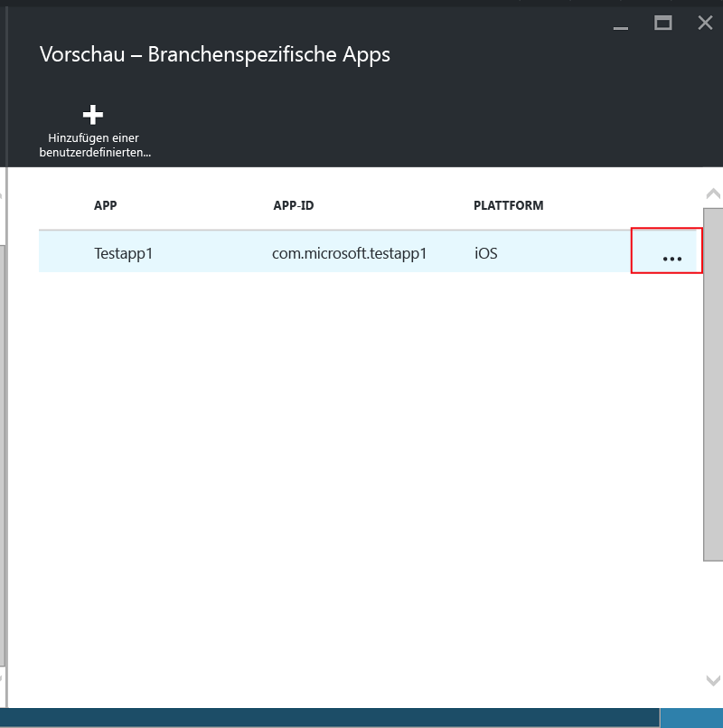

# Schützen von branchenspezifischen Apps und Daten auf nicht in Microsoft Intune registrierten Geräten

Richtlinien für die Verwaltung mobiler Anwendungen (Mobile App Management, MAM) dienen zum Schützen Ihrer Unternehmensdaten, indem Vorgänge zum Verschieben von Daten (wie Kopieren und Einfügen) eingeschränkt oder Benutzer gehindert werden, Unternehmensdokumente an privaten Speicherorten zu speichern.   Zum Anwenden von MAM-Richtlinien auf branchenspezifische iOS- und Android-Apps müssen Sie die App zunächst mit dem Microsoft Intune App Wrapping-Tool umschließen.  Bei diesem Prozess wird einer mobilen App eine Verwaltungsebene hinzugefügt, ohne dass die zugrunde liegende Anwendung geändert werden muss.  Sobald die App umschlossen ist, können Sie MAM-Richtlinien darauf anwenden und sie an Ihre Endbenutzer verteilen.  

In diesem Thema werden die erforderlichen Schritte zum Anwenden von MAM-Richtlinien auf Apps vorgestellt, auf die auf **nicht verwalteten Geräten im Besitz von Mitarbeitern** und auf Geräten zugegriffen wird, die von einer **Lösung für die Verwaltung von Mobilgeräten (Mobile Device Management, MDM) eines Drittanbieters** verwaltet werden.  Informationen zum Vorbereiten branchenspezifischer Apps, die auf **bei Intune registrierten Geräten** ausgeführt werden, finden Sie unter [Auswählen der Vorbereitung von Apps für die mobile Anwendungsverwaltung mit Microsoft Intune](decide-how-to-prepare-apps-for-mobile-application-management-with-microsoft-intune.md).
##  Schritt 1: Vorbereiten der App
Ehe Sie MAM-Richtlinien auf eine App anwenden können, müssen Sie die App zunächst mit dem Microsoft Intune App Wrapping-Tool umschließen.  Die Anleitung zum Installieren und Verwenden des App Wrapping-Tools sind im Download enthalten.  
>[!IMPORTANT]  
>Diese Version des App Wrapping-Tools, die nicht in Intune registrierte Geräte unterstützt, ist als öffentliche Vorschau verfügbar sein. Wenn Sie an der öffentlichen Vorschau teilnehmen möchten, können Sie das Tool von [dieser GitHub-Seite](https://github.com/msintuneappsdk/intune-app-wrapper-ios-preview) für iOS und von [dieser GitHub-Seite](https://github.com/msintuneappsdk/intune-app-wrapper-android-preview) für Android herunterladen.

## Schritt 2: Hinzufügen der App

Um Ihre branchenspezifische App zu MAM-Richtlinien zuzuordnen, müssen Sie Ihrem Intune-Abonnement/-Mandanten die App-Details wie folgt hinzufügen:

1. Wechseln Sie im [Azure-Portal](https://portal.azure.com/) zu **Mobile Anwendungsverwaltung mit Intune > Einstellungen**, und wählen Sie **Branchenspezifische Apps**.

  

2. Wählen Sie auf dem Blatt **Branchenspezifische Apps** die Option **Benutzerdefinierte App hinzufügen** aus.

  
3.  Geben Sie einen Namen für die App, die Paket-ID in das Feld „App-ID“ und die Plattform (iOS oder Android) an.

   Dieser Schritt dient zum Erstellen einer eindeutigen Auflistung Ihrer App.  Die App wird auch in der Liste der Ziel-Apps für eine MAM-Richtlinie für Ihren Mandanten angezeigt (siehe den nächsten Schritt).

## Schritt 3: Anwenden von MAM-Richtlinien
Sobald die App-Metadaten in den Dienst hochgeladen wurden, zeigt die App die Liste mit Apps an.  Sie können jetzt [eine neue Richtlinie erstellen oder eine vorhandene Richtlinie verwenden](create-and-deploy-mobile-app-management-policies-with-microsoft-intune.md) und sie auf die branchenspezifische App anwenden, die Sie in Schritt 2 hinzugefügt haben.

>[!IMPORTANT]
>Die MAM-Richtlinie muss für die Benutzer erstellt werden, die die umschlossene App verwenden werden.  Benutzer, für die diese Richtlinie nicht bereitgestellt wird, können die App nicht verwenden.

  
## Schritt 4: Verteilen der App
Sie können Apps für Ihre Endbenutzer wie folgt bereitstellen:
* Für Geräte, die bei einer MDM-Lösung eines Drittanbieters registriert sind, können Sie die Apps über Ihre MDM-Lösung verteilen.
* Für Geräte, die von keiner MDM-Lösung verwaltet werden, benötigen Sie eine benutzerdefinierte Lösung. Endbenutzer müssen die App herunterladen und auf ihrem Gerät installieren.

## Ändern der Metadaten
Falls Sie App-Details wie den Namen der App oder die Paket-ID ändern müssen, müssen Sie [die App entfernen](#remove-apps) und mit den neuen Metadaten [hinzufügen](#step-2-add-the-app).

##  Entfernen von Apps
Sie können eine branchenspezifische App aus der App-Liste entfernen.  Dadurch wird die App aus der Liste und die Zuordnung zu MAM-Richtlinien entfernt, ohne dass die App jedoch vom Gerät des Endbenutzers entfernt oder deinstalliert wird.  

1.  Wechseln Sie im [Azure-Portal](https://portal.azure.com/) zu ** Intune-Verwaltung von mobilen Anwendungen > Einstellungen**.  Wählen Sie auf dem Blatt **Einstellungen** den Eintrag **Branchenspezifische Apps**, um die Liste vorhandener Apps anzuzeigen.  
2.  Wählen Sie die App aus, die Sie entfernen möchten, und klicken Sie auf **(...)**, um das Kontextmenü zu öffnen.

  
3.  Wählen Sie **Anwendung löschen** aus, um die App zu löschen.

  

  Dies entfernt Apps aus der Liste der branchenspezifischen Apps und der Zielliste von Apps in der MAM-Richtlinie.

<!--HONumber=Sep16_HO2-->

