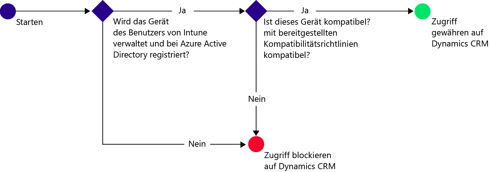
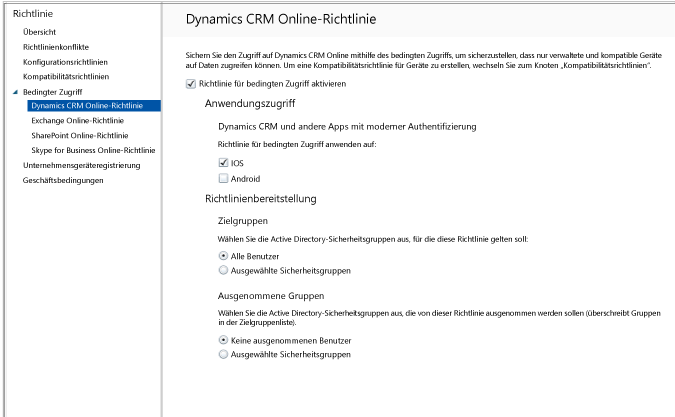

# Beschränken des E-Mail-Zugriffs auf Dynamics CRM Online mit Intune
Sie können den Zugriff auf Microsoft Dynamics CRM Online von iOS- und Android-Geräten mithilfe des bedingten Zugriffs von Microsoft Intune steuern.  Der bedingte Zugriff in Intune besteht aus zwei Komponenten:
* Eine [Gerätekompatibilitätsrichtlinie](introduction-to-device-compliance-policies-in-microsoft-intune.md), die das Gerät erfüllen muss, um als kompatibel bewertet zu werden.
* Eine [Richtlinie für bedingten Zugriff](restrict-access-to-email-and-o365-services-with-microsoft-intune.md), in der Sie die Bedingungen festlegen, die das Gerät erfüllen muss, um auf den Dienst zugreifen zu können.

Weitere Informationen zur Funktionsweise des bedingten Zugriffs finden Sie im Artikel [Beschränken des Zugriffs auf E-Mail, O365 und andere Dienste](restrict-access-to-email-and-o365-services-with-microsoft-intune.md).

[!IMPORTANT] Zum Bereitstellen des bedingten Zugriffs müssen Sie über Abonnements für Intune und Azure Active Directory Premium verfügen, und Benutzer müssen für beide Produkte lizenziert sein. Das **Abonnement für Enterprise Mobility + Security (EMS)** umfasst sowohl das Intune- als auch das Azure Active Directory Premium-Abonnement. Weitere Informationen finden Sie in der [Preisübersicht für Enterprise Mobility](https://www.microsoft.com/en-us/cloud-platform/enterprise-mobility-pricing). Falls Sie nicht über ein EMS-Abonnement verfügen, können Sie ein Abonnement für Azure Active Directory Premium erwerben. Weitere Informationen finden Sie in der [Preisübersicht für Azure Active Directory](https://azure.microsoft.com/en-us/pricing/details/active-directory/).

Wenn ein Zielbenutzer versucht, die Dynamics CRM-App auf seinem Gerät zu verwenden, erfolgt folgende Auswertung:

Für das Gerät, das auf Dynamics CRM zugreift, gelten die folgenden Anforderungen:
* Es muss sich um ein **Android**- oder **iOS**-Gerät handeln.
* Es muss bei Microsoft Intune **registriert** sein.
* Es muss mit allen bereitgestellten Intune-Konformitätsrichtlinien **kompatibel** sein.

Der Gerätestatus wird in Azure Active Directory gespeichert, wo der Zugriff entsprechend den von Ihnen angegebenen Bedingungen gewährt oder blockiert wird.

Wenn eine Bedingung nicht erfüllt wird, erhält der Benutzer bei der Anmeldung die folgenden Meldungen:
* Falls das Gerät nicht bei Microsoft Intune oder in Azure Active Directory registriert ist, wird eine Meldung mit Anweisungen zum Installieren der Unternehmensportal-App und zum Registrieren des Geräts angezeigt.
* Falls das Gerät nicht kompatibel ist, wird eine Meldung angezeigt, die den Benutzer zum Microsoft Intune-Unternehmensportal oder der Unternehmensportal-App weiterleitet. Hier findet er Informationen zum Problem und zu dessen Lösung.

## Konfigurieren des bedingten Zugriffs für Dynamics CRM Online  
### Schritt 1: Konfigurieren von Active Directory-Sicherheitsgruppen

Bevor Sie beginnen, konfigurieren Sie Azure Active Directory-Sicherheitsgruppen für die bedingte Zugriffsrichtlinien. Sie können diese Gruppen im **Office 365 Admin Center** konfigurieren. Diese Gruppen werden verwendet, um die Richtlinie auf Benutzer anzuwenden oder Benutzer von der Richtlinie auszunehmen. Bei Benutzern, für die eine Richtlinie gelten soll, muss jedes von ihnen verwendete Gerät die Richtlinie erfüllen, damit sie auf Ressourcen zugreifen können.

Sie können zwei Gruppentypen für die Verwendung mit der Dynamics CRM-Richtlinie angeben:
* **Zielgruppen**: Gruppen von Benutzern, auf die die Richtlinie angewendet werden soll.
* **Ausgenommene Gruppen**: Gruppen von Benutzern, die von der Richtlinie ausgenommen sind.

Benutzer, die in beiden Gruppen enthalten sind, werden von der Richtlinie ausgenommen.

### Schritt 2: Konfigurieren und Bereitstellen einer Kompatibilitätsrichtlinie
Sie müssen eine Kompatibilitätsrichtlinie [erstellen](create-a-device-compliance-policy-in-microsoft-intune.md) und auf allen Geräten [bereitstellen](deploy-and-monitor-a-device-compliance-policy-in-microsoft-intune.md), die von der Richtlinie betroffen sind. Dies sind alle Geräte, die von den Benutzern in den Zielgruppen verwendet werden.

> [!NOTE]
> Kompatibilitätsrichtlinien werden für Microsoft Intune-Gruppen bereitgestellt, Richtlinien für den bedingten Zugriff dagegen werden auf Azure Active Directory-Sicherheitsgruppen angewendet.

> [!IMPORTANT]
> Wenn Sie keine Kompatibilitätsrichtlinie bereitgestellt haben, werden die Geräte als kompatibel ausgewertet.

Fahren Sie mit Schritt 3 fort.
### Schritt 3: Konfigurieren der Dynamics CRM-Richtlinie
Anschließend konfigurieren Sie die Richtlinie so, dass nur verwaltete und kompatible Geräte auf Dynamics CRM zugreifen dürfen. Diese Richtlinie wird in Azure Active Directory gespeichert.

1.  Wählen Sie in der Microsoft Intune-Verwaltungskonsole **Richtlinie > bedingter Zugriff > Dynamics CRM Online-Richtlinie** aus.

  

2.  Wählen Sie **Richtlinie für bedingten Zugriff aktivieren** aus.
3.  Unter **Anwendungszugriff** können Sie optional eine Richtlinie für bedingten Zugriff auf Folgendes anwenden:
  * **iOS**
  * **Android**
4.  Wählen Sie unter **Zielgruppen** **Ändern** aus, um die Azure Active Directory-Sicherheitsgruppen auszuwählen, für die die Richtlinie gelten soll. Sie können dies für alle Benutzer oder nur für eine ausgewählte Benutzergruppe festlegen.
5.  Wählen Sie unter **Exempted Groups** (Ausgenommene Gruppen) optional **Ändern**, um die Azure Active Directory-Sicherheitsgruppen auszuwählen, die von dieser Richtlinie ausgenommen werden.
6.  Wählen Sie abschließend **Speichern** aus.

Sie haben den bedingten Zugriff für Dynamics CRM konfiguriert. Die Richtlinie für bedingten Zugriff wird sofort wirksam und muss nicht explizit bereitgestellt werden.
##  Überwachen der Richtlinien für Konformität und bedingten Zugriff

Im Arbeitsbereich **Gruppen** können Sie den Status beim bedingten Zugriff Ihrer Geräte anzeigen.

Wählen Sie eine beliebige Gruppe von Mobilgeräten und dann auf der Registerkarte **Geräte** einen der folgenden **Filter**aus:
* **Geräte, die nicht bei AAD registriert sind**: Diese Geräte werden für Dynamics CRM blockiert.
* **Geräte, die nicht kompatibel sind**: Diese Geräte werden für Dynamics CRM blockiert.
* **Geräte, die bei AAD registriert und kompatibel sind**: Diese Geräte können auf Dynamics CRM zugreifen.

##  Nächste Schritte
[Beschränken des Zugriffs auf Exchange Online](restrict-access-to-exchange-online-with-microsoft-intune.md)

[Beschränken des Zugriffs auf Exchange lokal](restrict-access-to-exchange-onpremises-with-microsoft-intune.md)
[Beschränken des Zugriffs auf SharePoint Online](restrict-access-to-sharepoint-online-with-microsoft-intune.md)

[Beschränken des Zugriffs auf Skype for Business Online](restrict-access-to-skype-for-business-online-with-microsoft-intune.md)

<!--HONumber=Oct16_HO1-->

