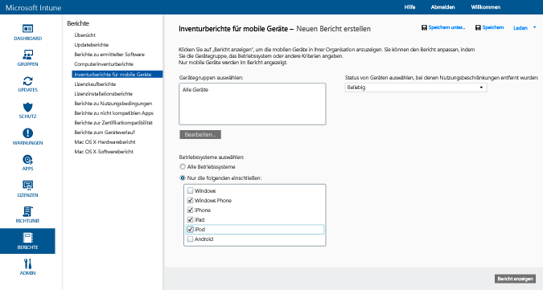
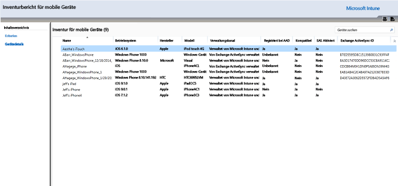
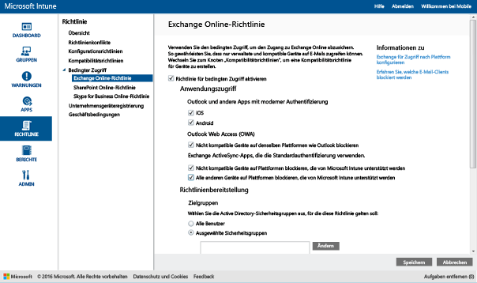
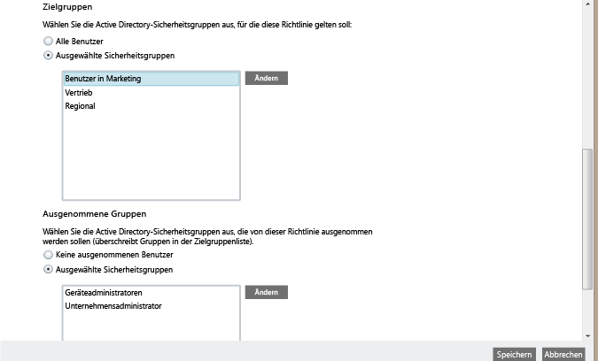
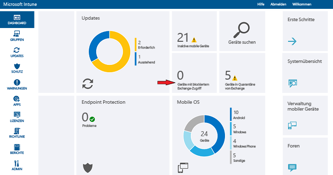

# Beschränken des E-Mail-Zugriffs auf Exchange Online- und neue Exchange Online Dedicated-Umgebungen mit Intune

Wenn Sie über eine Exchange Online Dedicated-Umgebung verfügen und herausfinden müssen, ob es sich um die neue oder die ältere Konfiguration handelt, wenden Sie sich an Ihren Kundenbetreuer.

Um den E-Mail-Zugriff auf Exchange Online oder die neue Exchange Online Dedicated-Umgebung zu steuern, konfigurieren Sie den bedingten Zugriff für Exchange Online in Intune.
Weitere Informationen zur Funktionsweise des bedingten Zugriffs finden Sie im Artikel [Beschränken des Zugriffs auf E-Mail, O365 und andere Dienste](restrict-access-to-email-and-o365-services-with-microsoft-intune.md).

**Bevor** Sie den bedingten Zugriff konfigurieren können, müssen folgende Voraussetzungen erfüllt sein:

-   Sie müssen über ein **Office 365-Abonnement verfügen, das Exchange Online (z. B. E3)** umfasst, und die Benutzer müssen für Exchange Online lizenziert sein.

- Sie müssen über ein **Enterprise Mobility + Security- oder Azure Active Directory Premium-Abonnement** verfügen, und die Benutzer müssen für EMS oder Azure AD lizenziert sein. Weitere Informationen finden Sie in der [Preisübersicht für Enterprise Mobility](https://www.microsoft.com/en-us/cloud-platform/enterprise-mobility-pricing) oder der [Preisübersicht für Azure Active Directory](https://azure.microsoft.com/en-us/pricing/details/active-directory/).

-  Sie sollten erwägen, den optionalen **Microsoft Intune Service to Service Connector** zu konfigurieren, der [!INCLUDE[wit_nextref](../includes/wit_nextref_md.md)] mit Microsoft Exchange Online verbindet und die Verwaltung von Geräteinformationen über die [!INCLUDE[wit_nextref](../includes/wit_nextref_md.md)]-Konsole ermöglicht. Der Connector ist zur Verwendung von Kompatibilitätsrichtlinien oder Richtlinien für den bedingten Zugriff nicht zwingend erforderlich, Sie benötigen ihn aber zum Ausführen von Berichten, mit deren Hilfe die Auswirkungen des bedingten Zugriffs bewertet werden.

   > [!NOTE]
   > Konfigurieren Sie den Service to Service Connector nicht, wenn Sie beabsichtigen, bedingten Zugriff für Exchange Online und lokales Exchange zu verwenden.

   Informationen zum Konfigurieren des Connectors finden Sie unter [Intune Service to Service Connector](intune-service-to-service-exchange-connector.md).

Wenn Richtlinien für bedingten Zugriff konfiguriert und auf einen Benutzer angewendet wurden, muss das **Gerät**, das der Benutzer zum Abrufen von E-Mails verwendet, folgende Voraussetzungen erfüllen:

-   Es muss bei [!INCLUDE[wit_nextref](../includes/wit_nextref_md.md)] **registriert** sein oder sich um einen in die Domäne eingebundenen PC handeln.

-  **Es muss in Azure Active Directory registriert sein**. Die erfolgt automatisch, wenn das Gerät bei [!INCLUDE[wit_nextref](../includes/wit_nextref_md.md)] registriert ist. Darüber hinaus muss die Exchange ActiveSync-ID des Clients in Azure Active Directory registriert sein.

  AAD DRS wird automatisch für Intune und Office 365-Kunden aktiviert. Kunden, die bereits den AD FS Device Registration Service bereitgestellt haben, sehen keine registrierten Geräte in ihrem lokalen Active Directory.

-   Es muss mit allen [!INCLUDE[wit_nextref](../includes/wit_nextref_md.md)]-Kompatibilitätsrichtlinien **kompatibel** sein, die auf diesem Gerät bereitgestellt wurden, oder es muss einer lokalen Domäne beigetreten sein.

Wenn eine Richtlinie für bedingten Zugriff nicht erfüllt wird, erhält der Benutzer bei der Anmeldung eine der folgenden Meldungen:

- Wenn das Gerät nicht bei [!INCLUDE[wit_nextref](../includes/wit_nextref_md.md)] oder in Azure Active Directory registriert ist, wird eine Meldung mit Anweisungen zum Installieren der Unternehmensportal-App, zum Registrieren des Geräts und zum Aktivieren des E-Mail-Zugriffs angezeigt. Dieser Prozess verknüpft auch die Exchange ActiveSync-ID mit dem Eintrag in Azure Active Directory.

-   Wenn das Gerät als nicht kompatibel mit den Kompatibilitätsrichtlinien ausgewertet wird, wird der Endbenutzer zur [!INCLUDE[wit_nextref](../includes/wit_nextref_md.md)]-Unternehmensportalwebsite oder zur Unternehmensportal-App weitergeleitet. Dort findet der Endbenutzer Informationen zum Problem und zur Lösung.

Das folgende Diagramm veranschaulicht den Ablauf, der von den Richtlinien für bedingten Zugriff für Exchange Online verwendet wird.

## Unterstützung für mobile Geräte
Sie können den Zugriff auf Exchange Online-E-Mails über **Outlook** und andere ** Apps, die die moderne Authentifizierung verwenden**, beschränken:

- Android 4.0 und höher, Samsung KNOX Standard 4.0 und höher sowie Android for Work
- iOS 8.0 und höher
- Windows Phone 8.1 und höher

Die **moderne Authentifizierung** ermöglicht das ADAL-basierte (Active Directory Authentication Library) Anmelden für Microsoft Office-Clients.

-   Die ADAL-basierte Authentifizierung ermöglicht Office-Clients die Einbindung in die browserbasierte Authentifizierung (auch als passive Authentifizierung bekannt).  Der Benutzer wird zur Authentifizierung zu einer Anmeldewebseite umgeleitet. Diese neue Anmeldemethode bietet größere Sicherheit wie die **mehrstufige Authentifizierung** und die **zertifikatbasierte Authentifizierung**.
Dieser [Artikel](https://support.office.com/en-US/article/How-modern-authentication-works-for-Office-2013-and-Office-2016-client-apps-e4c45989-4b1a-462e-a81b-2a13191cf517) enthält weitere ausführliche Informationen zur Funktionsweise der modernen Authentifizierung.
Setup-ADFS beansprucht Regeln zum Blockieren von nicht moderner Authentifizierungsprotokolle. Detaillierte Anleitungen werden in Szenario 3 beschrieben: [Blockieren des gesamten Zugriffs auf Office 365 außer durch browserbasierte Anwendungen](https://technet.microsoft.com/library/dn592182.aspx).

Sie können den Zugriff auf **Outlook Web Access (OWA)** auf Exchange Online beschränken, wenn von einem Browser auf **iOS**- und **Android**-Geräten aus zugegriffen wird.  Der Zugriff wird nur von unterstützten Browsern auf kompatiblen Geräten gewährt:

* Safari (iOS)
* Chrome (Android)
* Managed Browser (iOS und Android)

**Nicht unterstützte Browser werden blockiert**.

**Die OWA-App für iOS und Android kann so geändert werden, dass die moderne Authentifizierung nicht verwendet wird, und sie wird nicht unterstützt.  Der Zugriff über die OWA-App muss durch AD FS-Anspruchsregeln blockiert werden.**

Auf folgenden Plattformen können Sie den Zugriff auf Exchange-E-Mails über den integrierten **Exchange ActiveSync-E-Mail-Client** blockieren:

- Android 4.0 und höher, Samsung KNOX Standard 4.0 und höher

- iOS 8.0 und höher

- Windows Phone 8.1 und höher

## Unterstützung für PCs

Sie können den bedingten Zugriff für PCs einrichten, auf denen Office-Desktopanwendungen ausgeführt werden, um auf **Exchange Online** und **SharePoint Online** zuzugreifen. Dies gilt für PCs, die folgende Anforderungen erfüllen:

-   Der PC muss unter Windows 7.0, Windows 8.1 oder Windows 10 ausgeführt werden.

  >[!NOTE]
  > Damit Sie den bedingten Zugriff auf Windows 10-PCs verwenden können, müssen Sie diese PCs mit dem Windows 10 Anniversary-Update aktualisieren.

  Der PC muss entweder in die Domäne eingebunden oder mit den Kompatibilitätsrichtlinien kompatibel sein.

  Damit der PC als kompatibel bewertet wird, muss er bei [!INCLUDE[wit_nextref](../includes/wit_nextref_md.md)] registriert sein und den Richtlinien entsprechen.

  Für in die Domäne eingebundene PCs müssen Sie das Gerät für eine [automatische Registrierung](https://azure.microsoft.com/documentation/articles/active-directory-conditional-access-automatic-device-registration/) bei Azure Active Directory einrichten.

  >[!NOTE]
    >Bedingter Zugriff wird nicht auf PCs unterstützt, auf denen der Intune Computerclient-Agent ausgeführt wird.

-   [Die moderne Authentifizierung von Office 365 muss aktiviert sein](https://support.office.com/en-US/article/Using-Office-365-modern-authentication-with-Office-clients-776c0036-66fd-41cb-8928-5495c0f9168a) und alle neuesten Office-Updates enthalten.

    Die moderne Authentifizierung ermöglicht Windows-Clients mit Office 2013 eine ADAL-basierte Anmeldung (Active Directory Authentication Library) und bietet größere Sicherheit durch **mehrstufige Authentifizierung** und **zertifikatbasierte Authentifizierung**.

-   Richten Sie die Anspruchsregeln für Active Directory-Verbunddienste (ADFS) dahingehend ein, dass nicht moderne Authentifizierungsprotokolle blockiert werden. Detaillierte Anleitungen werden in Szenario 3 beschrieben: [Blockieren des gesamten Zugriffs auf Office 365 außer durch browserbasierte Anwendungen](https://technet.microsoft.com/library/dn592182.aspx).

## Konfigurieren des bedingten Zugriffs
### Schritt 1: Konfigurieren und Bereitstellen einer Konformitätsrichtlinie
Stellen Sie sicher, dass Sie eine Kompatibilitätsrichtlinie für die Benutzergruppen [erstellen](create-a-device-compliance-policy-in-microsoft-intune.md) und [bereitstellen](deploy-and-monitor-a-device-compliance-policy-in-microsoft-intune.md), für die auch die Richtlinie für bedingten Zugriff gelten soll.

> [!IMPORTANT]
> Wenn Sie keine Kompatibilitätsrichtlinie bereitgestellt haben, werden die Geräte als kompatibel bewertet und erhalten Zugriff auf Exchange.

### Schritt 2: Bewerten der Auswirkungen der Richtlinie für bedingten Zugriff
Mithilfe der **Inventurberichte für mobile Geräte** können Sie ermitteln, für welche Geräte der Zugriff auf Exchange blockiert wird, nachdem Sie die Richtlinie für bedingten Zugriff konfiguriert haben.

Konfigurieren Sie dafür eine Verbindung zwischen [!INCLUDE[wit_nextref](../includes/wit_nextref_md.md)] und Exchange mithilfe des [Microsoft Intune Service to Service Connectors](intune-service-to-service-exchange-connector.md).
1.  Navigieren Sie zu **Berichte -> Bestandsberichte zu mobilen Geräten**.

2.  Wählen Sie in den Berichtsparametern die auszuwertende [!INCLUDE[wit_nextref](../includes/wit_nextref_md.md)]-Gruppe sowie gegebenenfalls die Geräteplattformen aus, auf denen die Richtlinie angewendet werden soll.
3.  Nachdem Sie die Kriterien ausgewählt haben, die den Anforderungen Ihres Unternehmens entsprechen, wählen Sie **Bericht anzeigen** aus.
Die Berichtsanzeige wird in einem neuen Fenster geöffnet.

Überprüfen Sie nach der Ausführung des Berichts die folgenden vier Spalten auf blockierte Benutzer:

-   **##Verwaltungskanal** – Gibt an, ob das Gerät durch Intune und/oder Exchange ActiveSync verwaltet wird.

-   **Bei AAD registriert** – Gibt an, ob das Gerät bei Azure Active Directory registriert ist (dies wird als Arbeitsbereichsverknüpfung bezeichnet).

-   **Kompatibel** – Gibt an, ob das Gerät mit den von Ihnen bereitgestellten Konformitätsrichtlinien kompatibel ist.

-   **##Exchange ActiveSync-ID** – Bei IOS- und Android-Geräten muss die Exchange ActiveSync-ID mit der Geräteregistrierung in Azure Active Directory verknüpft sein. Dies erfolgt, wenn der Benutzer in der Quarantäne-E-Mail den Link zum **Aktivieren von E-Mails** auswählt.

    > [!NOTE]
    > Für Windows Phone-Geräte wird in dieser Spalte immer ein Wert angezeigt.

Bei Geräten, die Teil einer Zielgruppe sind, ist der Zugriff auf Exchange blockiert, sofern die Spaltenwerte nicht mit den in der folgenden Tabelle aufgeführten Werten übereinstimmen:

--------------------------
|Verwaltungskanal|Bei AAD registriert|Kompatibel|Exchange ActiveSync-ID|Resultierende Aktion|
|----------------------|------------------|-------------|--------------------------|--------------------|
|**Von Microsoft Intune und Exchange ActiveSync verwaltet**|Ja|Ja|Es wird ein Wert angezeigt.|E-Mail-Zugriff erlaubt|
|Beliebiger anderer Wert|Nein|Nein|Es wird kein Wert angezeigt.|E-Mail-Zugriff blockiert|
----------------------
Sie können den Inhalt des Berichts exportieren und die Benutzer über die in der Spalte **E-Mail-Adresse** enthaltene Adresse informieren, dass sie blockiert werden.

### Schritt 3: Konfigurieren von Benutzergruppen für die Richtlinie für bedingten Zugriff
Richtlinien für bedingten Zugriff werden auf verschiedene Azure Active Directory-Sicherheitsgruppen mit Benutzern angewendet. Sie können auch bestimmte Benutzergruppen von dieser Richtlinie ausnehmen.  Bei Benutzern, für die eine Richtlinie gelten soll, muss jedes von ihnen verwendete Gerät die Richtlinie erfüllen, damit sie auf ihre E-Mails zugreifen können.

Sie können diese Gruppen im **Office 365 Admin Center**oder **Intune-Kontenportal**konfigurieren.

Sie können für jede Richtlinie zwei Arten von Gruppen angeben:

-   **Zielgruppen** – Benutzergruppen, auf die die Richtlinie angewendet wird

-   **Ausgenommene Gruppen** – Benutzergruppen, die von der Richtlinie ausgenommen sind (optional)

Benutzer, die in beiden Gruppen enthalten sind, werden von der Richtlinie ausgenommen.

Es werden nur die Gruppen ausgewertet, für die die Richtlinie für bedingten Zugriff gilt.

### Schritt 4: Konfigurieren der Richtlinie für bedingten Zugriff

>[!NOTE]
> Sie können die Richtlinie für bedingten Zugriff auch in der Azure AD-Verwaltungskonsole erstellen. In der Azure AD-Verwaltungskonsole können Sie zusätzlich zu anderen Richtlinien für bedingten Zugriff wie Richtlinien für die mehrstufige Authentifizierung auch Richtlinien für bedingten Zugriff für Intune-Geräte erstellen (die in Azure AD als **gerätebasierte bedingte Zugriffsrichtlinien** bezeichnet werden).  Sie können auch Richtlinien für bedingten Zugriff für Unternehmens-Apps von Drittanbietern wie Salesforce und Box festlegen, die von Azure AD unterstützt werden. Weitere Informationen finden Sie unter [Festlegen von gerätebasierten Azure Active Directory-Richtlinien für bedingten Zugriff zur Steuerung des Zugriffs auf über Azure Active Directory verbundene Anwendungen](https://azure.microsoft.com/en-us/documentation/articles/active-directory-conditional-access-policy-connected-applications/).

1.  Wählen Sie in der [Microsoft Intune-Verwaltungskonsole](https://manage.microsoft.com) die Optionen **Richtlinie** > **Bedingter Zugriff** > **Exchange Online-Richtlinie**.

2.  Aktivieren Sie auf der Seite **Exchange Online-Richtlinie** die Option **Bedingte Zugriffsrichtlinie für Exchange Online aktivieren**.

    > [!NOTE]
    > Wenn Sie keine Kompatibilitätsrichtlinie bereitgestellt haben, werden Geräte als kompatibel ausgewertet.
    >
    > Unabhängig vom Konformitätsstatus müssen alle Benutzer, denen die Richtlinie zugewiesen ist, ihre Geräte bei [!INCLUDE[wit_nextref](../includes/wit_nextref_md.md)] registrieren.

3.  Unter **Anwendungszugriff** haben Sie für Apps, die die moderne Authentifizierung verwenden, zwei Möglichkeiten, auszuwählen, auf welche Plattformen die Richtlinie angewendet werden soll. Zu den unterstützten Plattformen gehören Android, iOS, Windows und Windows Phone.

    -   **Alle Plattformen**

        Dies setzt voraus, dass jedes Gerät, das für den Zugriff auf **Exchange Online** verwendet wird, in Intune registriert und kompatibel zu den Richtlinien ist.  Jede Clientanwendung, die die **moderne Authentifizierung** verwendet, unterliegt der Richtlinie für den bedingten Zugriff, und wenn die Plattform gegenwärtig nicht von Intune unterstützt wird, wird der Zugriff auf **Exchange Online** blockiert.

        Die Auswahl der Option **Alle Plattformen** bedeutet, dass Azure Active Directory diese Richtlinie auf alle Authentifizierungsanforderungen anwendet, unabhängig von der Plattform, die von der Clientanwendung gemeldet wird.  Alle Plattformen müssen registriert und kompatibel sein, mit Ausnahme von:
        *   Windows-Geräten. Diese müssen registriert werden und kompatibel sein, mit der lokalen Active Directory-Domäne verknüpft sein oder beides
        * Nicht unterstützte Plattformen wie Mac OS  Allerdings werden Apps, die die moderne Authentifizierung von diesen Plattformen verwenden, weiterhin blockiert.

    -   **Bestimmte Plattformen**

         Die Richtlinie für bedingten Zugriff wird auf jede Client-App angewendet, die die **moderne Authentifizierung** auf den von Ihnen festgelegten Geräteplattformen verwendet.

4. Unter **Outlook Web Access (OWA)** können Sie auswählen, dass der Zugriff auf Exchange Online nur durch die unterstützten Browser Safari (iOS) und Chrome (Android) gestattet sein soll. Der Zugriff von anderen Browsern aus wird blockiert. Die gleichen Plattformeinschränkungen, die Sie für den Anwendungszugriff für Outlook ausgewählt haben, gelten auch hier.

  Auf **Android**-Geräten müssen die Benutzer den Browserzugriff aktivieren.  Zu diesem Zweck müssen Endbenutzer die Option „Browserzugriff aktivieren“ auf dem registrierten Gerät wie folgt aktivieren:
  1.    Starten Sie die **Unternehmensportal-App**.
  2.    Wechseln Sie über die Schaltfläche mit den drei Punkten (...) oder über „Hardwaremenü“ zur Seite **Einstellungen**.
  3.    Klicken Sie auf die Schaltfläche **Browserzugriff aktivieren**.
  4.    Melden Sie sich im Chrome-Browser aus Office 365 ab, und starten Sie Chrome neu.

  Auf **iOS- und Android**-Plattformen stellt Azure Active Directory ein Transport Layer Security-Zertifikat (TLS) für das Gerät aus, das für den Zugriff auf den Dienst verwendet wird, damit es identifiziert werden kann.  Das Gerät zeigt den Endbenutzern das Zertifikat zusammen mit einer Eingabeaufforderung zur Auswahl des Zertifikats an, wie in den nachstehenden Screenshots dargestellt. Die Endbenutzer müssen dieses Zertifikat auswählen, bevor sie den Browser weiter verwenden können.

  **iOS**

  

  **Android**

  

5.  Unter **Exchange ActiveSync-Apps** können Sie festlegen, dass der Zugriff auf Exchange Online für nicht kompatible Geräte blockiert wird. Sie können auch auswählen, ob der Zugriff auf E-Mails zugelassen oder blockiert werden soll, wenn das Gerät nicht unter einer unterstützten Plattform ausgeführt wird. Zu den unterstützten Plattformen gehören Android, iOS, Windows und Windows Phone.

 Exchange Active Sync-Apps für **Android for Work**-Geräte:
 -  Nur **Gmail**- und **Nine Work**-Apps im **Arbeitsprofil** werden auf Android for Work-Geräten unterstützt. Damit der bedingte Zugriff auf Android for Work-Geräten funktioniert, müssen Sie ein E-Mail-Profil für die Gmail- oder Nine Work-App bereitstellen und dieses zudem als **erforderliche** Installation bereitstellen. 

6.  Wählen Sie unter **Zielgruppen**die Active Directory-Sicherheitsgruppen der Benutzer aus, auf die die Richtlinie angewendet wird. Sie können dies entweder auf alle Benutzer oder eine ausgewählte Liste von Benutzergruppen ausrichten.

    > [!NOTE]
    > Für Benutzer in den **Zielgruppen** werden die Exchange-Regeln und -Richtlinien durch Intune-Richtlinien ersetzt.
    >
    > Exchange erzwingt nur in den folgenden Situationen die Exchange-Regeln für Zulassung, Blockierung und Quarantäne sowie Exchange-Richtlinien:
    >
    > -   Der Benutzer ist nicht für Intune lizenziert.
    > -   Der Benutzer ist für Intune lizenziert, gehört aber keiner Sicherheitsgruppe an, die in der Richtlinie für den bedingten Zugriff angegeben ist.

6.  Wählen Sie unter **Ausgenommene Gruppen**die Active Directory-Sicherheitsgruppen der Benutzer aus, die von dieser Richtlinie ausgenommen werden. Wenn ein Benutzer sowohl in den Zielgruppen als auch in den ausgenommenen Gruppen enthalten ist, wird er von der Richtlinie ausgenommen.

7.  Wählen Sie abschließend **Speichern** aus.

-   Die Richtlinie für bedingten Zugriff wird sofort wirksam und muss nicht explizit bereitgestellt werden.

-   Nachdem ein Benutzer ein E-Mail-Konto erstellt hat, wird das Gerät sofort blockiert.

-   Sobald ein blockierter Benutzer das Gerät bei [!INCLUDE[wit_nextref](../includes/wit_nextref_md.md)] registriert und Probleme mit der Nichtkompatibilität behebt, wird der E-Mail-Zugriff innerhalb von 2 Minuten entsperrt.

-   Wenn der Benutzer die Registrierung seines Geräts aufhebt, wird der E-Mail-Zugriff nach ca. 6 Stunden blockiert.

**Beispielszenarien für die Konfiguration von Richtlinien für bedingten Zugriff, um den Gerätezugriff zu beschränken, finden Sie unter [Beispielszenarien für die Beschränkung des E-Mail-Zugriffs](restrict-email-access-example-scenarios.md).**

## Überwachen der Richtlinien für Konformität und bedingten Zugriff

#### So zeigen Sie Geräte an, die in Exchange blockiert wurden

Wählen Sie im [!INCLUDE[wit_nextref](../includes/wit_nextref_md.md)]-Dashboard die Kachel **Geräte mit blockiertem Exchange-Zugriff** aus, um die Anzahl der blockierten Geräte und Links zu weiteren Informationen anzuzeigen.

## Nächste Schritte
[Beschränken des Zugriffs auf SharePoint Online](restrict-access-to-sharepoint-online-with-microsoft-intune.md)

[Beschränken des Zugriffs auf Skype for Business Online](restrict-access-to-skype-for-business-online-with-microsoft-intune.md)

<!--HONumber=Oct16_HO3-->

