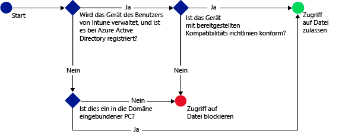

# Beschränken des Zugriffs auf SharePoint Online mit Microsoft Intune
Verwenden Sie den bedingten Zugriff von [!INCLUDE[wit_firstref](../includes/wit_firstref_md.md)], um den Zugriff auf Dateien zu steuern, die in SharePoint Online gespeichert sind.
Der bedingte Zugriff besteht aus zwei Komponenten:
- Eine Gerätekompatibilitätsrichtlinie, die das Gerät erfüllen muss, um als kompatibel bewertet zu werden.
- Eine Richtlinie für bedingten Zugriff, in der Sie die Bedingungen festlegen, die das Gerät erfüllen muss, um auf den Dienst zugreifen zu können.
Weitere Informationen zur Funktionsweise des bedingten Zugriffs finden Sie im Artikel [Beschränken des Zugriffs auf E-Mail, O365 und andere Dienste](restrict-access-to-email-and-o365-services-with-microsoft-intune.md).

Die Richtlinien für Konformität und bedingten Zugriff werden dem Benutzer bereitgestellt. Jedes Gerät, das der Benutzer zum Zugriff auf die Dienste verwendet, wird auf die Einhaltung der Richtlinien überprüft.

Wenn ein Benutzer versucht, mit einer unterstützten App wie z. B. OneDrive auf seinem Gerät eine Verbindung mit einer Datei herzustellen, erfolgt die folgende Auswertung:

>[!IMPORTANT]
>Der bedingte Zugriff für PCs und Windows 10 Mobile-Geräte mit Apps, die die moderne Authentifizierung verwenden, steht zurzeit nicht für alle Intune-Kunden zur Verfügung. Wenn Sie diese Funktionen bereits verwenden, müssen Sie keine weiteren Maßnahmen ergreifen. Sie können diese weiter verwenden.

>Wenn Sie keine Richtlinien für bedingten Zugriff für PCs oder Windows 10 Mobile-Geräte mit Apps, die die moderne Authentifizierung verwenden, erstellt haben und dies jetzt tun möchten, müssen Sie eine Anforderung übermitteln.  Allgemeine Informationen, Informationen zu bekannten Problemen sowie Informationen zum Zugriff auf dieses Feature finden Sie auf der [Connect-Website](http://go.microsoft.com/fwlink/?LinkId=761472).

**Bevor** Sie eine bedingte Zugriffsrichtlinie für SharePoint Online konfigurieren, müssen folgende Voraussetzungen erfüllt sein:
- Sie müssen über ein **SharePoint Online-Abonnement** verfügen, und Benutzer müssen für SharePoint Online lizenziert sein.
- Sie müssen über ein Abonnement für **Enterprise Mobility Suite** oder **Azure Active Directory Premium** verfügen.

  Zum Herstellen einer Verbindung mit den gewünschten Dateien muss das Gerät die folgenden Voraussetzungen erfüllen:
-   Es muss bei [!INCLUDE[wit_nextref](../includes/wit_nextref_md.md)] oder einem in die Domäne eingebundenen PC **registriert** sein.

-   Es muss in Azure Active Directory **registriert** sein (dies erfolgt automatisch bei der Registrierung des Geräts in [!INCLUDE[wit_nextref](../includes/wit_nextref_md.md)]).

-   Es muss mit allen bereitgestellten Kompatibilitätsrichtlinien von [!INCLUDE[wit_nextref](../includes/wit_nextref_md.md)] kompatibel sein.

Der Gerätestatus wird in Azure Active Directory gespeichert. Die Anwendung gewährt oder blockiert den Zugriff auf Dateien entsprechend den von Ihnen angegebenen Bedingungen.

Wenn eine Bedingung nicht erfüllt wird, erhält der Benutzer bei der Anmeldung die folgenden Meldungen:

-   Wenn das Gerät nicht bei [!INCLUDE[wit_nextref](../includes/wit_nextref_md.md)] oder in Azure Active Directory registriert ist, wird eine Meldung mit Anweisungen zum Installieren der Unternehmensportal-App und zum Registrieren des Geräts angezeigt.

-   Wenn das Gerät nicht kompatibel ist, wird eine Meldung angezeigt, die den Benutzer zum [!INCLUDE[wit_nextref](../includes/wit_nextref_md.md)]-Unternehmensportalwebsite oder zur Unternehmensportal-App weiterleitet. Dort findet der Benutzer Informationen zum Problem und zur Lösung.

**Bedingter Zugriff wird auf allen SharePoint-Websites erzwungen und externe Freigabe ist blockiert**

>[!NOTE]
>Wenn Sie den bedingten Zugriff für SharePoint Online aktivieren, sollten Sie die Domäne in der Liste wie im Thema [Remove-SPOTenantSyncClientRestriction](https://technet.microsoft.com/en-us/library/dn917451.aspx) beschrieben deaktivieren.  
## Unterstützung für mobile Geräte
- iOS 7.1 und höher
- Android 4.0 und höher, Samsung KNOX Standard 4.0 oder höher
- Windows Phone 8.1 und höher

Sie können den Zugriff auf SharePoint Online beschränken, wenn von einem Browser von **iOS**- und **Android**-Geräten aus zugegriffen wird.  Der Zugriff wird nur von unterstützten Browsern auf kompatiblen Geräten gewährt:
* Safari (iOS)
* Chrome (Android)
* Managed Browser (iOS und Android)

**Nicht unterstützte Browser werden blockiert**.

## Unterstützung für PCs
- Windows 8.1 und höher (bei Registrierung mit Intune)
- Windows 7.0 oder Windows 8.1 (bei Einbindung in eine Domäne)

  - In die Domäne eingebundene PCs müssen für die [automatische Registrierung](https://azure.microsoft.com/en-us/documentation/articles/active-directory-conditional-access-automatic-device-registration/) bei Azure Active Directory eingerichtet werden.
AAD DRS wird automatisch für Intune und Office 365-Kunden aktiviert. Kunden, die bereits den AD FS Device Registration Service bereitgestellt haben, sehen keine registrierten Geräte in ihrem lokalen Active Directory.

  - Wenn die Richtlinie das Beitreten zu einer Domäne erfordert und der PC nicht in die Domäne eingebunden ist, wird die Meldung angezeigt, dass der IT-Administrator kontaktiert werden sollte.

  - Wenn die Richtlinie das Beitreten zu einer Domäne oder Kompatibilität erfordert und der PC keine der Anforderungen erfüllt, wird eine Meldung mit einer Anleitung zum Installieren der Unternehmensportal-App und zur Registrierung angezeigt.
-    [Die moderne Authentifizierung von Office 365 muss aktiviert sein](https://support.office.com/en-US/article/Using-Office-365-modern-authentication-with-Office-clients-776c0036-66fd-41cb-8928-5495c0f9168a) und alle neuesten Office-Updates enthalten.

    Die moderne Authentifizierung ermöglicht Windows-Clients mit Office 2013 eine ADAL-basierte Anmeldung (Active Directory Authentication Library) und bietet größere Sicherheit durch **mehrstufige Authentifizierung** und **zertifikatbasierte Authentifizierung**.

## Konfigurieren des bedingten Zugriffs für SharePoint Online

### Schritt 1: Konfigurieren von Active Directory-Sicherheitsgruppen
Bevor Sie beginnen, konfigurieren Sie Azure Active Directory-Sicherheitsgruppen für die bedingte Zugriffsrichtlinien. Sie können diese Gruppen im **Office 365 Admin Center**oder **Intune-Kontenportal**konfigurieren. Diese Gruppen werden verwendet, um die Richtlinie auf Benutzer anzuwenden oder Benutzer von der Richtlinie auszunehmen. Bei Benutzern, für die eine Richtlinie gelten soll, muss jedes von ihnen verwendete Gerät die Richtlinie erfüllen, damit sie auf Ressourcen zugreifen können.

Sie können zwei Arten von Gruppentypen in einer SharePoint Online-Richtlinie angeben:

-   **Zielgruppen**: Gruppen von Benutzern, auf die die Richtlinie angewendet werden soll.

-   **Ausgenommene Gruppen**: Gruppen von Benutzern, die von der Richtlinie ausgenommen sind.

Benutzer, die in beiden Gruppen enthalten sind, werden von der Richtlinie ausgenommen.

### Schritt 2: Konfigurieren und Bereitstellen einer Kompatibilitätsrichtlinie
Falls noch nicht bereits geschehen, erstellen Sie für die Benutzer, auf die die SharePoint Online-Richtlinie angewendet werden soll, eine Kompatibilitätsrichtlinie und stellen Sie sie bereit.

> [!NOTE]
> Kompatibilitätsrichtlinien werden für [!INCLUDE[wit_nextref](../includes/wit_nextref_md.md)]-Gruppen bereitgestellt, Richtlinien für bedingten Zugriff dagegen werden auf Azure Active Directory-Sicherheitsgruppen angewendet.

Ausführliche Informationen zum Konfigurieren der Kompatibilitätsrichtlinie finden Sie unter [Erstellen einer Kompatibilitätsrichtlinie](create-a-device-compliance-policy-in-microsoft-intune.md).

> [!IMPORTANT]
> Wenn Sie keine Kompatibilitätsrichtlinie bereitgestellt haben, werden die Geräte als kompatibel ausgewertet.

Wenn Sie soweit sind, fahren Sie mit **Schritt 3**fort.

### Schritt 3: Konfigurieren der SharePoint Online-Richtlinie
Anschließend konfigurieren Sie die Richtlinie so, dass nur verwaltete und kompatible Geräte auf SharePoint Online zugreifen dürfen. Diese Richtlinie wird in Azure Active Directory gespeichert.

#### 

1.  Wählen Sie in der [Microsoft Intune-Verwaltungskonsole](https://manage.microsoft.com) **Richtlinie** > **Bedingter Zugriff** > **SharePoint Online-Richtlinie** aus.

2.  Wählen Sie **Richtlinie für bedingten Zugriff für SharePoint Online aktivieren** aus.

3.  Unter **Anwendungszugriff** können Sie optional eine Richtlinie für bedingten Zugriff auf Folgendes anwenden:

    -   **Alle Plattformen**

        Dies setzt voraus, dass jedes Gerät, das für den Zugriff auf **SharePoint Online** verwendet wird, in Intune registriert und mit den Richtlinien kompatibel ist.  Jede Clientanwendung, die die **moderne Authentifizierung** verwendet, unterliegt der Richtlinie für bedingten Zugriff. Wenn die Plattform zurzeit von Intune nicht unterstützt wird, ist der Zugriff auf **SharePoint** blockiert.

        Das Auswählen der Option **Alle Plattformen** bedeutet, dass Azure Active Directory diese Richtlinie auf alle Authentifizierungsanforderungen anwendet, ungeachtet der von der Clientanwendung gemeldeten Plattform.  Alle Plattformen müssen registriert und kompatibel sein, mit Ausnahme von:
        *   Windows-Geräten. Diese müssen registriert werden und kompatibel sein, mit der lokalen Active Directory-Domäne verknüpft sein oder beides
        * nicht unterstützten Plattformen wie Mac.  Allerdings werden Apps, die die moderne Authentifizierung von diesen Plattformen verwenden, weiterhin blockiert.
        >[!TIP]
        >Wenn Sie den bedingten Zugriff für PCs nicht bereits verwenden, wird Ihnen diese Option möglicherweise nicht angezeigt.  Verwenden Sie stattdessen die Option **Spezifische Plattformen**, Der bedingte Zugriff für PCs steht zurzeit nicht allen Intune-Kunden zur Verfügung.   Allgemeine Informationen, Informationen zu bekannten Problemen sowie Informationen zum Zugriff auf dieses Feature finden Sie auf der [Microsoft Connect-Website](http://go.microsoft.com/fwlink/?LinkId=761472).

    -   **Bestimmte Plattformen**

         Die Richtlinie für bedingten Zugriff wird auf jede Client-App angewendet, die die moderne Authentifizierung auf den von Ihnen festgelegten Plattformen verwendet.

     Bei Windows-PCs muss der PC entweder in die Domäne eingebunden oder bei [!INCLUDE[wit_nextref](../includes/wit_nextref_md.md)] registriert und kompatibel sein. Sie können die folgenden Anforderungen festlegen:

     -   **Geräte müssen in eine Domäne eingebunden oder kompatibel sein.** Wählen Sie diese Option aus, wenn Sie festlegen möchten, dass die PCs entweder in die Domäne eingebunden oder mit den in [!INCLUDE[wit_nextref](../includes/wit_nextref_md.md)] festgelegten Richtlinien kompatibel sein sollen. Wenn der PC keine der Anforderungen erfüllt, wird der Benutzer aufgefordert, das Gerät bei [!INCLUDE[wit_nextref](../includes/wit_nextref_md.md)] zu registrieren.

     -   **Geräte müssen in eine Domäne eingebunden sein.** Wählen Sie diese Option aus, wenn Sie festlegen möchten, dass die PCs für den Zugriff auf Exchange Online in die Domäne eingebunden sein müssen. Wenn der Computer in keine Domäne eingebunden ist, wird der E-Mail-Zugriff blockiert und der Benutzer aufgefordert, den IT-Administrator zu kontaktieren.

     -   **Geräte müssen kompatibel sein.** Wählen Sie diese Option aus, wenn Sie festlegen möchten, dass die PCs bei [!INCLUDE[wit_nextref](../includes/wit_nextref_md.md)] registriert und kompatibel sein. Wenn der PC nicht registriert ist, wird eine Meldung mit Anweisungen zur Registrierung angezeigt.

4.   Unter **Browserzugriff** auf SharePoint Online und OneDrive for Business können Sie auswählen, dass der Zugriff auf Exchange Online ausschließlich über unterstützte Browser gewährt werden soll: Safari (iOS) und Chrome (Android). Der Zugriff von anderen Browsern aus wird blockiert.  Die gleichen Plattformeinschränkungen, die Sie für den Anwendungszugriff für OneDrive ausgewählt haben, gelten auch hier.

  Auf **Android**-Geräten müssen die Benutzer den Browserzugriff aktivieren.  Zu diesem Zweck müssen Endbenutzer die Option „Browserzugriff aktivieren“ auf dem registrierten Gerät wie folgt aktivieren:
  1.    Starten Sie die **Unternehmensportal-App**.
  2.    Wechseln Sie über die Schaltfläche mit den drei Punkten (...) oder über „Hardwaremenü“ zur Seite **Einstellungen**.
  3.    Klicken Sie auf die Schaltfläche **Browserzugriff aktivieren**.
  4.  Melden Sie sich im Chrome-Browser aus Office 365 ab, und starten Sie Chrome neu.

  Auf **iOS- und Android**-Plattformen stellt Azure Active Directory ein Transport Layer Security-Zertifikat (TLS) für das Gerät aus, das für den Zugriff auf den Dienst verwendet wird, damit es identifiziert werden kann.  Das Gerät zeigt den Endbenutzern das Zertifikat zusammen mit einer Eingabeaufforderung zur Auswahl des Zertifikats an, wie in den nachstehenden Screenshots dargestellt. Die Endbenutzer müssen dieses Zertifikat auswählen, bevor sie den Browser weiter verwenden können.

  **iOS**

  

  **Android**

  
5.  Wählen Sie unter **Zielgruppen** **Ändern** aus, um die Azure Active Directory-Sicherheitsgruppen auszuwählen, für die die Richtlinie gelten soll. Sie können dies für alle Benutzer oder nur für ausgewählte Benutzergruppen festlegen.

6.  Wählen Sie unter **Exempted Groups** (Ausgenommene Gruppen) optional **Ändern**, um die Azure Active Directory-Sicherheitsgruppen auszuwählen, die von dieser Richtlinie ausgenommen werden.

6.  Wählen Sie abschließend **Speichern** aus.

Die Richtlinie für bedingten Zugriff wird sofort wirksam und muss nicht explizit bereitgestellt werden.

### Schritt 4: Überwachen der Richtlinien für Kompatibilität und bedingten Zugriff
Im Arbeitsbereich **Gruppen** können Sie den Status Ihrer Geräte anzeigen.

Wählen Sie eine beliebige Gruppe von Mobilgeräten und dann auf der Registerkarte **Geräte** einen der folgenden **Filter**aus:

-   **Geräte, die nicht bei AAD registriert sind** : Diese Geräte werden für SharePoint Online blockiert.

-   **Geräte, die nicht kompatibel sind** : Diese Geräte werden für SharePoint Online blockiert.

-   **Geräte, die bei AAD registriert und kompatibel sind** : Diese Geräte können auf SharePoint Online zugreifen.

### Weitere Informationen:
[Beschränken des Zugriffs auf E-Mail- und Office 365-Dienste mit Microsoft Intune](restrict-access-to-email-and-o365-services-with-microsoft-intune.md)

<!--HONumber=Jul16_HO3-->

