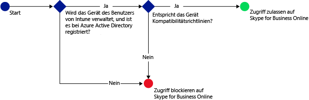
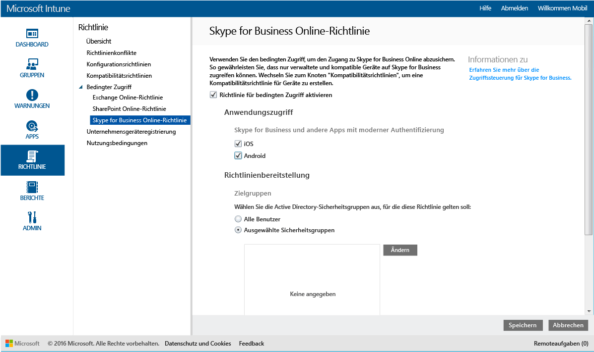

# Beschränken des Zugriffs auf Skype for Business Online mit Microsoft Intune
Verwenden Sie die Richtlinie für bedingten Zugriff für **Skype for Business Online** zum Steuern des Zugriffs auf Skype for Business Online.
Der bedingte Zugriff besteht aus zwei Komponenten:
- Eine Gerätekompatibilitätsrichtlinie, die das Gerät erfüllen muss, um als kompatibel bewertet zu werden.
- Eine Richtlinie für bedingten Zugriff, in der Sie die Bedingungen festlegen, die das Gerät erfüllen muss, um auf den Dienst zugreifen zu können.
Weitere Informationen zur Funktionsweise des bedingten Zugriffs finden Sie im Artikel [Beschränken des Zugriffs auf E-Mail- und Office 365-Dienste](restrict-access-to-email-and-o365-services-with-microsoft-intune.md).

Wenn ein Benutzer, für den der bedingte Zugriff gilt, versucht, Skype for Business Online auf seinem Gerät zu verwenden, erfolgt folgende Auswertung:

**Bevor** Sie eine bedingte Zugriffsrichtlinie für Skype for Business Online konfigurieren, müssen folgende Voraussetzungen erfüllt sein:
- Sie müssen über ein **Skype for Business Online-Abonnement** verfügen und Benutzern Skype for Business Online-Lizenzen zuweisen.
- Sie müssen über ein Abonnement für **Enterprise Mobility Suite** oder **Azure Active Directory Premium** verfügen.
-   [Aktivieren Sie die moderne Authentifizierung](https://docs.microsoft.com/en-us/intune/deploy-use/restrict-access-to-skype-for-business-online-with-microsoft-intune) für Skype for Business Online. 
-  All Ihre Endbenutzer müssen **Skype for Business Online** verwenden. Wenn in Ihrer Bereitstellung sowohl Skype for Business Online als auch lokales Skype for Business verwendet werden, wird die Richtlinie für bedingten Zugriff nicht auf Endbenutzer angewendet.

    Für das Gerät, dass Zugriff auf Skype for Business Online benötigt, müssen folgende Voraussetzungen erfüllt sein:

-   Es muss sich um ein **Android**- oder **iOS**-Gerät handeln.

-   Bei [!INCLUDE[wit_nextref](../includes/wit_nextref_md.md)] **registriert**.

-   Es muss mit allen bereitgestellten [!INCLUDE[wit_nextref](../includes/wit_nextref_md.md)]-Kompatibilitätsrichtlinien **kompatibel** sein.

Der Gerätestatus wird in Azure Active Directory gespeichert, wo der Zugriff entsprechend den von Ihnen angegebenen Bedingungen gewährt oder blockiert wird.

Wenn eine Bedingung nicht erfüllt wird, erhält der Benutzer bei der Anmeldung die folgenden Meldungen:

-   Wenn das Gerät nicht bei [!INCLUDE[wit_nextref](../includes/wit_nextref_md.md)] oder in Azure Active Directory registriert ist, wird eine Meldung mit Anweisungen zum Installieren der Unternehmensportal-App und zum Registrieren des Geräts angezeigt.

-   Wenn das Gerät nicht kompatibel ist, wird eine Meldung angezeigt, die den Benutzer zur [!INCLUDE[wit_nextref](../includes/wit_nextref_md.md)]-Unternehmensportalwebsite oder zur Unternehmensportal-App weiterleitet. Dort findet der Benutzer Informationen zum Problem und zur Lösung.

## Konfigurieren des bedingten Zugriffs für Skype for Business Online

### Schritt 1: Konfigurieren von Active Directory-Sicherheitsgruppen
Bevor Sie beginnen, konfigurieren Sie Azure Active Directory-Sicherheitsgruppen für die bedingte Zugriffsrichtlinien. Sie können diese Gruppen im **Office 365 Admin Center** konfigurieren. Diese Gruppen werden verwendet, um die Richtlinie auf Benutzer anzuwenden oder Benutzer von der Richtlinie auszunehmen. Bei Benutzern, für die eine Richtlinie gelten soll, muss jedes von ihnen verwendete Gerät die Richtlinie erfüllen, damit sie auf Ressourcen zugreifen können.

Sie können zwei Gruppen angeben, die für die Skype for Business-Richtlinie verwendet werden können:

-   **Zielgruppen**: Gruppen von Benutzern, auf die die Richtlinie angewendet werden soll.

-   **Ausgenommene Gruppen**: Gruppen von Benutzern, die von der Richtlinie ausgenommen sind.

Benutzer, die in beiden Gruppen enthalten sind, werden von der Richtlinie ausgenommen.

### Schritt 2: Konfigurieren und Bereitstellen einer Kompatibilitätsrichtlinie
Sie müssen eine Kompatibilitätsrichtlinie [erstellen](create-a-device-compliance-policy-in-microsoft-intune.md) und auf allen Geräten [bereitstellen](deploy-and-monitor-a-device-compliance-policy-in-microsoft-intune.md), die von der Richtlinie betroffen sind. Dies sind alle Geräte, die von den Benutzern in den **Zielgruppen** verwendet werden.

> [!NOTE] Kompatibilitätsrichtlinien werden für [!INCLUDE[wit_nextref](../includes/wit_nextref_md.md)]-Gruppen bereitgestellt, Richtlinien für bedingten Zugriff dagegen werden auf Azure Active Directory-Sicherheitsgruppen angewendet.

> [!IMPORTANT] Wenn Sie keine Kompatibilitätsrichtlinie bereitgestellt haben, werden die Geräte als kompatibel ausgewertet.

Wenn Sie soweit sind, fahren Sie mit **Schritt 3**fort.

### Schritt 3: Konfigurieren der Skype for Business Online-Richtlinie
Jetzt konfigurieren Sie die Richtlinie so, dass nur verwaltete und kompatible Geräte auf Skype for Business Online zugreifen dürfen. Diese Richtlinie wird in Azure Active Directory gespeichert.

####
1.  Klicken Sie in der [Microsoft Intune-Verwaltungskonsole](https://manage.microsoft.com) auf **Richtlinie** > **Bedingter Zugriff** > **Skype for Business Online-Richtlinie**.

2.  Wählen Sie **Richtlinie für bedingten Zugriff aktivieren** aus.

3.  Unter **Anwendungszugriff** können Sie optional eine Richtlinie für bedingten Zugriff auf Folgendes anwenden:

    -   **iOS**

    -   **Android**

4.  Klicken Sie unter **Zielgruppen**auf **Ändern** , um die Active Directory-Sicherheitsgruppen auszuwählen, für die die Richtlinie gelten soll. Sie können dies für alle Benutzer oder nur für eine ausgewählte Benutzergruppe festlegen.

5.  Klicken Sie unter **Ausgenommene Gruppen**optional auf **Ändern** , um die Active Directory-Sicherheitsgruppen auszuwählen, die von dieser Richtlinie ausgenommen werden.

6.  Klicken Sie abschließend auf **Speichern**.

Sie haben jetzt den bedingten Zugriff für Skype for Business Online konfiguriert. Die Richtlinie für bedingten Zugriff wird sofort wirksam und muss nicht explizit bereitgestellt werden.

## Überwachen der Richtlinien für Konformität und bedingten Zugriff
Im Arbeitsbereich **Gruppen** können Sie den Status beim bedingten Zugriff Ihrer Geräte anzeigen.

Wählen Sie eine beliebige Gruppe von Mobilgeräten und dann auf der Registerkarte **Geräte** einen der folgenden **Filter**aus:

* **Geräte, die nicht bei AAD registriert sind**: Diese Geräte werden für Skype for Business Online blockiert.

* **Geräte, die nicht kompatibel sind**: Diese Geräte werden für Skype for Business Online blockiert.

* **Geräte, die bei AAD registriert und kompatibel sind**: Diese Geräte können auf Skype for Business Online zugreifen.

<!--HONumber=Jun16_HO3-->

