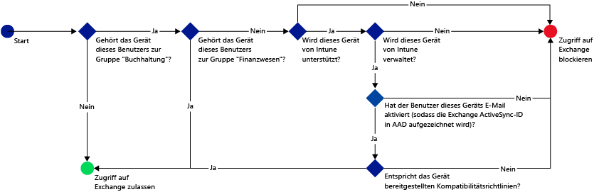
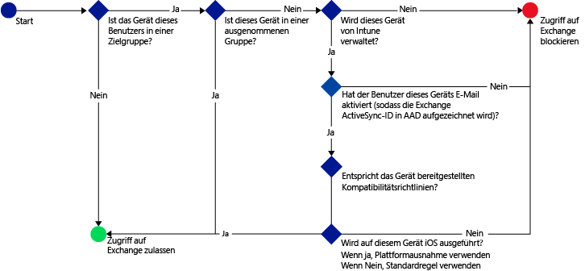
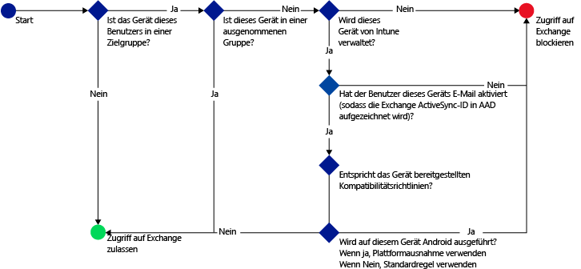

# Beschränken des E-Mail-Zugriffs mit Microsoft Intune: Beispielszenarien

## Blockieren des Zugriffs auf Exchange Online durch Benutzer nicht kompatibler Geräte
### Anforderungen für das Szenario
- Der Zugriff auf Exchange Online muss für alle Benutzer in der Active Directory-Sicherheitsgruppe **Accounting** blockiert werden, wenn das verwendete Gerät einer von Ihnen bereitgestellten Kompatibilitätsrichtlinie nicht entspricht.
- Wenn in dieser Gruppe Benutzer vorhanden sind, deren Geräte von [!INCLUDE[wit_nextref](../includes/wit_nextref_md.md)] nicht unterstützt werden, muss der Zugriff auf Exchange Online über diese Geräte blockiert werden.
- Benutzer in der Active Directory-Sicherheitsgruppe **Finance** müssen von der Richtlinie ausgenommen werden, auch wenn sie sich ebenfalls in der Sicherheitsgruppe **Accounting** befinden.

Um dies zu erreichen, konfigurieren Sie eine Richtlinie für bedingten Zugriff für Exchange Online mit folgenden Einstellungen:

-   Wählen Sie **Richtlinie für bedingten Zugriff aktivieren** aus.

- Wählen Sie die Plattformen aus, auf denen Sie Zugriff über Apps mit moderner Authentifizierung zulassen möchten.
- Wählen Sie für Exchange ActiveSync-Apps **Nicht kompatible Geräte auf Plattformen blockieren, die von Microsoft Intune unterstützt werden** und **Alle weiteren Geräte auf Plattformen blockieren, die nicht von Microsoft Intune unterstützt werden**.
-   Wählen Sie im Abschnitt **Zielgruppe** unter **Ausgewählte Sicherheitsgruppen** die Benutzergruppe **Accounting** aus.

-   Wählen Sie im Abschnitt **Ausgenommen Gruppe** unter **Ausgewählte Sicherheitsgruppen** die Benutzergruppe **Finance** aus.

Der folgende Ablauf wird verwendet, um zu entscheiden, welche Geräte auf Exchange Online zugreifen können:

## Alle iOS-Geräte, die auf lokales Exchange zugreifen, müssen von Intune verwaltet werden
### Anforderungen für das Szenario
- Nur Geräten, auf denen iOS ausgeführt wird, sollte Zugriff auf lokales Exchange gewährt werden.
- Die Geräte müssen auch bei Intune registriert sein und die Regeln der Kompatibilitätsrichtlinie erfüllen, bevor sie für den Zugriff auf Exchange verwendet werden können.

Um dies zu erreichen, konfigurieren Sie die folgende Richtlinie für bedingten Zugriff für lokales Exchange mit folgenden Einstellungen:

-   Wählen Sie die Option **Zugriff auf lokales Exchange von E-Mail-Apps blockieren, wenn das Gerät nicht kompatibel oder nicht bei Microsoft Intune registriert ist**. Wenn Sie diese Option auswählen, wird die Richtlinie für bedingten Zugriff aktiviert, die erfordert, dass alle Geräte bei Microsoft Intune registriert sein und die Regeln der Kompatibilitätsrichtlinie erfüllen müssen, bevor sie auf Exchange zugreifen können.

-   Erstellen Sie für die erweiterten Exchange ActiveSync-Einstellungen Folgendes:

  -   Eine Plattformausnahme, die Geräten mit iOS erlaubt, auf Exchange zuzugreifen.   

  -   Eine Standardregel, die festlegt, dass der Zugriff auf Exchange über ein Gerät, das nicht durch die Plattformausnahmeregel abgedeckt ist, blockiert werden soll. Diese Regel stellt sicher, dass der Zugriff auf Exchange über Geräte, auf denen iOS nicht ausgeführt wird, blockiert wird.

Der folgende Ablauf wird verwendet, um zu entscheiden, welche Geräte auf Exchange zugreifen können:

## Kein Android-Gerät darf auf lokales Exchange zugreifen
### Anforderungen für das Szenario
- Der Zugriff auf Exchange soll für alle Android-Geräte blockiert werden.
- Alle anderen unterstützten Geräte können auf Exchange zugreifen, solange sie von [!INCLUDE[wit_nextref](../includes/wit_nextref_md.md)] verwaltet werden.

Um dies zu erreichen, konfigurieren Sie eine Richtlinie für bedingten Zugriff für lokales Exchange mit folgenden Einstellungen:

-   Wählen Sie die Option **Zugriff auf lokales Exchange von E-Mail-Apps blockieren, wenn das Gerät nicht kompatibel oder nicht bei Microsoft Intune registriert ist**. Durch Auswahl dieser Option wird festgelegt, dass alle Geräte bei Intune registriert sein und die Regeln der Kompatibilitätsrichtlinie erfüllen müssen.

- Erstellen Sie für die erweiterten Exchange ActiveSync-Einstellungen Folgendes:
  -   Eine Plattformausnahme, die den Zugriff auf Exchange über Android-Geräte blockiert. Diese Regel stellt sicher, dass Android-Geräte nicht für den Zugriff auf Exchange verwendet werden können.

  -   Eine Standardregel, die angibt, dass ein Gerät für den Zugriff auf Exchange zugelassen werden soll, wenn es nicht durch andere Regeln abgedeckt wird. Diese Standardregel stellt sicher, dass Geräte, auf denen andere Plattformen als Android ausgeführt werden, die aber von Microsoft Intune unterstützt werden, für den Zugriff auf Exchange verwendet werden können. Sie müssen jedoch bei Intune registriert sein und die Regeln der Kompatibilitätsrichtlinie erfüllen.

Der folgende Ablauf wird verwendet, um zu entscheiden, welche Geräte auf Exchange zugreifen können:

<!--HONumber=Jun16_HO4-->

