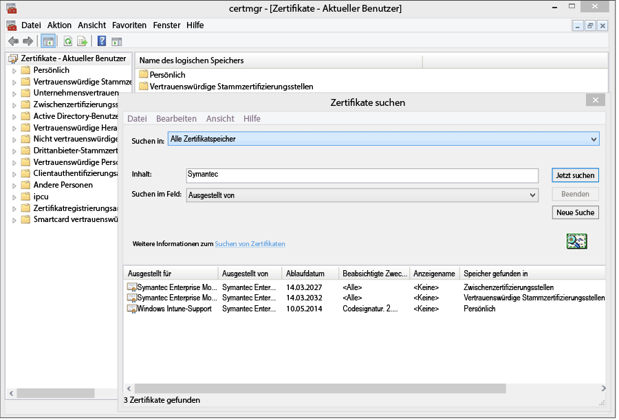
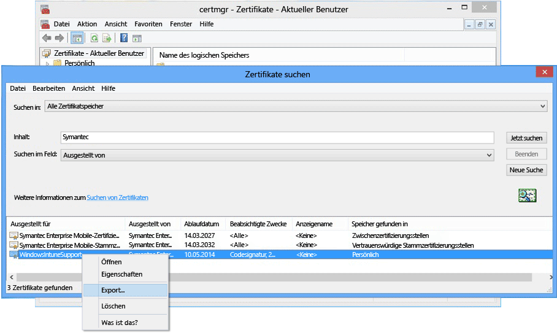

# Einrichten der Geräteverwaltung für Windows Phone 8.0

Windows Phone 8.0 erfordert ein Symantec-Zertifikat, damit die Intune-Unternehmensportal-App installiert und die Geräteverwaltung ermöglicht werden kann. Ein Zertifikat ist auch zum Signieren branchenspezifischer Apps erforderlich. Das folgende Thema gilt nur für Windows Phone 8.0. Informationen zum Verwaltung von Windows Phone 8.1 oder höher (einschließlich Windows 10 Mobile) finden Sie unter [Einrichten der Windows Phone-Registrierung](set-up-windows-phone-management-with-microsoft-intune.md).

> [!IMPORTANT]
> Ab September 2016 kann die Unternehmensportal-App für Windows 8.0 und Windows Phone 8.0 nicht mehr heruntergeladen werden.

-   **Windows Phone 8**: Zertifikat erforderlich
-   **Windows Phone 8.1 und Windows 10 Mobile** erfordern nur ein Zertifikat, wenn Folgendes gilt:

    -   Sie möchten die Unternehmensportal-App mit Intune bereitstellen.

    -   Sie stellen Branchen-Apps bereit (auch als Sideload-Apps bezeichnet).


  > [!IMPORTANT]
  > Das zur Verwaltung bestimmter mobiler Windows- und Windows Phone-Geräte verwendete Symantec-Zertifikat [muss regelmäßig erneuert werden](renew-a-symantec-code-signing-certificate.md).

Die Setupanforderungen für die Verwaltung von Windows Phone-Mobilgeräten hängen davon ab, wie Sie die Geräte verwalten möchten.  Das Festlegen von zwei CNAMEs in der DNS-Registrierung Ihres Unternehmens erleichtert die Registrierung für die Benutzer. Wenn Ihre Benutzer die Unternehmensportal-App aus dem Store herunterladen, müssen Sie nach dem Konfigurieren der DNS-Einstellungen nur noch das Unternehmensportal einrichten und den Benutzern erklären, wie sie sich registrieren können.  Für Windows Phone 8.0 oder für Windows Phone 8.1 benötigen Sie zur Bereitstellung des Unternehmensportals ein Symantec-Zertifikat, um die App mit einer Codesignatur zu versehen.

## Konfigurieren der Einrichtungsanforderungen zum Aktivieren der Windows Phone-Verwaltung
1.  **Einrichten von Intune** Falls nicht bereits geschehen, bereiten Sie die Verwaltung mobiler Geräte durch [Festlegen der Autorität für die Verwaltung mobiler Geräte](get-ready-to-enroll-devices-in-microsoft-intune.md#set-mobile-device-management-authority) auf **Microsoft Intune** vor.

2.  **Festlegen eines DNS-Alias für die Adresse des Registrierungsservers** (optional)

    Wenn ein DNS-Alias (CNAME-Datensatztyp) vorhanden ist, können Benutzer ihre Geräte einfacher registrieren, da der Servername bei der Registrierung bereits automatisch aufgefüllt wird.

    1.  Klicken Sie in der [Intune-Verwaltungskonsole](http://manage.microsoft.com) auf **Verwaltung** &gt; **Verwaltung mobiler Geräte** &gt; **Windows Phone**.

    2.  Geben Sie die URL der überprüften Domäne der Unternehmenswebsite in das Feld **Verifizierten Domänennamen eingeben** ein, und klicken Sie dann auf **Automatische Erkennung testen**.

    3.  Erstellen Sie **CNAME**-DNS-Ressourceneinträge für die Domäne des Unternehmens. Die CNAME-Ressourceneinträge müssen die folgenden Informationen enthalten:

        |Hostname|Verweist auf|TTL|
        |-------------|-------------|-------|
        |enterpriseenrollment.company_domain.com|enterpriseenrollment-s.manage.microsoft.com |1 Stunde|
        |enterpriseregistration.company_domain.com|enterpriseregistration.windows.net|1 Stunde|
        Wenn der Name Ihrer Unternehmens-Website beispielsweise contoso.com lautet, erstellen Sie einen CNAME in DNS, von dem EnterpriseEnrollment.contoso.com an manage.microsoft.com umgeleitet wird. Existieren mehrere überprüfte Domänen, erstellen Sie einen CNAME-Eintrag für jede Domäne.

        -   `enterpriseenrollment-s.manage.microsoft.com` – Unterstützt eine Umleitung zum Intune-Dienst mit Domänenerkennung anhand des E-Mail-Domänennamens

        -   `enterpriseregistration.windows.net` – Unterstützt eine Arbeitsbereichverknüpfung für mobile Geräte. Der bedingte Zugriff auf Windows 8.1 wird ebenfalls unterstützt.

    

3.  **Zertifikatsverwaltung zur Unterstützung der App-Signierung** [Erforderlich für Windows Phone 8.0 und Windows Phone 8.1, da damit kein Zugriff auf den Windows Phone Store erfolgt und/oder keine branchenspezifischen Apps benötigen werden.]

    Zur Unterstützung der Unternehmensportal-App für Windows Phone 8.0 und zur Bereitstellung von Unternehmens-Apps für Windows Phone 8.1 benötigen Sie ein **Symantec Enterprise Mobile Code Signing Certificate**. Sie können kein Zertifikat verwenden, das von Ihrer eigenen Zertifizierungsstelle ausgestellt wurde, da für Windows Phone-Geräte nur das Symantec-Zertifikat vertrauenswürdig ist. Dieses Zertifikat ist für folgende Zwecke erforderlich:

    -   Signieren einer Unternehmensportal-App zur Bereitstellung in [!INCLUDE[winphone8_client_1](../includes/winphone8_client_1_md.md)] für Registrierung und Telefonverwaltung

    -   Signieren von Branchen-Apps eines Unternehmens, sodass [!INCLUDE[wit_nextref](../includes/wit_nextref_md.md)] sie für Windows Phones bereitstellen kann

    Mithilfe der folgenden Schritte können Sie die erforderlichen Zertifikate bereitstellen und die Unternehmensportal-App signieren. Sie benötigen ein Windows Phone Dev Center-Konto, und Sie müssen ein Symantec-Zertifikat erwerben.

    1.  **Registrieren beim Windows Phone Dev Center** Registrieren Sie sich mithilfe von Unternehmenskontodaten beim [Windows Phone Dev Center](http://go.microsoft.com/fwlink/?LinkId=268442), wenn Sie sich anmelden, um Ihr Unternehmenskonto zu erwerben. Diese Anforderung muss von einem Mitglied der Geschäftsleitung autorisiert werden, bevor Sie ein Codesignaturzertifikat erhalten.

    2.  **Beziehen eines Symantec-Zertifikats für Unternehmen** Erwerben Sie unter Verwendung Ihrer Symantec-ID ein Zertifikat von der [Symantec-Website](http://go.microsoft.com/fwlink/?LinkId=268441). Nach dem Kauf des Zertifikats erhält die genehmigende Person in Ihrem Unternehmen, die Sie in Ihrem Windows Phone Dev Center-Konto bestimmt haben, eine E-Mail, in der die Genehmigung der Zertifikatanforderung angefordert wird. Weitere Informationen zu den Anforderungen des Symantec-Zertifikats finden Sie unter [Warum ist für Windows Phone ein Symantec-Zertifikat erforderlich?](https://technet.microsoft.com/en-us/library/dn764959.aspx#BKMK_Symantec) in den häufig gestellten Fragen zur Windows-Geräteregistrierung.

    3.  **Importieren von Zertifikaten** Nachdem die Anforderung genehmigt wurde, erhalten Sie eine E-Mail mit Anweisungen zum Importieren von Zertifikaten. Führen Sie die Anweisungen in der E-Mail aus, um die Zertifikate zu importieren.

    4.  **Überprüfen der importierten Zertifikate** Um zu überprüfen, ob die Zertifikate einwandfrei importiert wurden, navigieren Sie zum Snap-In **Zertifikate**. Klicken Sie mit der rechten Maustaste auf **Zertifikate**, und wählen Sie anschließend **Zertifikate suchen**. Geben Sie „Symantec“ in das Feld **Enthält** ein, und klicken Sie auf **Jetzt suchen**. Die importierten Zertifikate werden in den Ergebnissen angezeigt.

        

    5.  **Exportieren eines Signaturzertifikats** Wenn Sie überprüft haben, dass die Zertifikate vorhanden sind, können Sie die PFX-Datei exportieren, um das Unternehmensportal zu signieren. Wählen Sie das Symantec-Zertifikat mit „Codesignatur“ für **Beabsichtigter Zweck** aus. Klicken Sie mit der rechten Maustaste auf das Codesignaturzertifikat, und wählen Sie **Exportieren** aus.

        

        Wählen Sie im **Assistenten zum Exportieren von Zertifikaten**die Option **Ja, privaten Schlüssel exportieren** aus, und klicken Sie dann auf **Weiter**. Wählen Sie die Option **Privater Informationsaustausch –PKCS #12 (.PFX)** aus, und aktivieren Sie das Kontrollkästchen **Möglichst alle Zertifikate im Zertifizierungspfad berücksichtigen**. Schließen Sie den Assistenten ab. Weitere Informationen finden Sie unter [Exportieren eines Zertifikats mit dem privaten Schlüssel](http://go.microsoft.com/fwlink/?LinkID=203031).

    6.  **Herunterladen und Signieren der Unternehmensportal-App**

        Damit die Windows Phone-Registrierung unterstützt wird, muss die Unternehmensportal-App für Windows Phone 8.0 signiert und in Intune hochgeladen werden.

        1.  **Herunterladen des Unternehmensportals** Laden Sie das [Intune-Unternehmensportal für Windows Phone](http://go.microsoft.com/fwlink/?LinkId=268440) aus dem Download Center herunter. Der Standardinstallationspfad lautet `C:\Program Files (x86)\Microsoft Corporation\Windows Intune Company Portal for Windows Phone`.

        2.  **Herunterladen des Windows Phone 8.0 SDK** Laden Sie das [Windows Phone SDK](http://go.microsoft.com/fwlink/?LinkId=615570) herunter.

        3.  **Erstellen einer Codesignatur für die Unternehmensportal-App** Verwenden Sie die App XAPSignTool, die Sie mit dem SDK heruntergeladen haben, um das Unternehmensportal mit der PFX-Datei zu signieren, die Sie anhand des Symantec-Zertifikats erstellt haben. Weitere Informationen dazu finden Sie unter [Signieren einer Unternehmens-App mit dem Tool XapSignTool](http://go.microsoft.com/fwlink/?LinkID=280195).

    7.  **Hochladen der App in Intune** Laden Sie die signierte Unternehmensportal-App-Datei und Ihr Codesignaturzertifikat hoch, um die App den Endbenutzern zur Verfügung zu stellen.

        1.  Klicken Sie in der [Intune-Verwaltungskonsole](http://manage.microsoft.com) auf **Verwaltung** &gt; **Windows Phone**.

        2.  Klicken Sie auf **Signierte App-Datei hochladen**, und melden Sie sich mit Ihrer Intune-Administrator-ID an.

        3.  Navigieren Sie auf der Seite **Softwaresetup** für **Den Speicherort der Softwaresetupdateien angeben** zum Speicherort der codesignierten Unternehmensportal-App (XAP für Windows Phone 8.0 oder APPX für Windows Phone 8.1).

            Wenn Sie Intune testen und eine codesignierte App-Datei in ein Intune-Testkonto hochladen, deaktivieren Sie das Kontrollkästchen **Verwenden Sie die mit dem Symantec-Codesignaturbeispielzertifikat signierte Unternehmensportal-App-Datei**.

        4.  Fügen Sie die Zertifikatdatei (.pfx) hinzu, die Sie in das **Codesignaturzertifikat** exportiert haben, und erstellen Sie ein Kennwort für das Zertifikat.

        5.  Füllen Sie die Felder auf der Seite **Softwarebeschreibung** aus. Denken Sie daran, dass Benutzer diese Informationen auf ihren Geräten sehen, wenn sie Details zur App im Unternehmensportal aufrufen.

        6.  Schließen Sie den Assistenten ab. Benutzer, die ein Windows Phone 8.0-Gerät registrieren, erhalten nun die Unternehmensportal-App auf ihren Geräten bei der Registrierung. Windows Phone 8.1-Benutzer können die Unternehmensportal-App mit der Speicherversion des Unternehmensportals installieren.  Wenn Windows Phone 8.1-Geräte im Windows Phone Store blockiert sind oder Sie mithilfe von Intune die Unternehmensportal-App bereitstellen möchten, laden Sie die Unternehmensportal-App für Windows Phone 8.1 (SSP.appx) herunter, und signieren sie.

4.  **Erläutern des Zugriffs auf Unternehmensressourcen über das Unternehmensportal** Ihre Benutzer müssen wissen, wie sie ihre Geräte registrieren können und was sie erwartet, wenn die Geräte in die Verwaltung eingebunden sind. [Informieren der Endbenutzer über den Einsatz von Microsoft Intune](what-to-tell-your-end-users-about-using-microsoft-intune.md)

## Bereitstellen der Unternehmensportal-App von Windows Phone 8.1
Sie können die Unternehmensportal-App für Windows Phone 8.1-Geräte mit Intune bereitstellen, statt sie über den Windows Phone Store zu installieren. Dennoch müssen Sie die Windows Phone-Geräteregistrierung anhand der obigen Schritte mithilfe des Symantec-Zertifikats aktivieren. Anschließend müssen Sie die Windows Phone 8.1-Unternehmensportal-App herunterladen und sie mit Ihrem Symantec-Zertifikat signieren.  Dies ist nur erforderlich, wenn Ihre Benutzer nicht den Store des Unternehmens verwenden und Sie das Unternehmensportal für Windows Phone 8.1-Geräte bereitstellen möchten.


1.  **Herunterladen des Unternehmensportals**

    Laden Sie die [Microsoft Intune-Unternehmensportal-App für Windows Phone 8.1](http://go.microsoft.com/fwlink/?LinkId=615799) aus dem Download Center herunter, und führen Sie die selbstextrahierende Datei (.exe) aus. Diese Datei enthält zwei Dateien:

    -   CompanyPortal.appx: Die Installations-App des Unternehmensportals für Windows Phone 8.1

    -   WinPhoneCompanyPortal.ps1: Ein PowerShell-Skript, das Sie verwenden können, um die Unternehmensportal-App-Datei zu signieren, sodass sie für Windows Phone 8.1-Geräte bereitgestellt werden kann

2.  **Herunterladen des Windows Phone SDK** Laden Sie [Windows Phone SDK 8.0](http://go.microsoft.com/fwlink/?LinkId=615570) herunter (http://go.microsoft.com/fwlink/?LinkId=268439), und installieren Sie das SDK auf Ihrem Computer. Dieses SDK ist erforderlich, um ein Anwendungsregistrierungstoken zu generieren.

3.  **Generieren einer AETX-Datei** Generieren Sie aus der Symantec PFX-Datei eine Anwendungsregistrierungstoken-Datei (.aetx) mithilfe von AETGenerator.exe. Dieses Tool ist Teil von Windows Phone SDK 8.0. Eine Anleitung zum Erstellen einer AETX-Datei finden Sie im Abschnitt über das [Generieren eines Anwendungsregistrierungstokens für Windows Phone](https://msdn.microsoft.com/library/windows/apps/jj735576.aspx).

4.  **Herunterladen des Windows SDK für Windows 8.1** Laden Sie das [Windows Phone SDK](http://go.microsoft.com/fwlink/?LinkId=613525) herunter (http://go.microsoft.com/fwlink/?LinkId=613525), und installieren Sie es. Beachten Sie, dass das in der Unternehmensportal-App verwendete PowerShell-Skript den Standardinstallationsort `${env:ProgramFiles(x86)}\Windows Kits\8.1`nutzt. Wenn Sie die App an einem anderen Ort installieren möchten, beziehen Sie den Speicherort in einem Cmdlet-Parameter ein.

5.  **Codesignieren der App mithilfe von PowerShell** Öffnen Sie als Administrator **Windows PowerShell** auf dem Hostcomputer, auf dem Windows SDK mit dem Symantec Enterprise Mobile Code Signing Certificate installiert wurde. Navigieren Sie zur Datei „Sign-WinPhoneCompanyPortal.ps1“, und führen Sie das Skript aus.

    **Beispiel 1**

    ```
    .\Sign-WinPhoneCompanyPortal.ps1 -InputAppx 'C:\temp\CompanyPortal.appx' -OutputAppx 'C:\temp\CompanyPortalEnterpriseSigned.appx' -PfxFilePath 'C:\signing\cert.pfx' -PfxPassword '1234' -AetxPath 'C:\signing\cert.aetx'
    ```
    In diesem Beispiel wird die Datei "CompanyPortal.appx" unter "C:\temp\" signiert und die Datei "CompanyPortalEnterpriseSigned.appx" erstellt. Das PFX-Kennwort "1234" wird verwendet und die Herausgeber-ID wird aus der PFX-Datei gelesen. Die Unternehmens-ID wird aus der Datei "cert.aetx" gelesen.

    **Beispiel 2**

    ```
    .\Sign-WinPhoneCompanyPortal.ps1 -InputAppx 'C:\temp\CompanyPortal.appx' -OutputAppx 'C:\temp\CompanyPortalEnterpriseSigned.appx' -PfxFilePath 'C:\signing\cert.pfx' -PfxPassword '1234' -PublisherId 'OID.0.9.2342.19200300.100.1.1=1000000001, CN="Test, Inc.", OU=Test 1' -EnterpriseId 1000000001
    ```
    In diesem Beispiel wird die Datei "CompanyPortal.appx" unter "C:\temp\" signiert und die Datei "CompanyPortalEnterpriseSigned.appx" erstellt. Das PFX-Kennwort "1234" und die festgelegte Herausgeber-ID werden verwendet.

    **Parameter:**

    -   `-InputAppx` – Der lokale Pfad zur Datei „CompanyPortal.appx“ in einfachen Anführungszeichen. Beispiel: 'C:\temp\CompanyPortal.appx'

    -   `-OutputAppx` – Der lokale Pfad und Dateiname für die signierte Unternehmensportal-App in einfachen Anführungszeichen. Beispiel: 'C:\temp\CompanyPortalEnterpriseSigned.appx'

    -   `-PfxFilePath` – Der lokale Pfad und Dateiname für die exportierte PFX-Datei mit dem Symantec-Zertifikat. Beispiel: 'C:\signing\cert.pfx'

    -   `-PfxPassword` – Das Kennwort, das zum Signieren der PFX-Datei verwendet wird, in einfachen Anführungszeichen. Beispiel: '1234'

    -   `-AetxPath` – Der lokale Pfad zur AETX-Datei, die zum Lesen der Unternehmens-ID verwendet wird, wenn das Argument „EnterpriseId“ nicht definiert ist. Dieses Argument oder EnterpriseId muss angegeben werden. Beispiel: 'C:\signing\cert.aetx'

    -   `-PublisherId` – Die Herausgeber-ID des Unternehmens. Wenn sie nicht vorhanden ist, wird das Feld "Subject" von Symantec Enterprise Mobile Code Signing Certificate verwendet. Beispiel: 'OID.0.9.2342.19200300.100.1.1=1000000001, CN="Test, Inc.", OU=Test 1'

    -   `-SdkPath` – Der Pfad zum Stammordner des Windows SDK für Windows 8.1. Dieses Argument ist optional und wird standardmäßig auf "${env:ProgramFiles(x86)}\Windows Kits\8.1" gesetzt.

    -   `-EnterpriseId` – Die Unternehmens-ID. Dieses Argument oder "AetxPath" muss angegeben werden. Wenn dieses Argument nicht angegeben ist, wird die Unternehmens-ID aus der AETX-Datei gelesen. Beispiel: 1000000001

6.  Stellen Sie die Unternehmensportal-App (SSP.appx) für Windows Phone 8.1 bereit.

    > [!IMPORTANT]
    > Die ssp.xap und das Unternehmensportal aus dem Speicher können beide gleichzeitig installiert werden. Dies kann für den Benutzer verwirrend sein. Damit alle Benutzer die ssp.xap verwenden, erstellen Sie eine blockierte App für die Speicherversion des Unternehmensportals. Um zu erreichen, dass alle Windows Phone 8.1-Geräte nur die Speicherversion des Unternehmensportals verwenden, haben Sie drei Möglichkeiten:
    >
    > -   Wenn Sie keine Apps per Sideload übertragen und Windows Phone 8.0 nicht unterstützen müssen, laden Sie die signierte ssp.xap nicht herunter.
    > -   Wenn Sideload-Apps erforderlich sind und sich keine Windows Phone 8-Geräte registrieren, ändern Sie die automatisch erstellte ssp.xap-Bereitstellung von "Verfügbar" in "Deinstallieren".
    > -   Wenn Sideload-Apps installiert werden und Windows Phone 8.0-Geräte sich registrieren müssen und die ssp.xap benötigen, erstellen Sie eine neue Softwarebereitstellung der ssp.xap, und stellen Sie sie mit der Aktion **Deinstallieren** bereit. Windows Phone 8.0-Geräte unterstützen nicht die erzwungene Installation oder Deinstallation von Anwendungen, d. h. sie ignorieren die Bereitstellung. Windows Phone 8.1-Geräte unterstützen den Deinstallationsvorgang und entfernen die ssp.xap.


<!--HONumber=Jun16_HO4-->


