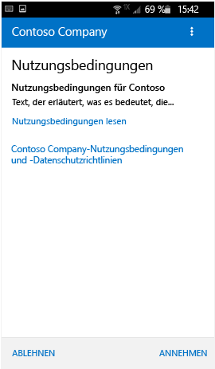
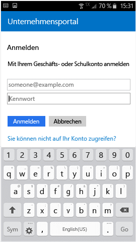

# Registrieren Ihres Android-Geräts bei Intune

Wenn Ihr Unternehmen oder Ihre Schule Microsoft Intune verwendet, können Sie Ihr Android-Gerät registrieren, um Zugriff auf Unternehmens-E-Mails, Dateien und weitere Ressourcen zu erhalten. Wenn Sie Ihre Geräte registrieren, kann Ihre IT-Abteilung diese Geschäfts-, Schul- oder Uniressourcen verwalten, schützen und Ihnen gleichzeitig die Möglichkeit bieten, Ihr bevorzugtes Gerät zu verwenden, um Ihre Arbeit erledigen. Weitere Informationen zur Registrierung finden Sie unter [Was geschieht, wenn ich die Unternehmensportal-App installiere und mein Gerät registriere?](what-happens-if-you-install-the-Company-Portal-app-and-enroll-your-device-in-intune-android.md)

Diese Registrierungsanweisungen sind für Samsung KNOX-Geräte mit Android und „native“ Android-Geräte (ohne Samsung Knox) bestimmt. Um zu ermitteln, ob Sie ein Samsung KNOX-Gerät haben, wechseln Sie zu **Einstellungen** &gt; **About device** (Infos zum Gerät). Wird „KNOX-Version“ nicht angezeigt, verfügen Sie über ein natives Android-Gerät.

Vor oder nach der Registrierung werden Sie möglicherweise aufgefordert, eine Kategorie auszuwählen, die am besten beschreibt, wie Sie Ihr Gerät nutzen. Ihr IT-Administrator verwendet diese Kategorie, um die Apps zu überprüfen, auf die Sie Zugriff haben.

Sollte beim Versuch der Registrierung Ihres Geräts bei Intune ein Fehler auftreten, können Sie [Registrierungsfehler an Ihren IT-Administrator senden](send-enrollment-errors-to-your-it-administrator-android.md).

**So registrieren Sie Ihr Android-Gerät:**

1.  Installieren Sie die kostenlose Intune-Unternehmensportal-App aus [Google Play](http://play.google.com/store/apps/details?id=com.microsoft.windowsintune.companyportal).

2.  Öffnen Sie die Microsoft Intune-Unternehmensportal-App.

3.  Tippen Sie im Unternehmensportal auf dem **Begrüßungsbildschirm** auf **Anmelden**, und melden Sie sich dann mit Ihrem Geschäfts-, Schul- oder Unikonto an.

       

4.  Wenn Ihr IT-Administrator Nutzungsbedingungen des Unternehmens eingerichtet hat, tippen Sie auf **AKZEPTIEREN**, um sie anzunehmen.

    

5.  Melden Sie sich bei der Unternehmensportal-App mit Ihrem Geschäfts-, Schul- oder Unikonto und dem zugehörigen Kennwort an, und tippen Sie dann auf **Anmelden**.

    

6.  Tippen Sie auf dem Bildschirm **Unternehmenszugriff einrichten** auf **BEGINNEN**.

    

7.  Lesen Sie auf dem Bildschirm **Gründe für das Registrieren Ihres Geräts**, welche Möglichkeiten Sie haben, wenn Sie Ihr Gerät registrieren, und tippen Sie dann auf **WEITER**.

    

8.  Prüfen Sie in einer Liste, was Ihr IT-Administrator auf Ihrem Gerät einsehen kann und was nicht, und tippen Sie dann auf **WEITER**.

    

9.  Lesen Sie im Bildschirm **Was ist der nächste Schritt?**, was während der Registrierung passiert, und tippen Sie dann auf **REGISTRIEREN**.

    

10.  Wenn Sie Android 6.0 oder höher verwenden, führen Sie diesen Schritt aus. Fahren Sie andernfalls mit dem nächsten Schritt fort.

    Wenn Ihr IT-Administrator bestimmte Richtlinien eingerichtet hat, werden möglicherweise folgende Meldungen angezeigt:
    -   **Zulassen, dass das Unternehmensportal Telefonanrufe tätigt und verwaltet?**

        

    Wenn diese Meldung angezeigt wird, tippen Sie auf **ZULASSEN**. Sie können ruhig auf „ZULASSEN“ tippen, weil **Microsoft niemals Ihre Telefonanrufe tätigt oder verwaltet**! Google steuert den Meldungstext, daher kann er von Microsoft nicht geändert werden. Wenn Sie den Zugriff gewähren, erlauben Sie Ihrem Gerät schlicht, die IMEI-Nummer (International Mobile Station Equipment Identity) Ihres Geräts an Intune zu senden. Die IMEI ähnelt einer Seriennummer, mit der ein mobiles Gerät eindeutig identifiziert werden kann.

    Wenn Sie den Zugriff verweigern, wird die Meldung bei Ihrer nächsten Anmeldung beim Unternehmensportal angezeigt. Sie können künftige Meldungen jedoch deaktivieren, indem Sie das Kontrollkästchen **Nicht mehr nachfragen** aktivieren. Wenn Sie den Zugriff später erlauben möchten, wechseln Sie zu **Einstellungen** &gt; **Apps** &gt; **Unternehmensportal** &gt; **Berechtigungen** &gt; **Telefon**, um die Berechtigung zu aktivieren.

    -   **Zulassen, dass das Unternehmensportal auf Ihre Kontakte zugreift?**

        

    Wenn diese Meldung angezeigt wird, tippen Sie auf **ZULASSEN**. Sie können ruhig auf „ZULASSEN“ tippen, weil **Microsoft niemals auf Ihre Kontakte zugreift**! Google steuert den Meldungstext, daher kann er von Microsoft nicht geändert werden. Wenn Sie den Zugriff gewähren, wird der Unternehmensportal-App lediglich das Erstellen, Verwenden und Verwalten Ihres Geschäftskontos erlaubt.

    Wenn Sie den Zugriff verweigern, wird die Meldung bei Ihrer nächsten Anmeldung beim Unternehmensportal angezeigt. Sie können künftige Meldungen jedoch deaktivieren, indem Sie das Kontrollkästchen **Nicht mehr nachfragen** aktivieren. Wenn Sie den Zugriff später erlauben möchten, wechseln Sie zu **Einstellungen** &gt; **Apps** &gt; **Unternehmensportal** &gt; **Berechtigungen** &gt; **Telefon**, um die Berechtigung zu aktivieren.

11.  Klicken Sie auf dem Bildschirm **Geräteadministrator aktivieren** auf **Aktivieren**.

    

12.  Befolgen Sie die Aufforderungen zur Eingabe einer PIN oder eines Kennworts. Wenn Sie bereits eine PIN oder ein Kennwort auf diesem Gerät eingerichtet haben, wird dieser Bildschirm nicht angezeigt, und Sie werden nicht zur Eingabe einer neuen PIN oder eines neuen Kennworts aufgefordert.

    

13.  Wenn Sie ein Samsung Knox-Gerät verwenden, tippen Sie auf **Bestätigen**. Es wird eine Meldung angezeigt, die besagt, dass das Gerät registriert wird. Wenn Sie ein natives Android-Gerät verwenden, beachten Sie den folgenden Bildschirm, der anzeigt, dass das Gerät registriert wird.

    

    Dieser Bildschirm zeigt an, dass das Gerät registriert wird.

    

14. Wenn der Bildschirm **Einrichten des Unternehmenszugriffs** angezeigt wird, tippen Sie auf **WEITER**. Wenn eine Meldung anzeigt, dass Ihr Gerät nicht kompatibel ist, befolgen Sie die Anweisungen zum Beheben des Problems, und tippen Sie dann auf **WEITER**.

      

11. Tippen Sie auf dem Bildschirm **Einrichten des Unternehmenszugriffs abgeschlossen** auf **FERTIG**. Ihr Gerät ist jetzt bei registriert.

    

Bevor Sie versuchen, Unternehmens-Apps zu installieren, wechseln Sie zu **Einstellungen** &gt; **Sicherheit**, und aktivieren Sie **Unknown sources** (Unbekannte Quellen). Wenn Sie diese Option nicht aktivieren, bevor Sie versuchen, Apps zu installieren, wird die folgende Meldung angezeigt: „Installation blockiert. Aus Sicherheitsgründen ist Ihr Gerät so eingestellt, dass die Installation von Apps aus unbekannten Quellen blockiert wird.“ Sie können im Fehlerdialogfeld auf **Einstellungen** tippen, um zur Option **Unknown sources** zu wechseln.

Benötigen Sie weitere Unterstützung? Wenden Sie sich an Ihren IT-Administrator (suchen Sie auf der [Unternehmensportal-Website](http://portal.manage.microsoft.com) nach Kontaktinformationen) oder an das Microsoft Android-Team unter wintunedroidfbk@microsoft.com..

<!--HONumber=Dec16_HO3-->

