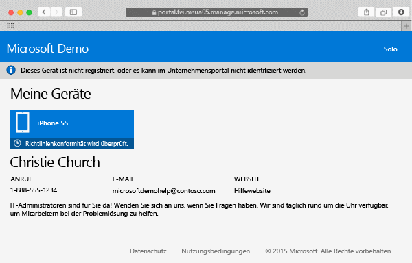

# Registrieren Ihres Mac OS X-Geräts bei Intune

Die Registrierung Ihres Mac OS X-Geräts bei Intune ermöglicht Ihnen den Zugriff auf das Netzwerk des Unternehmens, Ihre geschäftlichen E-Mails und Arbeitsdateien sowie den Abruf von Unternehmens-Apps. Weitere Informationen, was geschieht, wenn Sie Ihr Gerät registrieren, finden Sie unter [Was geschieht, wenn Sie die Unternehmensportal-App installieren und Ihr Gerät bei Intune registrieren?](what-happens-if-you-install-the-company-portal-app-and-enroll-your-device-in-intune-ios.md).

Wenn Sie ein iOS-Gerät registrieren möchten, lesen Sie [Registrieren Ihres iOS-Geräts bei Intune](enroll-your-device-in-intune-ios.md).

So registrieren Sie Ihr Mac OS X-Gerät

1.  Öffnen Sie in einem Safari-Browser die [Unternehmensportal-Website](https://portal.manage.microsoft.com), und tippen Sie auf die Benachrichtigungsleiste.

2.  Tippen Sie auf **Dieses Gerät ist nicht registriert, oder es kann im Unternehmensportal nicht identifiziert werden**.

     

3.  Tippen Sie auf **Installieren**, um die Registrierung des Geräts zu starten.

     

4.  Tippen Sie im Dialogfeld **Verwaltungsprofil installieren** auf **Installieren**. Wenn ein Dialogfeld angezeigt wird, in dem Sie aufgefordert werden, Ihre Anmeldeinformationen einzugeben, geben Sie Ihren Benutzernamen und Ihr Kennwort ein, und tippen Sie dann auf **Weiter** &gt; **Installieren**.

     

    Wenn Sie die Registrierung abgeschlossen haben, wird die Seite „Verwaltungsprofil“ mit der Angabe angezeigt, dass Ihr Profil überprüft wurde.

     

Benötigen Sie weitere Unterstützung? Wenden Sie sich an Ihren IT-Administrator. Die entsprechenden Kontaktinformationen finden Sie auf der [Unternehmensportal-Website](http://portal.manage.microsoft.com).

### Weitere Informationen:
[Verwenden Ihres iOS- oder Mac OS X-Geräts mit Intune](using-your-ios-or-mac-os-x-device-with-intune.md)

<!--HONumber=Jul16_HO1-->

