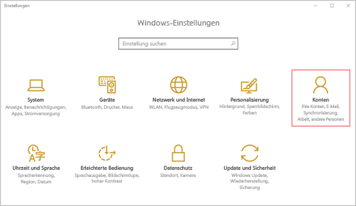
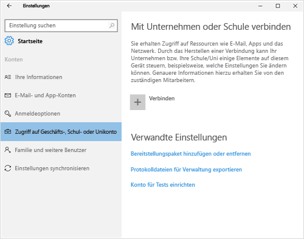
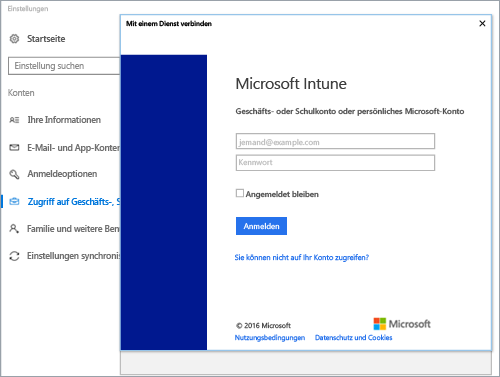
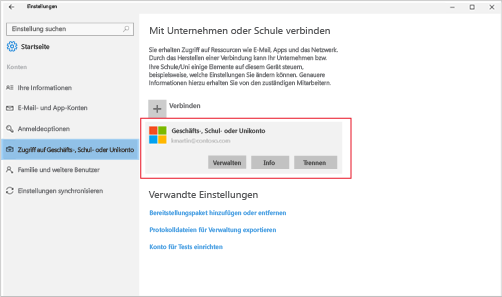
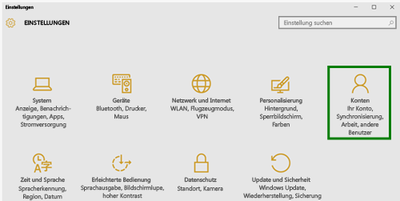
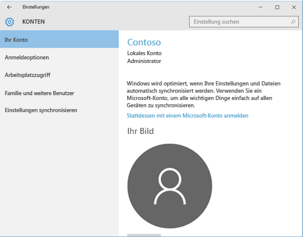
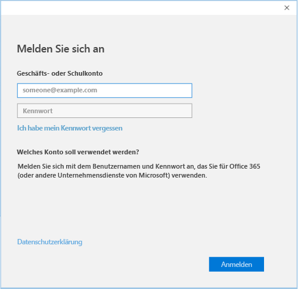

# Registrieren Ihres Windows 10 Mobile- oder Windows 10-Desktopgeräts bei Intune

Wenn Ihr Unternehmen oder Ihre Schule Microsoft Intune verwendet, können Sie Ihre Geräte registrieren, um Zugriff auf Unternehmens-E-Mails, Dateien und weitere Ressourcen zu erhalten. Durch das Registrieren Ihrer Geräte kann Ihre Organisation Unternehmensdaten schützen. Weitere Informationen zur Registrierung finden Sie unter [Was geschieht, wenn Sie die Unternehmensportal-App installieren und Ihr Gerät bei Intune registrieren?](what-happens-if-you-install-the-company-portal-app-and-enroll-your-device-in-intune-windows.md) und unter [Was Ihr IT-Administrator auf Ihrem Gerät sehen bzw. nicht sehen kann](what-can-your-it-administrator-see-when-you-enroll-your-device-in-intune-windows.md).

So registrieren Sie Ihr Windows 10 Mobile- oder Windows 10-Desktopgerät:

1.  Wechseln Sie zu den **Windows-Einstellungen**, und tippen Sie auf **Konten**.

    

2.  Sehen Sie sich die beiden folgenden Bildschirme an, und suchen Sie denjenigen heraus, der der Anzeige auf Ihrem Gerät entspricht. Befolgen Sie die Schritte, die Sie auf dem Bildschirm Ihres Gerätes sehen.

    Wenn dieser Bildschirm angezeigt wird, befolgen Sie die Anleitung unter [Zu befolgende Schritte bei Anzeige von „Zugriff auf Geschäfts-, Schul- oder Unikonto“](#steps-to-follow-if-you-see-access-work-or-school).

    

    Wenn dieser Bildschirm angezeigt wird, befolgen Sie die Schritte unter [Zu befolgende Schritte bei Anzeige von „Ihr Konto“](#steps-to-follow-if-you-see-your-account).

    

## Zu befolgende Schritte bei Anzeige von „Zugriff auf Geschäfts-, Schul- oder Unikonto“

1.  Tippen Sie auf **Auf Arbeits- oder Schulkonto zugreifen** und dann auf **Verbinden**.

    

2.  Geben Sie die E-Mail-Adresse Ihres Geschäfts-, Schul- oder Unikontos ein, und tippen Sie auf **Weiter**.

    

3. Melden Sie sich mit Ihrem Geschäfts-, Schul- oder Unikonto bei Intune an.

    

    In einer Meldung wird angezeigt, dass Ihr Unternehmen oder Ihre Bildungseinrichtung das Gerät registriert.

4. Wenn die Seite **Alles bereit!** angezeigt wird, tippen Sie auf **Schließen**. Der Vorgang ist abgeschlossen.

  

5. Wenn Sie die Verbindung noch einmal überprüfen möchten, kehren Sie zu den **Einstellungen** zurück. Ihr Geschäfts-, Schul- oder Unikonto wird jetzt aufgeführt.

    

Wenn Sie die obigen Schritte ausgeführt haben und trotzdem nicht auf E-Mails und Dateien Ihres Geschäfts-, Schul- oder Unikontos zugreifen können, befolgen Sie die Schritte unter [Schritte zur Problembehandlung bei Anzeige von „Zugriff auf Geschäfts-, Schul- oder Unikonto“](troubleshoot-your-windows-10-device-windows.md#troubleshooting-steps-to-follow-if-you-see-access-work-or-school).

## Zu befolgende Schritte bei Anzeige von „Mein Konto“

1.  Wechseln Sie zu den **Windows-Einstellungen**, und tippen Sie auf **Konten**.

    

2.  Tippen Sie auf **Mein Konto**.

    

3.  Tippen Sie auf **Geschäfts- oder Schulkonto hinzufügen**.

    

4.  Melden Sie sich mit den Anmeldeinformationen Ihres Geschäfts- oder Schulkontos an.

    

Wenn Sie die obigen Schritte ausgeführt haben und trotzdem nicht auf E-Mails, Dateien und andere Daten Ihres Geschäfts-, Schul- oder Unikontos zugreifen können, befolgen Sie die Schritte zur Problembehandlung unter [Schritte zur Problembehandlung bei Anzeige von „Mein Konto“](troubleshoot-your-windows-10-device-windows.md#troubleshooting-steps-to-follow-if-you-see-your-account).

Außerdem wird empfohlen, dass Sie die Unternehmensportal-App installieren, mit der Sie die Unternehmens-Apps einfach bestimmen und abrufen können, die für Sie und Ihre Rolle relevant sind. Abhängig von der Intune-Konfiguration Ihres Unternehmens wurde die Unternehmensportal-App möglicherweise bereits als Teil Ihres Registrierungsprozesses installiert.

Suchen Sie in der Liste Ihrer Apps nach **Unternehmensportal**, um zu prüfen, ob Sie die App haben. Wenn das Unternehmensportal nicht in der Liste der Apps angezeigt wird, gehen Sie folgendermaßen vor, um es zu installieren.

1.  Tippen Sie auf **Starten** &gt; **Store**.

2.  Tippen Sie auf **Suchen**, und geben Sie **Unternehmensportal** ein.

3.  Tippen Sie in der Liste der Ergebnisse auf **Unternehmensportal** &gt; **Installieren**.

4.  Tippen Sie auf **Installieren** oder **Kostenlos**. Die angezeigte Option hängt davon ab, wie Ihr Unternehmen die App konfiguriert hat.

Benötigen Sie weitere Unterstützung? Wenden Sie sich an Ihren IT-Administrator. Die entsprechenden Kontaktinformationen finden Sie auf der [Unternehmensportal-Website](http://portal.manage.microsoft.com).

<!--HONumber=Oct16_HO1-->

