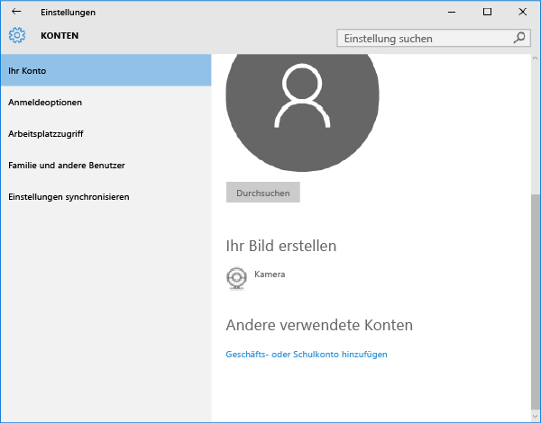

# Registrieren Ihres Windows 10 Mobile- oder Windows 10-Desktopgeräts bei Intune

Wenn Ihre Firma oder Schule Microsoft Intune verwendet, können Sie Ihre Geräte registrieren, um Zugriff auf die Unternehmens-E-Mail, Dateien und weitere Ressourcen zu erhalten. Durch das Registrieren Ihrer Geräte kann Ihre Organisation Unternehmensdaten schützen. Weitere Informationen zur Registrierung finden Sie unter [Was geschieht, wenn Sie die Unternehmensportal-App installieren und Ihr Gerät bei Intune registrieren?](what-happens-if-you-install-the-company-portal-app-and-enroll-your-device-in-intune-windows.md) und unter [Was Ihr IT-Administrator auf Ihrem Gerät sehen bzw. nicht sehen kann](what-can-your-it-administrator-see-when-you-enroll-your-device-in-intune-windows.md).

So registrieren Sie Ihr Windows 10 Mobile- oder Windows 10-Desktopgerät:

1.  Wechseln Sie zu **Windows-Einstellungen**, und tippen Sie auf **Konten**.

    

2.  Tippen Sie auf **Mein Konto**.

    

3.  Tippen Sie auf **Geschäfts- oder Schulkonto hinzufügen**.

    

4.  Melden Sie sich mit den Anmeldeinformationen Ihres Geschäfts- oder Schulkontos an.

    

Wenn Sie die obigen Schritte ausgeführt haben und trotzdem nicht auf E-Mails, Dateien und andere Daten Ihres Geschäfts- oder Schulkontos zugreifen können, wechseln Sie zurück zu **Konten**, und tippen Sie auf **Geschäftszugriff**.

-   Wenn Ihr Geschäfts- oder Schulkonto angezeigt wird, sind keine weiteren Schritte erforderlich. Sie sind verbunden.

-   Wenn Ihr Geschäfts- oder Schulkonto nicht angezeigt wird, tippen Sie auf **Verbinden**, und melden Sie sich mit den Anmeldeinformationen Ihres Geschäfts- oder Schulkontos an.

Außerdem wird empfohlen, dass Sie die Unternehmensportal-App installieren, mit der Sie die Unternehmens-Apps einfach bestimmen und abrufen können, die für Sie und Ihre Rolle relevant sind. Abhängig von der Intune-Konfiguration Ihres Unternehmens wurde die Unternehmensportal-App möglicherweise bereits als Teil Ihres Registrierungsprozesses installiert. Um zu prüfen, ob Sie die App haben, suchen Sie in der Liste Ihrer Apps nach **Unternehmensportal**. Wenn das Unternehmensportal nicht in der Liste der Apps angezeigt wird, gehen Sie folgendermaßen vor, um es zu installieren.

1.  Tippen Sie auf **Starten** &gt; **Store**.

2.  Tippen Sie auf **Suchen**, und geben Sie **Unternehmensportal** ein.

3.  Tippen Sie in der Liste der Ergebnisse auf **Unternehmensportal** &gt; **Installieren**.

4.  Tippen Sie auf **Installieren** oder **Kostenlos**. Die angezeigte Option hängt davon ab, wie Ihr Unternehmen die App konfiguriert hat.

Benötigen Sie weitere Unterstützung? Wenden Sie sich an Ihren IT-Administrator. Die entsprechenden Kontaktinformationen finden Sie auf der [Unternehmensportal-Website](http://portal.manage.microsoft.com).

### Weitere Informationen:
[Registrieren Ihres Windows-Geräts bei Intune](enroll-your-device-in-intune-windows.md) 
[Verwenden Ihres Windows-Geräts mit Intune](using-your-windows-device-with-intune.md)

<!--HONumber=Jul16_HO3-->

