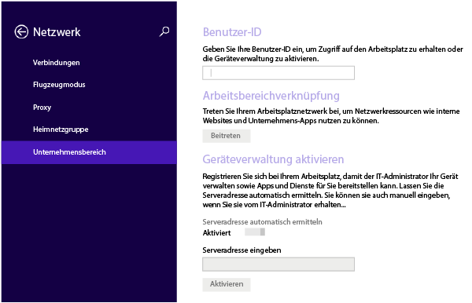
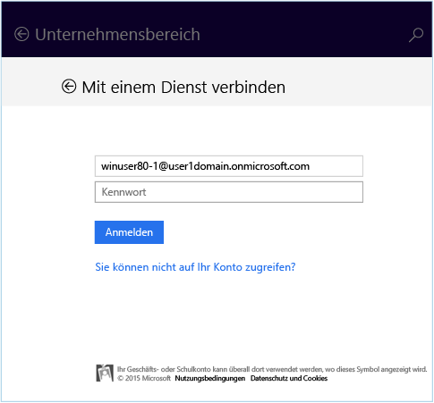
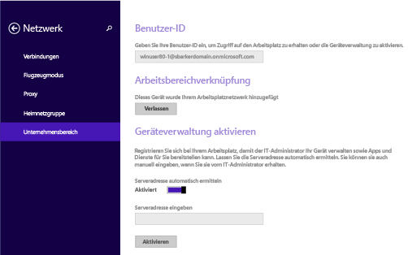
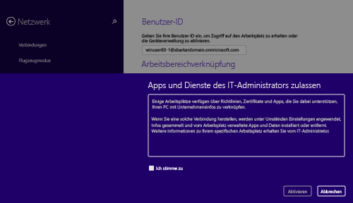

# Registrieren Ihres Windows 8.1- oder Windows RT 8.1-Geräts bei Intune

Wenn Ihr Unternehmen oder Ihre Schule Microsoft Intune verwendet, können Sie Ihre Geräte registrieren, um Zugriff auf Unternehmens-E-Mails, Dateien und weitere Ressourcen zu erhalten. Wenn Sie Ihre Geräte registrieren, kann Ihre Organisation Unternehmensdaten schützen. Weitere Informationen zur Registrierung finden Sie unter [Was geschieht, wenn Sie die Unternehmensportal-App installieren und Ihr Gerät bei Intune registrieren?](what-happens-if-you-install-the-company-portal-app-and-enroll-your-device-in-intune-windows.md) und unter [Was Ihr IT-Administrator auf Ihrem Gerät sehen bzw. nicht sehen kann](what-can-your-it-administrator-see-when-you-enroll-your-device-in-intune-windows.md).

So registrieren Sie Ihr Windows 8.1- oder Windows RT 8.1-Gerät:

1.  Tippen Sie auf dem Gerät auf **Einstellungen** &gt; **PC-Einstellungen** &gt; **Netzwerk** &gt; **Arbeitsplatz**.

    

2.  Geben Sie Ihre E-Mail-Adresse (Geschäft, Schule oder Uni) als Benutzer-ID ein, und tippen Sie dann auf **Beitreten**.

    Wenn Ihre Benutzer-ID nicht erforderlich ist, wird die E-Mail-Adresse verwendet, die Sie beim Anmelden auf diesem Gerät eingegeben haben.

3.  Geben Sie das Kennwort für Ihre Geschäfts-, Schul- oder Uni-E-Mail-Adresse ein.

    

4.  Tippen Sie unter **Geräteverwaltung aktivieren** auf **Aktivieren**

    

5.  Aktivieren Sie im Dialogfeld **Apps und Dienste des IT-Administrators zulassen** das Kästchen **Ich stimme zu**, und tippen Sie dann auf **Aktivieren**.

    

    Wenn Sie sich erfolgreich registriert haben, wird folgender Bildschirm angezeigt.

    

Außerdem wird empfohlen, dass Sie die Unternehmensportal-App installieren, mit der Sie die Unternehmens-Apps einfach bestimmen und abrufen können, die für Sie und Ihre Rolle relevant sind. Abhängig von der Intune-Konfiguration Ihres Unternehmens wurde die Unternehmensportal-App möglicherweise bereits im Rahmen Ihres Registrierungsprozesses installiert. Um zu prüfen, ob Sie die App haben, suchen Sie in der Liste Ihrer Apps nach **Unternehmensportal**. Wenn das Unternehmensportal nicht in der Liste der Apps angezeigt wird, gehen Sie folgendermaßen vor, um es zu installieren.

1.  Tippen Sie auf **Starten** &gt; **Store**.

2.  Tippen Sie auf **Suchen**, und geben Sie **Unternehmensportal** ein.

3.  Tippen Sie in der Liste der Ergebnisse auf **Unternehmensportal**.

4.  Tippen Sie auf **Installieren** oder **Kostenlos**. Die angezeigte Option hängt davon ab, wie Ihr Unternehmen die App eingerichtet hat.

Benötigen Sie weitere Unterstützung? Wenden Sie sich an Ihren IT-Administrator. Die entsprechenden Kontaktinformationen finden Sie auf der [Unternehmensportal-Website](http://portal.manage.microsoft.com).

<!--HONumber=Jan17_HO1-->

