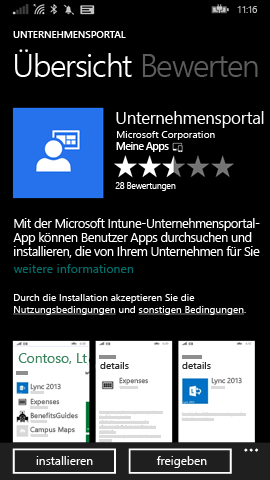
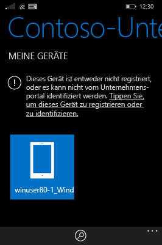
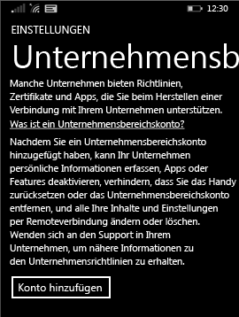

# Registrieren Ihres Windows Phone 8.1-Geräts bei Intune

Wenn Ihr Unternehmen oder Ihre Schule Microsoft Intune verwendet, können Sie Ihre Geräte registrieren, um Zugriff auf Unternehmens-E-Mails, Dateien und weitere Ressourcen zu erhalten. Wenn Sie Ihre Geräte registrieren, kann Ihre Organisation Unternehmensdaten schützen. Weitere Informationen zur Registrierung finden Sie unter [Was geschieht, wenn Sie die Unternehmensportal-App installieren und Ihr Gerät bei Intune registrieren?](what-happens-if-you-install-the-company-portal-app-and-enroll-your-device-in-intune-windows.md) und unter [Was Ihr IT-Administrator auf Ihrem Gerät sehen bzw. nicht sehen kann](what-can-your-it-administrator-see-when-you-enroll-your-device-in-intune-windows.md).

Befolgen Sie die für Ihre Firma oder Schule geltenden Anweisungen, um Ihr Phone 8.1-Gerät bei Intune zu registrieren:

-   [Wenn Ihr Unternehmen Ihnen das Verwenden des Unternehmensportals aus dem Windows Store erlaubt, gehen Sie folgendermaßen vor:](#if-your-company-lets-you-use-the-company-portal-from-the-windows-store)

-   [Wenn es Ihnen nicht gestattet ist, von Ihrem Windows Phone aus auf den Windows Store zuzugreifen oder Sie kein Microsoft-Konto besitzen:](#if-you-are-not-allowed-to-access-the-windows-store-from-your-windows-phone-or-if-you-do-not-have-a-microsoft-account)

## Wenn Ihr Unternehmen Ihnen das Verwenden des Unternehmensportals aus dem Windows Store erlaubt, gehen Sie folgendermaßen vor:
Installieren Sie die Unternehmensportal-App auf Ihrem Gerät:

1.  Tippen Sie auf **Starten** &gt; **Store**.

2.  Tippen Sie auf **Suchen**, und geben Sie **Unternehmensportal** ein.

3.  Tippen Sie in der Liste der Ergebnisse auf **Unternehmensportal**.

    

4.  Tippen Sie auf **Unternehmensportal** &gt; **Installieren**.

    

Registrieren Sie Ihr Gerät:

1.  Öffnen Sie auf dem Gerät die App **Microsoft Intune-Unternehmensportal**.

2.  Geben Sie Ihre Anmeldeinformationen ein. Möglicherweise werden Sie aufgefordert, die allgemeinen Geschäftsbedingungen Ihres Unternehmens zu akzeptieren.

3.  Navigieren Sie zu **Meine Geräte**.

4.  Tippen Sie auf **Tippen, um dieses Gerät zu registrieren oder zu identifizieren**.

    

5.  Tippen Sie auf **Dieses Gerät registrieren**.

    

6.  Tippen Sie auf **Konto hinzufügen**.

    

7.  Geben Sie den Anforderungen entsprechend weitere Informationen ein, und tippen Sie dann auf **Anmelden**, um die Registrierung abzuschließen. Ihr Arbeitsplatzkonto sollte nun auf der Seite **Einstellungen** &gt; **Arbeitsplatz** angezeigt werden.

    

## Wenn Ihnen der Zugriff auf den Windows Store von Ihrem Windows Phone aus nicht erlaubt ist oder Sie kein Microsoft-Konto besitzen

1.  Tippen Sie auf **Einstellungen** &gt; **Arbeitsplatz**.

2.  Tippen Sie auf **Konto hinzufügen**, und melden Sie sich mit Ihrem Geschäftskonto an.

3.  Geben Sie den Anforderungen entsprechend weitere Informationen ein, und tippen Sie dann auf **Anmelden**, um die Registrierung abzuschließen.

4.  Wenn Sie aufgefordert werden, die Unternehmens-App oder den Hub zu installieren, stellen Sie sicher, dass das entsprechende Kontrollkästchen aktiviert ist, und tippen Sie dann auf **Fertig**.

Wenn Ihr IT-Administrator das Unternehmensportal so eingerichtet hat, dass es während der Anmeldung installiert wird, wird das Unternehmensportal in Ihrer App-Liste angezeigt.

Benötigen Sie weitere Unterstützung? Wenden Sie sich an Ihren IT-Administrator. Die entsprechenden Kontaktinformationen finden Sie auf der [Unternehmensportal-Website](http://portal.manage.microsoft.com).

<!--HONumber=Nov16_HO1-->

