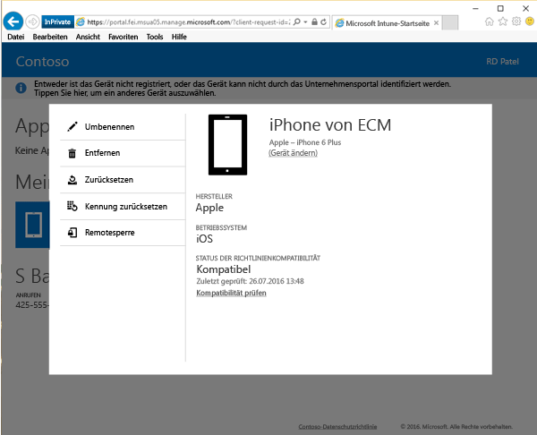

# Zurücksetzen Ihres Geräts über die Unternehmensportalwebsite

Wenn Ihr Gerät verloren geht oder gestohlen wird, empfiehlt es sich, das Gerät auf die Werkseinstellungen zurückzusetzen, um nicht autorisierten Zugriff auf Ihre Daten zu verhindern. Sie können Ihr Gerät remote über die [Unternehmensportalwebsite](http://portal.manage.microsoft.com) zurücksetzen. Die Unternehmensportalwebsite ist eine Website, auf der Sie Computer und Geräte verwalten können, die Sie bei Intune registriert haben. Hier können Sie die meisten der Aufgaben ausführen, die auch über Ihre Unternehmensportal-App zur Verfügung stehen.

Wenn Sie Ihr Gerät zurücksetzen, wird es im Unternehmensportal nicht mehr aufgeführt und auf die Werkseinstellungen zurückgesetzt.

So setzen Sie Ihr Gerät zurück:

1.  Öffnen Sie die [Unternehmensportalwebsite](http://portal.manage.microsoft.com), und tippen Sie auf das Gerät, das Sie zurücksetzen möchten.

2.  Tippen Sie auf **Zurücksetzen**.

    

3. Lesen die Warnmeldung, die angibt, dass Sie das Gerät auf die werkseitigen Standardeinstellungen zurücksetzen, und tippen Sie dann auf **Zurücksetzen**, um das Gerät zurückzusetzen.

Ihr Gerät wurde zurückgesetzt.

Benötigen Sie weitere Unterstützung? Wenden Sie sich an Ihren IT-Administrator. Die entsprechenden Kontaktinformationen finden Sie auf der [Unternehmensportal-Website](http://portal.manage.microsoft.com).

### Weitere Informationen:
[Verwenden der Intune-Unternehmensportal-Website](using-the-intune-company-portal-website.md)

<!--HONumber=Aug16_HO4-->

