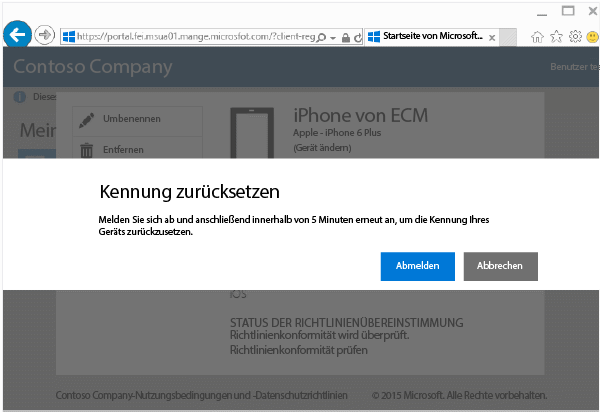
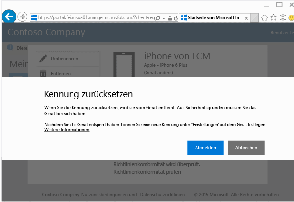

# Zurücksetzen Ihrer Kennung über die Unternehmensportalwebsite

Wenn Sie die PIN oder das Kennwort für ein bei Intune registriertes Gerät verloren haben, können Sie die PIN bzw. das Kennwort über die [Unternehmensportalwebsite](http://portal.manage.microsoft.com) zurücksetzen. Die Unternehmensportalwebsite ist eine Website, auf der Sie Computer und Geräte verwalten können, die Sie bei Intune registriert haben. Hier können Sie die meisten der Aufgaben ausführen, die auch über Ihre Unternehmensportal-App zur Verfügung stehen.

> [!NOTE]
> Die Schaltfläche „Kennung zurücksetzen“ wird möglicherweise auf der Unternehmensportal-Website nicht angezeigt, je nachdem, wie Intune von Ihrem IT-Administrator konfiguriert wurde. Das Zurücksetzen der Kennung wird auf Geräten mit Windows 8.1 und Windows RT nicht unterstützt.

So setzen Sie Ihre Kennung zurück

1.  Öffnen Sie die [Unternehmensportal-Website](http://portal.manage.microsoft.com), und tippen Sie auf das Gerät, dessen Kennung Sie zurücksetzen möchten.

2.  Tippen Sie auf **Kennung zurücksetzen**.

    

3.  Tippen Sie auf **Abmelden**, und melden Sie sich dann mit den Anmeldeinformationen Ihres Geschäfts- oder Schulkontos wieder an. Sie müssen sich innerhalb von fünf Minuten wieder anmelden.

    

4.  Tippen Sie auf **Kennung zurücksetzen**.

    

    In der Tabelle finden Sie Informationen zur Funktionsweise von „Kennung zurücksetzen“ auf Ihrem Gerät.

    |Plattform|Unterstützung|
    |------------|-----------|
    |Android|Erstellt eine neue, temporäre, alphanumerische Kennung.|
    |iOS|Entfernt die Kennung vom Gerät und erstellt keine neue temporäre Kennung. Wenn Sie Touch ID verwenden, müssen Sie es auf dem Gerät erneut einrichten, da es beim Zurücksetzen der Kennung entfernt wird.|
    |Windows 10 (nur mobile Geräte)|Erstellt eine neue, temporäre, alphanumerische Kennung. Windows Hello wird unterstützt.|
    |Windows Phone 8.1|Erstellt eine neue, temporäre, numerische Kennung.|
    Nachdem Sie Ihr Gerät entsperrt haben, können Sie auf Ihrem Gerät unter **Einstellungen** eine neue Kennung festlegen.

5.  Entsperren Sie Ihr Gerät, und legen Sie eine neue Kennung fest, oder ändern Sie die temporäre Kennung auf Ihrem Gerät unter **Einstellungen**.

    Um eine Benachrichtigung anzuzeigen, die bestätigt, dass Ihr Kennwort erfolgreich zurückgesetzt wurde, klicken Sie auf das Benachrichtigungskennzeichen oben rechts auf der Unternehmensportal-Website.

Benötigen Sie weitere Unterstützung? Wenden Sie sich an Ihren IT-Administrator. Die entsprechenden Kontaktinformationen finden Sie auf der [Unternehmensportal-Website](http://portal.manage.microsoft.com).

<!--HONumber=Sep16_HO3-->

