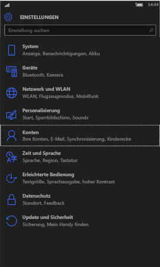
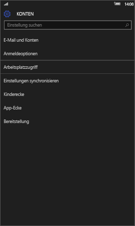
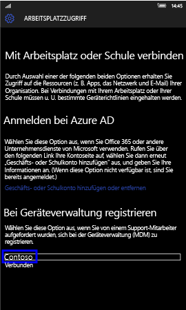
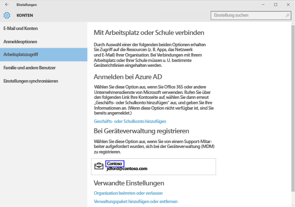
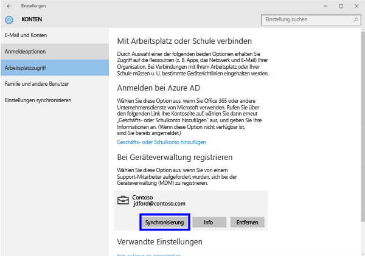
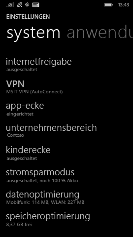
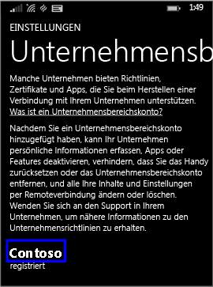
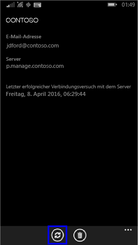

---
# required metadata

title: Manuelles Synchronisieren des Geräts | Microsoft Intune
description:
keywords:
author: Staciebarker
manager: jeffgilb
ms.date: 05/18/2016
ms.topic: article
ms.prod:
ms.service: microsoft-intune
ms.technology:
ms.assetid: 443c6de7-5187-4dc4-b844-6085a0c659bd

# optional metadata

#ROBOTS:
#audience:
#ms.devlang:
ms.reviewer: priyar
ms.suite: ems
#ms.tgt_pltfrm:
#ms.custom:

---

# Manuelles Synchronisieren des Geräts
Wenn die App-Installation bei Ihnen zu lange dauert, gehen Sie folgendermaßen vor, um Ihr Windows-Gerät manuell zu synchronisieren. Dies kann die Installation beschleunigen. Nur unterstützte Versionen sind aufgeführt. Klicken Sie im Abschnitt „Inhalt dieses Artikels“ weiter oben auf den Link, der dem Typ Ihres Geräts entspricht:

* [Windows 10 Mobile](#windows-10-mobile)
* [Windows 10 Desktop](#windows-10-desktop)
* [Windows Phone 8.1](#windows-phone-8-1)

## Windows 10 Mobile
So synchronisieren Sie Ihr Windows 10 Mobile-Gerät manuell, um eine langsame App-Installation zu beschleunigen:

1. Wechseln Sie zu **Alle Apps** > **Einstellungen** > **Konten**.

    
    
2. Tippen Sie auf **Arbeitsplatzzugriff**.

    
    
3. Tippen Sie unter **Für Geräteverwaltung registrieren** auf den Namen Ihres Unternehmens, wie unten dargestellt.

    
    
4. Tippen Sie auf das **Sync**-Symbol.

    
    
    Oben auf dem Bildschirm wird die Meldung „Ihr Konto wird synchronisiert“ angezeigt. Die Schaltfläche „Sync“ wird abgeblendet, bis die Synchronisierung des Geräts abgeschlossen ist.

## Windows 10 Desktop
So synchronisieren Sie Ihr Windows 10 Desktop-Gerät manuell, um eine langsame App-Installation zu beschleunigen:

1. Klicken Sie auf die Schaltfläche **Start**, wie unten dargestellt, und anschließend auf **Einstellungen**.

    
    
2. Klicken Sie auf der Seite **Einstellungen** auf **Konten**.
 
    
    
3. Auf der Seite **Konten** wählen Sie **Arbeitsplatzzugriff** aus.
    
    
    
4. Klicken Sie unter **Für Geräteverwaltung registrieren** auf den Namen Ihres Unternehmens, wie unten durch die blaue Hervorhebung gezeigt.
    
    
   
5. Klicken Sie auf die Schaltfläche **Synchronisieren**.
    
    
   
   Die Schaltfläche wird solange abgeblendet, bis die Synchronisierung abgeschlossen ist.

## Windows Phone 8.1
So synchronisieren Sie Ihr Windows Phone 8.1-Gerät manuell, um eine langsame App-Installation zu beschleunigen:

1. Wechseln Sie zu **Alle Apps** > **Einstellungen** > **Arbeitsplatz**.

    
    
2. Tippen Sie auf den Namen Ihres Unternehmens, wie unten durch die blaue Hervorhebung gezeigt.

    
   
3. Tippen Sie auf das **Sync**-Symbol.

    
    
   Oben auf dem Bildschirm wird die Meldung „Ihr Konto wird synchronisiert“ angezeigt, bis die Synchronisierung des Geräts abgeschlossen ist.

Benötigen Sie weitere Unterstützung? Wenden Sie sich an Ihren IT-Administrator. Die entsprechenden Kontaktinformationen finden Sie auf der [Unternehmensportal-Website](http://portal.manage.microsoft.com).

### Weitere Informationen:
[Verwenden Ihres Windows-Geräts mit Intune](using-your-windows-device-with-intune.md)

<!--HONumber=Jun16_HO2-->

