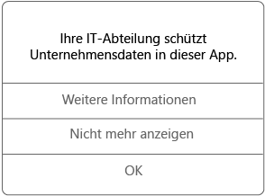

# Verwenden verwalteter Apps auf Ihrem iOS-Gerät

Verwaltete Apps sind Apps, die Ihr IT-Administrator einrichten kann, um Unternehmensdaten zu schützen, auf die Sie in der App zugreifen können. Wenn Sie in einer verwalteten App auf Ihrem iOS-Gerät auf Unternehmensdaten zugreifen, werden Sie feststellen, dass die App ein wenig anders als erwartet funktioniert. Sie können beispielsweise ggf. geschützte Unternehmensdaten nicht kopieren und einfügen oder diese Daten nicht an bestimmten Speicherorten speichern.

Unterschiedliche verwaltete Apps können auch auf Ihrem Gerät zusammenarbeiten, um Ihnen das Erledigen Ihrer täglichen Aufgaben zu ermöglichen, während Unternehmensdaten geschützt bleiben. Wenn Sie z. B. eine Unternehmensdatei in einer verwalteten App öffnen und eine andere verwaltete App zum Anzeigen dieser Datei erforderlich ist, erlaubt die verwaltete App Ihnen automatisch das Anzeigen der Datei. Wenn eine erforderliche App nicht verfügbar ist, sind bestimmte Vorgänge, z. B. Öffnen eines Dokuments oder Zugreifen auf einen Weblink aus einem verwalteten Dokument, ggf. nicht möglich.

Wenn Sie in einer verwalteten App auf Unternehmensdaten zugreifen, wird eine Meldung wie die folgende angezeigt, die Sie informiert, dass die App, die Sie öffnen, verwaltet wird.

### Wie erhalte ich verwaltete Apps?
Es gibt verschiedene Möglichkeiten, verwaltete Apps zu erhalten:

-   Wenn Ihr Gerät bei Microsoft Intune registriert ist, installieren Sie die App entweder über die Unternehmensportal-App oder -Website, oder Ihr IT-Administrator installiert sie auf Ihrem Gerät. Informationen zum Registrieren finden Sie unter [Registrieren Ihres iOS-Geräts bei Intune](enroll-your-device-in-intune-ios.md) oder [Registrieren Ihres macOS-Geräts bei Intune](enroll-your-device-in-intune-macos.md).

-   Sie installieren eine App aus dem App Store und melden sich dann mit Ihrem Unternehmensbenutzerkonto an, das von Intune verwaltet wird.

### Was kann mein IT-Administrator in einer App verwalten?
Es folgen einige Beispiele für Optionen, die Ihr IT-Administrator in einer App verwalten kann und die sich auf Ihre Interaktionen mit Unternehmensdaten auf Ihrem Gerät auswirken können:

-   Zugriff auf bestimmte Websites

-   Übertragung von Daten zwischen Anwendungen

-   Speichern von Dateien

-   Kopier- und Einfügevorgänge

-   PIN-Zugriffsanforderungen

-   Ihre Anmeldung mit Unternehmensanmeldeinformationen

-   Fähigkeit zur Sicherung in der Cloud

-   Fähigkeit zur Erstellung von Screenshots

-   Anforderungen für die Verschlüsselung von Daten

Wenden Sie sich an Ihren IT-Administrator, um weitere Informationen zu den verwalteten Anwendungen auf Ihrem Gerät zu erhalten. Die entsprechenden Kontaktinformationen finden Sie auf der [Unternehmensportal-Website](http://portal.manage.microsoft.com).

<!--HONumber=Dec16_HO2-->

