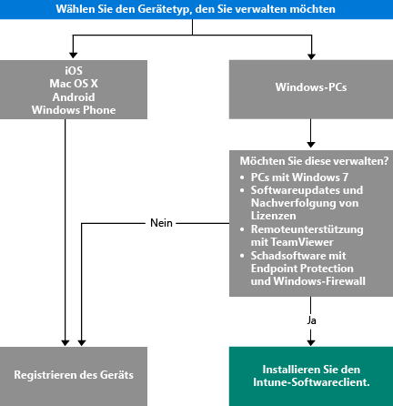

# Auswählen der Methode zum Verwalten von Geräten

Um Vorteile aus den zahlreichen Funktionen zu ziehen, die Intune anbietet, wie z.B. die App-Bereitstellung und die Steuerung von Geräteeinstellungen, müssen Ihre Geräte *verwaltet* werden. Die Art, wie Sie Geräte verwalten, hängt von den Intune-Funktionen ab, die Sie verwenden möchten.
Dieses Thema hilft Ihnen bei der Auswahl der Methode, die Ihren Anforderungen entspricht.

Um Geräte zu verwalten, auf denen iOS, Mac OS X, Android oder Windows Phone ausgeführt wird, müssen Sie diese *registrieren*.

Zum Verwalten von Windows-PCs haben Sie zwei Optionen:

1. Registrieren Sie das Gerät **oder**
2. Installieren Sie den *Intune-Computerclient*.

## Welche Methode soll verwendet werden?
Verwenden Sie diesen Entscheidungsfluss, um zu entscheiden, wie Ihre Geräte verwaltet werden können.

Registrieren Sie Windows PCs, um von den meisten Funktionen zu profitieren. Der Intune-Softwareclient ist möglicherweise geeigneter für Ihre Anforderungen, wenn:

- Der PC mit Windows 7 ausgeführt wird.
- Sie Windows-Softwareupdates und -Lizenznutzung verwalten möchten.
- Sie Schadsoftware mit Endpoint Protection und der Windows-Firewall verwalten möchten.
- Sie Remoteunterstützung für Benutzer mithilfe der TeamViewer-Software bereitstellen möchten.

Eine ausführliche Liste der Funktionen für die Verwaltung, die Sie zu jeder Methode erhalten, finden Sie unter [Verwaltungsfunktionen für mobile Geräte](mobile-device-management-capabilities-in-microsoft-intune.md) und [Funktionen des Intune-PC-Softwareclients](windows-pc-management-capabilities-in-microsoft-intune.md).
Informationen zu den Geräten und PCs, die von Intune unterstützt werden, finden Sie unter [Unterstützte mobile Geräte und Computer](/intune/get-started/supported-mobile-devices-and-computers).

## Exchange ActiveSync-Verwaltung
Zusätzlich zur Registrierung eines Geräts oder zur Installation des Intune-Softwareclients können Sie auch Geräte [mithilfe von Exchange ActiveSync](/intune/deploy-use/mobile-device-management-with-exchange-activesync-and-microsoft-intune) verwalten. Diese Methode erfordert das Installieren von On-Premises Connector oder die Verwendung des integrierten Service to Service Connector, um eine Verbindung mit Exchange Server herzustellen.
Obwohl dies eine dritte Möglichkeit zum Verwalten von Geräten ist, bietet sie im Vergleich zu anderen Methoden eine begrenzte Anzahl von Funktionen für die Verwaltung.

## Nächste Schritte

- [Auswählen der Methode zum Registrieren mobiler Geräte](/intune/get-started/choose-how-to-enroll-devices1)
- [Verwalten von Windows-PCs mit der Intune-PC-Clientsoftware](/intune/deploy-use/manage-windows-pcs-with-microsoft-intune)

- [Verwaltung mobiler Geräte mit Exchange ActiveSync und Microsoft Intune](/intune/deploy-use/mobile-device-management-with-exchange-activesync-and-microsoft-intune).

<!--HONumber=Aug16_HO5-->

