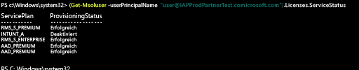

---
# required metadata

title: Verwalten von Intune-Lizenzen mithilfe von PowerShell | Microsoft Intune
description:
keywords:
author: Staciebarker
manager: jeffgilb
ms.date: 04/28/2016
ms.topic: get-started-article
ms.prod:
ms.service: microsoft-intune
ms.technology:
ms.assetid: d2d31c80-c32c-4315-8271-1b0cf9a1f78a

# optional metadata

#ROBOTS:
#audience:
#ms.devlang:
ms.reviewer: jeffgilb
ms.suite: ems
#ms.tgt_pltfrm:
#ms.custom:

---

# Verwalten von Intune-Lizenzen mithilfe von PowerShell
Bevor Benutzer sich für die Verwendung des Intune-Diensts anmelden oder ihre Geräte für die Verwaltung registrieren können, müssen Sie zunächst jedem Benutzer eine Lizenz für Ihr Intune-Abonnement zuweisen (siehe [Verwalten von Intune-Lizenzen](start-with-a-paid-subscription-to-microsoft-intune-step-4.md)). Organisationen, die Microsoft Enterprise Mobility Suite (EMS) verwenden, verfügen jedoch möglicherweise über Benutzer, die nur Azure Active Directory Premium- oder Intune-Dienste im EMS-Paket benötigen. Sie können einen oder mehrere Dienste mithilfe von [Azure Active Directory PowerShell-Cmdlets](https://msdn.microsoft.com/library/jj151815.aspx) zuweisen. 

Um Benutzerlizenzen für EMS-Dienste selektiv zuzuweisen, öffnen Sie PowerShell als Administrator auf einem Computer, auf dem das [Azure Active Directory-Modul für Windows PowerShell](https://msdn.microsoft.com/library/jj151815.aspx#bkmk_installmodule) installiert ist. Sie können PowerShell auf einem lokalen Computer oder einem AD FS-Server installieren.

Sie müssen eine neue Lizenz-SKU-Definition erstellen, die nur für die gewünschten Servicepläne gilt. Deaktivieren Sie zu diesem Zweck die Pläne, die Sie nicht anwenden möchten. Sie können beispielsweise eine Lizenz-SKU-Definition erstellen, die keine Intune-Lizenzen zuweist. Um eine Liste der verfügbaren Dienste anzuzeigen, geben Sie Folgendes ein:.
 
    (Get-MsolAccountSku | Where {$_.SkuPartNumber -eq "EMS"}).ServiceStatus 

Sie können den folgenden Befehl ausführen, um den Intune-Serviceplan auszuschließen. Mit der gleichen Methode können Sie die Definition auf eine vollständige Sicherheitsgruppe ausweiten oder detailliertere Filter verwenden. 

**Beispiel 1** Erstellen Sie über die Befehlszeile einen neuen Benutzer, und weisen Sie eine EMS-Lizenz zu, ohne den auf Intune bezogenen Teil der Lizenz zu aktivieren:

    Connect-MsolService 
        
    New-MsolUser -DisplayName “Test User” -FirstName FName -LastName LName -UserPrincipalName user@<TenantName>.onmicrosoft.com –Department DName -UsageLocation US
    
    $CustomEMS = New-MsolLicenseOptions -AccountSkuId "<TenantName>:EMS" -DisabledPlans INTUNE_A
    Set-MsolUserLicense -UserPrincipalName user@<TenantName>.onmicrosoft.com -AddLicenses <TenantName>:EMS -LicenseOptions $CustomEMS 
    

Überprüfen Sie das Ergebnis:

    (Get-MsolUser -UserPrincipalName "user@<TenantName>.onmicrosoft.com").Licenses.ServiceStatus

**Beispiel 2** Deaktivieren Sie den auf Intune bezogenen Teil der EMS-Lizenz für einen Benutzer, dem bereits eine Lizenz zugewiesen wurde:

    Connect-MsolService 
    
    Set-MsolUserLicense -UserPrincipalName user@<TenantName>.onmicrosoft.com -RemoveLicenses IAPProdPartnerTest:EMS
    
    $CustomEMS = New-MsolLicenseOptions -AccountSkuId "<TenantName>:EMS" -DisabledPlans INTUNE_A
    Set-MsolUserLicense -UserPrincipalName user@<TenantName>.onmicrosoft.com -AddLicenses <TenantName>:EMS -LicenseOptions $CustomEMS
 
Überprüfen Sie das Ergebnis:
 
    (Get-MsolUser -UserPrincipalName "user@<TenantName>.onmicrosoft.com" .Licenses.ServiceStatus

### Nächste Schritte
Gratulation! Sie haben Schritt 4 der Kurzanleitung *Erste Schritte mit Intune* abgeschlossen.
>[!div class="step-by-step"]

>[&larr; **Synchronisieren von Benutzern mit Intune**](.\start-with-a-paid-subscription-to-microsoft-intune-step-2.md)     [**Organisieren von Benutzern und Geräten** &rarr;](.\start-with-a-paid-subscription-to-microsoft-intune-step-5.md)  

<!--HONumber=Jun16_HO3-->

