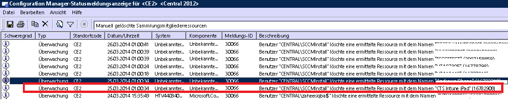

# Behandlung von Problemen bei der Geräteregistrierung bei Intune

Dieses Thema enthält Vorschläge zur Problembehandlung bei Problemen mit der Geräteregistrierung. Wenn sich das Problem mit diesen Informationen nicht beheben lässt, finden Sie unter [How to get support for Microsoft Intune](how-to-get-support-for-microsoft-intune.md) (Anfordern von Support für Microsoft Intune) weitere Möglichkeiten, Hilfe zu erhalten.

## Erste Schritte bei der Problembehandlung

Bevor Sie mit der Problembehandlung beginnen, stellen Sie sicher, dass Intune ordnungsgemäß konfiguriert wurde, um die Registrierung zu ermöglichen. Informationen zu diesen Konfigurationsanforderungen finden Sie unter:

-   [Vorbereiten der Registrierung von Geräten in Microsoft Intune](/intune/deploy-use/gprerequisites-for-enrollment.md)
-   [Einrichten der iOS- und Mac-Geräteverwaltung](/intune/deploy-use/set-up-ios-and-mac-management-with-microsoft-intune)
-   [Einrichten der Windows 10 Mobile- und Windows Phone-Verwaltung mit Microsoft Intune](/intune/deploy-use/set-up-windows-phone-management-with-microsoft-intune)
-   [Einrichten der Windows-Geräteverwaltung](/intune/deploy-use/set-up-windows-device-management-with-microsoft-intune)

Ihre Benutzer verwalteter Geräte können Registrierungs- und Diagnoseprotokolle erfassen, die Sie überprüfen können. Benutzeranleitungen zur Erfassung der Protokolle finden Sie unter:

- [Senden von Android-Diagnosedatenprotokollen an Ihren IT-Administrator über ein USB-Kabel](/intune/enduser/send-diagnostic-data-logs-to-your-it-administrator-using-a-usb-cable-android)
- [Senden von Android-Diagnosedatenprotokollen an Ihren IT-Administrator per E-Mail](/intune/enduser/send-diagnostic-data-logs-to-your-it-administrator-using-email-android)
- [Senden von Android-Registrierungsfehlern an Ihren IT-Administrator](/intune/enduser/send-enrollment-errors-to-your-it-administrator-android)
- [Senden von iOS-Registrierungsfehlern an Ihren IT-Administrator](/intune/enduser/send-errors-to-your-it-admin-ios)

## Allgemeine Probleme bei der Registrierung
Diese Probleme können auf allen Geräteplattformen auftreten.

### Gerätekapazität erreicht
**Problem**: Benutzer erhalten während der Registrierung eine Fehlermeldung auf ihrem Gerät, z. B. den Fehler **Unternehmensportal vorübergehend nicht verfügbar** auf einem iOS-Gerät, und die Datei „DMPdownloader.log“ in Configuration Manager enthält den Fehler **DeviceCapReached**.

**Lösung:** Beabsichtigt. Benutzer können nicht mehr als 5 Geräte registrieren.

#### Überprüfen Sie die Anzahl der registrierten und zulässigen Geräte.

1.  Überprüfen Sie im Intune-Verwaltungsportal, dass dem Benutzer nicht mehr als 5 Geräte zugewiesen sind.

2.  Überprüfen Sie im Intune-Verwaltungsportal unter „Admin\Mobile Device Management\Enrollment Rules“, dass der Grenzwert für die Geräteregistrierung auf 5 festgelegt ist.

Benutzer von mobilen Geräten können Geräte unter folgender URL löschen: [https://byodtestservice.azurewebsites.net/](https://byodtestservice.azurewebsites.net/).

Administratoren können Geräte im Azure Active Directory-Portal löschen.

#### So löschen Sie Geräte im Azure Active Directory-Portal

1.  Navigieren Sie zu [http://aka.ms/accessaad](http://aka.ms/accessaad), oder klicken Sie unter [https://portal.office.com](https://portal.office.com) auf **Verwaltung** &gt; **Azure AD**.

2.  Melden Sie sich mit Ihrer Organisations-ID über den Link im linken Bereich der Seite an.

3.  Erstellen Sie ein Azure-Abonnement, wenn Sie noch keins besitzen. Hierzu sollte keine Kreditkarte oder Zahlung erforderlich sein, wenn Sie ein gebührenpflichtiges Konto besitzen (klicken Sie auf den Abonnementlink **Ihr kostenloses Azure Active Directory registrieren** ).

4.  Wählen Sie zuerst **Active Directory** und dann Ihre Organisation aus.

5.  Wählen Sie die Registerkarte **Benutzer** aus.

6.  Wählen Sie den Benutzer aus, dessen Geräte Sie löschen möchten.

7.  Klicken Sie auf **Geräte**.

8.  Entfernen Sie Geräte nach Bedarf, z. B. solche, die nicht mehr verwendet werden oder fehlerhafte Definitionen haben.

> [!NOTE]

> Sie können das Erreichen der Kapazitätsgrenze für Geräteregistrierungen vermeiden, indem Sie Geräteregistrierungs-Manager verwenden, wie unter [Registrieren unternehmenseigener Geräte mit dem Geräteregistrierungs-Manager in Microsoft Intune](/intune/deploy-use/enroll-corporate-owned-devices-with-the-device-enrollment-manager-in-microsoft-intune) beschrieben.
>
> Ein Benutzerkonto das der Gruppe „Geräteregistrierungs-Manager“ hinzugefügt wird, kann die Registrierung nicht abschließen, wenn die bedingte Zugriffsrichtlinie für diese spezielle Benutzeranmeldung erzwungen wird.

### Unternehmensportal vorübergehend nicht verfügbar
**Problem**: Sie erhalten auf dem Gerät die Fehlermeldung **Unternehmensportal vorübergehend nicht verfügbar**.

#### Behandlung des Fehlers „Unternehmensportal vorübergehend nicht verfügbar“

1.  Entfernen Sie die Intune-Unternehmensportal-App von dem Gerät.

2.  Öffnen Sie auf dem Gerät den Browser, navigieren Sie zu [https://portal.manage.microsoft.com](https://portal.manage.microsoft.com), und versuchen Sie eine Benutzeranmeldung.

3.  Wenn sich der Benutzer nicht anmelden kann, lassen Sie ihn ein anderes Netzwerk ausprobieren.

4.  Wenn auch dies fehlschlägt, überprüfen Sie, ob die Anmeldeinformationen des Benutzers korrekt mit Azure Active Directory synchronisiert wurden.

5.  Wenn sich der Benutzer erfolgreich angemeldet hat, werden Sie auf einem iOS-Gerät aufgefordert, die Intune-Unternehmensportal-App zu installieren und sich zu registrieren. Auf einem Android-Geräten müssen Sie die Intune-Unternehmensportal-App manuell installieren, wonach Sie die Registrierung erneut versuchen können.

### MDM-Autorität nicht definiert
**Problem**: Sie erhalten die Fehlermeldung **MDM-Autorität nicht definiert**.

#### Behandlung des Fehlers „MDM-Autorität nicht definiert“

1.  Stellen Sie sicher, dass die MDM-Autorität entsprechend der Version des von Ihnen verwendeten Intune-Diensts festgelegt wurde, d. h. für Intune Office 365 MDM oder System Center Configuration Manager mit Intune. Für Intune wird die MDM-Autorität in **Verwaltung** &gt; **Verwaltung mobiler Geräte** festgelegt. Für Configuration Manager mit Intune legen Sie sie fest, wenn Sie den Intune-Connector konfigurieren, und in Office 365 gibt es dafür die Einstellung **Mobilgeräte**.

    > [!NOTE]
    > Nachdem Sie die MDM-Autorität festgelegt haben, können Sie sie nur ändern, indem Sie sich an den Support wenden, wie unter [Anfordern von Support für Microsoft Intune](how-to-get-support-for-microsoft-intune.md) beschrieben.

2.  Stellen Sie sicher, dass die Anmeldeinformationen des Benutzers korrekt mit Azure Active Directory synchronisiert wurden, indem Sie überprüfen, ob der UPN mit den Active Directory-Informationen im Kontoportal übereinstimmt.
    Wenn der UPN nicht mit den Active Directory-Informationen übereinstimmt:

    1.  Deaktivieren Sie DirSync auf dem lokalen Server.

    2.  Löschen Sie den nicht übereinstimmenden Benutzer aus der Benutzerliste **Intune-Kontoportal** .

    3.  Warten Sie etwa eine Stunde, damit der Azure-Dienst die fehlerhaften Daten entfernen kann.

    4.  Aktivieren Sie DirSync erneut, und überprüfen Sie, ob der Benutzer jetzt ordnungsgemäß synchronisiert ist.

3.  In einem Szenario, in dem Sie System Center Configuration Manager mit Intune verwenden, stellen Sie sicher, dass der Benutzer eine gültige Cloudbenutzer-ID besitzt:

    1.  Öffnen Sie SQL Management Studio.

    2.  Stellen Sie eine Verbindung mit der geeigneten Datenbank her.

    3.  Öffnen Sie den Datenbankenordner, und suchen und öffnen Sie den Ordner **CM_DBName**, wobei „DBName“ der Name der Kundendatenbank ist.

    4.  Klicken Sie im oberen Bereich auf **Neue Abfrage**, und führen Sie die folgenden Abfragen aus:

        -   Zum Anzeigen aller Benutzer: `select * from [CM_ DBName].[dbo].[User_DISC]`

        -   Zum Anzeigen bestimmter Benutzer verwenden Sie die folgende Abfrage, wobei „%testuser1%“ für „Benutzername@domain.com“ des Benutzers steht, den Sie nachschlagen möchten: `select * from [CM_ DBName].[dbo].[User_DISC] where User_Principal_Name0 like '%testuser1%'`

        Klicken Sie nach dem Schreiben der Abfrage auf **Ausführen**.
        Nachdem die Ergebnisse zurückgegeben wurden, suchen Sie nach der Cloudbenutzer-ID.  Wenn Sie keine ID finden, ist der Benutzer nicht für die Verwendung von Intune lizenziert.

### Erstellen einer Richtlinie oder Registrieren von Geräten ist nicht möglich, wenn der Firmenname Sonderzeichen enthält
**Problem:** Sie können keine Richtlinie erstellen bzw. keine Geräte registrieren.

**Lösung**: Entfernen Sie im [Office 365 Admin Center](https://portal.office.com/) die Sonderzeichen aus den Firmennamen, und speichern Sie die Unternehmensinformationen.

### Anmelden oder Registrieren von Geräten ist nicht möglich, wenn Sie mehrere überprüfte Domänen haben
**Problem:** Wenn Sie Ihren AD FS eine zweite überprüfte Domäne hinzufügen, können Benutzer mit dem Benutzerprinzipalnamen-Suffix (UPN) der zweiten Domäne sich möglicherweise nicht bei Portalen anmelden oder Geräte registrieren.

**Lösung:** Microsoft Office 365-Kunden, die einmaliges Anmelden (Single Sign-On, SSO) über AD FS 2.0 verwenden und in ihrer Organisation über mehrere Domänen der obersten Ebene für Benutzer-UPN-Suffixe verfügen (z. B. „@contoso.com“ oder „@fabrikam.com“) müssen für jedes Suffix eine separate Instanz des AD FS 2.0-Verbunddiensts bereitstellen.  Es gibt jetzt einen [Rollup für AD FS 2.0](http://support.microsoft.com/kb/2607496), der in Verbindung mit der Option **SupportMultipleDomain** den AD FS-Server zur Unterstützung dieses Szenarios aktiviert, ohne dass zusätzliche AD FS 2.0-Server erforderlich sind. Weitere Informationen finden Sie in [diesem Blogbeitrag](https://blogs.technet.microsoft.com/abizerh/2013/02/05/supportmultipledomain-switch-when-managing-sso-to-office-365/).

## Android-Probleme
### Fehler bei der Profilinstallation
**Problem**: Sie erhalten auf einem Android-Gerät die Fehlermeldung **Fehler bei der Profilinstallation**.

### Schritte zur Problembehandlung bei fehlgeschlagener Profilinstallation

1.  Vergewissern Sie sich, dass dem Benutzer eine geeignete Lizenz für die Version des von Ihnen verwendeten Intune-Diensts zugewiesen wurde.

2.  Stellen Sie sicher, dass das Gerät nicht bereits bei einem anderen MDM-Anbieter registriert ist oder dass nicht bereits ein Verwaltungsprofil darauf installiert ist.

4.  Vergewissern Sie sich, dass Chrome für Android der Standardbrowser ist und dass Cookies aktiviert sind.

### Android-Zertifikatsprobleme

**Problem**: Benutzer erhält die folgende Meldung auf seinem Gerät: *Sie können sich nicht anmelden, da dem Gerät ein erforderliches Zertifikat fehlt.*

**Lösung**:

- Der Benutzer kann in der Lage sein, das fehlende Zertifikat mit [diesen Anweisungen](/intune/enduser/your-device-is-missing-a-required-certificate-android#your-device-is-missing-a-certificate-required-by-your-it-administrator) abzurufen.
- Wenn der Benutzer das Zertifikat nicht abrufen kann, können Zwischenzertifikate auf Ihrem AD FS-Server fehlen. Die Zwischenzertifikate benötigt Android, um dem Server zu vertrauen.

Sie können die Zertifikate wie folgt in den Zwischenspeicher auf dem AD FS-Server oder Proxys importieren:

1.  Starten Sie auf dem AD FS-Server die **Microsoft Management Console**, und fügen Sie das Zertifikate-Snap-In für das **Computerkonto** hinzu.
5.  Suchen Sie das Zertifikat, das Ihr AD FS-Dienst verwendet, und zeigen Sie sein übergeordnetes Zertifikat an.
6.  Kopieren Sie das übergeordnete Zertifikat, und fügen Sie es unter **Computer\Intermediate Certification Authorities\Certificates** ein.
7.  Kopieren Sie Ihre Zertifikate für AD FS, AD FS Decrypting und AD FS Signing, und fügen Sie sie in den privaten Speicher für den AD FS-Dienst ein.
8.  Starten Sie die AD FS-Server neu.

Der Benutzer sollte sich jetzt mit dem Android-Gerät bei der Unternehmensportal-App anmelden können.

## iOS-Probleme
### Fehler bei der Profilinstallation
**Problem**: Sie erhalten auf einem iOS-Gerät die Fehlermeldung **Fehler bei der Profilinstallation**.

### Schritte zur Problembehandlung bei fehlgeschlagener Profilinstallation

1.  Vergewissern Sie sich, dass dem Benutzer eine geeignete Lizenz für die Version des von Ihnen verwendeten Intune-Diensts zugewiesen wurde.

2.  Stellen Sie sicher, dass das Gerät nicht bereits bei einem anderen MDM-Anbieter registriert ist oder dass nicht bereits ein Verwaltungsprofil darauf installiert ist.

3.  Wechseln Sie zu [https://portal.manage.microsoft.com](https://portal.manage.microsoft.com), und versuchen Sie, das Profil zu installieren, wenn Sie dazu aufgefordert werden.

4.  Vergewissern Sie sich, dass Safari für iOS der Standardbrowser ist und dass Cookies aktiviert sind.

### Ein registriertes iOS-Gerät wird nicht in der Konsole angezeigt, wenn der System Center Configuration Manager mit Intune verwendet wird.
**Problem:** Der Benutzer registriert das iOS-Gerät, aber es wird nicht in der Configuration Manager-Verwaltungskonsole angezeigt. Das Gerät zeigt nicht an, dass es registriert wurde. Mögliche Ursachen:

- Vielleicht haben Sie Ihren Intune-Connector erst in einem Konto und dann in einem anderen Konto registriert.
- Vielleicht haben Sie das MDM-Zertifikat von einem Konto heruntergeladen und auf einem anderen Konto verwendet.

**Lösung:** Führen Sie die folgenden Schritte aus:

1. Deaktivieren Sie iOS im Windows Intune-Connector.
    1. Klicken Sie mit der rechten Maustaste auf das Intune-Abonnement, und wählen Sie **Eigenschaften** aus.
    1. Deaktivieren Sie auf der Registerkarte „iOS“ die Option „iOS-Registrierung aktivieren“.

1. Führen Sie in SQL die folgenden Schritte in der CAS-Datenbank aus:

    1. update SC_ClientComponent_Property set Value2 = '' where Name like '%APNS%'
    1. delete from MDMPolicy where PolicyType = 7
    1. delete from MDMPolicyAssignment where PolicyType = 7
    1. update SC_ClientComponent_Property set Value2 = '' where Name like '%APNS%'
    1. delete from MDMPolicy where PolicyType = 11
    1. delete from MDMPolicyAssignment where PolicyType = 11
    1. DELETE Drs_Signals
1. Starten Sie den SMS-Executive-Dienst oder den CM-Server neu.

1. Rufen Sie ein neues APN-Zertifikat ab und laden Sie es hoch: Klicken Sie mit der rechten Maustaste im linken Bereich des Configuration Manager auf das Intune-Abonnement. Wählen Sie **APNs-Zertifikatanforderung erstellen **, und folgen Sie den Anweisungen.
## Probleme bei der Verwendung von System Center Configuration Manager mit Intune
### Mobile Geräte verschwinden
**Problem:** Nach der erfolgreichen Registrierung eines mobilen Geräts bei Configuration Manager verschwindet es aus der Auflistung der Mobilgeräte, aber das Gerät besitzt weiterhin das Verwaltungsprofil und wird im CSS-Gateway aufgeführt.

**Lösung**: Dies kann auftreten, weil Sie einen benutzerdefinierten Prozess haben, der Geräte entfernt, die keiner Domäne angehören, oder weil der Benutzer das Gerät aus dem Abonnement entfernt hat. Um zu verifizieren und überprüfen, welcher Prozess oder welches Benutzerkonto das Gerät aus der Configuration Manager-Konsole entfernt hat, führen Sie die folgenden Schritte aus.

#### Überprüfen, wie das Gerät entfernt wurde

1.  Wählen Sie in der Configuration Manager-Verwaltungskonsole **Überwachung** &gt; **Systemstatus** &gt; **Statusmeldungsabfragen** aus.

2.  Klicken Sie mit der rechten Maustaste auf **Manuell gelöschte Auflistungselementressourcen**, und wählen Sie **Meldungen anzeigen** aus.

3.  Wählen Sie eine geeignete Datum/Uhrzeit-Kombination innerhalb der letzten 12 Stunden aus.

4.  Suchen Sie das fragliche Gerät, und überprüfen Sie, wie das Gerät entfernt wurde. Das folgende Beispiel zeigt, dass das Konto „SCCMInstall“ das Gerät über eine unbekannte Anwendung gelöscht hat.

    

5.  Überprüfen Sie, ob der Configuration Manager keine geplante Aufgabe, ein geplantes Skript oder einen anderen geplanten Prozess hat, der eventuell keiner Domäne beigetretene, mobile oder verwandte Geräte automatisch löscht.

### Weitere iOS-Registrierungsfehler
Eine Liste von iOS-Registrierungsfehlern finden Sie in unserer Gerät-/Benutzerdokumentation unter [Es werden Fehlermeldungen angezeigt, wenn Sie versuchen, Ihr Gerät bei Intune zu registrieren](/intune/enduser/using-your-ios-or-mac-os-x-device-with-intune).

## PC-Probleme

### Der Computer ist bereits registriert – Fehler hr 0x8007064c
**Problem:** Fehler bei Registrierung: **Der Computer ist bereits registriert**. Das Registrierungsprotokoll zeigt Fehler **hr 0x8007064c** an.

Möglicherweise wurde der Computer bereits vorher registriert oder hat das geklonte Image eines Computers, der registriert wurde. Das Kontozertifikat des vorherigen Kontos ist immer noch auf dem Computer vorhanden.

**Lösung:**

1. Führen Sie im Menü **Start** **Ausführen** -> **MMC** aus.
1. **Datei** -> **Snap-Ins hinzufügen/entfernen**.
1. Doppelklicken Sie auf **Zertifikate**, wählen Sie **Computerkonto**, **Weiter**, Option **Lokaler Computer**.
1. Doppelklicken Sie auf **Zertifikate (lokaler Computer)**, und wählen Sie **Persönlich/Zertifikate**.
1. Suchen Sie nach dem von Sc_Online_Issuing ausgestellten Intune-Zertifikat, und löschen Sie es, falls vorhanden.
1. Löschen Sie diesen Registrierungsschlüssel, sofern vorhanden: ** HKEY_LOCAL_MACHINE\SOFTWARE\Microsoft\OnlineManagement regkey** und alle untergeordneten Schlüssel.
1. Versuchen Sie die erneute Registrierung.
1. Wenn der Computer sich immer noch nicht registrieren kann, suchen und löschen Sie diesen Schlüssel, sofern vorhanden: **KEY_CLASSES_ROOT\Installer\Products\6985F0077D3EEB44AB6849B5D7913E95**.
1. Versuchen Sie die erneute Registrierung.

    > [!IMPORTANT]
    > Dieser Abschnitt, diese Methode oder Aufgabe enthält Schritte, die Ihnen zeigen, wie Sie die Registrierung ändern. Wenn Sie die Registrierung falsch ändern, können jedoch schwerwiegende Probleme auftreten. Achten Sie darum auf eine sorgfältige Ausführung der folgenden Schritte. Sichern Sie die Registrierung zum zusätzlichen Schutz, bevor Sie sie ändern. Sie können dann die Registrierung wiederherstellen, falls ein Problem auftritt.
    > Weitere Informationen zum Sichern und Wiederherstellen der Registrierung finden Sie unter [How to back up and restore the registry in Windows](https://support.microsoft.com/en-us/kb/322756) (Sichern und Wiederherstellen der Registrierung in Windows).

## Allgemeine Fehlercodes bei der Registrierung

|Fehlercode|Mögliches Problem|Lösungsvorschlag|
|--------------|--------------------|----------------------------------------|
|0x80CF0437 |Die Uhr des Clientcomputers ist nicht auf die richtige Uhrzeit eingestellt.|Stellen Sie sicher, dass die Uhr und die Zeitzone des Clientcomputers richtig eingestellt sind.|
|0x80240438, 0x80CF0438, 0x80CF402C|Verbindung mit dem Intune-Dienst ist nicht möglich. Überprüfen Sie die Proxy-Einstellungen des Clients.|Überprüfen Sie, ob die Proxykonfiguration des Clientcomputers von Intune unterstützt wird, und ob der Clientcomputer Zugang zum Internet hat.|
|0x80240438, 0x80CF0438|Proxyeinstellungen in Internet Explorer und im lokalen System sind nicht konfiguriert.|Verbindung mit dem Intune-Dienst ist nicht möglich. Überprüfen Sie die Proxyeinstellungen des Clients, und vergewissern Sie sich, dass die Proxykonfiguration des Clientcomputers von Intune unterstützt wird, und der Clientcomputer mit dem Internet verbunden ist.|
|0x80043001, 0x80CF3001, 0x80043004, 0x80CF3004|Das Registrierungspaket ist nicht mehr aktuell.|Laden Sie das aktuellste Clientsoftwarepaket vom Arbeitsbereich „Verwaltung“ herunter, und installieren Sie es.|
|0x80043002, 0x80CF3002|Das Konto befindet sich im Wartungsmodus.|Wenn sich das Konto im Wartungsmodus befindet, können Sie keine neuen Clientcomputer registrieren. Melden Sie sich zum Anzeigen Ihrer Kontoeinstellungen bei Ihrem Konto an.|
|0x80043003, 0x80CF3003|Das Konto wurde gelöscht.|Prüfen Sie, ob Ihr Konto und Ihr Abonnement für Intune noch aktiv sind. Melden Sie sich zum Anzeigen Ihrer Kontoeinstellungen bei Ihrem Konto an.|
|0x80043005, 0x80CF3005|Der Clientcomputer wurde abgekoppelt.|Warten Sie einige Stunden, entfernen Sie ältere Versionen der Clientsoftware von dem Computer, und versuchen Sie dann erneut, die Clientsoftware auf dem Computer zu installieren.|
|0x80043006, 0x80CF3006|Die für das Konto maximal zulässige Anzahl Arbeitsplätze ist erreicht.|Ihr Unternehmen muss zusätzliche Arbeitsplätze erwerben, bevor Sie weitere Clientcomputer bei dem Dienst registrieren können.|
|0x80043007, 0x80CF3007|Zertifikatsdatei wurde im Ordner des Installationsprogramms nicht gefunden.|Extrahieren Sie alle Dateien, bevor Sie die Installation starten. Die extrahierten Dateien dürfen nicht umbenannt oder verschoben werden: Alle Dateien müssen im selben Ordner vorhanden sein, da die Installation sonst fehlschlägt.|
|0x8024D015, 0x00240005, 0x80070BC2, 0x80070BC9, 0x80CFD015|Die Software kann nicht installiert werden, weil ein Neustart des Clientcomputers aussteht.|Starten Sie den Computer neu, und wiederholen Sie dann die Installation der Clientsoftware.|
|0x80070032|Eine oder mehrere Voraussetzungen, die für die Installation der Clientsoftware erforderlich sind, wurden auf dem Clientcomputer nicht gefunden.|Stellen Sie sicher, dass alle erforderlichen Updates auf dem Clientcomputer installiert sind, und versuchen Sie dann erneut, die Clientsoftware zu installieren.|
|0x80043008, 0x80CF3008|Microsoft-Onlinedienst zur Updateverwaltung konnte nicht gestartet werden.|Wenden Sie sich dazu an den Microsoft Support, wie unter [Anfordern von Support für Microsoft Intune](how-to-get-support-for-microsoft-intune.md) beschrieben.|
|0x80043009, 0x80CF3009|Der Clientcomputer ist bereits für den Dienst registriert.|Sie müssen den Clientcomputer abkoppeln, bevor sie ihn erneut für den Dienst registrieren können.|
|0x8004300B, 0x80CF300B|Das Installationspaket für die Clientsoftware kann nicht ausgeführt werden, da die Windows-Version auf dem Client nicht unterstützt wird.|Die auf dem Client ausgeführte Windows-Version wird von Intune nicht unterstützt.|
|0xAB2|Fehler beim Zugriff auf die VBScript-Laufzeit für die benutzerdefinierte Aktion.|Dieser Fehler wird von einer benutzerdefinierten Aktion verursacht, die auf DLLs (Dynamic-Link Libraries) aufbaut. Um den DLL-Fehler zu ermitteln, benötigen Sie möglicherweise die Tools, die im Artikel 198038 der [Microsoft Support-KB: Hilfreiche Tools bei Problemen mit der Paketerstellung und Weitergabe](https://support.microsoft.com/en-us/kb/198038) erläutert werden.|
|0x80cf0440|Die Verbindung zum Dienstendpunkt wurde abgebrochen.|Test- oder kostenpflichtige Konto wird angehalten. Erstellen Sie ein neues Test- oder kostenpflichtiges Konto und registrieren Sie sich erneut.|

### Nächste Schritte
Wenn diese Informationen zur Problembehandlung für Sie nicht hilfreich waren, wenden Sie sich wie in [Anfordern von Support für Microsoft Intune](how-to-get-support-for-microsoft-intune.md) beschrieben an den Microsoft Support.

<!--HONumber=Sep16_HO4-->

