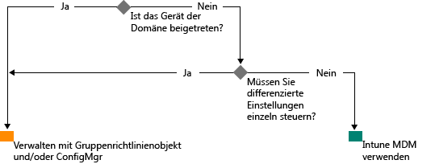

# Der Weg zur modernen Windows-Verwaltung mit Microsoft Intune

Die Nutzung privater Geräte für die Arbeit und Mitarbeiter, die außerhalb des Büros arbeiten, ändert die Weise, in der Organisationen Geräte verwalten. Während für bestimmte Teile mancher Organisationen vielleicht eine tiefgreifende, fein abgestufte Kontrolle über die verwendeten Geräte erforderlich ist, orientieren sich andere Organisationen eher an einer schlanken, szenariobasierten Verwaltung, um die Kräfte einer modernen Belegschaft freizusetzen.

Windows 10 setzt die Tradition fort, dass Windows das am besten verwaltete Betriebssystem für Organisationen darstellt. Windows unterstützt umfassende Verwaltung und Sicherheit durch Technologien wie Gruppenrichtlinien, Active Directory und System Center Configuration Manager. Es bietet darüber hinaus einen mobile-first, cloud-first-Ansatz zur modernen, vereinfachten Verwaltung mithilfe cloudbasierter Lösungen zur Geräteverwaltung, wie etwa Microsoft Enterprise Mobility Suite (EMS). Zukünftige Windows-Innovationen, die durch Windows as a Service bereitgestellt werden, werden durch schnelle, flexible Clouddienste wie Microsoft Intune, Azure Active Directory, Azure Rights Management Service, Office 365 und den Windows Store for Business ergänzt.

IT-Organisationen bietet sich so die Möglichkeit, größere Flexibilität mit Innovation und Kosteneinsparungen zu kombinieren. Dieses Dokument gibt eine Orientierung bei den Strategien zum Bereitstellen und Verwalten von Windows 10. Es bietet darüber hinaus Einblicke in die strategische Planung bei Microsoft im Hinblick auf Tools zur Geräteverwaltung. Bedenken Sie bei Ihren Überlegungen zu den Grundlagen von Verwaltung und ihrer Anwendung auf verschiedene Geräte die folgenden vier Phasen im Gerätelebenszyklus:

## Bereitstellung und Versorgung

Im Gegensatz zur traditionellen Betriebssystem-Bereitstellung, die komplexe IT-Operationen erfordert, öffnet moderne Geräteverwaltung die Tür zu „Out-of-the-Box-Verwaltung“. IT-Abteilungen möchten aus neuen Geräten auf einfache Weise voll konfigurierte, umfassend verwaltete Geräte machen, ohne neue Images zu erstellen.  Dynamische Bereitstellung ist einfacher denn je und wird durch cloudbasierte Dienste zur Geräteverwaltung Wirklichkeit, wie Microsoft Intune. Mit dem Windows-Designer für die Imageerstellung und -konfiguration (ICD) können Sie auch eigenständige Bereitstellungspakete erstellen. Natürlich unterstützen wir weiterhin herkömmliche Techniken zur Imageerstellung, damit Organisationen mithilfe von System Center Configuration Manager benutzerdefinierte Images erstellen können.

## Identität und Authentifizierung

Windows 10 und Dienste wie Azure Active Directory eröffnen neue Möglichkeiten für cloudbasierte Identität, Authentifizierung und Verwaltung. Szenarien wie BYOD und CYOD bringen für Unternehmen einen anderen Ansatz für den Zugriff der Benutzer auf Unternehmensressourcen und -Apps mit sich. Sie können die Benutzer- und Geräteverwaltung als zu einer von zwei Kategorien gehörig auffassen:

- Geräte im Firmenbesitz (CYOD) oder Privatbesitz (BYOD), die von mobilen Benutzern für SaaS-Apps wie Office 365 verwendet werden.

  Windows 10 ermöglicht Mitarbeitern die Bereitstellung von Geräten in Eigeninitiative. Geräte im Firmenbesitz können mithilfe von Azure AD Join einfach den Zugriff auf Unternehmensressourcen einrichten. Analog dazu erlaubt eine neue, vereinfachte BYOD-Oberfläche Benutzern das Hinzufügen ihres Arbeitskontos zu Windows und das Zugreifen auf Arbeitsressourcen auf privaten Geräten. Die Kombination aus Azure AD Join und automatischer Intune MDM-Registrierung bringt Geräte in [nur einem einfachen Schritt](https://blogs.technet.microsoft.com/ad/2015/08/14/windows-10-azure-ad-and-microsoft-intune-automatic-mdm-enrollment-powered-by-the-cloud/) in einen vom Unternehmen verwalteten Zustand, alles von der Cloud aus. Azure AD Join stellt außerdem eine hervorragende Lösung für vorübergehend beschäftigte Mitarbeiter, Partner oder Teilzeitkräfte dar. Diese Konten können von der lokalen AD-Domäne getrennt bleiben und trotzdem Zugriff auf die benötigten Unternehmensressourcen erhalten.
- PCs und Tablets mit Domänenmitgliedschaft, die traditionelle Anwendungen und Ressourcen verwenden, die Authentifizierung benötigen oder lokal auf streng vertrauliche Ressourcen oder Verschlusssachen zugreifen

  Windows 10-Geräte, die Mitglied einer lokalen Active Directory-Domäne sind, registrieren sich automatisch bei Azure AD, sodass Benutzer die zusätzlichen Vorteile von Windows 10-Benutzererfahrungen wie Einmaligem Anmelden bei lokalen und Cloudressourcen von jedem Ort aus, unternehmensweitem Roaming von Einstellungen, Microsoft Passport for Work und Windows Hello nutzen können. PCs und Tablets mit Domänenmitgliedschaft sollten auch weiterhin mit dem System Center Configuration Manager-Client oder Gruppenrichtlinien verwaltet werden.

Überprüfen Sie die Rollen in Ihrer Organisation. Identifizieren Sie Benutzer oder Geräte, für die eine Domänenmitgliedschaft erforderlich ist, und erwägen Sie, die anderen Benutzer auf Azure AD umzustellen. Weitere Informationen über die Weise, in der Windows 10 und Azure AD den Zugriff auf Arbeitsressourcen für heterogene Geräte und Szenarien optimieren, erfahren Sie in [diesem Artikel](https://azure.microsoft.com/en-us/documentation/articles/active-directory-azureadjoin-windows10-devices/).

Ein verallgemeinerter Entscheidungsbaum könnte etwa so aussehen. Natürlich sind in einigen Fällen Ausnahmen erforderlich.

## Einstellungen und Konfiguration

Die Konfigurationsanforderungen werden durch die erforderliche Verwaltungsstufe, die verwalteten Geräte und Daten und Branchenanforderungen zusammen definiert. Zugleich gibt es häufig Sorgen bei Mitarbeitern wegen strenger Richtlinien, die IT ihren privaten Geräten auferlegt, trotzdem möchten sie nicht auf den Zugriff auf Unternehmens-E-Mail und -Dokumente verzichten. Windows 10 stellt mithilfe einer gemeinsamen MDM-Schicht einen konsistenten Satz von Konfigurationen übergreifend für PCs, Tablets und Smartphones bereit. Der MDM-Ansatz legt den Schwerpunkt auf Einstellungen, durch die sich die Absichten des Administrators verwirklichen lassen, ohne jede einzelne Einstellung verfügbar zu machen. Im Gegensatz dazu bieten Gruppenrichtlinien fein abgestufte Einstellungen, die vom Administrator einzeln gesteuert werden. Ein Vorteil von MDM liegt darin, dass Administratoren mithilfe schlankerer und effizienterer Tools breiter gefasste Einstellungen für Datenschutz, Sicherheit und Anwendungsmanagement anwenden können. Dadurch ist MDM die richtige Wahl für Geräte, die ständig unterwegs sind.

Viele Organisationen müssen aber weiterhin Computer mit Domänenmitgliedschaft granular verwalten, etwa mithilfe der 1.500 konfigurierbaren Gruppenrichtlinieneinstellungen von Internet Explorer oder sehr spezifischer Windows Firewall-Regeln. In diesen Fällen stellen Gruppenrichtlinien und der System Center Configuration Manager auch weiterhin hervorragende Optionen zur Verwaltung dar. Gruppenrichtlinien sind die beste Möglichkeit, Windows PCs und Tablets mit Domänenzugehörigkeit, die mit dem Unternehmensnetzwerk verbunden sind, mithilfe von Windows-basierten Tools präzise zu verwalten. Microsoft fügt mit jeder neuen Version von Windows neue Einstellungen der Gruppenrichtlinien hinzu. Für eine fein abgestufte Konfiguration mit robuster Softwarebereitstellung , Windows-Updates und Betriebssystem-Bereitstellung bleibt Configuration Manager die empfohlene Lösung.

## Aktualisieren von Windows-Geräten

Mit Windows as a Service entfällt für IT-Organisationen die Notwendigkeit, mit jeder neuen Windows-Version komplexe Imagingvorgänge (Löschen und Laden) auszuführen. Gleich, ob auf Current Branch (CB) oder Current Branch for Business (CBB), Geräte erhalten die neusten Updates hinsichtlich Funktionen und Qualität mithilfe einfacher – oftmals automatischer – Prozesse zur Anwendung von Patches. MDM mit Intune bietet Tools für das Anwenden von Windows-Updates auf Clientcomputer im Unternehmen. Configuration Manager bietet umfassende Möglichkeiten zur Verwaltung und Nachverfolgung dieser Updates, einschließlich Wartungsfenster und automatischer Bereitstellungsregeln.

## Zusammenfassung

Wägen Sie in Ihren Überlegungen zu einer modernen Geräteverwaltung in Ihrer Organisation die Schritte ab, die am Beginn Ihres Wegs stehen können.

1. **Es sind Investitionen, die Sie heute tätigen können.** Welche Komponenten der herkömmlichen Geräteverwaltung müssen Sie beibehalten, und wo können Sie modernisieren? Ob Sie Schritte zum Minimieren der Erstellung von benutzerdefinierten Images unternehmen, die Verwaltung von Einstellungen neu bewerten oder Authentifizierung und Compliance überdenken, die Vorteile können sofort nutzbar sein.

2. **Evaluieren Sie die verschiedenen Anwendungsfälle in Ihrer Umgebung.** Gibt es Gruppen von Geräten, die von einer schlankeren, vereinfachten Verwaltung profitieren würden? BYOD-Geräte bieten sich beispielsweise grundsätzlich als Kandidaten für cloudbasierte Verwaltung an. Benutzer oder Geräte, die Daten verarbeiten, die strengeren Regeln unterliegen, erfordern möglicherweise eine lokale AD-Domäne zur Authentifizierung. Configuration Manager und EMS geben Ihnen die Möglichkeit, die Implementierung von modernen Verwaltungsszenarien zu erproben und zugleich verschiedene Geräte auf eine Weise einzubinden, die Ihren Unternehmensanforderungen optimal Rechnung trägt. Sie haben die Wahl.

## Die nächsten Schritte

- **Bewerten Sie die Verwaltungsanforderungen in Ihrer Umgebung.** Eine Größe passt vielleicht nicht zu allen Ihren Bedürfnissen, abhängig von den Benutzern, ihrer Mobilität, den Geräten und den Daten, auf die sie zugreifen.
- **Wägen Sie die Anforderungen ab.** Mit Windows 10, Configuration Manager und der Enterprise Mobility Suite verfügen Sie über die Flexibilität, die Erstellung von Images, Authentifizierung, Einstellungen und Verwaltungstools für jedes erdenkliche Szenario zu meistern.
- **Gehen Sie in kleinen Schritten vor.** Der Umstieg auf eine moderne Geräteverwaltung muss keine Umstellung über Nacht sein.
- **Optimieren Sie Ihre vorhandenen Investitionen.** Machen Sie sich auf dem Weg von der traditionellen lokalen Verwaltung hin zu einer modernen, cloudbasierten Verwaltung die flexible Hybridarchitektur von Configuration Manager und Intune zunutze. In dem Maß, da im cloudbasierten Identitäts-/MDM-Modell weitere Möglichkeiten verfügbar werden, sieht sich Microsoft verpflichtet, einen klaren Weg von der herkömmlichen zur modernen Verwaltung bereitzustellen.

<!--HONumber=Oct16_HO4-->

