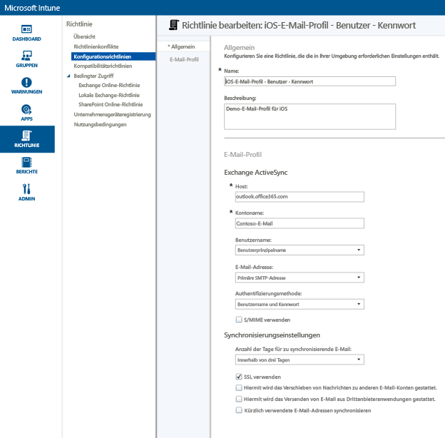
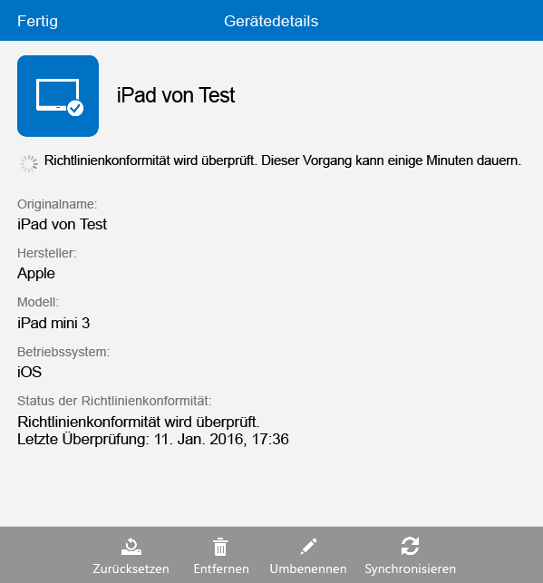

---
# required metadata

title: Einrichten des E-Mail-Zugriffs für iOS-Geräte mit Microsoft Intune | Microsoft Intune
description:
keywords:
author: Staciebarker
manager: jeffgilb
ms.date: 04/28/2016
ms.topic: article
ms.prod:
ms.service: microsoft-intune
ms.technology:
ms.assetid: 3853673d-290a-400f-8e45-d55e39d42acd

# optional metadata

#ROBOTS:
#audience:
#ms.devlang:
ms.reviewer: jeffgilb
ms.suite: ems
#ms.tgt_pltfrm:
#ms.custom:

---

# Einrichten des E-Mail-Zugriffs für iOS-Geräte mit Microsoft Intune
Wenn Geräte bei Intune registriert sind, können Sie die Geräte so konfigurieren, dass die Benutzer auf Unternehmens-E-Mails zugreifen können. Eine Möglichkeit, dies für bestimmte Gerätetypen zu erreichen, ist das Erstellen und Bereitstellen eines **E-Mail-Profils**. E-Mail-Profile sind eine Art Intune-Richtlinie, über die das Gerät eines Benutzers eingerichtet und mit dem E-Mail-Dienst Ihres Unternehmens verbunden wird.
Durch Verwendung eines E-Mail-Profils erfolgt der E-Mail-Zugriff für registrierte Geräte automatisch, sodass Sie nicht jedes Gerät manuell einrichten müssen. Ein E-Mail-Profil stellt außerdem sicher, dass alle Endbenutzer den Zugriff auf die gleiche Weise und mit den gleichen Grundeinstellungen einrichten.

## Ziele dieser exemplarischen Vorgehensweise

- Erstellen und Bereitstellen eines E-Mail-Profils für iOS-Geräte
- Überprüfen, ob die E-Mail-Profilrichtlinie erfolgreich angewendet wurde

## Für diese exemplarische Vorgehensweise erforderliche Geräte und Komponenten

- Ein Exchange-Server, der entweder lokal oder im Rahmen Ihres Office/E3-Abonnements in Azure gehostet wird.
- Der Hostname des Exchange-Servers Ihres Unternehmens. Dies ist der vollqualifizierte Domänenname (FQDN). Beispiel: **contosodemo55.onmicrosoft.com**..
- Eine Benutzergruppe, für die das E-Mail-Profil bereitgestellt werden soll. Wenn Sie die exemplarische Vorgehensweise [Starten einer Microsoft Intune-Testversion und Bereitstellen einer iOS-PIN-Richtlinie](start-a-microsoft-intune-trial-and-deploy-ios-pin-policy.md) durchlaufen haben, können Sie die dafür erstellte Benutzergruppe **GroupDemo** verwenden.
- Registrierte iOS-Geräte, auf denen das Profil bereitgestellt werden soll. Wenn Sie die exemplarische Vorgehensweise [Starten einer Microsoft Intune-Testversion und Bereitstellen einer iOS-PIN-Richtlinie](start-a-microsoft-intune-trial-and-deploy-ios-pin-policy.md) durchlaufen haben, verfügen Sie über einige registrierte iOS-Geräte.

## Schritte zum Erstellen und Bereitstellen eines E-Mail-Profils für iOS-Geräte

In dieser exemplarischen Vorgehensweise verwenden wir den gehosteten Exchange-Server, der zu einem Testabonnement gehört.
1. Klicken Sie in der Intune-Konsole auf **Richtlinie** und dann auf **Richtlinie hinzufügen**..

2. Erweitern Sie im Dialogfeld **Neue Richtlinie erstellen** die Option **iOS**, wählen Sie **E-Mail-Profil** aus, und klicken Sie dann auf **Richtlinie erstellen**..

3. Geben Sie auf der Seite „Richtlinie erstellen“ einen Namen für die Richtlinie, z. B. **iOS-E-Mail-Profil – Benutzerkennwort** und eine Beschreibung ein. Möglicherweise verfügen Sie über mehrere E-Mail-Profile für verschiedene Gerätetypen und Authentifizierungsmethoden. Daher können Sie im Namen angeben, wofür das Profil gedacht ist.
4. Geben Sie den Namen des Exchange-Hosts ein. Da wir den in Azure gehosteten Exchange-Server verwenden, geben wir als Hostnamen einfach **outlook.office365.com** ein.

5. Geben Sie den Kontonamen ein, der Benutzern des Geräts angezeigt wird, damit sie den E-Mail-Dienst einfacher identifizieren können. Beispiel: **Contoso-E-Mail**..
6. Da wir den Benutzernamen und das Kennwort verwenden, um den Benutzer beim Exchange-Dienst zu authentifizieren, lassen Sie die Einstellungen für Benutzername und Kennwort unverändert.
7. Passen Sie die Synchronisierungseinstellungen entsprechend Ihren Anforderungen an. Verwenden Sie vorerst die Standardwerte, es sei denn, Sie möchten eine bestimmte Einstellung ändern.  
8. Klicken Sie auf **Richtlinie speichern**..
9. Ein Dialogfeld wird angezeigt, in dem Sie gefragt werden, ob Sie die Richtlinie jetzt bereitstellen möchten. Klicken Sie auf **Ja**..

10. Wählen Sie im Fenster, das als Nächstes angezeigt wird, die Benutzergruppe aus, für die das E-Mail-Profil bereitgestellt werden soll. Klicken Sie auf **Hinzufügen** und dann auf **OK**..

Nachdem Sie auf **OK** geklickt haben, wird die Richtlinie innerhalb weniger Minuten auf registrierte Geräte übertragen.

## Schritte zum Überprüfen, ob das Profil erfolgreich angewendet wurde

Um sicherzustellen, dass das Profil angewendet wurde, benötigen Sie Zugriff auf eines der Geräte, auf denen Sie das E-Mail-Profil bereitgestellt haben.
1. Öffnen Sie auf dem iOS-Gerät die Mail-App.
Die App fordert Sie zur Angabe des E-Mail-Benutzernamens und -Kennworts auf.

2. Geben Sie den Benutzernamen und das Kennwort für das Exchange-E-Mail-Konto des Benutzers ein, und tippen Sie dann auf **OK**..
 Die Mail-App wird mit dem Exchange-Konto geöffnet, und es beginnt die Synchronisierung von E-Mails mit dem Gerät.

3. Überprüfen Sie die Kontoeinstellungen in der Mail-App, um sicherzustellen, dass der Kontoname demjenigen entspricht, den Sie in das E-Mail-Profil eingegeben haben (z. B. **Contoso Mail**), und um sicherzustellen, dass die Synchronisierungseinstellungen ordnungsgemäß festgelegt sind.

  Wenn das E-Mail-Profil nicht automatisch auf das Gerät angewendet wurde, können Sie die Richtlinie mithilfe der Unternehmensportal-App auf dem Gerät manuell anwenden.
1. Öffnen Sie die Unternehmensportal-App.
2. Tippen Sie auf **Meine Geräte**..
3. Tippen Sie auf den Namen Ihres Geräts.

4. Tippen Sie auf **Sync** > **Kompatibilität prüfen**..

Nach einigen Augenblicken wird das E-Mail-Profil auf das Gerät angewendet. Danach können Sie die Schritte zur Überprüfung ausführen, um sicherzustellen, dass das Profil ordnungsgemäß angewendet wurde.

## Weitere Informationen
[Intune-Evaluierungshandbuch](get-started-with-a-30-day-trial-of-microsoft-intune.md)

<!--HONumber=May16_HO1-->

