---
# required metadata

title: Starten eines Microsoft Intune-Tests und Bereitstellen einer iOS-PIN-Richtlinie | Microsoft Intune
description:
keywords:
author: Staciebarker
manager: jeffgilb
ms.date: 04/28/2016
ms.topic: article
ms.prod:
ms.service: microsoft-intune
ms.technology:
ms.assetid: 06cb9a73-0f17-44b3-b334-86c98020316e

# optional metadata

#ROBOTS:
#audience:
#ms.devlang:
ms.reviewer: jeffgilb
ms.suite: ems
#ms.tgt_pltfrm:
#ms.custom:

---

# Starten eines Microsoft Intune-Tests und Bereitstellen einer iOS-PIN-Richtlinie
Diese schrittweisen Anweisungen unterstützen Sie beim Einrichten einer Intune-Testversion und Konfigurieren einer PIN-Richtlinie für iOS-Geräte. Eine Liste mit anderen Intune-Evaluierungsaufgaben, die Sie ausprobieren können, finden Sie unter [Allgemeine Microsoft Intune-Evaluierungsaufgaben](common-microsoft-intune-evaluation-tasks.md)..

## Überprüfen der Voraussetzungen für diese Aufgabe

-   Windows-PC mit Internet Explorer – für administrative Aufgaben

-   Gerät mit iOS 7.1 oder höher zum Testen der Validierung der Benutzerrichtlinie

-   Telefon zur Authentifizierung während der Anmeldung der Testversion

## Erstellen eines kostenlosen Intune-Testkontos
> [!NOTE]
> Wenn Sie bereits über ein Intune-Abonnement verfügen, überspringen Sie diesen Abschnitt und fahren mit dem nächsten Abschnitt fort.

1.  Klicken Sie auf einem Windows-PC mit der rechten Maustaste auf **Internet Explorer** (IE), und wählen Sie **InPrivate-Browsen** aus..

    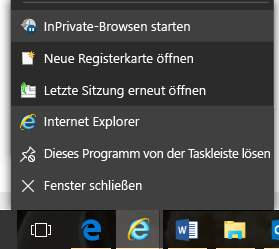

2.  Wechseln Sie zum [Intune-Anmeldungsportal](https://portal.office.com/Signup/Signup.aspx?OfferId=40BE278A-DFD1-470a-9EF7-9F2596EA7FF9&dl=INTUNE_A&ali=1), stellen Sie die erforderlichen Informationen bereit, und klicken Sie dann auf **Weiter**..

    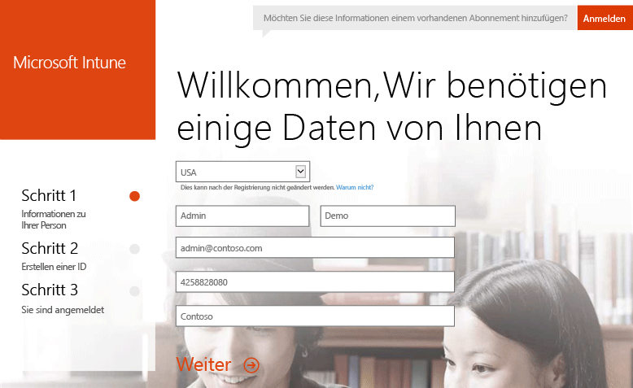

3.  Geben Sie eine Benutzer-ID und das Kennwort für Ihr Administratorkonto ein, und klicken Sie auf **Weiter**. Sie verwenden diese ID für die Anmeldung beim Intune-Portal, um Ihre Administratoraufgaben wahrzunehmen.

    

4.  Geben Sie Ihre Mobiltelefonnummer ein, und klicken Sie zum Überprüfen Ihrer Nummer auf **SMS**.

    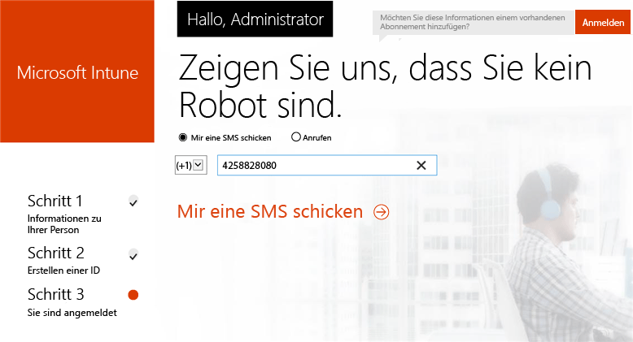

5.  Speichern Sie die auf dem Bildschirm angezeigten Informationen, und klicken Sie dann auf **Jetzt kann es losgehen...**..

    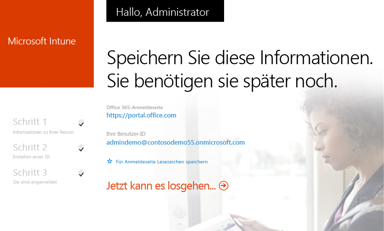

## Erstellen eines Testbenutzers

1.  Klicken Sie auf einem Windows-PC auf **Start**, um zur Seite für die Benutzerverwaltung zu wechseln.

    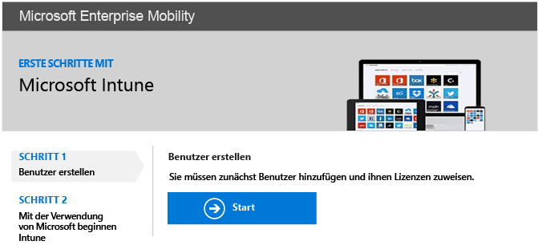

2.  Klicken Sie auf die Schaltfläche **+**, um einen Benutzer hinzuzufügen.

    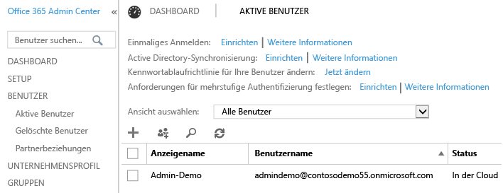

3.  Auf der Seite **Neues Benutzerkonto erstellen**:

    1.  Geben Sie Informationen für den Testbenutzer an.

    2.  Wählen Sie die Option **Kennwort eingeben** aus.

    3.  Deaktivieren Sie das Kontrollkästchen **Diese Person muss ihr Kennwort bei der nächsten Anmeldung ändern**.

    4.  Klicken Sie auf **Erstellen**..

    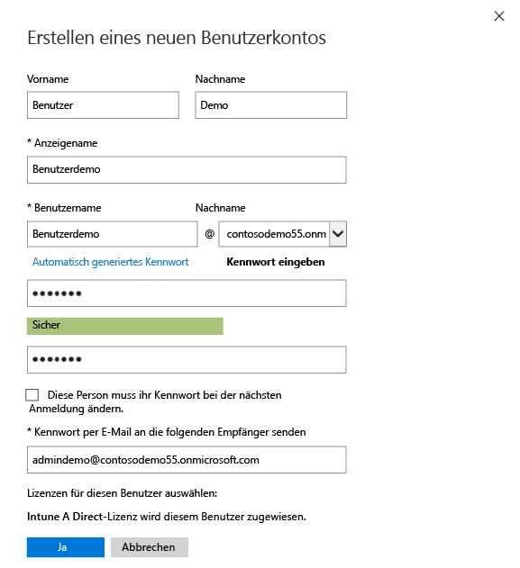

4.  Klicken Sie auf der Seite zur Bestätigung der Erstellung auf **Schließen**..

    

5.  Klicken Sie auf die Schaltfläche **Aktualisieren**, um den von Ihnen erstellten Testbenutzer anzuzeigen.

    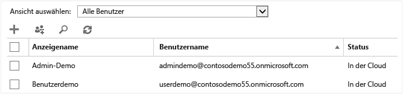

## Konfigurieren einer iOS-PIN-Richtlinie für den Testbenutzer

1.  Legen Sie auf einem Windows-PC Intune als MDM-Autorität fest:

    1.  Wechseln Sie zur [Intune-Verwaltungskonsole](http://manage.microsoft.com/), melden Sie sich mit Ihrem Administratorkonto an, und klicken Sie auf **Verwaltung mobiler Geräte starten**. Die Seite „Autorität für die Verwaltung mobiler Geräte“ wird geöffnet.

        

    2.  Klicken Sie auf den Link **Autorität für die Verwaltung mobiler Geräte festlegen**.

        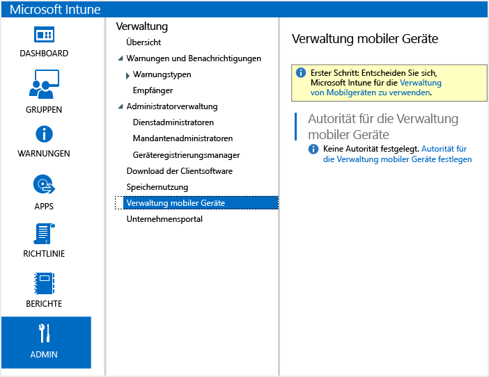

2.  Aktivieren Sie iOS-Geräte für die Registrierung. Über diesen Prozess wird zwischen dem Apple Push Notification Service (APNS) und Ihrem Intune-Abonnement ein vertrauenswürdiges Zertifikat eingerichtet.

    1.  Klicken Sie auf **iOS- und Mac OS X-Plattform aktivieren**..

        

    2.  Klicken Sie auf **APNS-Zertifikatanforderung herunterladen**..

        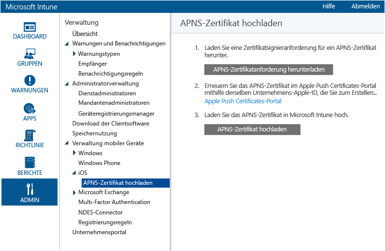

    3.  Geben Sie einen Dateinamen und Speicherort für die Zertifikatsignieranforderung (CSR) an, und klicken Sie dann auf **Speichern**. Diese Datei enthält den öffentlichen Schlüssel, der mit einem privaten Schlüssel übereinstimmt, der zu Ihrem Intune-Abonnement gehört.

        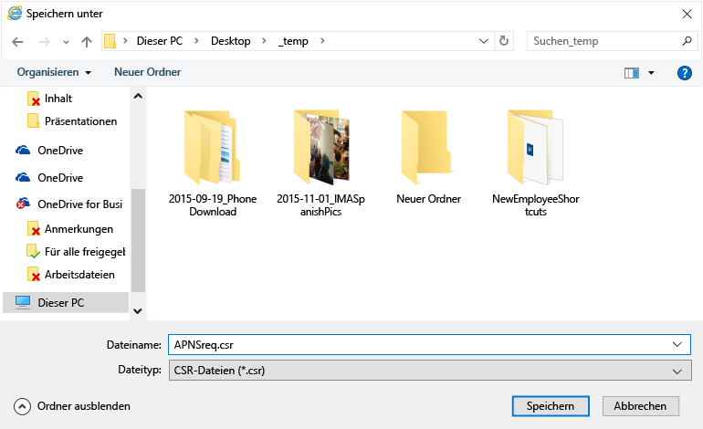

    4.  Klicken Sie auf **Apple Push Certificates-Portal**, um eine neue Registerkarte zu öffnen.

        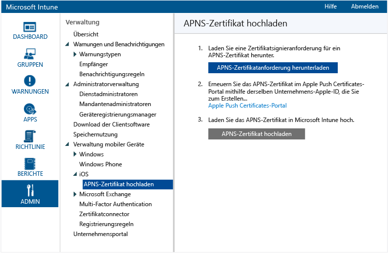

    5.  Geben Sie Ihre Apple-ID und das zugehörige Kennwort ein, und klicken Sie auf **Anmelden**. Bei dieser ID kann es sich um die ID handeln, die Sie auf Ihrem iOS-Gerät zum Abrufen von Apps aus dem iOS App Store verwenden.

        

    6.  Klicken Sie auf **Zertifikat erstellen**..

        

    7.  Lesen Sie die Nutzungsbedingungen von Apple, aktivieren Sie das Kontrollkästchen, und klicken Sie auf **Annehmen**..

        

    8.  Klicken Sie auf **Durchsuchen**..

        

    9. Wählen Sie die zuvor gespeicherte CSR-Datei aus, und klicken Sie auf **Öffnen**..

        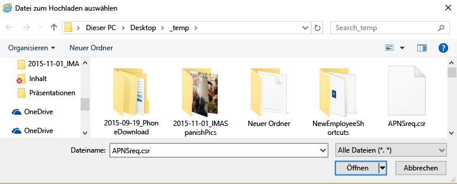

    10. Klicken Sie auf die Schaltfläche **Hochladen**.

        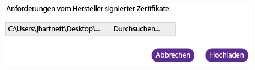

    11. Wenn Sie zum Herunterladen einer JSON-Datei aufgefordert werden, klicken Sie auf **Speichern unter**..

        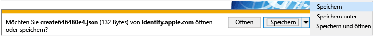

    12. Geben Sie einen Speicherort für die JSON-Datei an, und klicken Sie auf **Speichern**..

        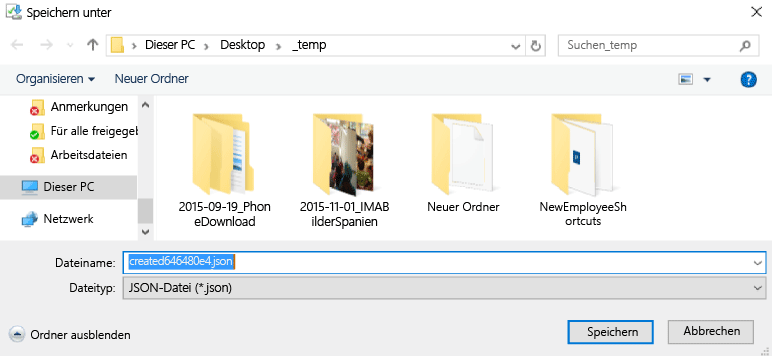

        Wenn auf der Seite nach einigen Sekunden keine automatische Weiterleitung erfolgt, klicken Sie auf **Abbrechen**..

        

    13. Um die neu erstellte Zertifikatdatei abzurufen, klicken Sie auf **Herunterladen**..

        

    14. Wenn Sie zum Herunterladen einer PEM-Datei aufgefordert werden, klicken Sie auf **Speichern unter**..

        

    15. Geben Sie einen Speicherort für die PEM-Datei an, und klicken Sie auf **Speichern**..

        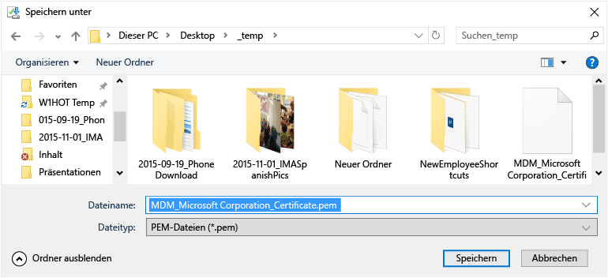

    16. Kehren Sie zur Registerkarte der Intune-Verwaltungskonsole zurück, und klicken Sie auf die **APNS-Zertifikat hochladen**..

        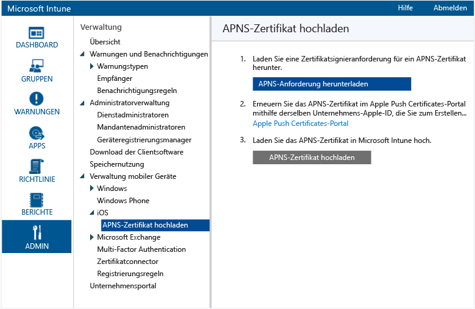

    17. Geben Sie Ihre Apple-ID ein, und klicken Sie auf **Durchsuchen**..

        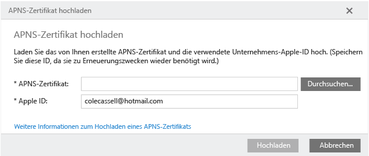

    18. Wählen Sie die soeben gespeicherte PEM-Datei aus, und klicken Sie auf **Öffnen**..

        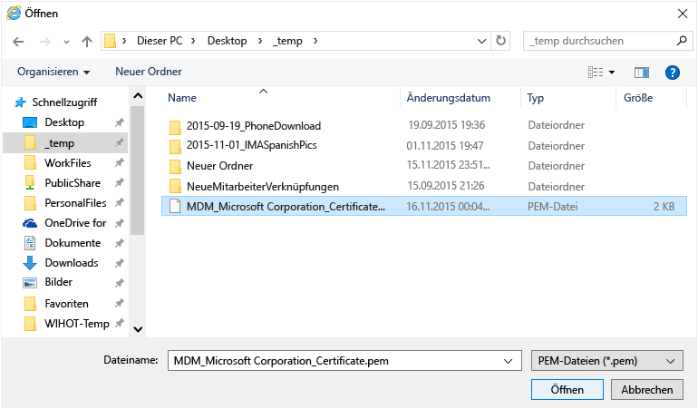

    19. Klicken Sie auf **Hochladen**..

        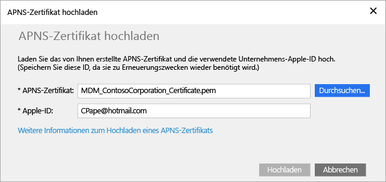

        Ihr APNS-Zertifikat ist jetzt konfiguriert.

        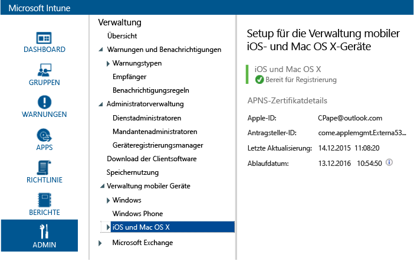

3.  Erstellen Sie zum Ausrichten der Richtlinie eine Testbenutzergruppe:

    1.  Klicken Sie im linken Bereich auf **Gruppen**..

        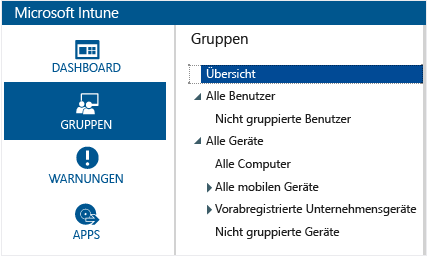

    2.  Klicken Sie ganz rechts auf **Gruppe erstellen**..

        

    3.  Geben Sie einen Gruppennamen an, wählen Sie **Alle Benutzer** als übergeordnete Gruppe aus, und klicken Sie dann auf **Weiter**..

        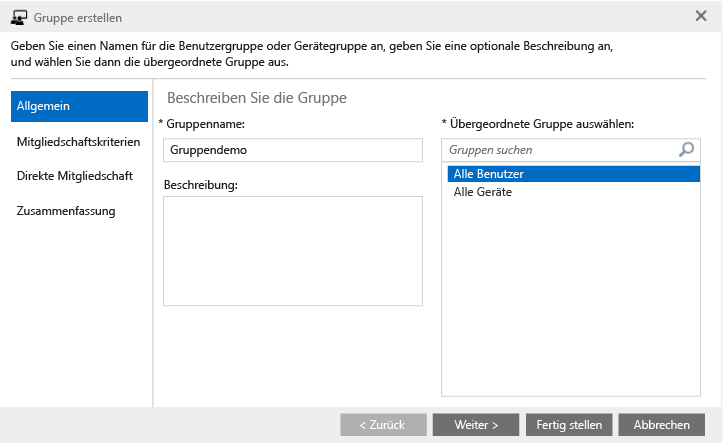

    4.  Wählen Sie im Feld **Gruppenmitgliedschaft starten mit** die Option **Alle Benutzer in der übergeordneten Gruppe** aus, und klicken Sie dann auf **Fertig stellen**..

        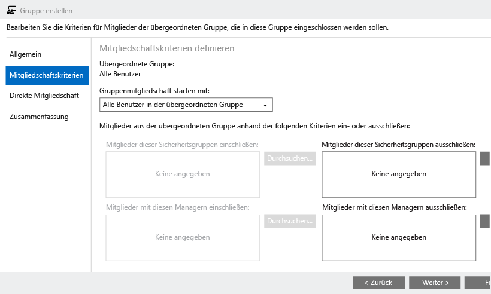

4.  Erstellen Sie eine iOS-PIN-Richtlinie, und richten Sie diese auf die Testbenutzergruppe aus:

    1.  Klicken Sie im linken Bereich auf **Richtlinie**..

        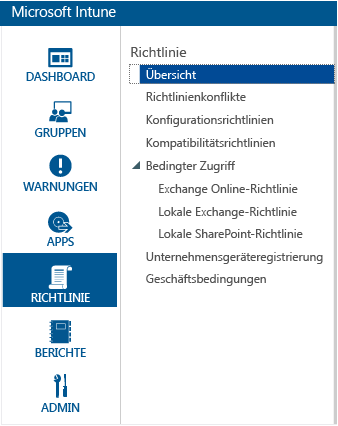

    2.  Klicken Sie ganz rechts auf **Richtlinie hinzufügen**..

        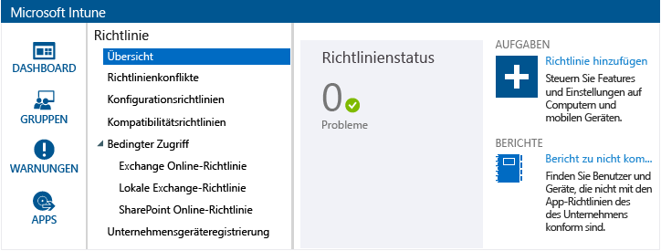

    3.  Erweitern Sie den iOS-Knoten, wählen Sie die Zeile **Allgemeine Konfiguration** aus, und klicken Sie auf **Richtlinie erstellen**..

        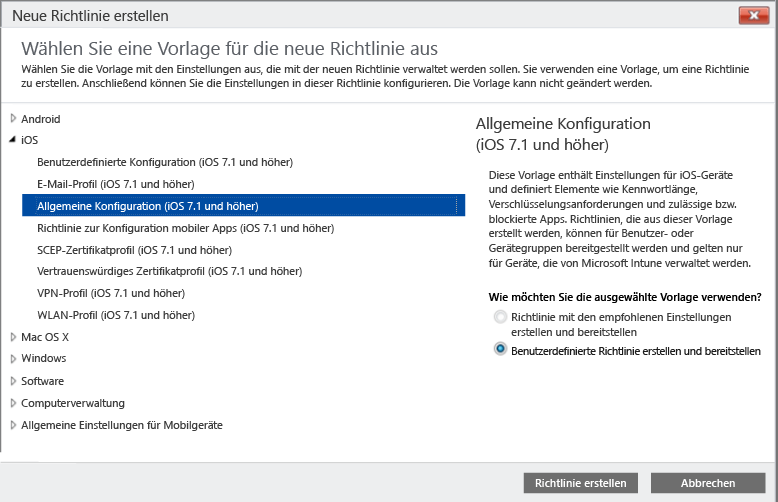

    4.  Geben Sie einen Namen für die Richtlinie ein, aktivieren Sie die Option **Kennwort zum Entsperren mobiler Geräte erforderlich**, und legen Sie für die Option **Minimale Kennwortlänge** den Wert **4** fest..

        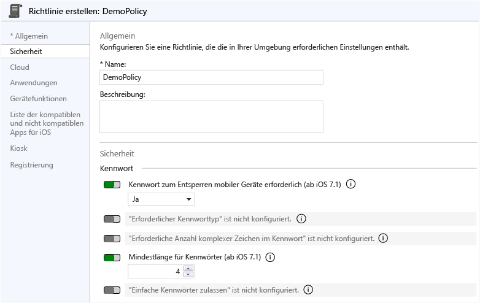

    5.  Klicken Sie zum Bereitstellen der Richtlinie auf **Ja**.

        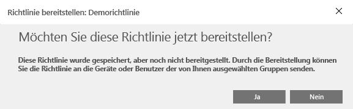

    6.  Klicken Sie auf die zuvor erstellte Benutzergruppe, anschließend auf **Hinzufügen** und dann auf **OK**..

        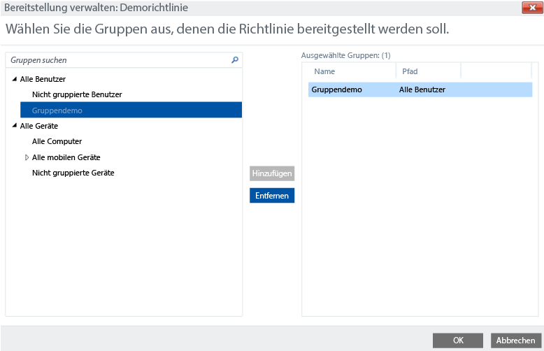

        Sie verfügen jetzt über eine iOS-PIN-Richtlinie, die auf Ihre Testbenutzergruppe ausgerichtet ist.

        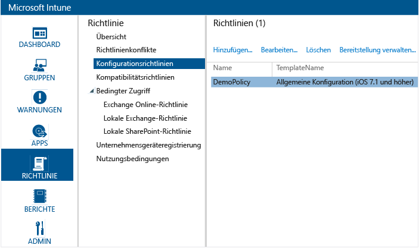

## Überprüfen, ob die Richtlinie auf einem iOS-Gerät erzwungen wird

1.  Starten Sie auf einem iPad den iOS App Store, installieren Sie die kostenlose App **Intune-Unternehmensportal**, und öffnen Sie sie anschließend.

    

2.  Geben Sie den Namen und das Kennwort für Ihr Testbenutzerkonto ein, und tippen Sie auf **Anmelden**..

    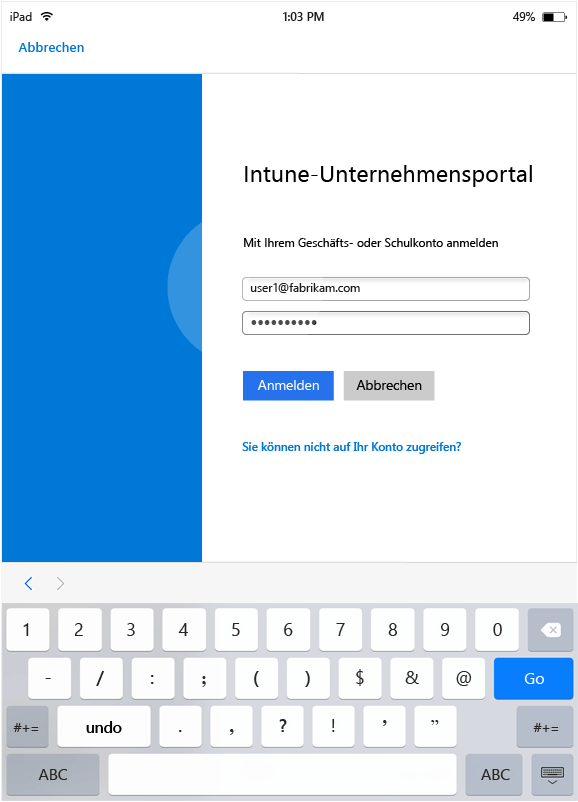

3.  Tippen Sie auf **Registrieren**, um mit der Registrierung des Geräts in Intune zu beginnen.

    

4.  Tippen Sie auf dem Bildschirm **Profil installieren** auf **Installieren**..

    

5.  Tippen Sie im Dialogfeld **Profil installieren** auf **Installieren**..

    

6.  Tippen Sie auf dem Bildschirm **Warnung** auf **Installieren**..

    

7.  Tippen Sie im Dialogfeld **Remoteverwaltung** auf **Vertrauen**..

    

8.  Wenn die Installation des Verwaltungsprofils abgeschlossen ist, tippen Sie auf **Fertig**. Die Registrierung ist nun abgeschlossen.

    

9. Wenn die Registrierung abgeschlossen ist, tippen Sie auf **OK** und schließen dann die Unternehmensportal-App.

    

10. Wenn Sie zum Konfigurieren einer Kennung aufgefordert werden, tippen Sie auf **Weiter**..

    

11. Geben Sie Ihre Kennung ein, tippen Sie auf **Weiter**, geben Sie Ihre Kennung erneut ein, und tippen Sie auf **Speichern**..

    

12. Drücken Sie den Netzschalter zum Sperren Ihres iPads, streichen Sie dann zum Entsperren über das Display, und prüfen Sie, ob Sie jetzt Ihre Kennung eingeben müssen, um das Gerät zu entsperren.

### Weitere Informationen:
[Intune-Evaluierungsanleitung](get-started-with-a-30-day-trial-of-microsoft-intune.md)

<!--HONumber=May16_HO1-->

