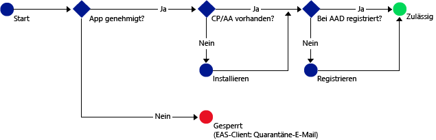

# Zulassen des Zugriffs auf Office 365-Dienste ausschließlich für mobile Apps, die Intune-Richtlinien für die Verwaltung mobiler Anwendungen unterstützen
[Intune-Richtlinien für die Verwaltung mobiler Anwendungen (MAM)](protect-apps-and-data-with-microsoft-intune.md) unterstützen Sie beim Schutz Ihrer Unternehmensdaten auf Geräten, die für die Verwaltung in Intune registriert sind. Richtlinien für die Verwaltung mobiler Anwendungen können Sie auch auf **mitarbeitereigenen Geräten verwenden, die nicht für die Verwaltung in Intune registriert sind**.  Auch wenn Sie das Gerät nicht verwalten, müssen Sie in diesem Fall dennoch sicherstellen, dass Unternehmensdaten und -ressourcen geschützt sind. Mithilfe des bedingten Zugriffs für die Verwaltung mobiler Anwendungen (MAM CA) können Sie eine Richtlinie erstellen, mit der nur mobile Apps auf O365-Dienste wie Exchange Online zugreifen können, die Intune-Richtlinien für die Verwaltung mobiler Anwendungen unterstützen.

Wenn Sie beispielsweise zulassen, dass nur die **Microsoft Outlook-App** auf Exchange Online zugreifen kann, können Sie so **verhindern, dass die in iOS und Android integrierten Mail-Apps**, die nicht über den Datenschutz von Intune-Richtlinien für die Verwaltung mobiler Anwendungen verfügen, E-Mails von **Exchange Online** empfangen.

Das folgende Diagramm zeigt den Ablauf, mit dem Richtlinien für den bedingten Zugriff für die Verwaltung mobiler Anwendungen bestimmen, wann der Zugriff zugelassen oder blockiert wird: .

Beschreibung der Abkürzungen, die in den Diagrammen verwendet werden:
* **CP**: Unternehmensportal-App
* **AA**: Azure-Authentifikator-App
* **AAD**: Azure Active Directory
* **EAS**: Exchange Active Sync

## Voraussetzungen
**Bevor** Sie MAM CA-Richtlinien konfigurieren können, müssen Sie über ein **Enterprise Mobility + Security- oder ein Azure Active Directory Premium-Abonnement** verfügen, und die Benutzer müssen für EMS oder Azure AD lizenziert sein. Weitere Informationen finden Sie in der [Preisübersicht für Enterprise Mobility](https://www.microsoft.com/en-us/cloud-platform/enterprise-mobility-pricing) oder der [Preisübersicht für Azure Active Directory](https://azure.microsoft.com/en-us/pricing/details/active-directory/).

## Unterstützte Apps
**Exchange Online**: **Microsoft Outlook** für Android und iOS.

Informationen zur Benutzererfahrung mit einer App, die über MAM CA-Richtlinien verfügt, finden Sie unter [What to expect when using an app with MAM CA](use-apps-with-mam-ca.md) (Was Sie bei Verwendung einer App mit MAM CA erwarten können).

## Nächste Schritte
[Erstellen einer Exchange Online-Richtlinie für MAM-Apps](mam-ca-for-exchange-online.md)

[Blockieren von Apps, die über keine moderne Authentifizierung verfügen](block-apps-with-no-modern-authentication.md)

### Weitere Informationen:

[Schützen von App-Daten mithilfe von Verwaltungsrichtlinien für mobile Apps mit Microsoft Intune](protect-app-data-using-mobile-app-management-policies-with-microsoft-intune.md)

<!--HONumber=Oct16_HO4-->

