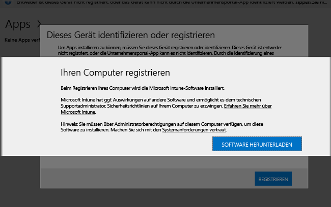

---

title: Installieren der PC-Clientsoftware | Microsoft Intune
description: Befolgen Sie diese Anleitung zum Verwalten Ihrer Windows-PCs durch die Microsoft Intune-Clientsoftware.
keywords: 
author: staciebarker
ms.date: 07/19/2016
ms.topic: article
ms.prod: 
ms.service: microsoft-intune
ms.technology: 
ms.assetid: 64c11e53-8d64-41b9-9550-4b4e395e8c52
ms.reviewer: owenyen
ms.suite: ems
translationtype: Human Translation
ms.sourcegitcommit: 103e7065d1e2c3281f8f04808ee2546d3c7e2b53
ms.openlocfilehash: 32af8a615453b8c72e704f40dcdf0de6fbf10907


---

# <a name="install-the-intune-software-client-on-windows-pcs"></a>Installieren des Intune-Softwareclients auf Windows-PCs
Windows-PCs können mithilfe der Installation der Intune-Clientsoftware registriert werden. Die Intune-Clientsoftware kann auf folgenden Wegen installiert werden:

- manuell
- Installiert durch Gruppenrichtlinien
- In einem Datenträgerimage eingeschlossen
- Benutzerinstallation

Der Intune-Softwareclient, der zuerst heruntergeladen wird, enthält die für die Registrierung des PCs in der Intune-Verwaltung mindestens erforderliche Software. Nachdem ein PC registriert ist, lädt der Intune-Softwareclient die vollständige Clientsoftware herunter, die für die Verwaltung des PCs erforderlich ist.

Diese Reihe von Downloads minimiert die Zeit, die benötigt wird, um Ihren PC zunächst in Intune zu registrieren. Außerdem wird sichergestellt, dass auf dem Client die neueste verfügbare Software läuft, nachdem der zweite Download abgeschlossen ist.

## <a name="download-the-intune-client-software"></a>Herunterladen der Intune-Clientsoftware

Alle Methoden, bis auf die eigenhändige Installation der Intune-Clientsoftware von Benutzern, erfordern einen Softwaredownload für die Bereitstellung.

1.  Klicken Sie in der [Microsoft Intune-Verwaltungskonsole](https://manage.microsoft.com/) auf **Admin** &gt; **Download der Clientsoftware**.

  

2.  Klicken Sie auf der Seite **Clientsoftwaredownload** auf **Clientsoftwaredownload**. Speichern Sie anschließend das Paket **Microsoft_Intune_Setup.zip**, das die Software enthält, an einem sicheren Speicherort in Ihrem Netzwerk.

    > [!NOTE]
    > Das Installationspaket für die Intune-Clientsoftware enthält Informationen zu Ihrem Konto. Wenn nicht autorisierte Benutzer Zugriff auf das Installationspaket erhalten, können sie Computer bei dem Konto registrieren, dem das eingebettete Zertifikat entspricht, und möglicherweise Zugriff auf Unternehmensressourcen erhalten.

3.  Extrahieren Sie an dem sicheren Ort in Ihrem Netzwerk den Inhalt des Installationspakets.

    > [!IMPORTANT]
    > Sie dürfen die extrahierte Datei **ACCOUNTCERT** weder umbenennen noch entfernen, da sonst die Installation der Clientsoftware misslingt.

## <a name="deploy-the-client-software-manually"></a>Manuelles Bereitstellen der Clientsoftware

Wechseln Sie auf einem Computer zum Ordner, in dem sich die Dateien für die Installation der Clientsoftware befinden. Führen Sie dann **Microsoft_Intune_Setup.exe** aus, um die Clientsoftware zu installieren.

    > [!NOTE]
    > The status of the installation is displayed when you hover over the icon in the taskbar on the client computer.

## <a name="deploy-the-client-software-by-using-group-policy"></a>Bereitstellen der Clientsoftware mithilfe von Gruppenrichtlinien

1.  Führen Sie im Ordner, der die Dateien **Microsoft_Intune_Setup.exe** und **MicrosoftIntune.accountcert** enthält, den folgenden Befehl aus, um die Windows Installer-basierten Installationsprogramme für 32-Bit- und 64-Bit-Computer zu extrahieren:

    ```
    Microsoft_Intune_Setup.exe/Extract <destination folder>
    ```

2.  Kopieren Sie die Dateien **Microsoft_Intune_x86.msi**, **Microsoft_Intune_x64.msi** und **MicrosoftIntune.accountcert** in einen Netzwerkpfad, auf den alle Computer, auf denen die Clientsoftware installiert werden soll, zugreifen können.

    > [!IMPORTANT]
    > Benennen Sie die Dateien nicht um, und trennen sie sie nicht, da bei der Installation der Clientsoftware sonst ein Fehler auftritt.

3.  Verwenden Sie Gruppenrichtlinien, um die Software auf Computern in Ihrem Netzwerk bereitzustellen.

    Weitere Informationen zum automatischen Bereitstellen von Software mithilfe von Gruppenrichtlinien finden Sie in Ihrer Windows Server-Dokumentation.

## <a name="deploy-the-client-software-as-part-of-an-image"></a>Bereitstellen der Clientsoftware als Teil eines Images
Sie können die Intune-Clientsoftware als Teil eines Betriebssystemabbilds auf Computern installieren. Verwenden Sie dazu die folgende Vorgehensweise als Leitfaden:

1.  Kopieren Sie die Clientinstallationsdateien **Microsoft_Intune_Setup.exe** und **MicrosoftIntune.accountcert** in den Ordner **%Systemdrive%\Temp\Microsoft_Intune_Setup** auf dem Referenzcomputer.

2.  Erstellen Sie den Registrierungseintrag **WindowsIntuneEnrollPending** , indem Sie dem Skript **SetupComplete.cmd** den folgenden Befehl hinzufügen:

    ```
    %windir%\system32\reg.exe add HKEY_LOCAL_MACHINE\Software\Microsoft\Onlinemanagement\Deployment /v
    WindowsIntuneEnrollPending /t REG_DWORD /d 1
    ```

3.  Fügen Sie **setupcomplete.cmd** den folgenden Befehl hinzu, um das Registrierungspaket mit dem Befehlszeilenargument „/PrepareEnroll“ auszuführen:

    ```
    %systemdrive%\temp\Microsoft_Intune_Setup\Microsoft_Intune_Setup.exe /PrepareEnroll
    ```
    > [!TIP]
    > Mithilfe des Skripts **SetupComplete.cmd** können von Windows Setup Veränderungen am System vorgenommen werden, bevor sich ein Benutzer anmeldet. Durch das Befehlszeilenargument **/PrepareEnroll** wird ein Zielcomputer auf die automatische Registrierung bei Intune nach Beenden von Windows Setup vorbereitet.

4.  Legen Sie die Datei **SetupComplete.cmd** auf dem Referenzcomputer im Ordner **%Windir%\Setup\Scripts** ab.

5.  Erstellen Sie ein Systemabbild des Referenzcomputers, und stellen sie es auf den Zielcomputern bereit.

Wenn der Zielcomputer nach Beenden von Windows Setup neu gestartet wird, wird der Registrierungsschlüssel **WindowsIntuneEnrollPending** erstellt. Mit dem Registrierungspaket wird überprüft, ob der Computer registriert ist. Wenn der Computer registriert ist, ist keine weitere Aktion erforderlich. Wenn der Computer nicht registriert ist, wird vom Registrierungspaket eine Aufgabe zur automatischen Microsoft Intune-Registrierung erstellt.

Bei der Ausführung dieser Aufgabe zur automatischen Registrierung zum nächsten geplanten Zeitpunkt prüft die Aufgabe das Vorhandensein des Registrierungswerts **WindowsIntuneEnrollPending** und versucht, den Ziel-PC bei Intune zu registrieren. Sollte die Registrierung aus einem beliebigen Grund fehlschlagen, wird die Registrierung beim nächsten Ausführen der Aufgabe erneut versucht. Die Wiederholungen werden für einen Monat ausgeführt.

Die Aufgabe zur automatischen Intune-Registrierung, der Registrierungswert **WindowsIntuneEnrollPending** und das Kontozertifikat werden entweder vom Zielcomputer gelöscht, sobald die Registrierung erfolgreich war oder ein Monat vergangen ist (egal was zuerst kommt).

## <a name="instruct-users-to-self-enroll"></a>Einweisen von Benutzern in die eigenständige Registrierung

Benutzer können die Intune-Clientsoftware installieren, indem Sie auf die [Unternehmensportal-Website](http://portal.manage.microsoft.com) gehen. Wenn das Webportal erkennt, dass es sich bei dem Gerät um einen Windows-PC handelt, fordert es Benutzer dazu auf, den PC durch Herunterladen des Intune-Softwareclients zu registrieren. Nach dem Herunterladen der Software können Benutzer diese installieren, um ihren PC über Intune verwalten zu lassen.



## <a name="monitor-and-validate-successful-client-deployment"></a>Überwachen und Überprüfen der erfolgreichen Clientbereitstellung
Verwenden Sie eins der folgenden Verfahren, um die erfolgreiche Clientbereitstellung zu überwachen und zu überprüfen.

### <a name="to-verify-the-installation-of-the-client-software-from-the-microsoft-intune-administrator-console"></a>So überprüfen Sie die Installation der Clientsoftware mithilfe der Microsoft Intune-Administratorkonsole

1.  Klicken Sie in der [Microsoft Intune-Verwaltungskonsole](https://manage.microsoft.com/) auf **Gruppen** &gt; **Alle Geräte** &gt; **Alle Computer**.

2.  Suchen Sie in der Liste der Computer die verwalteten Computer, von denen mit Intune kommuniziert wird. Um nach einem bestimmten verwalteten Computer zu suchen, geben Sie den Computernamen oder einen Teil des Namens in das Textfeld **Geräte suchen** ein.

3.  Überprüfen Sie den Status des Computers im unteren Bereich der Konsole. Beheben Sie alle Fehler.

### <a name="to-create-a-computer-inventory-report-to-display-all-enrolled-computers"></a>So erstellen Sie einen Computerinventurbericht zum Anzeigen aller registrierten Computer

1.  Klicken Sie in der [Microsoft Intune-Verwaltungskonsole](https://manage.microsoft.com/) auf **Berichte** &gt; **Computerinventurberichte**.

2.  Belassen Sie auf der Seite **Neuen Bericht erstellen** die Standardwerte in den Feldern (sofern Sie keine Filter anwenden möchten), und klicken Sie anschließend auf **Bericht anzeigen**.

3.  In einem neuen Fenster wird die Seite **Computerinventurbericht** geöffnet, auf der alle erfolgreich bei Intune registrierten Computer angezeigt werden.

    > [!TIP]
    > Klicken Sie im Bericht auf beliebige Spaltenüberschriften, um die Liste nach dem Inhalt der betreffenden Spalte zu sortieren.


### <a name="see-also"></a>Weitere Informationen:
[Verwalten von Windows-PCs mit Microsoft Intune](manage-windows-pcs-with-microsoft-intune.md)
[Problembehandlung beim Clientsetup](../troubleshoot/troubleshoot-client-setup-in-microsoft-intune.md)


<!--HONumber=Nov16_HO5-->


