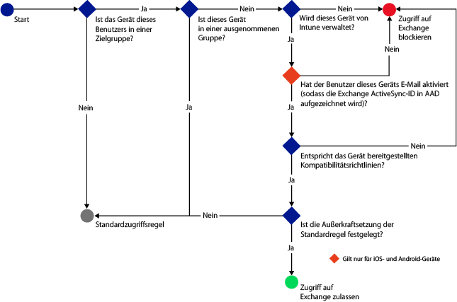
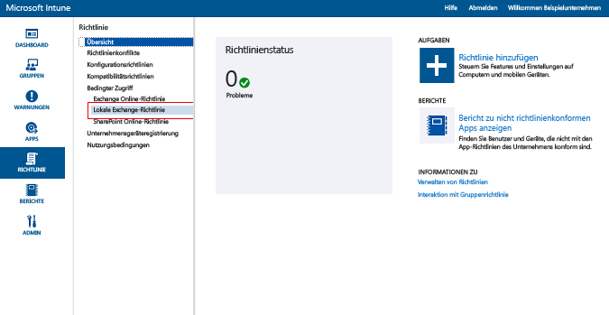
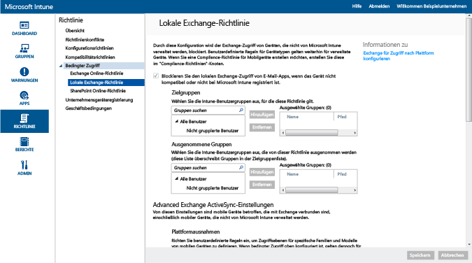

# Beschränken des E-Mail-Zugriffs auf lokale Exchange- und ältere Exchange Online Dedicated-Umgebungen mit Intune

Wenn Sie über eine Exchange Online Dedicated-Umgebung verfügen und herausfinden müssen, ob es sich um die neue oder die ältere Konfiguration handelt, wenden Sie sich an Ihren Kundenbetreuer.

Um den E-Mail-Zugriff auf lokales Exchange oder Ihre ältere Exchange Online Dedicated-Umgebung zu steuern, konfigurieren Sie den bedingten Zugriff für lokales Exchange in Intune.
Weitere Informationen zur Funktionsweise des bedingten Zugriffs finden Sie im Artikel [Beschränken des Zugriffs auf E-Mail- und Office 365-Dienste]( restrict-access-to-email-and-o365-services-with-microsoft-intune.md).

**Bevor** Sie den bedingten Zugriff konfigurieren können, müssen Sie Folgendes überprüfen:

-   Bei Ihrer Exchange-Version muss es sich um **Exchange 2010 oder höher** handeln. Exchange Server-Clientzugriffsserver-Arrays werden unterstützt.

-   Sie müssen den **lokalen Exchange Connector** verwenden, der [!INCLUDE[wit_nextref](../includes/wit_nextref_md.md)] mit dem lokalen Microsoft Exchange verbindet. Auf diese Weise können Sie Geräte über die [!INCLUDE[wit_nextref](../includes/wit_nextref_md.md)]-Konsole verwalten. Informationen zum Connector finden Sie unter [Lokaler Exchange-Connector für Intune](intune-on-premises-exchange-connector.md).

    -   Der lokale Exchange Connector, der Ihnen in der Intune-Konsole zur Verfügung steht, ist spezifisch für Ihren Intune-Mandanten und kann mit keinem anderen Mandanten verwendet werden. Sie müssen auch sicherstellen, dass der Exchange-Connector für Ihren Mandanten **nur auf einem Computer** installiert ist.

        Diesen Connector sollte von der Intune-Verwaltungskonsole heruntergeladen werden.  Eine exemplarische Vorgehensweise zum Konfigurieren des lokalen Exchange-Connectors finden Sie unter [Konfigurieren des lokalen Exchange-Connectors für lokales oder gehostetes Exchange](intune-on-premises-exchange-connector.md).

    -   Der Connector kann auf jedem Computer installiert werden, solange dieser Computer mit dem Exchange-Server kommunizieren kann.

    -   Der Connector unterstützt die **Exchange-Clientzugriffsserver-Umgebung**. Technisch können Sie den Connector auch direkt auf dem Exchange-Clientzugriffsserver installieren, aber dies ist nicht zu empfehlen, da die Last auf dem Server dadurch erhöht wird.
    Sie müssen den Connector so konfigurieren, dass er mit einem der Exchange-Clientzugriffsserver kommuniziert.

-   **Exchange ActiveSync** muss für die zertifikatbasierte Authentifizierung oder die Eingabe von Anmeldeinformationen durch Benutzer konfiguriert werden.

Wenn Richtlinien für bedingten Zugriff konfiguriert und auf einen Benutzer angewendet wurden, muss das **Gerät**, das der Benutzer zum Abrufen von E-Mails verwendet, folgende Voraussetzungen erfüllen:

-  Es muss bei [!INCLUDE[wit_nextref](../includes/wit_nextref_md.md)] **registriert** sein oder sich um einen in die Domäne eingebundenen PC handeln.

-  **Es muss in Azure Active Directory registriert sein**. Darüber hinaus muss die Exchange ActiveSync-ID des Clients in Azure Active Directory registriert sein.

  AAD DRS wird automatisch für Intune und Office 365-Kunden aktiviert. Kunden, die bereits den AD FS Device Registration Service bereitgestellt haben, sehen keine registrierten Geräte in ihrem lokalen Active Directory. **Dies gilt nicht für Windows-PCs und Windows Phone-Geräte.**

-   Es muss mit allen für das Gerät festgelegten [!INCLUDE[wit_nextref](../includes/wit_nextref_md.md)]-Kompatibilitätsrichtlinien **kompatibel** sein.

Das folgende Diagramm veranschaulicht den Ablauf, der von den Richtlinien für bedingten Zugriff für die lokale Exchange-Umgebung verwendet wird, um zu bewerten, ob Geräte zugelassen oder blockiert werden.

 Wenn eine Richtlinie für bedingten Zugriff nicht erfüllt wird, erhält der Benutzer bei der Anmeldung eine der folgenden Meldungen:

- Wenn das Gerät nicht bei [!INCLUDE[wit_nextref](../includes/wit_nextref_md.md)] oder in Azure Active Directory registriert ist, wird eine Meldung mit Anweisungen zum Installieren der Unternehmensportal-App, zum Registrieren des Geräts und zum Aktivieren des E-Mail-Zugriffs angezeigt. Dieser Prozess verknüpft auch die Exchange ActiveSync-ID mit dem Eintrag des Geräts in Azure Active Directory.

-   Wenn das Gerät nicht kompatibel ist, wird eine Meldung angezeigt, die den Benutzer zur [!INCLUDE[wit_nextref](../includes/wit_nextref_md.md)]-Unternehmensportalwebsite oder zur Unternehmensportal-App weiterleitet. Dort findet der Benutzer Informationen zum Problem und zur Lösung.

## Unterstützung für mobile Geräte
-   Windows Phone 8.1 und höher

-   Systemeigene E-Mail-App unter iOS.

-   EAS-E-Mail-Clients wie Gmail unter Android 4 oder höher.
- EAS-E-Mail-Clients für **Android for Work-Geräte:** Nur **Gmail**- und **Nine Work**-Apps im **Arbeitsprofil** werden auf Android for Work-Geräten unterstützt. Damit der bedingte Zugriff unter Android for Work funktioniert, müssen Sie ein E-Mail-Profil für die Gmail- oder Nine Work-App sowie diese Apps als erforderliche Installation bereitstellen. 

[!INCLUDE[wit_nextref](../includes/afw_rollout_disclaimer.md)]

> [!NOTE]
> Microsoft Outlook-App unter Android und iOS wird nicht unterstützt.

## Unterstützung für PCs

Die **E-Mail**-Anwendung unter Windows 8.1 und höher (bei Registrierung bei [!INCLUDE[wit_nextref](../includes/wit_nextref_md.md)])

##  Konfigurieren einer Richtlinie für bedingten Zugriff

1.  Klicken Sie in der [Microsoft Intune-Verwaltungskonsole](https://manage.microsoft.com) auf **Richtlinie** > **Bedingter Zugriff** > **Richtlinie für lokales Exchange**.

2.  Konfigurieren Sie die Richtlinie mit den Einstellungen, die Sie benötigen: 

  - **Blockieren Sie den lokalen Exchange-Zugriff von E-Mail-Apps, wenn das Gerät nicht kompatibel oder nicht bei Microsoft Intune registriert ist**: Bei Auswahl dieser Option wird der Zugriff auf Exchange-Dienste für Geräte blockiert, die nicht von [!INCLUDE[wit_nextref](../includes/wit_nextref_md.md)] verwaltet werden oder eine Kompatibilitätsrichtlinie nicht erfüllen.

  - **Standardregelüberschreibung – Den Zugriff auf Exchange durch registrierte und kompatible Geräte immer zulassen**: Wenn Sie diese Option aktivieren, dürfen Geräte, die bei Intune angemeldet sind und die Kompatibilitätsrichtlinie erfüllen, auf Exchange zugreifen.  
  Diese Regel setzt die **Standardregel** außer Kraft, was bedeutet, dass, selbst wenn Sie die **Standardregel** so festlegen, dass der Zugriff isoliert bzw. blockiert wird, registrierte und kompatible Geräte weiterhin auf Exchange zugreifen können.

  - **Zielgruppen**: Wählen Sie die [!INCLUDE[wit_nextref](../includes/wit_nextref_md.md)]-Benutzergruppen aus, die ihr Gerät bei [!INCLUDE[wit_nextref](../includes/wit_nextref_md.md)] registrieren müssen, um auf Exchange zugreifen zu können.

  - **Ausgenommene Gruppen**: Wählen Sie die [!INCLUDE[wit_nextref](../includes/wit_nextref_md.md)]-Benutzergruppen aus, die von der Richtlinie für bedingten Zugriff ausgenommen werden sollen. Benutzer in dieser Liste werden ausgenommen, auch wenn sie auch in der Liste **Zielgruppen** befinden.

  - **Plattformausnahmen**: Wählen Sie **Regel hinzufügen** aus, um eine Regel zu konfigurieren, die Zugriffsebenen für angegebene mobile Gerätefamilien und -modelle definiert. Da diese Geräte einen beliebigen Typ aufweisen können, können Sie auch Gerätetypen konfigurieren, die nicht von [!INCLUDE[wit_nextref](../includes/wit_nextref_md.md)] unterstützt werden.

  - **Standardregel**: Bei Geräten, die durch keine der anderen Regeln abgedeckt werden, können Sie auswählen, ob der Zugriff auf Exchange zugelassen oder blockiert oder das Gerät unter Quarantäne gestellt werden soll. Wenn Sie die Regel so festlegen, dass der Zugriff zugelassen wird, wird iOS-, Windows- und Samsung KNOX-Geräten, die registriert und kompatibel sind, der E-Mail-Zugriff automatisch gewährt. Endbenutzer müssen keinen Prozess durchlaufen, um an ihre E-Mails zu gelangen.  Auf Android-Geräten, die nicht unter Samsung KNOX ausgeführt werden, erhalten Endbenutzer eine Quarantäne-E-Mail. Diese Mail enthält eine exemplarische Vorgehensweise, mit der die Benutzer die Registrierung und Kompatibilität überprüfen müssen, bevor der Zugriff auf die E-Mail erfolgen kann. Wenn Sie die Regel so festlegen, dass der Zugriff blockiert oder isoliert wird, wird der Zugriff aller Geräte auf Exchange blockiert, unabhängig davon, ob sie bereits bei Intune registriert sind oder nicht. Um zu verhindern, dass registrierte und kompatible Geräte von dieser Regel betroffen sind, aktivieren Sie **Außerkraftsetzung der Standardregel**.
>[!TIP]
>Wenn Sie beabsichtigen, zuerst alle Geräte zu blockieren, bevor Sie den Zugriff auf E-Mail gewähren, wählen Sie die Regel „Zugriff blockieren“ oder „Quarantäne“ aus. Die Standardregel gilt für alle Gerätetypen, sodass Gerätetypen, die Sie als Plattformausnahmen konfiguriert haben und die nicht von [!INCLUDE[wit_nextref](../includes/wit_nextref_md.md)] unterstützt werden, ebenfalls betroffen sind.

  - **Benutzerbenachrichtigung**: Zusätzlich zu der von Exchange gesendeten Benachrichtigungs-E-Mail sendet Intune eine E-Mail mit Schritten zum Entsperren des Geräts. Sie können die Standardnachricht bearbeiten, um Sie an Ihre Bedürfnisse anzupassen. Da die Benachrichtigungs-E-Mail von Intune mit den Lösungsanweisungen an das Exchange-Postfach des Benutzers gesendet wird, kann es vorkommen, dass das Gerät blockiert wird, bevor der Benutzer die E-Mail-Nachricht erhält. In diesem Fall besteht die Möglichkeit, die Nachricht über ein freigeschaltetes Gerät oder eine andere Exchange-Zugriffsmethode anzuzeigen. Dies gilt insbesondere, wenn die **Standardregel** für die Blockierung oder Quarantäne festgelegt ist.  In diesem Fall muss der Endbenutzer seinen App Store besuchen, die Microsoft-Unternehmensportal-App herunterladen und sein Gerät registrieren. Dies gilt für iOS-, Windows- und Samsung KNOX-Geräte.  Für Android-Geräte, auf denen nicht Samsung KNOX ausgeführt wird, müssen Sie die Quarantäne-E-Mail an ein alternatives E-Mail-Konto senden. Der Endbenutzer muss diese Mail auf sein blockiertes Gerät kopieren, um den Registrierungs- und Kompatibilitätsprozess abzuschließen.
  > [!NOTE]
  > Damit die Benachrichtigungs-E-Mail von Exchange gesendet werden kann, müssen Sie das Konto angeben, das dafür verwendet werden soll.
  >
  > Weitere Informationen finden Sie unter [Konfigurieren des lokalen Exchange Connectors für lokales oder gehostetes Exchange](intune-on-premises-exchange-connector.md).

3.  Wählen Sie abschließend **Speichern** aus.

-   Die Richtlinie für bedingten Zugriff wird sofort wirksam und muss nicht explizit bereitgestellt werden.

-   Nachdem ein Benutzer ein Exchange ActiveSync-Profil eingerichtet hat, kann es 1 bis 3 Stunden dauern, bis das Gerät blockiert wird (wenn es nicht von [!INCLUDE[wit_nextref](../includes/wit_nextref_md.md)] verwaltet wird).

-   Wenn ein blockierter Benutzer das Gerät anschließend bei [!INCLUDE[wit_nextref](../includes/wit_nextref_md.md)] registriert und die Nichtkompatibilität behebt, wird der E-Mail-Zugriff innerhalb von 2 Minuten entsperrt.

-   Wenn der Benutzer das Gerät bei [!INCLUDE[wit_nextref](../includes/wit_nextref_md.md)] deregistriert, kann es 1 bis 3 Stunden dauern, bis das Gerät blockiert wird.

**Beispielszenarien für die Konfiguration von Richtlinien für bedingten Zugriff zur Beschränkung des Gerätezugriffs finden Sie unter [Beispielszenarien für die Beschränkung des E-Mail-Zugriffs](restrict-email-access-example-scenarios.md).**

## Nächste Schritte
[Beschränken des Zugriffs auf SharePoint Online](restrict-access-to-sharepoint-online-with-microsoft-intune.md)

[Beschränken des Zugriffs auf Skype for Business Online](restrict-access-to-skype-for-business-online-with-microsoft-intune.md)

<!--HONumber=Dec16_HO2-->

