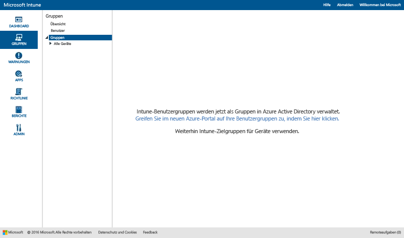

# Verwenden von Gruppen zum Verwalten von Benutzern und Geräten in Microsoft Intune

In diesem Thema wird das Erstellen von Gruppen in Intune beschrieben. Darüber hinaus erhalten Sie Informationen dazu, wie sich die Verwaltung von Gruppen in den nächsten Monaten verändern wird. 

>[!IMPORTANT]
>
>Wenn Sie den Arbeitsbereich „Gruppen“ im Intune-Portal öffnen und dort einen Link zum Azure AD-Portal (Azure Active Directory) vorfinden, verwenden Sie bereits den *neuen* Ansatz für Azure AD-Sicherheitsgruppen für die Gruppenverwaltung in Intune, der unter [Ankündigung bevorstehender Verbesserungen an der Administratoroberfläche für Gruppen](#notice-of-upcoming-improvements-to-the-admin-experience-for-groups) beschrieben wird. Klicken Sie auf den Link zum Azure AD-Portal, um Ihre Gruppen zu erstellen und zu verwalten.
>
> 
>
>Wenn der Link zum Azure AD-Portal nicht angezeigt wird, verwenden Sie noch den *aktuellen* Ansatz zur Gruppenverwaltung, der unter [Erstellen von Gruppen zum Verwalten von Benutzern und Geräten in Microsoft Intune](#Create-groups-to-manage-users-and-devices-with-Microsoft-Intune) in diesem Thema beschrieben ist.

## Ankündigung bevorstehender Verbesserungen an der Administratoroberfläche für Gruppen

Sie haben uns zu verstehen gegeben, dass Sie übergreifend eine einheitliche Oberfläche für Gruppierung und Zielfestlegung in Enterprise Mobility und Security wünschen. Wir haben auf Sie gehört. Auf der Grundlage Ihres Feedbacks konvertieren wir in Kürze die Intune Gruppen in auf Azure Active Directory-basierende Sicherheitsgruppen. Durch diese Änderung wird die Gruppenverwaltung zwischen Intune und Azure Active Directory (Azure AD) vereinheitlicht. Die neue Oberfläche bringt den Vorteil mit sich, dass Sie keine Gruppen mehr dienstübergreifend verdoppeln müssen. Durch die Optionen zur Verwendung von Windows PowerShell und Microsoft Graph wird so außerdem Erweiterbarkeit verfügbar.

### Inwiefern betrifft das mich?
Wenn Sie bereits Intune-Kunde sind, sind Sie von diesen Änderungen nicht betroffen. Aber das kommt demnächst:

-   Neue Konten werden Azure AD-Sicherheitsgruppen statt Intune-*Benutzergruppen* verwenden.   
-   Im November 2016 verwalten neue Konten, die nach dem monatlichen Service Release bereitgestellt wurden, jeweils benutzerbasierte Gruppen und gerätebasierte Gruppen im Azure AD-Portal. Bestandskunden sind davon nicht betroffen.
-   Im Dezember 2016 beginnt das Intune-Produktteam mit der Migration von Bestandskunden zur neuen Azure AD-basierten Gruppenverwaltungsoberfläche. Alle Benutzer- und Gerätegruppen, die jetzt in Intune vorhanden sind, werden zu Azure AD-Sicherheitsgruppen migriert. Mit den Migrationen wird erst begonnen, wenn wir die Auswirkungen auf Ihre alltägliche Arbeit auf ein Minimum beschränken und erwarten können, dass Auswirkungen auf Ihre Benutzer ausbleiben. Außerdem benachrichtigen wir Sie, bevor wir Ihr Konto migrieren.

### Wie und wann werde ich zur neuen Gruppenoberfläche migrieren?
Wir migrieren die aktuellen Intune-Kunden über einen längeren Zeitraum. Wir sind dabei, den Zeitplan für diese Migration fertigzustellen und aktualisieren dieses Thema in ein paar Wochen, um Ihnen weitere Details mitzuteilen. Sie erhalten Sie eine Benachrichtigung, bevor Sie migriert werden. Kontaktieren Sie unser Migrationsteam unter [intunegrps@microsoft.com](mailto:intunegrps@microsoft.com), wenn Sie Probleme mit der Migration haben. Einzelheiten darüber, wie Gruppen migriert werden, finden Sie unter [Migrieren von Gruppen zu Azure Active Directory](migrating-groups-to-azure-active-directory.md).

### Was geschieht mit meinen vorhandenen Benutzer- und Gerätegruppen?
 Benutzergruppen und Gerätegruppen, die Sie in Intune erstellt haben, werden zu Azure AD-Sicherheitsgruppen migriert. Intune-Standardgruppen, z.B. die Gruppe „Alle Benutzer“ werden nur migriert, wenn Sie sie zum Zeitpunkt der Migration in Bereitstellungen verwenden. Für einige Gruppen kann die Migration komplexer sein. Wir benachrichtigen Sie, wenn weitere Schritte in Ihrer Organisation zum Ausführen der Migration erforderlich sind.

### Welche neuen Funktionen sind für mich verfügbar?
Das ist die neue Funktionalität, die wir mit dieser Migration von Intune nach Azure Active Directory einführen:

-    Azure AD-Sicherheitsgruppen werden in Intune für alle Bereitstellungsarten unterstützt.
-    Azure AD-Sicherheitsgruppen unterstützen das Gruppieren von Geräten und Benutzern.
-    Azure AD-Sicherheitsgruppen unterstützen dynamische Gruppen mit Intune-Geräteattributen. Sie können beispielsweise Geräte anhand der Plattform, wie etwa iOS, dynamisch gruppieren. Wenn ein neues iOS-Gerät in Ihrer Organisation registriert wird, wird es der dynamischen iOS-Gerätegruppe automatisch hinzugefügt.
-    Sie arbeiten mit einer gemeinsamen Administratoroberfläche für die Gruppenverwaltung in Azure AD und Intune.
- Die Rolle „Intune-Dienstadministrator“ wird zu Azure AD hinzugefügt, sodass Intune-Dienstadministratoren Gruppenverwaltungsaufgaben in Azure AD ausführen können.

### Welche Intune-Funktion wird nicht verfügbar sein?
Zwar wird die Gruppenoberfläche insgesamt verbessert, jedoch stehen einige Intune-Funktionen nach der Migration der Organisation von Intune-Gruppen zu Azure AD-Sicherheitsgruppen nicht mehr zur Verfügung.

#### Gruppenverwaltungsfunktion

-   Nach der Migration können beim Erstellen einer neuen Gruppe keine Mitglieder oder Gruppen mehr ausgeschlossen werden. In dynamischen Gruppen von Azure AD können jedoch Attribute verwendet werden, mit denen sich erweiterte Regeln erstellen lassen, die Sie zum Ausschließen von Mitgliedern aus einer Gruppe auf der Grundlage der von Ihnen festgelegten Kriterien verwenden können.
-   Gruppen aus nicht gruppierten Benutzern und nicht gruppierten Geräten werden nicht unterstützt. Diese Gruppen werden nicht von Intune nach Azure AD migriert.

#### Gruppenabhängige Funktionen

-   Die Serviceadministratorrolle wird über keine **Verwalten von Gruppen**-Berechtigungen verfügen.
-   Sie können keine Exchange ActiveSync-Geräte gruppieren. Ihre Gruppe „Alle von EAS verwalteten Geräte“ wird von einer Gruppe in eine Berichtsansicht konvertiert.
-  Pivotieren mit Gruppen in Berichten ist nicht verfügbar.
-  Adressierung benutzerdefinierter Zielgruppen mithilfe von Benachrichtigungsregeln ist nicht verfügbar.

### Wie sollte ich mich für die Änderung vorbereiten?
 Wir haben Empfehlungen für Sie, die Ihnen diese Umstellung vereinfachen:

- Bereinigen Sie alle unerwünschten oder nicht benötigten Intune-Gruppen vor der Migration.
- Überdenken Sie die Verwendung der Ausschlussfunktion in Ihren Gruppen, und ziehen Sie in Erwägung, Ihre Gruppen ggf. so zu bearbeiten, dass sie die Ausschlussfunktion nicht benötigen.
-  Wenn Administratoren von Ihnen keine Berechtigung zum Erstellen von Gruppen in Azure AD besitzen, bitten Sie Ihren Azure AD-Administrator, sie zur Azure AD-Rolle „Intune-Dienstadministrator“ hinzuzufügen.

## Erstellen von Gruppen zum Verwalten von Benutzern und Geräten in Microsoft Intune

In diesem Abschnitt wird beschrieben, wie Intune-Gruppen in der Intune-Verwaltungskonsole erstellt werden.

Sie können Gruppen im Arbeitsbereich **Gruppen** in der Microsoft Intune-Verwaltungskonsole erstellen und verwalten. Die Seite **Gruppenübersicht** enthält Statusübersichten, die Ihnen helfen, Probleme, die Ihre Aufmerksamkeit erfordern, schnell zu erkennen und zu priorisieren. Statusübersichten betreffen diese Bereiche:

-   Warnungen
-   Softwareupdates
-   Endpoint Protection
-   Richtlinie
-   Softwareverwaltung

Darüber hinaus werden in der Gruppenhierarchie Statusübersichten angezeigt, damit Sie Probleme bei Mitgliedern einer ausgewählten Gruppe leichter erkennen und beheben können.

## Erstellen von Gruppen

> [!TIP]
> Überlegen Sie beim Erstellen von Gruppen, wie Richtlinien angewendet werden. Sie verfügen möglicherweise z.B. über Richtlinien, die für ein Gerätebetriebssystem oder für verschiedene Rollen oder Organisationseinheiten in Ihrer Organisation spezifisch sind, die Sie in Active Directory bereits definiert haben. Es kann sinnvoll sein, getrennte Gerätegruppen für iOS, Android und Windows sowie eine Benutzergruppe für jede Rolle in der Organisation zu verwenden.
>
> Vermutlich ist es ebenfalls ratsam, eine Standardrichtlinie zu erstellen, die für alle Gruppen und Geräte gilt, um die grundlegenden Compliance-Anforderungen Ihrer Organisation zu erfüllen. Dadurch können Sie spezifischere Richtlinien für die weitesten Kategorien von Benutzern und Geräten erstellen. Beispielsweise können Sie E-Mail-Richtlinien für jedes der Betriebssysteme der mobilen Geräte erstellen.
>
> Gehen Sie beim Benennen Ihrer Richtlinien umsichtig vor, damit Sie sie später leicht identifizieren können. Ein guter, beschreibender Richtlinienname ist beispielsweise **WP-E-Mail-Richtlinie für das gesamte Unternehmen**.
>
> Jedes Mal, wenn Sie eine einschränkende Richtlinie erstellen sollten Sie das Ihren Benutzern mitteilen. Achten Sie daher nach dem Erstellen der allgemeineren Gruppen und Richtlinien darauf, in welcher Weise Sie kleinere Gruppen erstellen, um unnötige Kommunikation zu vermeiden.

### So erstellen Sie eine Gerätegruppe

1.  Wählen Sie in der Intune-Verwaltungskonsole **Gruppen** &gt; **Übersicht** &gt; **Gruppe erstellen** aus.

2.  Geben Sie einen Namen und (optional) eine Beschreibung für die Gruppe ein, und wählen Sie dann eine Gerätegruppe als übergeordnete Gruppe aus. Klicken Sie auf **Weiter**.

3.  Wählen Sie auf der Seite **Mitgliedschaftskriterien definieren** den Typ der in die Gruppe aufzunehmenden Geräte aus. Auf der Grundlage der Gerätetypen, für deren Aufnahme Sie sich entschieden haben, bestehen weitere Konfigurationsoptionen:

    -   **Computer**. Geben Sie an, ob alle Mitglieder der übergeordneten Gruppe eingeschlossen werden sollen und welche Organisationseinheiten (OUs) sowie Domänen ein- bzw. ausgeschlossen werden sollen. Sie können die Informationen über Organisationseinheiten und die Domäne für einen Computer aus dem Inventar abrufen.

    -   **Mobil**. Wählen Sie aus, ob von Intune verwaltete mobile Geräte, von Exchange ActiveSync verwaltete mobile Geräte oder beide eingeschlossen sein sollen.

    -   **Alle Geräte**. Bei dieser Option sind alle Geräte ohne Ausschlüsse auf Basis von Kriterien enthalten.

4.  Wählen Sie auf der Seite **Direkte Mitgliedschaft definieren** **Durchsuchen** aus, um einzelne Geräte zum Ein- oder Ausschließen auszuwählen. Wenn Sie Geräte auswählen, die sich nicht in der angegebenen übergeordneten Gruppe befinden, fügt Intune diese Geräte automatisch zur übergeordneten Gruppe hinzu.

5.  Überprüfen Sie auf der Seite **Zusammenfassung** Ihre getroffenen Entscheidungen, und wählen Sie dann **Fertig stellen** aus.

Die neu erstellte Gruppe wird in der Liste **Gruppen** im Arbeitsbereich **Gruppen** unter der übergeordneten Gruppe angezeigt. Das ist auch der Ort, an dem Sie die Gruppe bearbeiten oder löschen können.

### So erstellen Sie eine Benutzergruppe

1.  Wählen Sie in der Intune-Verwaltungskonsole **Gruppen** &gt; **Übersicht** &gt; **Gruppe erstellen** aus.

2.  Geben Sie einen Namen und (optional) eine Beschreibung für die Gruppe ein, und wählen Sie dann eine Benutzergruppe als übergeordnete Gruppe aus. Klicken Sie auf **Weiter**.

3.  Geben Sie auf der Seite **Mitgliedschaftskriterien definieren** an, ob alle Mitglieder der übergeordneten Gruppe eingeschlossen werden sollen oder ob mit einer leeren Gruppe begonnen werden soll. Schließen Sie anschließend Mitglieder auf der Grundlage der Sicherheitsgruppen von Benutzern ein oder aus, die Sie entweder manuell im [Office 365 Admin Center](http://go.microsoft.com/fwlink/?LinkId=698854) konfigurieren oder aus Active Directory synchronisieren. Wenn sich die Mitgliedschaft bei einer Sicherheitsgruppe ändert, können sich auch Mitgliedschaften bei Benutzergruppen auf Basis dieser Sicherheitsgruppe ändern.

    > [!IMPORTANT]
    > Derzeit werden, wenn Ihre Gruppe Mitglieder aus bestimmten Sicherheits- oder Vorgesetztengruppen einschließt und Sie außerdem Mitglieder aus bestimmten Gruppen ausschließen, die Mitglieder, die Sie ursprünglich aufgenommen hatten, entfernt. Um eine Gruppe zu erstellen, die sowohl eingeschlossene als auch ausgeschlossene Mitglieder aufweist, empfehlen wir Ihnen, zuerst eine übergeordnete Gruppe zu erstellen, die die eingeschlossenen Mitglieder enthält. Erstellen Sie anschließend eine untergeordnete Gruppe für diese übergeordnete Gruppe. Listen Sie in der neuen untergeordneten Gruppe die ausgeschlossenen Mitlieder auf. Verwenden Sie anschließend diese untergeordnete Gruppe zum Verwalten von Intune-Richtlinien, Profilen und App-Verteilung.

    > [!NOTE]
    > Im Azure-Portal können Sie Gruppen auf der Grundlage der Vorgesetzten der Benutzer erstellen. Dieser Gruppentyp ist dynamisch und ändert sich, wenn Mitarbeiter in Azure Active Directory zum Team eines Vorgesetzten hinzugefügt oder aus ihm entfernt werden. Das Erstellen einer Azure-Gruppe auf der Grundlage des Namens von Vorgesetzten ist unter [Verwenden von Attributen zum Erstellen erweiterter Regeln](https://azure.microsoft.com/en-us/documentation/articles/active-directory-accessmanagement-groups-with-advanced-rules/) im Abschnitt **So konfigurieren Sie eine Gruppe als Gruppe mit "Vorgesetzten"** beschrieben.

4.  Wählen Sie auf der Seite **Direkte Mitgliedschaft definieren** **Durchsuchen** aus, um einzelne Benutzer zum Ein- oder Ausschließen auszuwählen. Wenn Sie Benutzer auswählen, die nicht in der von Ihnen angegebenen übergeordneten Gruppe enthalten sind, werden diese Benutzer der übergeordneten Gruppe automatisch hinzugefügt. Die Option zum manuellen Hinzufügen von Benutzern befindet sich unten im Dialogfeld **Mitglieder auswählen**. Dies ist hilfreich, wenn Sie einen Benutzer hinzufügen möchten, der noch nicht über ein registriertes Gerät verfügt.

5.  Überprüfen Sie auf der Seite **Zusammenfassung** Ihre getroffenen Entscheidungen, und wählen Sie dann **Fertig stellen** aus.

Die neu erstellte Gruppe wird in der Liste **Gruppen** im Arbeitsbereich **Gruppen** unter der übergeordneten Gruppe angezeigt. Das ist auch der Ort, an dem Sie die Gruppe bearbeiten oder löschen können.

> [!TIP]
> Sicherheitsgruppen sind eine gute Ressource zum Auffüllen von Benutzergruppen. Da in Sicherheitsgruppen definiert wird, wer auf welche Ressourcen zugreifen kann, lassen sich Sicherheitsgruppen oft gut in Intune-Benutzergruppen übersetzen. Sicherheitsgruppen, die von Active Directory nach Azure Active Directory synchronisiert oder direkt mithilfe des Office 365 Admin Centers oder des Azure Portals in Azure Active Directory erstellt werden, stehen Ihnen beim Erstellen von Benutzergruppen in Intune zur Verfügung.

## Filtern von Administratoransichten nach Rolle
In gefilterten Gruppenansichten können Sie auf der Grundlage der Rolle eines Administrators genau festlegen, welche Informationen für ihn sichtbar sind. Sie können auch einschränken, welche Gruppen die einzelnen IT-Administratoren verwalten können. Dies kann in folgenden Fällen hilfreich sein:

-   Sie möchten, dass Ihre IT-Administratoren Elemente nur für bestimmte Benutzer und Geräte bereitstellen können
-   Sie möchten, dass Ihren IT-Administratoren nur die Gruppen angezeigt werden, die für den betreffenden Administrator relevant sind

Sie können gefilterte Gruppenansichten für Dienstadministratoren in der Intune-Verwaltungskonsole konfigurieren. Weitere Informationen finden Sie unter [Was Sie wissen sollten, bevor Sie Microsoft Intune starten](/intune/get-started/what-to-know-before-you-start-microsoft-intune).

Nachdem Sie gefilterte Gruppenansichten für einen Dienstadministrator eingerichtet haben, kann der Administrator nur die von Ihnen angegebenen Gruppen sehen und auswählen, wenn er Software oder Richtlinien bereitstellt oder Berichte ausführt. Darüber hinaus werden dem Administrator auf diesen Seiten der Verwaltungskonsole keine Statusinformationen angezeigt:

-   **Systemübersicht**
-   **Gruppenübersicht**
-   **Übersicht über Endpoint Protection**
-   **Warnungsübersicht**
-   **Softwareübersicht**
-   **Richtlinienübersicht**

### So erstellen Sie eine gefilterte Gruppenansicht

1.  Wählen Sie in der Intune-Verwaltungskonsole **Admin** &gt; **Administratorverwaltung** &gt; **Dienstadministratoren** aus.

2.  Wählen Sie den Dienstadministrator aus, für den Sie eine gefilterte Gruppenansicht erstellen möchten, und wählen Sie dann **Gruppen verwalten** aus.

3.  Fügen Sie im Dialogfeld **Gruppen auswählen, die für diesen Dienstadministrator sichtbar sind** die Gruppen hinzu, auf die der Dienstadministrator Zugriff erhalten soll, und wählen Sie dann **OK** aus.

Nachdem Sie die gefilterten Gruppenansichten eingerichtet haben, können IT-Administratoren nur die Gruppen anzeigen und auswählen, die von Ihnen angegeben wurden.

## Verwalten Ihrer Gruppen
Nachdem Sie Gruppen erstellt haben, können Sie diese entsprechend den Anforderungen Ihrer Organisation verwalten.

Sie können den Namen, die Beschreibung und die Mitglieder der Gruppe ändern.

Sie können eine Gruppe löschen, die keinen Nutzen mehr für Ihre Organisation hat. Beim Löschen einer Gruppe werden die Benutzer, die zu dieser Gruppe gehören, nicht gelöscht.

## Nächste Schritte
Nachdem Sie die Gruppen und Richtlinien eingerichtet haben, überprüfen Sie **Vorgesehener Wert** und **Status**, um die praktischen Auswirkungen Ihres Entwurfs einzuschätzen.

### Überprüfen des Entwurfs

1. Wählen Sie ein Gerät aus einer Gerätegruppe aus, und navigieren Sie durch die Informationskategorien am oberen Seitenrand.
2. Wählen Sie **Richtlinie** aus. Sie sehen in etwa diesen Screenshot mit den Richtlinieneinstellungen eines Android-Geräts.

Jede Richtlinie verfügt über einen **vorgesehenen Wert** und einen **Status**. Der vorgesehene Wert ist der Wert, den Sie durch das Zuweisen der Richtlinie erzielen wollen. Der Status gibt an, was erreicht wird, wenn alle für das Gerät geltenden Richtlinien sowie die Einschränkungen und Anforderungen der Hardware und des Betriebssystems zusammen betrachtet werden. Der Screenshot zeigt zwei klare Beispiele:

-   **Einfache Kennwörter zulassen** ist auf **Ja**gesetzt, wie in der Spalte **Beabsichtigter Wert** gezeigt, der **Status** ist jedoch **Nicht zutreffend**. Dies liegt daran, dass einfache Kennwörter für Android-Geräte nicht unterstützt werden.
-   Analog dazu gilt das erweiterte Richtlinienelement**E-Mail-Einstellungen für iOS-Geräte** nicht für dieses Gerät, da es ein Android-Gerät ist.

> [!NOTE]
> Denken Sie daran: Wenn zwei Richtlinien mit unterschiedlichen Einschränkungsstufen für das gleiche Gerät gelten, wird in der Praxis die restriktivere Richtlinie angewendet.

<!--HONumber=Nov16_HO1-->

