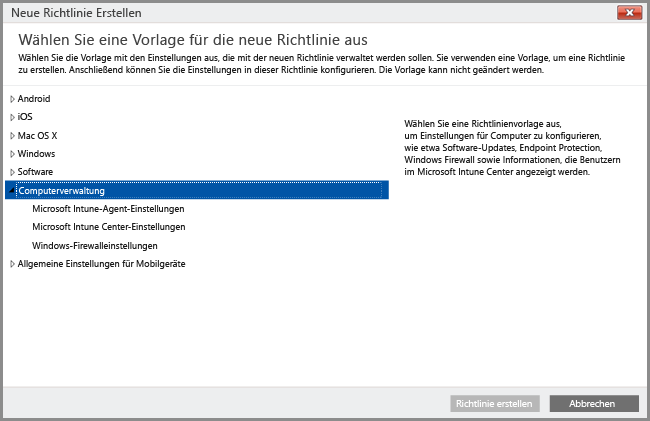

# Verwenden von Richtlinien zum Vereinfachen der Verwaltung von Windows-PCs

Windows-PCs, auf denen der Intune Softwareclient ausgeführt wird, können mithilfe der **Computerverwaltungsrichtlinien** von Intune verwaltet werden. Verwenden Sie die Intune-Richtlinien zur **Computerverwaltung**, um die Einstellungen im Microsoft Intune Center zu konfigurieren, Updates auf PCs zu steuern und die Windows-Firewall für PCs zu konfigurieren.

### Verwalten des Microsoft Intune Center
Benutzern wird der Intune-Softwareclient als das **Microsoft Intune Center** angezeigt. Das Microsoft Intune Center bietet Benutzern folgende Möglichkeiten:

-   Abrufen von Anwendungen aus dem Unternehmensportal

-   Suchen nach Updates

-   Verwalten von Microsoft Intune Endpoint Protection

-  Anfordern von Remoteunterstützung

Das Microsoft Intune Center ist auf allen verwalteten Computern installiert. Sie können die folgenden Einstellungen in einer Intune Center-Richtlinie konfigurieren, die anschließend Benutzern im Microsoft Intune Center angezeigt werden:

|Richtlinieneinstellung|Details|
|------------------|--------------------|
|**Name**|Name des Administrators, der den Computer verwaltet Maximale Länge: 40 Zeichen|
|**Telefonnummer**|Telefonnummer des Administrators, der den Computer verwaltet Maximale Länge: 20 Zeichen|
|**E-Mail-Adresse**|E-Mail-Adresse des Administrators, der den Computer verwaltet Maximale Länge: 40 Zeichen|
|**Name der Website**|Name der Supportwebsite für Benutzer >Maximale Länge: 40 Zeichen|
|**URL der Website**|URL der Supportwebsite Maximale Länge: 150 Zeichen|
|**Anmerkungen**|Hinweis, der Benutzern angezeigt wird Maximale Länge: 120 Zeichen|

Finden Sie Informationen zu Richtlinien und Einstellungen für Windows-PCs in den folgenden Ressourcen:

- [Aktualisieren Ihrer Windows-PCs mit Softwareupdates in Microsoft Intune](keep-windows-pcs-up-to-date-with-software-updates-in-microsoft-intune.md): Aufgrund dieser Richtlinien suchen verwaltete Computer nach Softwareupdates und laden diese von Microsoft und Drittanbietern herunter. Diese Updates enthalten keine Upgrades des Betriebssystems (d.h. keine Upgrades von Windows 7 auf Windows 10 oder von Windows 10 auf eine höhere Version).

- [Schützen von Windows-PCs mit Endpoint Protection für Microsoft Intune](help-secure-windows-pcs-with-endpoint-protection-for-microsoft-intune.md): Zu diesen Einstellungen gehören Überprüfungszeitpläne und zu ergreifende Maßnahmen, wenn Malware erkannt wird.

- [Unterstützen des Schutzes von Windows-PCs mithilfe von Windows-Firewall-Richtlinien in Microsoft Intune](help-protect-windows-pcs-using-windows-firewall-policies-in-microsoft-intune.md): Diese Richtlinien vereinfachen die Verwaltung von Windows-Firewalleinstellungen auf verwalteten Computern.

### Weitere Informationen:

[Allgemeine Aufgaben zur Verwaltung von Windows-PCs mit dem Intune-Softwareclient](common-windows-pc-management-tasks-with-the-microsoft-intune-computer-client.md)

<!--HONumber=Nov16_HO4-->

