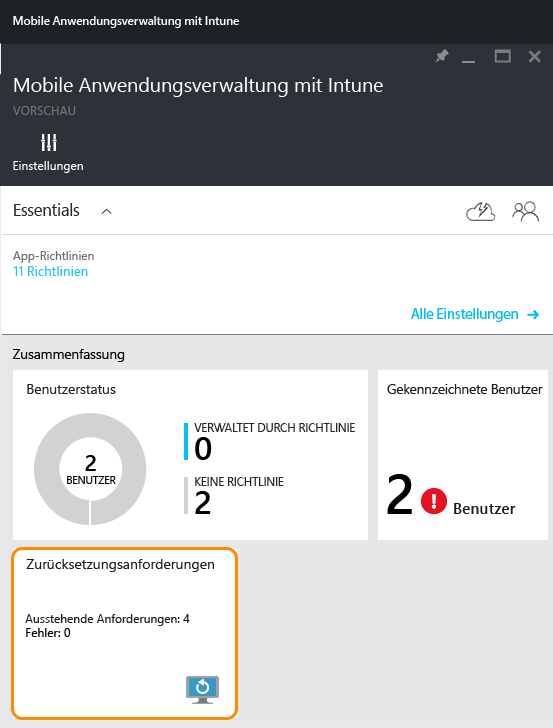
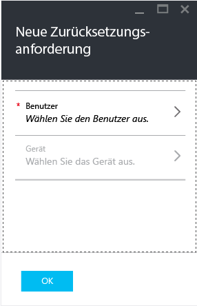

# Löschen verwalteter Unternehmensdaten aus Apps mit Microsoft Intune
Wenn ein Gerät verloren geht oder gestohlen wird oder wenn der Mitarbeiter das Unternehmen verlässt, müssen Sie sicherstellen, dass Unternehmensdaten in Apps vom Gerät entfernt werden. Allerdings sollten Sie persönliche Daten nicht vom Gerät entfernen, insbesondere dann nicht, wenn das Gerät dem Mitarbeiter gehört.

Um Unternehmensdaten aus Apps selektiv zu entfernen, erstellen Sie mithilfe der Schritte in diesem Thema eine Zurücksetzungsanforderung. Nach Abschluss der Anforderung werden die Unternehmensdaten beim nächsten Ausführen der Anwendung aus der App entfernt.
>[!NOTE]
> Direkt aus der App mit dem nativen Adressbuch synchronisierte Kontakte werden entfernt. Kontakte, die aus dem nativen Adressbuch mit einer anderen externen Quelle synchronisiert werden, können nicht zurückgesetzt werden. Dies gilt derzeit nur für die Microsoft Outlook-App.

## Erstellen einer Zurücksetzungsanforderung

1.  Wählen Sie auf dem Blatt **Mobile Anwendungsverwaltung mit Intune** die Kachel **Zurücksetzungsanforderungen** aus.

    

2.  Wählen Sie **Neue Zurücksetzungsanforderung**. Dadurch wird das Blatt **Neue Zurücksetzungsanforderung** geöffnet.

    

3.  Wählen Sie **Benutzer** aus, um das Blatt **Benutzer** zu öffnen, und den Benutzer auszuwählen, dessen App-Daten gelöscht werden sollen.

4.  Wählen Sie **Gerät** aus.  Daraufhin wird das Blatt **Gerät** geöffnet, auf dem alle dem ausgewählten Benutzer zugeordneten Geräte aufgeführt sind.  Wählen Sie das Gerät aus, das zurückgesetzt werden soll.

5.  Sie befinden sich nun wieder auf dem Blatt **Neue Zurücksetzungsanforderung**. Wählen Sie **OK** aus, um eine Zurücksetzungsanforderung zu erstellen. Der Dienst erstellt für jede geschützte App auf dem Gerät eine separate Löschanforderung und überwacht diese.

## Überwachen der Löschanforderungen
Auf dem Blatt **Intune Mobile Application Management** enthält die Kachel **Löschanforderung** einen zusammenfassenden Bericht.  Angezeigt wird der Gesamtstatus mit der Anzahl der ausstehenden Anforderungen und Fehler. Weitere Einzelheiten erhalten Sie durch Ausführen dieser Schritte:

1.  Wählen Sie auf dem Blatt **Mobile Anwendungsverwaltung mit Intune** die Kachel **Zurücksetzungsanforderung** aus, um das Blatt **Zurücksetzungsanforderung** zu öffnen.

2.  Auf dem Blatt **Zurücksetzungsanforderung** wird eine Liste mit Ihren Anforderungen, gruppiert nach Benutzer, angezeigt. Da das System für jede geschützte App, die auf dem Gerät ausgeführt wird, eine Zurücksetzungsanforderung erstellt, werden möglicherweise für einen Benutzer mehrere Anforderungen angezeigt. Der Status gibt an, ob eine Zurücksetzungsaufforderung noch **aussteht**oder **fehlgeschlagen**ist, bzw. **erfolgreich**ausgeführt wurde.

Der Benutzer muss die App für das Zurücksetzen öffnen, und das Zurücksetzen dauert bis zu 30 Minuten, nachdem die Anforderung gestellt wurde. 

Zurücksetzungen mit Status „Ausstehend“ werden angezeigt, bis Sie sie manuell löschen.  Um eine Anforderung zum Zurücksetzen manuell zu löschen, klicken Sie mit der rechten Maustaste, und wählen Sie „Löschen“.

### Weitere Informationen:
[Schützen von App-Daten mithilfe der Verwaltungsrichtlinien für mobile Apps](protect-app-data-using-mobile-app-management-policies-with-microsoft-intune.md)

[Verwenden des Azure-Portals](azure-portal-for-microsoft-intune-mam-policies.md)

<!--HONumber=Nov16_HO3-->

