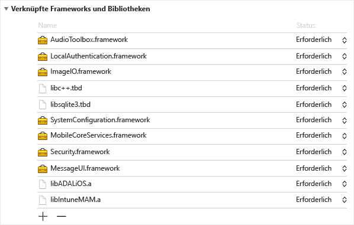
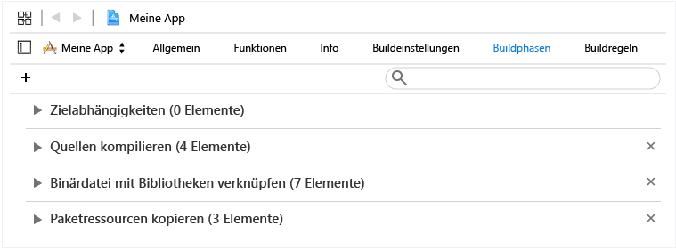
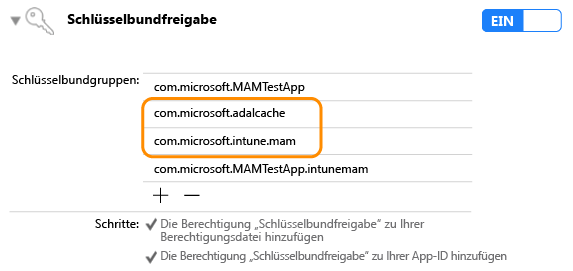

# Microsoft Intune App SDK für iOS –Entwicklerhandbuch

> [!NOTE]
> Lesen Sie am besten zuerst den Leitfaden [Erste Schritte mit dem Microsoft Intune App SDK](intune-app-sdk-get-started.md). Dort finden Sie Informationen zu den Vorbereitungen, die Sie auf den verschiedenen unterstützten Plattformen für die Integration treffen müssen.* 

Das Microsoft Intune App SDK für iOS ermöglicht die Integration von Intune Mobile App Management (MAM) in Ihre iOS-App. Eine MAM-aktivierte Anwendung ist eine in das Intune App SDK integrierte Anwendung, mit der IT-Administratoren Richtlinien für Ihre mobile App bereitstellen können, wenn die App aktiv von Intune verwaltet wird.


# Inhalt des SDK 

Das Intune App SDK für iOS enthält eine statische Bibliothek, Ressourcendateien, API-Header, eine Liste mit Debug-Einstellungen (PLIST) sowie ein Konfigurationstool. Mobile Apps können einfach nur die Ressourcendateien enthalten und statisch mit den Bibliotheken verknüpft sein, um die meisten Richtlinien durchzusetzen. Erweiterte Intune-MAM-Funktionen werden mithilfe von APIs erzwungen.

Dieses Handbuch befasst sich mit der Verwendung der folgenden Komponenten des Intune App SDK für iOS:

* **libIntuneMAM.a**: Die statische Intune App SDK-Bibliothek. Wenn Ihre App keine Extensions verwendet, können Sie diese Bibliothek mit Ihrem Projekt verknüpfen, um die App für die mobile Anwendungsverwaltung mit Intune zu aktivieren. Entsprechende Anweisungen finden Sie im Abschnitt „Erstellen einer App mit dem Intune App SDK“.

* **IntuneMAM.framework**: Das Intune App SDK-Framework. Verknüpfen Sie dieses Framework mit Ihrem Projekt, um die App für die mobile Anwendungsverwaltung mit Intune zu aktivieren. Verwenden Sie das Framework anstelle der statischen Bibliothek, wenn Ihre App Extensions verwendet, damit vom Projekt nicht mehrere Kopien der statischen Bibliothek erstellt werden.

* **IntuneMAMResources.Bundle**: Ein Ressourcenpaket, das die Ressourcen für das SDK enthält. 

* **Headers**: Stellt die Intune App SDK-APIs bereit. Wenn Sie eine API verwenden, müssen Sie die Headerdatei einschließen, die die API enthält. Die folgenden Headerdateien umfassen die zum Aktivieren der Funktionalität des Intune App SDK erforderlichen API-Funktionsaufrufe: 
    
    * IntuneMAMAsyncResult.h
    * IntuneMAMDataProtectionInfo.h
    * IntuneMAMDataProtectionManager.h
    * IntuneMAMFileProtectionInfo.h
    * IntuneMAMFileProtectionManager.h
    * IntuneMAMPolicyDelegate.h
    * IntuneMAMLogger.h 


# Funktionsweise des Intune App SDK

Ziel des Intune App SDK für iOS ist es, iOS-Anwendungen mit minimalen Codeänderungen mit Verwaltungsfunktionen zu versehen. Möglichst wenige Codeänderungen bedeuten kürzere Markteinführungszeiten und garantieren trotzdem die Konsistenz und Stabilität Ihrer mobilen Anwendung. 

Die Anwendung muss mit der statischen Bibliothek verknüpft sein und das Ressourcenpaket enthalten. Die Datei „MAMDebugSettings.plist“ ist optional und kann in das Paket eingeschlossen werden, um MAM-Richtlinien zu simulieren, die für die Anwendung aktiviert werden, ohne dass die Anwendung über Microsoft Intune bereitgestellt werden muss. Daneben können in Debugversionen die Richtlinien in der Datei „MAMDebugSettings.plist“ angewendet werden, indem die Datei über die iTunes-Dateifreigabe in das Verzeichnis „Dokumente“ der App übertragen wird.

# Integrieren des SDK in Ihre mobile App 

Führen Sie die nachstehenden Schritte aus, um das Intune App SDK zu aktivieren:

1. **Option 1**: Verknüpfen Sie die Bibliothek `libIntuneMAM.a`:

    Ziehen Sie die Bibliothek `libIntuneMAM.a` mittels Drag & Drop in die Liste „Verknüpfte Frameworks und Bibliotheken“ des Projektziels.
     

    **Hinweis**: Wenn Sie Ihre App im App Store veröffentlichen möchten, verwenden Sie die für die Veröffentlichung erstellte Version von `libIntuneMAM.a` anstelle der Debugversion. Die Veröffentlichungsversion befindet sich im Ordner "Release". Die Debugversion enthält ausführliche Ausgaben, die beim Beheben von Problemen mit dem Intune App SDK hilfreich sind.
    
    **Option 2**: Verknüpfen Sie `IntuneMAM.framework` mit Ihrem Projekt. Ziehen Sie `IntuneMAM.framework` mittels Drag & Drop in die Liste „Verknüpfte Frameworks und Bibliotheken“ des Projektziels.
    
    **Hinweis**: Bei Verwendung des Frameworks müssen Sie die Simulatorarchitekturen manuell aus dem universellen Framework entfernen, bevor Sie Ihre App an den App Store übermitteln. Weitere Informationen hierzu finden Sie im Abschnitt „Übermitteln Ihrer App an den App Store“.

2. Fügen Sie die folgenden iOS-Frameworks zum Projekt hinzu:
    * MessageUI.framework
    * Security.framework
    * MobileCoreServices.framework
    * SystemConfiguration.framework
    * libsqlite3.dylib
    * libc++.dylib
    * ImageIO.framework
    * LocalAuthentication.framework
    * AudioToolbox.framework

    **Hinweis**: Wenn die Anwendung für iOS 7 erstellt werden soll, legen Sie das Attribut „Status“ von `LocalAuthentication.framework` auf „Optional“ fest. Wenn „Status“ nicht festgelegt wurde, kann die Anwendung unter iOS 7 nicht gestartet werden.

    **Hinweis**: In Xcode 7 wurden die `.dylib` -Erweiterungen in `.tbd` geändert.

3. Fügen Sie das Ressourcenpaket `IntuneMAMResources.bundle` zum Projekt hinzu, indem Sie es in „Buildphasen“ unter „Paketressourcen kopieren“ ziehen.

 
4. Fügen Sie `-force_load {PATH_TO_LIB}/libIntuneMAM.a` einem der folgenden Pfade hinzu, wobei Sie `{PATH_TO_LIB}` durch den Speicherort des Intune App SDK ersetzen:
    * der Buildkonfigurationseinstellung `OTHER_LDFLAGS` des Projekts 
    * „Other Linker Flags“ der Benutzeroberfläche<br>

    **Hinweis**: Um den `PATH_TO_LIB` zu suchen, wählen Sie die Datei `libIntuneMAM.a` aus, und wählen Sie dann im Menü „Datei“ die Option „Informationen abrufen“ aus. Kopieren Sie den Pfad aus dem Abschnitt „Allgemein“ in das Fenster „Info“.

5. Wenn in Ihrer mobilen App ein Haupt-NIB oder ein Haupt-Storyboard in der Datei „Info.plist“ definiert ist, entfernen Sie die Felder der Haupt-Storyboard- oder Haupt-NIB-Datei. Fügen Sie die zuvor entfernten Storyboard- oder NIB-Werte in einem neuen Wörterbuch mit Namen „IntuneMAMSettings“ mit den folgenden Schlüsselnamen (sofern zutreffend) hinzu:
    * MainStoryboardFile
    * MainStoryboardFile~ipad
    * MainNibFile
    * MainNibFile~ipad
    
   **Hinweis**: Wenn in Ihrer mobilen App kein Haupt-NIB oder -Storyboard in der Datei „Info.plist“ definiert ist, sind diese Einstellungen **nicht erforderlich**. 

    **Hinweis**: Sie können die Datei „Info.plist“ im Raw-Format anzeigen (um die Schlüsselnamen zu sehen), indem Sie im Dokument mit der rechten Maustaste auf eine beliebige Stelle klicken und den Anzeigetyp in „Show Raw Keys/Values“ ändern.

6. Aktivieren Sie die Freigabe des Schlüsselbunds (sofern noch nicht geschehen), indem Sie in jedem Projektziel auf „Capabilities“ (Funktionen) klicken und den Schalter „Keychain Sharing“ (Schlüsselbundfreigabe) auf „Ein“ festlegen. Die Freigabe des Schlüsselbunds ist für den nächsten Schritt erforderlich.

    **Hinweis**: Ihr Bereitstellungsprofil muss neue Werte für die Freigabe des Schlüsselbunds unterstützen. Die Schlüsselbund-Zugriffsgruppen sollten ein Platzhalterzeichen unterstützen. Sie können dies überprüfen, indem Sie die Datei „.mobileprovision“ in einem Text-Editor öffnen, nach „keychain-access-groups“ suchen und sich vergewissern, dass ein Platzhalter vorhanden ist. Beispiel: 
    ```
    <key>keychain-access-groups</key>
    <array>
    <string>YOURBUNDLESEEDID.*</string>
    </array>
    ```
7. Nachdem Sie die Freigabe des Schlüsselbunds aktiviert haben, folgen Sie den nachstehenden Schritten, um eine separate Zugriffsgruppe zu erstellen, in der die Intune App SDK-Daten gespeichert werden. Sie können eine Zugriffsgruppe für den Schlüsselbund über die Benutzeroberfläche oder mithilfe der Berechtigungsdatei erstellen:

    Verwenden der Benutzeroberfläche zum Erstellen einer Zugriffsgruppe für den Schlüsselbund: 
    
    * Wenn in Ihrer mobilen App keine Zugriffsgruppen für den Schlüsselbund definiert sind, fügen Sie die Paket-ID der App als erste Gruppe hinzu.
    * Fügen Sie die freigegebene Schlüsselbundgruppe `com.microsoft.intune.mam` hinzu. Diese Zugriffsgruppe wird vom Intune App SDK zum Speichern von Daten verwendet.  
    * Fügen Sie `com.microsoft.adalcache` zu Ihren vorhandenen Zugriffsgruppen hinzu. 

     

    Wenn Sie die Berechtigungsdatei und nicht die reguläre Benutzeroberfläche verwenden, um die Zugriffsgruppe für den Schlüsselbund zu erstellen, müssen Sie der Zugriffsgruppe für den Schlüsselbund in der Berechtigungsdatei `$(AppIdentifierPrefix)` voranstellen. Beispiel:  
    * `$(AppIdentifierPrefix)com.microsoft.intune.mam` 
    * `$(AppIdentifierPrefix)com.microsoft.adalcache`

    **Hinweis**: Eine Berechtigungsdatei ist eine XML-Datei, die für Ihre mobile Anwendung eindeutig ist und verwendet wird, um in der iOS-App spezielle Berechtigungen und Funktionen anzugeben.

8. Wenn die Definition von URL-Schemas der App in deren Info.plist-Datei erfolgt, fügen Sie ein weiteres Schema mit dem Suffix `-intunemam` für jedes URL-Schema hinzu.

9. Bei mobilen Apps, die für iOS 9+ entwickelt wurden, müssen Sie jedes Protokoll, das Ihre App an `UIApplication canOpenURL` übergibt, in das `LSApplicationQueriesSchemes`-Array der Info.plist-Datei Ihrer App aufnehmen. Darüber hinaus muss für jedes aufgeführte Protokoll ein neues Protokoll hinzugefügt werden, dem `-intunemam`. Sie müssen auch `http-intunemam`, `https-intunemam`und `ms-outlook-intunemam` in das Array einschließen. 

10. Wenn in den Berechtigungen der App App-Gruppen definiert sind, fügen Sie diese Gruppen dem IntuneMAMSettings-Wörterbuch unter dem Schlüssel `AppGroupIdentitifiers` als Zeichenfolgenarray hinzu.

11. Verknüpfen Sie Ihre mobile Anwendung mit der Azure-Authentifizierungsbibliothek (ADAL). Die ADAL-Bibliothek für Objective C ist [auf Github verfügbar](https://github.com/AzureAD/azure-activedirectory-library-for-objc).

    **Hinweis**: Das Intune App SDK wurde mit dem ADAL Broker Branch Code vom 19.06.2015 getestet. Stellen Sie sicher, dass die Verknüpfung mit der neuesten/funktionierenden Version der ADAL-Bibliothek erfolgt.

12. Schließen Sie das `ADALiOSBundle.bundle` in das Projekt ein, indem Sie das Ressourcenpaket unter „Copy Bundle Resources“ nach „Build Phases“ ziehen.

13. Verwenden Sie die Linkeroption `-force_load PATH_TO_ADAL_LIBRARY` bei der Verknüpfung mit der Bibliothek.

    Fügen Sie `-force_load {PATH_TO_LIB}/libADALiOS.a` der `OTHER_LDFLAGS`-Buildkonfigurationseinstellung des Projekts hinzu, oder legen Sie auf der Benutzeroberfläche „Other Linker Flags“ (Weitere Linkerflags) fest. `PATH_TO_LIB` sollte durch den Speicherort der ADAL-Binärdateien ersetzt werden. 

# Konfigurieren der Einstellungen für die Azure-Authentifizierungsbibliothek (ADAL) in Ihrer App 

Das Intune App SDK verwendet ADAL (Azure Directory Authentication Library) für die Authentifizierung und bedingte Startszenarien. Es verwendet ADAL außerdem zum Registrieren der Benutzeridentität beim MAM-Dienst für Verwaltungsszenarien ohne Geräteregistrierung. 

Normalerweise setzt ADAL voraus, dass Apps sich registrieren und eine eindeutige ID, die als „ClientID“ bezeichnet wird, sowie weitere Bezeichner abrufen, um die Sicherheit der Token zu gewährleisten, die an die Anwendung übermittelt werden. Das Intune App SDK verwendet standardmäßige Registrierungswerte bei der Kontaktaufnahme zu Azure Active Directory.  

Wenn die App selbst ADAL als Authentifizierungsszenario verwendet, muss sie ihre vorhandenen Registrierungswerte verwenden und die Standardwerte des Intune App SDK überschreiben, um sicherzustellen, dass die Endbenutzer nicht zwei Mal zur Authentifizierung aufgefordert werden (einmal vom Intune App SDK und ein weiteres Mal von der App). 

##Häufig gestellte Fragen zu ADAL

**Welche ADAL-Binärdateien sollen verwendet werden?** 

Das Intune App SDK verwendet aktuell den Brokerbranch von [ADAL auf GitHub](https://github.com/AzureAD/azure-activedirectory-library-for-objc), um Apps zu unterstützen, für die bedingter Zugriff erforderlich ist (also Apps, die von der Microsoft Authenticator-App abhängen). Das SDK ist trotzdem mit dem Hauptbranch von ADAL kompatibel. Verwenden Sie den Branch, der für Ihre App geeignet ist.

**Wie erfolgt die Verknüpfung mit ADAL-Binarys?**

Fügen Sie `-force_load {PATH_TO_LIB}/libADALiOS.a` der `OTHER_LDFLAGS`-Buildkonfigurationseinstellung des Projekts hinzu, oder legen Sie auf der Benutzeroberfläche „Other Linker Flags“ (Weitere Linkerflags) fest. `PATH_TO_LIB` sollte durch den Speicherort der ADAL-Binärdateien ersetzt werden. Achten Sie außerdem darauf, das ADAL-Paket in Ihre App zu kopieren.  

Weitere Detailinformationen finden Sie in den Anweisungen zu [ADAL auf Github](https://github.com/AzureAD/azure-activedirectory-library-for-objc).


**Wie gebe ich den ADAL-Cache für andere Apps frei, die mit dem gleichen Bereitstellungsprofil signiert wurden?**

Wenn in Ihrer App keine Zugriffsgruppen für den Schlüsselbund definiert sind, fügen Sie die Paket-ID der App als erste Gruppe hinzu.
Aktivieren Sie ADAL-SSO, indem Sie den Schlüsselbundberechtigungen die Zugriffsgruppen `com.microsoft.adalcache` und `com.microsoft.workplacejoin` hinzufügen. 

Falls Sie die Schlüsselbundgruppe für den freigegebenen ADAL-Cache explizit festlegen, achten Sie darauf, dass sie auf `<app_id_prefix>.com.microsoft.adalcache` festgelegt ist. ADAL legt dies für Sie fest, sofern Sie die Einstellung nicht außer Kraft setzen. Wenn Sie eine benutzerdefinierte Schlüsselbundgruppe angeben möchten, die `com.microsoft.adalcache` ersetzt, geben Sie sie in der „Info.plist“ mithilfe des Schlüssels `ADALCacheKeychainGroupOverride` unter „IntuneMAMSettings“ an.

**Wie kann ich beim Intune App SDK die Verwendung der ADAL-Einstellungen durchsetzen, die von meiner App bereits verwendet werden?** 

Wenn Ihre App bereits ADAL verwendet, finden Sie im Abschnitt zu IntuneMAMSettings unten Informationen zum Auffüllen der folgenden Einstellungen:  

* ADALClientId
* ADALRedirectUri
* ADALRedirectScheme
* ADALCacheKeychainGroupOverride

**Wie wechsle ich zwischen der AAD-Produktions- und der internen Testumgebung?**

Die `AadAuthorityURI`-Einstellung in `MAMPolicies.plist` kann verwendet werden, um die für ADAL-Aufrufe zu verwendende AAD-Umgebung anzugeben. Sie ist aktuell standardmäßig für die Verwendung der AAD-Präproduktionsumgebung (Pre-production Environment, PPE) festgelegt, sofern die Einstellung nicht außer Kraft gesetzt wird.
    
Um in PPE zu testen, können Sie einen Schalter zur Kompilierzeit oder Laufzeit verwenden. 

Um einen Umgebungsumschalter von MAM-Dienst-URLs und von AAD zur Kompilierzeit zu erhalten, legen Sie das boolesche Flag `UsePPE` in „MAMEnvironment.plist“ auf WAHR fest (**Hinweis**: Das Vornehmen dieser Einstellung über „Info.plist“ wird nicht unterstützt). 

Einen Umgebungsumschalter zur Laufzeit erhalten Sie, indem Sie `com.microsoft.intune.mam.useppe` in den Standardeinstellungen des Standardbenutzers auf „1“ festlegen, um PPE zu verwenden. Dadurch wird die vorhandene `com.microsoft.intune.mam.AADAuthorityEnvironment`-Einstellung ersetzt. 

**Wie kann ich die URL der AAD-Autorität durch eine zur Laufzeit übergebene mandantenspezifische URL ersetzen?** 

Legen Sie in der IntuneMAMPolicyManager-Instanz die `aadAuthorityUriOverride`-Eigenschaft fest.

**Hinweis**: Sie benötigen dies im MAM-Szenario ohne Geräteregistrierung, um dem SDK die erneute Verwendung des ADAL-Aktualisierungstokens, das von der App abgefangen wurde, zu ermöglichen.

**Hinweis:** Das SDK verwendet weiterhin die URL dieser Autorität für die Aktualisierung von Richtlinien und alle nachfolgenden Registrierungsanforderungen, sofern der Wert nicht gelöscht oder geändert wird.  Daher ist es wichtig, den Wert zu löschen, wenn sich ein Unternehmensbenutzer bei der App abmeldet, und ihn wieder festzulegen, wenn sich ein neuer Unternehmensbenutzer wieder anmeldet.


**Wie kann ich vorgehen, wenn meine App ihrerseits ADAL zur Authentifizierung verwendet?**

Die unten beschriebenen Schritte müssen ausgeführt werden, wenn die App bereits ADAL zur Authentifizierung verwendet. Wenn Ihre App ADAL nicht verwendet, sollten Sie den Abschnitt zum Registrieren beim Intune-Dienst für Apps, die ADAL nicht verwenden, lesen.

* Geben Sie in der „Info.plist“ des Projekts unter dem IntuneMAMSettings-Wörterbuch mit dem Schlüsselnamen `ADALClientId` die für ADAL-Aufrufe zu verwendende ClientID an. 

* Geben Sie in der „Info.plist“ des Projekts unter dem IntuneMAMSettings-Wörterbuch mit dem Schlüsselnamen `ADALRedirectUri` den für ADAL-Aufrufe zu verwendenden Umleitungs-URI an. Je nach dem Format der Umleitungs-URI Ihrer App müssen Sie auch das `ADALRedirectScheme` angeben.


#Registrieren Ihrer App beim MAM-Dienst 

## Mithilfe der APIs
Das Intune App SDK bietet jetzt die Möglichkeit, dass iOS-Apps MAM-Richtlinien von Intune empfangen können, ohne per MDM bei Intune registriert zu sein. Um diese neue Funktionalität zu unterstützen, stellt das SDK neue APIs zur Verfügung, die der App den Empfang von MAM-Richtlinien ermöglichen. Führen Sie die folgenden Schritte aus, um die neuen APIs zu verwenden:

1. Verwenden Sie die neueste Version des Intune App SDKs, die Verwaltung von Geräten mit oder ohne Geräteregistrierung unterstützt. Wenn Ihre App eine ältere Version des SDKs ohne dieses Feature verwendet hat, müssen Sie die Intune MAM-Bibliothek aktualisieren und außerdem den Ordner „Headers“ mit den Headern aus dem neuen SDK aktualisieren.

2. Fügen Sie allen Dateien, die die APIs aufrufen, „IntuneMAMEnrollment.h“ hinzu 

3. Um in PPE zu testen, können Sie einen Schalter zur Kompilierzeit oder Laufzeit einschließen. 

    Um einen Umgebungsumschalter von MAM-Dienst-URLs und von AAD zur Kompilierzeit zu erhalten, legen Sie das boolesche Flag `UsePPE` in „MAMEnvironment.plist“ auf WAHR fest (**Hinweis**: Das Vornehmen dieser Einstellung über „Info.plist“ wird nicht unterstützt). 

    Einen Umgebungsumschalter zur Laufzeit erhalten Sie, indem Sie `com.microsoft.intune.mam.useppe` in den Standardeinstellungen des Standardbenutzers auf „1“ festlegen, um PPE zu verwenden. Dadurch wird die vorhandene `com.microsoft.intune.mam.AADAuthorityEnvironment`-Einstellung ersetzt. 


##Registrieren von Konten 

Eine App kann MAM-Richtlinien vom Intune-Dienst empfangen, wenn die App im Auftrag eines angegebenen Benutzerkontos registriert ist.  Es liegt in der Zuständigkeit der App, alle neu angemeldeten Benutzer beim Intune App SDK zu registrieren.  Nachdem das neue Benutzerkonto authentifiziert wurde, sollte die App die `registerAndEnrollAccount`-Methode aufrufen, die sich in „Headers/IntuneMAMEnrollment.h“ befindet: 

```
/** 


 *  This method will add the account to the list of registered accounts. 
 *  An enrollment request will immediately be started.
 *  @param identity The UPN of the account to be registered with the SDK 
 */ 

(void)registerAndEnrollAccount:(NSString *)identity; 

```
Durch Aufrufen der oben angegebenen Methode registriert das SDK das Benutzerkonto und versucht, die App im Auftrag dieses Kontos zu registrieren.  Wenn bei der Registrierung aus irgendeinem Grund ein Fehler auftritt, versucht das SDK die Registrierung 24 Stunden später automatisch erneut.  Zu Debugzwecken kann die App über einen Stellvertreter Benachrichtigungen zu den Ergebnissen von Registrierungsanforderungen empfangen (die Details finden Sie unten).

Nachdem diese API aufgerufen wurde, kann die Anwendung anschließend normal funktionieren.  Wenn die Registrierung erfolgreich ist, benachrichtigt das SDK den Benutzer, dass ein Neustart der App erforderlich ist.  Zu diesen Zeitpunkt kann der Benutzer die App sofort neu starten.


##Aufheben der Registrierung von Konten 


Bevor ein Benutzer bei einer App abgemeldet wird, sollte die App die Registrierung des Benutzers beim SDK aufheben.  Dadurch wird Folgendes sichergestellt: 

1. Für das Konto des Benutzers werden keine wiederholten Registrierungsversuche mehr ausgeführt. 
2. Wenn der Benutzer die Anwendung erfolgreich registriert hatte, wird die Registrierung von Benutzer und App beim Intune MAM-Dienst aufgehoben, und die MAM-Richtlinien werden entfernt.
3. Optional kann ein selektives Zurücksetzen eingeleitet werden, um sicherzustellen, dass alle mit der Arbeit oder Schule zusammenhängenden Daten gelöscht werden. 

Bevor der Benutzer abgemeldet wird, sollte die App die folgende API aufrufen, die sich in „Headers/IntuneMAMEnrollment.h“ befindet: 

```
/*
 *  This method will remove the provided account from the list of 
 *  registered accounts.  Once removed, if the account has enrolled 
 *  the application, the account will be un-enrolled. 
 *  @note In the case where an un-enroll is required, this method will block 
 *  until the Intune MAM AAD token is acquired, then return.  This method must be called before  
 *  the user is removed from the application (so that required AAD tokens are not purged 
 *  before this method is called). 
 *  @param identity The UPN of the account to be removed. 
 *  @param doWipe   If YES, a selective wipe if the account is un-enrolled 
 */ 

(void)deRegisterAndUnenrollAccount:(NSString *)identity withWipe:(BOOL)doWipe; 
```

Diese Methode muss aufgerufen werden, bevor die AAD-Token des Benutzerkontos gelöscht werden.  Das SDK benötigt das App-Token des Benutzers, um im Auftrag des Benutzers spezifische Anforderungen an den Intune MAM-Dienst zu senden. 

Wenn die App die mit der Arbeit oder Schule zusammenhängenden Daten des Benutzers aus eigenem Antrieb löscht, kann das `doWipe`-Flag auf FALSCH festgelegt werden.  Andernfalls kann die App ein selektives Zurücksetzen durch das SDK ausführen lassen, was zu einem Aufruf des Stellvertreters der App für selektives Zurücksetzen führt. 

```
[[IntuneMAMEnrollmentManager instance] deRegisterAndUnenrollAccount:@”user@foo.com” withWipe:YES]; 
```


##Registrieren ohne vorherige Anmeldung 

Eine App, die den Benutzer nicht bei Azure Active Directory registriert, kann trotzdem MAM-Richtlinien vom Intune-Dienst empfangen, indem sie die API unten aufruft, um die Authentifizierung vom SDK ausführen zu lassen. Apps sollten dies tun, wenn sie einen Benutzer nicht durch AAD authentifizieren lassen, aber trotzdem MAM-Richtlinien abrufen müssen, um die Daten in der App zu schützen. Beispiel: Ein anderer Authentifizierungsdienst wird für die Anmeldung bei der App verwendet, oder die App unterstützt Anmeldung überhaupt nicht. Zu diesem Zweck sollte die Anwendung die `loginAndEnrollAccount`-Methode aufrufen, die sich in „Headers/IntuneMAMEnrollment.h“ befindet:

```
/** 
 *  Creates an enrollment request which is started immediately. 
 *  If no token can be retrieved for the identity, the user will be prompted 
 *  to enter their credentials, after which enrollment will be retried. 
 *  @param identity The UPN of the account to be logged in and enrolled. 
 */ 
 (void)loginAndEnrollAccount: (NSString *)identity; 

```
Durch das Aufrufen dieser Methode fordert das SDK den Benutzer zur Eingabe von Anmeldeinformationen auf, wenn kein Token gefunden wird, und versucht dann, die Anwendung im Auftrag dieses Kontos zu registrieren. Die Methode kann mit der Identität „nil“ aufgerufen werden. In diesem Fall nimmt das SDK die Registrierung mit dem vorhandenen MAM-Benutzer auf dem Gerät vor oder fordert den Benutzer zur Eingabe eines Benutzernamens auf, wenn kein vorhandener Benutzer gefunden wird. 

Bei einem Fehler bei der Registrierung sollte die App den erneuten Aufruf dieser API zu einem späteren Zeitpunkt vorsehen, je nach den Fehlerdetails. Die App kann über einen Stellvertreter Benachrichtigungen zu den Ergebnissen von Registrierungsanforderungen empfangen (weitere Informationen finden Sie in den Details). 

Nachdem diese API aufgerufen wurde, kann die App anschließend normal funktionieren.  Wenn die Registrierung erfolgreich ist, benachrichtigt das SDK den Benutzer, dass ein Neustart der App erforderlich ist, wie im Abschnitt oben zum Registrieren von Konten bereits dargestellt. 

##Debuginformationen 

Die App kann Debugbenachrichtigungen zu den folgenden Anforderungen an den Intune MAM-Dienst empfangen: 

 - Registrierungsanforderungen 
 - Anforderungen zur Richtlinienaktualisierung 
 - Anforderungen zur Aufhebung der Registrierung 

Die Benachrichtigungen werden mithilfe von Stellvertretermethoden übergeben, die sich in „ Headers/IntuneMAMEnrollmentDelegate.h“ befinden: 

```
/** 
 *  Called when an enrollment request operation is completed. 
 * @param status status object containing debug information 
 */ 
 
(void)enrollmentRequestWithStatus:(IntuneMAMEnrollmentStatus *)status; 

/** 
 *  Called when a MAM policy request operation is completed.
 *  @param status status object containing debug information 
 */ 
(void)policyRequestWithStatus:(IntuneMAMEnrollmentStatus *)status; 

/**
 *  Called when a un-enroll request operation is completed. 
 *  @Note: when a user is un-enrolled, the user is also de-registered with the SDK 
 *  @param status status object containing debug information 
 */ 

(void)unenrollRequestWithStatus:(IntuneMAMEnrollmentStatus *)status; 

```

Diese Stellvertretermethoden geben ein ```IntuneMAMEnrollmentStatus```-Objekt zurück, das die folgenden Informationen enthält: 

- Die Identität der Kontos, dem die Anforderung zugeordnet ist 
- Statuscode, der das Ergebnis der Anforderung anzeigt 
- Eine Fehlerzeichenfolge mit einer Beschreibung des Statuscodes 
- Ein NSError-Objekt 

Dieses Objekt ist in „Headers/IntuneMAMEnrollmentStatus.h“ zusammen mit den spezifischen Statuscodes definiert, die zurückgegeben werden können. 

Es ist wichtig, zu beachten, dass diese Informationen zu Debugzwecken dienen, und keine Geschäftslogik von Apps auf diesen Benachrichtigungen aufbauen sollte.  Die zugrundeliegende Idee ist, dass die App diese Informationen zu Debug- und Überwachungszwecken an einen Telemetriedienst senden kann. 


##Codebeispiel 

Die folgenden Beispiele zeigen Implementierungen der Stellvertretermethoden: 

```
- (void)enrollmentRequestWithStatus:(IntuneMAMEnrollmentStatus *)status 


{ 


    NSLog(@"enrollment result for identity %@ with status code %ld", status.identity, (unsigned long)status.statusCode); 


    NSLog(@"Debug Message: %@", status.errorString); 


} 


- (void)policyRequestWithStatus:(IntuneMAMEnrollmentStatus *)status 


{ 


    NSLog(@"policy check-in result for identity %@ with status code %ld", status.identity, (unsigned long)status.statusCode); 


    NSLog(@"Debug Message: %@", status.errorString); 


} 


- (void)unenrollRequestWithStatus:(IntuneMAMEnrollmentStatus *)status 


{ 


    NSLog(@"un-enroll result for identity %@ with status code %ld", status.identity, (unsigned long)status.statusCode); 


    NSLog(@"Debug Message: %@", status.errorString); 


} 

```


##Neustart der App 

Wenn eine Anwendung zum ersten Mal MAM-Richtlinien empfängt, muss sie neu gestartet werden, um die erforderlichen Hooks anzuwenden.  Um die App zu benachrichtigen, dass ein Neustart erfolgen muss, stellt das SDK eine Stellvertretermethode in „ Headers/IntuneMAMPolicyDelegate.h“ zur Verfügung. 
```
 - (BOOL) restartApplication 
```
Der Rückgabewert dieser Methode teilt dem SDK mit, ob die Anwendung den erforderlichen Neustart übernimmt.   

 - Wenn WAHR zurückgegeben wird, ist die Anwendung für die Ausführung des Neustarts zuständig.   
 - Wenn FALSCH zurückgegeben wird, führt das SDK den Neustart der Anwendung aus, nachdem diese Methode zurückgegeben wurde.  Das SDK zeigt daraufhin sofort ein Dialogfeld an, das den Benutzer informiert, dass die Anwendung neu gestartet werden muss. 


# Konfigurieren der Intune App SDK-Einstellungen

Zum Konfigurieren des Intune App SDK wird das Wörterbuch „IntuneMAMSettings“ verwendet, das sich in der Datei „info.plist“ der Anwendung befindet. Es folgt eine Liste aller unterstützten Einstellungen: 

Einige dieser Einstellungen wurden ggf. schon in vorherigen Abschnitten erörtert, und einige gelten nicht für alle Apps. 

Einstellung  | Typ  | Definition | Erforderlich?
--       |  --   |   --       |  --
ADALClientId  | Zeichenfolge  | Der AAD-Clientbezeichner der App. | Erforderlich, wenn die App ADAL verwendet.
ADALRedirectUri  | Zeichenfolge  | Der AAD-Umleitungs-URI der App. | ADALRedirectUri oder ADALRedirectScheme ist erforderlich, wenn die App ADAL verwendet. 
ADALRedirectScheme  | Zeichenfolge  | Das AAD-Umleitungsschema der App. Dies kann anstelle von ADALRedirectUri verwendet werden, wenn der Umleitungs-URI der App im Format `scheme://bundle_id` vorliegt. | ADALRedirectUri oder ADALRedirectScheme ist erforderlich, wenn die App ADAL verwendet. 
ADALLogOverrideDisabled | Boolesch  | Gibt an, ob das SDK alle ADAL-Protokolle (einschließlich ADAL-Aufrufe von der App, sofern zutreffend) in die eigene Protokolldatei einschließt. Standardwert ist "NO". Legen Sie den Wert auf "YES" fest, wenn die App einen eigenen ADAL-Protokollrückruf festlegen möchte. | (Optional)
ADALCacheKeychainGroupOverride | Zeichenfolge  | Gibt die Schlüsselbundgruppe an, die für den ADAL-Cache anstelle von „com.microsoft.adalcache“ verwendet werden soll. Beachten Sie, dass diese das App-ID-Präfix nicht enthält. Das Präfix wird der angegebenen Zeichenfolge zur Laufzeit vorangestellt. | (Optional)
AppGroupIdentifiers | Ein Zeichenfolgenarray.  | Ein Array mit App-Gruppen aus dem Berechtigungsabschnitt "com.apple.security.application-groups" der App. | Erforderlich, wenn die App Anwendungsgruppen verwendet.
ContainingAppBundleId | Zeichenfolge | Gibt die Paket-ID der Anwendung an, die die Extension enthält. | Erforderlich für iOS-Extensions.
DebugSettingsEnabled| Boolesch | Bei der Einstellung JA können innerhalb des Einstellungspakets Testrichtlinien angewendet werden. Diese Einstellungen sollte bei ausgelieferten Anwendungen **nicht** aktiviert sein. | (Optional)
MainNibFile<br>MainNibFile~ipad  | Zeichenfolge  | Diese Einstellung sollte den Namen der Haupt-NIB-Datei der Anwendung enthalten.  | Erforderlich, wenn MainNibFile für die Anwendung in der „Info.plist“ definiert ist.
MainStoryboardFile<br>MainStoryboardFile~ipad  | Zeichenfolge  | Diese Einstellung sollte den Namen der Haupt-Storyboard-Datei der Anwendung enthalten. | Erforderlich, wenn UIMainStoryboardFile für die Anwendung in der „Info.plist“ definiert ist.
MAMPolicyRequired| Boolesch| Gibt an, ob das Starten der App blockiert ist, wenn die App nicht über die Intune MAM-Richtlinie verfügt. Der Standardwert ist „Nein“. 
MAMPolicyWarnAbsent | Boolesch| Gibt an, ob die App den Benutzer beim Starten warnt, wenn die App nicht über die Intune MAM-Richtlinie verfügt. Hinweis: Apps, bei denen diese Einstellung auf JA festgelegt ist, können nicht beim Store eingereicht werden. | (Optional)
MultiIdentity | Boolesch| Gibt an, ob die App den Umgang mit mehreren Identitäten beherrscht | (Optional)
SplashIconFile <br>SplashIconFile~ipad | Zeichenfolge  | Gibt die Intune Splash Icon-Datei an. Weitere Informationen hierzu finden Sie im Abschnitt „Bilddateien beim Start“. | (Optional)
SplashDuration | Zahl | Mindestdauer in Sekunden, für die der Intune Splash-Bildschirm beim Anwendungsstart angezeigt wird. Standardwert ist 1,5. | (Optional)
BackgroundColor| Zeichenfolge| Gibt die Hintergrundfarbe für Begrüßungsbildschirm und PIN-Bildschirm an. Akzeptiert eine hexadezimale RGB-Zeichenfolge im Format „#XXXXXX“, wobei „X“ Werte von 0–9 bzw. A–F annehmen kann. Das Gatterzeichen kann ausgelassen werden.   | Optional, der Standardwert ist hellgrau.
ForegroundColor| Zeichenfolge| Gibt die Vordergrundfarbe für Begrüßungsbildschirm und PIN-Bildschirm an, wie etwa die Textfarbe. Akzeptiert eine hexadezimale RGB-Zeichenfolge im Format „#XXXXXX“, wobei „X“ Werte von 0–9 bzw. A–F annehmen kann. Das Gatterzeichen kann ausgelassen werden.  | Optional, der Standardwert ist schwarz.
AccentColor | Zeichenfolge| Gibt die Akzentfarbe für den PIN-Bildschirm an, etwa die Textfarbe einer Schaltfläche oder die Hervorhebungsfarbe für ein Feld.  Akzeptiert eine hexadezimale RGB-Zeichenfolge im Format „#XXXXXX“, wobei „X“ Werte von 0–9 bzw. A–F annehmen kann. Das Gatterzeichen kann ausgelassen werden.| Optional, der Standardwert ist blau (Systemfarbe).
MAMTelemetryDisabled| Boolesch| Gibt an, ob das SDK keine Telemetriedaten an sein Back-End sendet| (Optional)
MAMTelemetryUsePPE | Boolesch | Gibt an, ob das SDK Daten an das Back-End der Präproduktionsumgebung (Pre-production Environment, PPE) sendet. Verwenden Sie diese Option beim Testen Ihrer Apps mit Intune-Richtlinien, damit Telemetriedaten aus dem Test getrennt von Kundendaten gehalten werden. | (Optional)

## Telemetrie 

Standardmäßig protokolliert das Intune App SDK für iOS Telemetriedaten zu Nutzungsereignissen, die an Microsoft Intune gesendet werden. Für die folgenden Verwendungsereignisse werden Daten protokolliert: 

1. **Start der App**: Übermittelt an Microsoft Intune Daten zur Nutzung von MAM-aktivierten Apps nach Verwaltungsart (MAM mit MDM, MAM ohne MDM-Registrierung usw.).

2. **Aufruf der EnrollApplication-API**: Übermittelt an Microsoft Intune die Erfolgsquote und verschiedene andere Leistungsindikatoren zu `enrollApplication`-Aufrufen auf der Clientseite.

**Hinweis**: Wenn Sie sich entscheiden, keine Telemetriedaten Ihrer mobilen Anwendung vom Intune App SDK an Microsoft Intune zu senden, müssen Sie die Erfassung von App SDK-Telemetriedaten deaktivieren, indem Sie die Eigenschaft `MAMTelemetryDisabled` im IntuneMAMSettings-Wörterbuch auf „JA“ festlegen.


## Integrieren des SDK in Ihre Extension (optional) 

Befolgen Sie beim Erstellen von Extensions die gleichen Anweisungen zum Erstellen Ihrer mobilen App, wie sie im Abschnitt „Integrieren des SDK in Ihre mobile App“ beschrieben sind. Aktualisieren Sie darüber hinaus die Datei „info.plist“ für jede Extension, indem Sie unter dem IntuneMAMSettings-Wörterbuch einen `ContainingAppBundleId`-Schlüssel mit dem Wert der Paket-ID der Anwendung hinzufügen.

## Integrieren des SDK in Ihr Framework (optional)

Dank der letzten Aktualisierungen am Intune App SDK müssen Sie Ihre mobile App nicht mit speziellen Linker-Flags kompilieren, wenn Ihre mobile App eingebettete Anwendungsframeworks enthält. 

## Bilddateien beim Start (optional)

Wenn eine für MAM aktivierte App aktiv von Microsoft Intune verwaltet wird, zeigt das Intune App SDK beim App-Start einen Startbildschirm an, um den Benutzer darauf hinzuweisen, dass die App verwaltet wird. Sie können optional Bilddateien hinzufügen, damit auf der Startseite „Vom Unternehmen verwaltet“ angezeigt wird. Verwenden Sie für Bilddateien folgende Richtlinien:

* Fügen Sie die Dateinamen in der Info.plist-Datei der Anwendung unter dem IntuneMAMSettings-Wörterbuch mit den Schlüsselnamen `SplashIconFile` und `SplashIconFile~ipad` hinzu. 

* Größe der Bilddatei und Anforderungen:

    * 180 x 180 für iPhone 6s Plus und iPhone 6 Plus, 120 x 120 für andere iPhone-Modelle und 152 x 152 für iPad. 
    
    * Entfernen Sie die PNG-Erweiterung aus den Dateinamen. 
    
    * Verwenden Sie die Linkeroption `@2x` für Versionen mit zweifacher Skalierung und das Suffix `@3x` für Versionen mit dreifacher Skalierung der Bilddateien. Wenn die Bilddateien nicht die korrekte Größe aufweisen, werden sie entsprechend skaliert. Wenn die Werte von "SplashIconFile" nicht angegeben werden, wählt das Intune App SDK eines der Symbole der App aus (60 x 60 für alle iPhones, 76 x 76 für iPad).

**Hinweis**: Dieser Bildschirm wird beim Start angezeigt, kann vom Benutzer jedoch dauerhaft abgeschaltet werden.


#Aktivieren mehrerer Identitäten (optional)

Standardmäßig wendet das SDK Richtlinien auf die gesamte App an. Mehrere Identitäten sind ein Feature von MAM, das aktiviert werden kann, um die identitätsbezogene Anwendung von Richtlinien zu ermöglichen.  Dies erfordert eine stärkere Beteiligung der App als andere MAM-Features. 

Die App muss das App-SDK informieren, wenn sie die Änderung der aktiven Identität beabsichtigt. Das SDK benachrichtigt seinerseits die App, wenn eine Änderung der Identität erforderlich ist. Aktuell wird nur eine verwaltete Identität unterstützt. Sobald der Benutzer das Gerät oder die App registriert, verwendet das SDK die dabei verwendete Identität und betrachtet sie als die primäre verwaltete Identität. Andere Benutzer der App werden als nicht verwaltet mit uneingeschränkten Richtlinieneinstellungen behandelt. 

Beachten Sie, dass eine Identität einfach in Form einer Zeichenfolge definiert wird. Bei Identitäten werden Groß- und Kleinschreibung nicht unterschieden, und Anforderungen einer Identität beim SDK werden möglicherweise nicht mit der gleichen Groß-/Kleinschreibung zurückgegeben, die ursprünglich beim Festlegen der Identität verwendet worden war.


##Grundlegendes zu Identitäten 
  
Eine Identität ist einfach der Benutzername eines Kontos (z. B. benutzer@contoso.com). Entwickler können die Identität der App auf den folgenden verschiedenen Ebenen festlegen: 

* **Prozessidentität**: Die Prozessidentität legt die prozessweite Identität fest und wird in der Hauptsache für Anwendungen mit nur einer Identität verwendet. Diese Identität betrifft alle Vorgänge, Dateien und die Benutzeroberfläche.
* **UI-Identität**: Legt fest, welche Richtlinien auf Vorgänge auf der Benutzeroberfläche im Hauptthread angewendet werden, z. B. Ausschneiden/Kopieren/Einfügen, PIN, Authentifizierung, Datenfreigabe usw. Die UI-Identität wirkt sich nicht auf Dateivorgänge (Verschlüsselung, Sicherung usw.) aus. 
* **Threadidentität**: Die Threadidentität wirkt sich darauf aus, welche Richtlinien auf den aktuellen Thread angewendet werden. Dies betrifft alle Vorgänge, Dateien und die Benutzeroberfläche.

Es liegt in der Zuständigkeit der App, die Identitäten passend für verwaltete und nicht verwaltete Benutzer festzulegen.

Jeder Thread weist jederzeit eine effektive Identität für Dateioperationen und Vorgänge auf der Benutzeroberfläche auf. Dies ist die Identität, die für die Entscheidung verwendet wird, welche Richtlinien, sofern zutreffend, angewendet werden sollen. Wenn die Identität „no identity“ ist oder der Benutzer nicht verwaltet ist, werden keine Richtlinien angewendet. 
 
 

##Threadwarteschlangen
 
Apps versenden häufig asynchrone und synchrone Aufgaben an Threadwarteschlangen. Das SDK fängt GCD-Aufrufe (Grand Central Dispatch) ab und ordnet den versendeten Aufgaben die aktuelle Threadidentität zu. Wenn die Aufgaben ausgeführt werden, ändert das SDK die Threadidentität vorübergehend in die der Aufgabe zugeordnete Identität, führt die Aufgabe(n) aus und stellt die ursprüngliche Threadidentität wieder her. Da `NSOperationQueue` auf GCD basiert, wird `NSOperations` mit der Identität des Threads zu dem Zeitpunkt ausgeführt, als die Aufgaben zur `NSOperationQueue` hinzugefügt wurden. Die `NSOperations` oder direkt mithilfe von GCD versendete Funktionen besitzen ebenfalls die Fähigkeit, die aktuelle Threadidentität in die Identität zu ändern, mit der sie ausgeführt werden. Diese Identität setzt die vom versendenden Thread geerbte Identität außer Kraft. 

##Dateibesitzer
 
Das SDK verfolgt die lokale Dateibesitzeridentität nach und wendet Richtlinien entsprechend an. Der Dateibesitzer wird beim Erstellen der Datei oder beim Öffnen der Datei im Kürzungsmodus (truncate mode) eingerichtet. Der Besitzer wird auf die effektive Identität für Dateioperationen des Threads festgelegt, der den Vorgang ausführt. Alternativ können Apps die Identität des Dateibesitzers mithilfe von `IntuneMAMFilePolicyManager` explizit festlegen. Apps können die `IntuneMAMFilePolicyManager` verwenden, um den Dateibesitzer abzurufen und die UI-Identität festzulegen, bevor sie den Dateiinhalt anzeigen.


##Freigegebene Datendateien
 
Wenn die App Dateien erstellt, die Daten von verwalteten wie auch von nicht verwalteten Benutzern enthalten, liegt es in der Zuständigkeit der App, die Daten der verwalteten Benutzer zu verschlüsseln. Daten können mithilfe der APIs von `protect` und `unprotect` von `IntuneMAMDataProtectionManager` verschlüsselt werden. Die `protect`-Methode akzeptiert eine Identität, bei der es sich um einen verwalteten oder nicht verwalteten Benutzer handeln kann. Wenn der Benutzer verwaltet ist, werden die Daten verschlüsselt. Wenn es sich um einen nicht verwalteten Benutzer handelt, wird den Daten ein Header hinzugefügt, der die Identität verschlüsselt, die Daten selbst werden jedoch nicht verschlüsselt.  Die `protectionInfo`-Methode kann verwendet werden, um den Besitzer der Daten abzurufen.

##Freigabe-Extensions
 
Wenn die App eine Freigabe-Extension enthält, kann der Besitzer des freigegebenen Elements mithilfe der `protectionInfoForItemProvider`-Methode in `IntuneMAMDataProtectionManager` abgerufen werden. Wenn es sich bei dem freigegebenen Element um eine Datei handelt, übernimmt das SDK das Festlegen des Dateibesitzers. Wenn es sich bei dem freigegebenen Element um Daten handelt, liegt es in der Zuständigkeit der Datei, den Dateibesitzer festzulegen, wenn die Daten dauerhaft in einer Datei gespeichert werden, und die `setUIPolicyIdentity`-API aufzurufen (unten beschrieben), bevor die Daten auf der Benutzeroberfläche angezeigt werden.
 
#Aktivieren mehrerer Identitäten
 
Standardmäßig werden Apps als einzelne Identität betrachtet, und die Prozessidentität wird vom SDK auf den registrierten Benutzer festgelegt. Um die Unterstützung für mehrere Identitäten zu aktivieren, sollte dem IntuneMAMSettings-Wörterbuch in der Info.plist-Datei der Anwendung eine boolesche Einstellung mit dem Namen „MultiIdentity“ und dem Wert „JA“ hinzugefügt werden. Wenn mehrere Identitäten aktiviert sind, werden die Prozessidentität, die UI-Identität und die Threadidentitäten auf „nil“ festgelegt, und ihre passende Festlegung liegt in der Zuständigkeit der App.

 
##Wechseln von Identitäten
 
###Von der App eingeleiteter Identitätswechsel
Beim Starten werden mehrere Identitäten als unter einem unbekannten, nicht verwalteten Konto angesehen. Die Benutzeroberfläche für bedingten Start wird nicht ausgeführt, und für die App werden keine Richtlinien durchgesetzt. Es liegt in der Zuständigkeit der App, das SDK bei jedem beabsichtigten Wechsel der Identität zu benachrichtigen. Normalerweise geschieht das, wenn die App im Begriff ist, Daten für ein bestimmtes Benutzerkonto anzuzeigen.

Ein Beispiel dafür ist, wenn der Benutzer versucht, ein Dokument, ein Postfach oder eine Registerkarte in einem Notizbuch zu öffnen. Die App muss das SDK benachrichtigen, bevor die Datei, das Postfach oder die Registerkarte tatsächlich geöffnet wird. Dies erfolgt mithilfe der `setUIPolicyIdentity`-API in `IntuneMAMPolicyManager`. Diese API sollte unabhängig davon aufgerufen werden, ob der Benutzer verwaltet ist oder nicht. Wenn der Benutzer verwaltet ist, führt das SDK die Prüfungen für den bedingten Start aus (Jailbreakerkennung, PIN, Authentifizierung usw.). Das Ergebnis des Identitätswechsels wird asynchron mithilfe eines Abschlusshandlers an die App zurückgegeben. Die App sollte das Öffnen des Dokuments, des Postfachs, der Registerkarte usw. aufschieben, bis ein Ergebniscode für den Erfolg zurückgegeben wird. Bei einem Fehler beim Identitätswechsel sollte die App den Vorgang abbrechen. 

###Vom SDK eingeleiteter Identitätswechsel
Es gibt Fälle, in denen das SDK die App bitten muss, zu einer bestimmten Identität zu wechseln. Apps, die mehrere Identitäten unterstützen, müssen die `identitySwitchRequired`-Methode in `IntuneMAMPolicyDelegate` implementieren, um diese Anforderung zu verarbeiten. Wenn die App beim Aufruf imstande ist, die Anforderung des Wechselns zu einer angegebenen Identität auszuführen, sollte sie `IntuneMAMAddIdentityResultSuccess` im Abschlusshandler übergeben. Wenn sie den Identitätswechsel nicht vornehmen kann, sollte die App `IntuneMAMAddIdentityResultFailed` im Abschlusshandler übergeben. Die App muss als Reaktion auf diesen Aufruf nicht `setUIPolicyIdentity` aufrufen. Wenn das SDK bei der App den Wechsel zu einem nicht verwalteten Benutzerkonto anfordern muss, wird im Aufruf `identitySwitchRequired` eine leere Zeichenfolge übergeben. 
 
###Selektives Zurücksetzen
Wenn die App selektiv zurückgesetzt wird, ruft das SDK die `wipeDataForAccount`-Methode in `IntuneMAMPolicyDelegate` auf. Es liegt in der Zuständigkeit der App, das Konto des angegebenen Benutzers und alle ihm zugeordneten Daten zu entfernen. Das SDK ist imstande, alle Dateien im Besitz des Benutzer zu entfernen, und führt dies durch, wenn von der App auf den `wipeDataForAccount`-Aufruf „FALSCH“ zurückgegeben wird. Beachten Sie, dass diese Methode von einem Hintergrundthread aufgerufen wird und die App erst nach dem Entfernen aller Daten des Benutzers zurückkehren sollte (ausgenommen bei Dateien, wenn die App „FALSCH“ zurückgegeben hatte).

# Debuggen des Intune App SDK in Xcode

Bevor Sie Ihre MAM-aktivierte App mit Microsoft Intune manuell testen, können Sie in XCode eine **Settings.bundle**-Datei verwenden. Dies ermöglicht die Festlegung von Testrichtlinien, ohne dass eine Verbindung zu Intune erforderlich wird. Zum Aktivieren:

* Fügen Sie eine Settings.bundle-Datei hinzu, indem Sie mit der rechten Maustaste auf den Ordner der obersten Ebene im Projekt klicken. Wählen Sie "Add" > "New File" im Menü aus. Wählen Sie die Vorlage "Settings Bundle" unter "Resources" aus, um sie hinzuzufügen.

* Nur im Fall von Debugbuilds müssen Sie die MAMDebugSettings.plist-Datei in „Settings.bundle“ kopieren.

* Fügen Sie in „Root.plist“ (die sich in „Settings.bundle“ befindet), eine Einstellung mit „‚Type‘ = Child Pane“ und „‚FileName‘ = MAMDebugSettings“ hinzu.

* Aktivieren Sie in **Einstellungen > Name-Ihrer-App** „Testrichtlinien aktivieren“.

* Starten Sie die App (entweder innerhalb oder außerhalb von Xcode). 

* Aktivieren Sie unter **Einstellungen > Name-Ihrer-App > Testrichtlinien aktivieren** eine Richtlinie, z. B. „PIN“.

* Starten Sie die App (entweder innerhalb oder außerhalb von Xcode). Vergewissern Sie sich, dass PIN wie erwartet funktioniert.

> [!NOTE]
> Sie können nun **Einstellungen > Name-Ihrer-App > Testrichtlinien aktivieren** verwenden, um Einstellungen zu aktivieren und umzuschalten.

# Empfohlene und bewährte Methoden für iOS

Im Folgenden finden Sie einige empfohlene und bewährte Methoden für die Entwicklung für iOS:

Beim iOS-Dateisystem werden Groß-/Kleinschreibung berücksichtigt. Vergewissern Sie sich, dass die Groß-/Kleinschreibung bei Dateinamen wie `libIntuneMAM.a` und `IntuneMAMResources.bundle`.

Wenn Xcode Probleme beim Suchen nach `libIntuneMAM.a`hat, können Sie das Problem beheben, indem Sie den Pfad zu dieser Bibliothek den Linker-Suchpfaden hinzufügen.


##FAQ 

 **Müssen alle Benutzer meiner Anwendung beim MAM-Dienst registriert werden?**

Nein.  Nur Arbeits-, Schul- oder Unikonten sollten beim Intune App SDK registriert werden.  Die Apps sind dafür zuständig, zu bestimmen, ob ein Konto in einem Arbeits-, Schul- oder Unikontext verwendet wird.   
 
**Was geschieht mit Benutzern, die bereits bei der Anwendung angemeldet sind?  Müssen sie registriert werden?** 

Die Anwendung ist nicht nur für das Registrieren von Benutzern nach der erfolgreichen Authentifizierung zuständig, sondern es obliegt ihr auch, alle vorhandenen Konten zu registrieren, die bereits vorhanden waren, bevor die Anwendung mit MAM-Funktionalität ohne MDM-Registrierung ausgestattet wurde.   


Zu diesem Zweck sollte die Anwendung die `registeredAccounts:`-Methode verwenden.  Diese Methode gibt ein NSDictionary zurück, das sämtliche beim Intune MAM-Dienst registrierten Konten enthält.  Wenn in der Anwendung bestehende Konten in der Liste nicht vorhanden sind, sollte die Anwendung diese Konten mithilfe von `registerAndEnrollAccount:` registrieren. 


 

**Wie oft wiederholt das SDK Registrierungsversuche?** 

Das SDK wiederholt alle zuvor mit einem Fehler abgebrochenen Registrierungsversuche in einem 24-Stunden-Intervall.  Das SDK geht so vor, um sicherzustellen, dass ein Benutzer erfolgreich registriert wird und Richtlinien auf sein Konto angewendet werden, wenn die Organisation MAM erst nach der Anmeldung des Benutzers bei der Anwendung aktiviert hat. 

Das SDK stellt die Wiederholungsversuche ein, wenn es feststellt, dass ein Benutzer die Anwendung erfolgreich registriert hat.  Dies hat den Grund, dass stets nur 1 Benutzer eine Anwendung registrieren kann. Wenn die Registrierung des Benutzers aufgehoben wird, beginnen die Registrierungsversuche wieder mit dem gleichen 24-Stunden-Intervall. 


 
**Warum muss der Benutzer registriert werden?** 

Das SDK führt im Hintergrund in regelmäßigen Abständen die folgenden Aktionen aus:

 - Wenn die Anwendung noch nicht registriert ist, versucht es, alle registrierten Konten alle 24 Stunden zu registrieren. 
 - Wenn die Anwendung registriert ist, prüft das SDK alle 8 Stunden auf MAM-Richtlinienaktualisierungen. 

Durch Aufheben der Registrierung eines Benutzers teilt die Anwendung dem SDK mit, dass der Benutzer die Anwendung nicht mehr verwendet und alle oben genannten regelmäßigen Aktionen für dieses Benutzerkonto eingestellt werden können.  Dadurch werden außerdem das Aufheben der Registrierung und ggf. das selektive Zurücksetzen ausgelöst. 

**Soll das doWipe-Flag in der Methode zum Aufheben der Registrierung auf WAHR festgelegt werden?** Diese Methode sollte aufgerufen werden, bevor der Benutzer bei der Anwendung abgemeldet wird.  Wenn die Daten des Benutzers im Rahmen der Abmeldung aus der Anwendung gelöscht werden, kann `doWipe` auf FALSCH festgelegt werden.  Wenn die Anwendung die Daten des Benutzers jedoch nicht entfernt, sollte dieser Wert auf WAHR festgelegt werden, damit das SDK die Daten seinerseits manuell löschen kann. 

**Gibt es andere Möglichkeiten zum Aufheben der Registrierung einer Anwendung?** Ja. Der IT-Administrator kann einen Befehl zum selektiven Zurücksetzen an die Anwendung senden, der dazu führt, dass die Registrierung des Benutzers aufgehoben wird und seine Daten zurückgesetzt werden.  Das SDK wickelt dieses Szenario automatisch ab und sendet mithilfe der Stellvertretermethode zum Aufheben der Registrierung eine Benachrichtigung. 

#Übermitteln Ihrer App an den App Store
Sowohl Builds mit der statischen Bibliothek des Intune App SDKs als auch Builds, die das Framework nutzen, sind universelle Binarys, was bedeutet, dass sie Code für alle Geräte- und Simulatorarchitekturen enthalten. Apple lehnt für den App Store eingereichte Apps ab, wenn sie Simulatorcode enthalten. Beim Kompilieren mit der statischen Bibliothek für nur für Geräte bestimmte Builds entfernt der Linker den Simulatorcode automatisch.

Wenn Ihre App den **Frameworkbuild** des Intune App SDKs verwendet, müssen Sie die Simulatorarchitekturen manuell aus dem universellen Framework entfernen, bevor Sie die App beim App Store einreichen. Die folgenden Anweisungen helfen Ihnen dabei:

1. Stellen Sie sicher, dass sich `IntuneMAM.framework` auf dem Desktop befindet.
2. Führen Sie die folgenden Befehle aus:
    
    ```
    lipo ~/Desktop/IntuneMAM.framework/IntuneMAM -remove i386 -remove x86_64 -output ~/Desktop/IntuneMAM.device_only
    ```
    Der erste Befehl entfernt die Simulatorarchitekturen aus der dylib des Frameworks.
    ```
    cp ~/Desktop/IntuneMAM.device_only ~/Desktop/IntuneMAM.framework/IntuneMAM 
    ```
    Der zweite Befehl kopiert die nur für Geräte zuständige dylib wieder in das Frameworkverzeichnis.


<!--HONumber=Sep16_HO4-->


