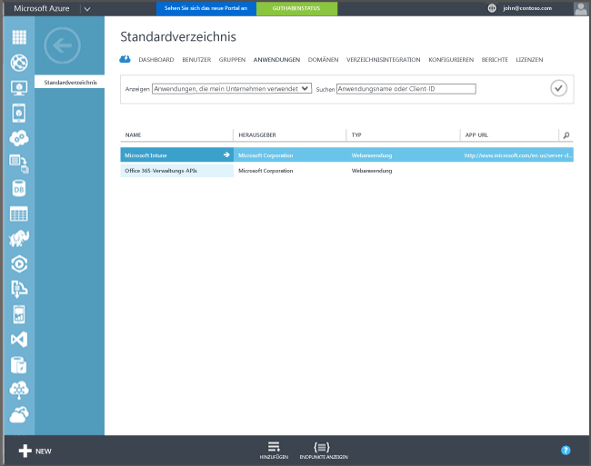

## Azure Active Directory-Registrierung

Mit der automatischen Registrierung können Benutzer entweder unternehmenseigene oder private Windows 10-PCs und Windows 10 Mobile-Geräte in Intune registrieren, indem Sie ein Geschäfts- oder Schulkonto hinzufügen und zustimmen, dass das Gerät verwaltet wird. So einfach ist das. Im Hintergrund registriert sich das Gerät des Benutzers und tritt Azure Active Directory bei. Nach der Registrierung wird das Gerät mit Intune verwaltet.

**Voraussetzungen**
- Azure Active Directory Premium-Abonnement ([Testabonnement](http://go.microsoft.com/fwlink/?LinkID=816845))
- Microsoft Intune-Abonnement

### Konfigurieren der automatischen MDM-Registrierung

1. Wechseln Sie im [Azure-Verwaltungsportal](https://manage.windowsazure.com) (https://manage.windowsazure.com) zum Knoten **Active Directory**, und wählen Sie Ihr Verzeichnis aus.

2. Klicken Sie auf die Registerkarte **Anwendungen** und **Microsoft Intune** sollte in der Liste der Anwendungen angezeigt werden.

    

3. Klicken Sie auf den Pfeil für **Microsoft Intune** und eine Seite, mit der Sie Microsoft Intune konfigurieren können, sollte angezeigt werden.

4. Klicken Sie auf **Konfigurieren**, um mit der Konfiguration der automatischen MDM-Registrierung mit Microsoft Intune zu beginnen.

5. Angeben der URLs für Intune:

  - **MDM-Registrierungs-URL** – Verwenden Sie den Standardwert.
  - **MDM-Nutzungsbedingungs-URL** – Verwenden Sie den Standardwert. Diese URL zeigt die Nutzungsbedingungen für Benutzer an, wenn Geräte registriert werden.
  - **MDM-Richtlinien-URL** – Verwenden Sie den Standardwert. Wenn ein Gerät als nicht kompatibel gemeldet wird, wird die Nachricht **Zugriff verweigert.** mit dieser URL angezeigt. Die URL verweist auf eine Seite, die Benutzern hilft, zu verstehen, warum ihr Gerät nicht mit der Richtlinie kompatibel ist und wie sie die Kompatibilität wiederherstellen können.

6.  Geben Sie an, welche Geräte von Benutzern von Microsoft Intune verwaltet werden sollen. Die Windows 10-Geräte dieser Benutzer werden automatisch für die Verwaltung mit Microsoft Intune registriert.

  - **Alle**
  - **Gruppen**
  - **Keine**

7. Wählen Sie **Speichern** aus.

<!--HONumber=Jan17_HO1-->

